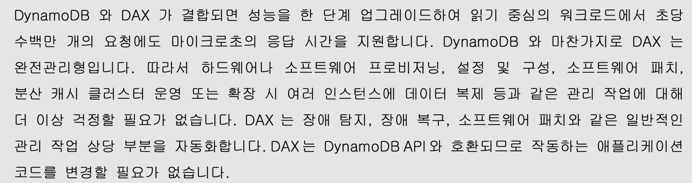

---
title:Amazon ElastiCache
author: cotes   
categories: [AWS SSA 03,AWS 기초: RDS + Aurora + ElastiCache]
tags: [AWS]

---

### Amazon ElastiCache 정리 (AWS 시험 대비)

#### **1. ElastiCache 개요**

- **관리형 인메모리 데이터베이스 서비스**:
- 웹에 작동
- 애플리케이션을 변경하여 DB 조회 전에 작동
  
- **Redis** 또는 **Memcached**를 완전 관리형으로 제공.
  
- **고성능, 저지연** 캐시 솔루션으로, **읽기 집중적 워크로드**의 데이터베이스 부하 감소.
  
- **캐시 전략**:
  
  - **Cache Hit**: 데이터가 캐시에 존재 → 직접 반환 (데이터베이스 조회 생략).
      - 만약 쿼리가 이미 수행되어 ElastiCache에 저장되어 있다면 이를 캐시 히트
  
  - **Cache Miss**: 데이터가 캐시에 없음 → 데이터베이스 조회 후 결과를 캐시에 저장.

------

#### **주요 사용 사례**

- **데이터베이스 부하 감소**:
  - 반복 쿼리 결과를 캐시에 저장 → RDS/Aurora 등 백엔드 데이터베이스의 부하 분산.
- **상태 비저장(Stateless) 애플리케이션 구현**:
  - 사용자 세션 데이터를 ElastiCache에 저장 → 애플리케이션 인스턴스 간 상태 공유 가능 (예: 로그인 세션 유지).
- **고속 데이터 처리**:
  - 실시간 분석, 리더보드(Redis의 Sorted Set 활용), 메시지 큐 등에 적합.

------

#### **edis vs Memcached 비교**

| **특징**          | **Redis**                                    | **Memcached**                            |
| :---------------- | :------------------------------------------- | :--------------------------------------- |
| **고가용성**      | Multi-AZ 지원, 자동 장애 조치, 읽기 복제본   | X (단순 분할/샤딩)                       |
| **데이터 지속성** | AOF(Append Only File)로 디스크에 백업        | X (인메모리 전용, 서버리스 버전 제외)    |
| **데이터 구조**   | 문자열, 해시, 리스트, 집합, 정렬된 집합 지원 | 문자열만 지원                            |
| **스레드 모델**   | 단일 스레드                                  | 멀티스레드 (높은 동시성 처리)            |
| **사용 사례**     | 복잡한 데이터 구조, 고가용성 필요 시         | 단순 키-값 저장, 수평 확장(샤딩) 필요 시 |

------

### **요약 체크리스트**

1. **ElastiCache = Redis/Memcached 관리형 서비스** (인메모리 캐시).
2. **Cache Hit/Miss 전략**으로 DB 부하 감소.
3. **Redis**: 고가용성, 복잡 데이터 구조, 지속성.
   1. **Redis는 자동 장애 조치 기능이 있는 다중 가용 영역을 지원하며**
   2. **읽기 복제본을 생성하여 읽기 작업을 확장하고 높은 가용성을 제공합니다**
   3. **또한 AOF 지속성을 사용하여 데이터 내구성을 제공하며**
   4. **Redis의 오픈 소스 버전에서는 백업 및 복원 기능을 제공합니다**
4. **Memcached**: 단순 키-값, 샤딩, 멀티스레드. 
   1. 여러 노드를 설정하여 데이터를 분할하는 아이디어입니다
   2. 이는 차팅이라고 불리며 여러 노드가 함께 있는 것입니다
   3. 고가용성도 없고 복제도 없습니다
5. **상태 비저장 앱** 구현 (세션 저장).
6. **캐시 무효화**는 주요 관리 과제.

**DAX**

