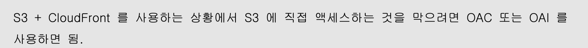

---
title:CloudFront
author: cotes   
categories: [AWS SSA 03,CloudFront 및 글로벌 엑셀러레이터]
tags: [AWS]

---

## CloudFront

- ### Amazon CloudFront 핵심 정리

  ------

  #### **개요**

  - **정의**: AWS의 **CDN(Content Delivery Network)** 서비스로, 전 세계 216개 이상의 **엣지 로케이션**에서 콘텐츠를 캐싱하여 지연 시간을 줄입니다.
  - **목적**: 정적/동적 콘텐츠의 **글로벌 배포** 및 성능 최적화.
  - **주요 특징**:
    - 낮은 지연 시간, 높은 전송 속도.
    - DDoS 방어 (AWS Shield, WAF 통합).
    - S3, ALB, EC2, 사용자 정의 HTTP 백엔드와 연동.

  - **캐싱 메커니즘**:
    - 최초 요청 시 원본(Origin)에서 데이터를 가져와 엣지에 캐시 → 재요청 시 엣지에서 직접 제공.
    - **TTL(Time-To-Live)**: 캐시 유지 기간 설정 가능.

- **Ingress 기능**: CloudFront를 통해 S3 버킷에 데이터 업로드 가능.
- **동적 콘텐츠 지원**: Lambda@Edge로 엣지에서 코드 실행.

#### **CloudFront vs S3 교차 리전 복제(CRR)**

| **구분**      | **CloudFront**                    | **S3 CRR**                                   |
| :------------ | :-------------------------------- | :------------------------------------------- |
| **목적**      | 전 세계 정적 콘텐츠 캐싱          | 특정 리전 간 데이터 복제 (동적 콘텐츠)       |
| **캐싱**      | 엣지 로케이션에 일시적 캐시       | 원본 버킷과 동기화 (실시간 복제)             |
| **접근 범위** | 216+ 엣지 로케이션 (글로벌)       | 사용자 지정 리전 (예: us-east-1 → eu-west-1) |
| **비용**      | 데이터 전송량 및 요청 수 기준     | 스토리지 및 복제 비용                        |
| **사용 사례** | 정적 웹사이트, 이미지/비디오 배포 | 리전 간 데이터 중복성 필요 시                |

####  **시험 핵심 팁**

1. **CloudFront 선택 조건**:
   - **"전 세계 사용자", "낮은 지연 시간", "정적 콘텐츠",CDN** 키워드 → CloudFront.
   - **"동적 콘텐츠"** → Lambda@Edge 고려.
   - **CDN**
2. **OAC**:
   - S3 버킷에 대한 접근 제어 시 **OAC** 사용 (OAI 대체됨).
3. **CRR과 차이점**:
   - CRR은 리전 간 복제, CloudFront는 글로벌 캐싱.
4. **보안**:
   - **AWS Shield** + **WAF** 조합 → DDoS/웹 공격 방어.
5. **엣지 로케이션**:
   - 캐시 미스 시 원본에서 데이터 수집 → 캐시 저장.

------

#### **CloudFront와 HTTP 백엔드 연동 방식**

- **대상 백엔드**: EC2 인스턴스, ALB(Application Load Balancer), S3 정적 웹사이트 등.
- **공통 요구사항**:
  - CloudFront 엣지 로케이션 → 백엔드로의 **네트워크 연결 가능성** 보장.
  - **보안 그룹(Security Group)** 설정이 핵심.

| **구분**            | **EC2 직접 연결**  | **ALB 사용**                     |
| :------------------ | :----------------- | :------------------------------- |
| **EC2 노출 여부**   | 공개 (퍼블릭 IP)   | 비공개 (프라이빗 IP)             |
| **보안 강도**       | 낮음               | 높음 (ALB가 트래픽 필터링)       |
| **확장성**          | 제한적             | 우수 (Auto Scaling 그룹 연동)    |
| **적합한 시나리오** | 소규모 테스트 환경 | 프로덕션 환경 (고가용성 필요 시) |

------

