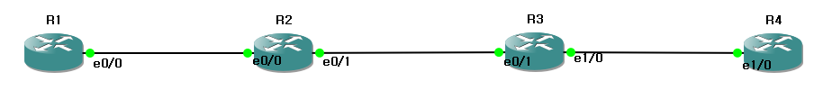

1

 

# 


### ip 기본 설정

```bash
R1
conf t
int lo 0
ip add 1.1.1.1 255.255.255.0
no sh
int e0/0
ip add 1.1.12.1 255.255.255.0
no sh


R2
conf t
int lo 0
ip add 1.1.2.2 255.255.255.0
no sh
int e0/0
ip add 1.1.12.2 255.255.255.0
no sh
int e0/1
ip add 1.1.23.2 255.255.255.0
no sh


R3
conf t
int lo 0
ip add 1.1.3.3 255.255.255.0
no sh
int e0/1
ip add 1.1.23.3 255.255.255.0
no sh
int e1/0
ip add 1.1.34.3 255.255.255.0
no sh

R4
conf t
int lo 0
ip add 1.1.4.4 255.255.255.0
no sh
int e1/0
ip add 1.1.34.4 255.255.255.0
no sh
```


### R1

```bash
router bgp 1
bgp router-id 1.1.1.1
neighbor 1.1.12.2 remote-as 234 - 네트웤을 보낼 대상의 정보를 입력 반드시
network 1.1.1.0 mask 255.255.255.0

```

### R2

```bash
router bgp 234
bgp router-id 1.1.2.2 
neighbor 1.1.12.1 remote-as 1 // 네이버 설정
network 1.1.2.0 mask 255.255.255.0 // 정보 전달 (광고)
```


------

## OSPF 세팅


### R2 R3

```bash
---------- R2 와 R3 ospf 세팅

R1과 R2 사이는 DMZ 구간이기 때문에 ospf 세팅을 안해도 된다.

R2
router ospf 2
router-id 1.1.2.2
int e0/1
ip ospf 2 area 0
int lo 0
ip ospf 2 area 0

R3
router ospf 3
router-id 1.1.3.3
int e0/1
ip ospf 3 area 0
int lo 0
ip ospf 3 area 0
```

### R3 R4

```bash
R3
router bgp 234
neighbor 1.1.4.4 remote-as 234
neighbor 1.1.4.4 update-source lo 0

R4 
router bgp 234
neighbor 1.1.3.3 remote-as 234
neighbor 1.1.3.3 update-source lo 0
```

### R2 R4

```bash
R2
router bgp 234
neighbor 1.1.4.4 remote-as 234
neighbor 1.1.4.4 update-source lo 0

R4 
router bgp 234
neighbor 1.1.2.2 remote-as 234
neighbor 1.1.2.2 update-source lo 0
```

------

## OSPF(IGP) 세팅

### R2 R3

```bash
R2
router bgp 234
neighbor 1.1.3.3 remote-as 234
neighbor 1.1.3.3 update-source lo 0


R3
router bgp 234
neighbor 1.1.2.2 remote-as 234
neighbor 1.1.2.2 update-source lo 0

```

### R3 R4

```bash
R3
router ospf 3
router-id 1.1.3.3
int e1/0
ip ospf 3 area 0
int lo 0
ip ospf 3 area 0

R4
router ospf 4
router-id 1.1.4.4
int e1/0
ip ospf 4 area 0
int lo 0
ip ospf 4 area 0
```

------

## ebgp 관계 

```bash

R2(config-router)#do sh run | sec router bgp
router bgp 234
 bgp router-id 1.1.2.2
 bgp log-neighbor-changes
 network 1.1.2.0 mask 255.255.255.0
 neighbor 1.1.12.1 remote-as 1
R2(config-router)#
```

------

## do sh ip bgp summary 명령어

```bash
BGP router identifier 1.1.3.3, local AS number 234
BGP table version is 2, main routing table version 2
3 network entries using 420 bytes of memory
3 path entries using 240 bytes of memory
2/1 BGP path/bestpath attribute entries using 288 bytes of memory
1 BGP AS-PATH entries using 24 bytes of memory
0 BGP route-map cache entries using 0 bytes of memory
0 BGP filter-list cache entries using 0 bytes of memory
BGP using 972 total bytes of memory
BGP activity 3/0 prefixes, 3/0 paths, scan interval 60 secs

Neighbor        V           AS MsgRcvd MsgSent   TblVer  InQ OutQ Up/Down  State/PfxRcd
1.1.2.2         4          234      15      13        2    0    0 00:08:19        3
R3(config-if)#


Neighbor        V           AS MsgRcvd MsgSent   TblVer  InQ OutQ Up/Down  State/PfxRcd
1.1.2.2         4          234      26      24        2    0    0 00:18:19        3
1.1.4.4         4          234       2       5        2    0    0 00:00:19        0


IGP 를 모르면 BGP 설정이 안됨
```



