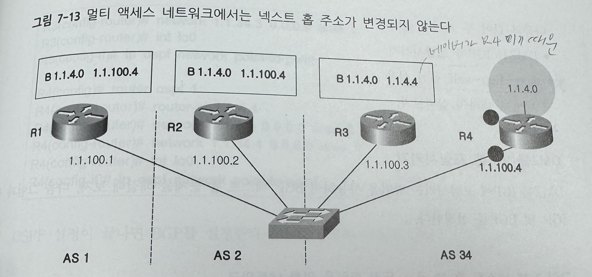

# BGP Basic 2

### BGP 설정시 해결해야할 문제

1. **next hop 문제**

   	- **라우팅**

   	- **명령어(next-hop-self)**

2. **split horizon 문제**
   - **fulle mesh**
   - **confederation**
   - **route reflector**


------

## BGP 넥스트 홉 

목적지의 네트워크로 가기 위한 다음 라우터를 넥스트 홉 라우터라고 한다.

IGP의 넥스트 홉 IP 주소는 항상 물리적으로 접속된 인접 라우터의 IP 주소이다.


다른 AS로 넘어갈 때는 그 AS와 연결되는 라우터가 넥스트 홉이 된다.


멀티 엑세스 네트워크에서는 다음 그림 처럼 eBGP, IBGP를 막론하고 처음 라우팅 정보를 보낸 라우터가 넥스트 홉으로 설정되고, 끝까지 바뀌지 않는다.


BGP에서 넥스트 홉의 IP 주소는 네이버를 설정할 때 사용된 IP를 사용한다.

또한 BGP는 광고받은 네트워크의 넥스트 홉 ㅈ소가 라우팅 가능한 것이어야만 해당 네트워크를 사용할 수 있다.

------

## next-hop-self 옵션 사용 385

이 방법은 라우터인 R2가 네이버를 설정하면서, 넥스트 홉 ip 주소를 R3, R4 라우터가 알고 있는 R2 자신의 주소로 변경하는 것이다.

​	•	BGP에서 **IBGP(내부 BGP) 라우터 간에 Next Hop 문제를 해결하기 위한 설정**

​	•	**특정 라우터가 자신의 인터페이스 IP를 넥스트 홉으로 강제 설정**하여, IBGP 내부에서 올바르게 패킷이 전달

✅ **사용 이유**

​	1.	**IBGP에서 Next Hop이 AS 내부 라우터의 인터페이스가 아닌 외부(EBGP) IP로 설정될 경우, 경로가 끊길 수 있음.**

​	2.	**Next Hop을 AS 내부 라우터의 인터페이스로 변경하여 경로 문제를 방지**하기 위해 사용.




### 넥스트 홉 ip 주소 변경하기

```bash
router bpg 234
neighbor 1.1.3.3 next-hop-self
neighbor 1.1.4.4 next-hop-self
```

그러면, R3와 R4가 R2에서 수신하는 모든 네트워크의 넥스트 홉이 R2로 변경된다.


**추가) 경계 라우터(Border Router)와의 관계**

​	•	**ASBR(Autonomous System Boundary Router):**

​	•	OSPF와 BGP 같은 프로토콜에서 **외부 네트워크와 연결되는 경계 라우터**.

​	•	ASBR이 외부 라우터에서 받은 경로 정보를 내부 라우터에 전달할 때 **Next Hop이 필요**.

​	•	**ABR(Area Border Router):**

​	•	OSPF에서 서로 다른 Area를 연결하는 라우터.

​	•	OSPF 내부에서도 ABR을 통해 다른 Area로 패킷을 전달할 때 **Next Hop 개념이 적용됨**.


✅ **ASBR과 ABR에서도 Next Hop Self가 적용될 수 있음.**

​	•	ASBR이 BGP를 통해 외부 경로를 학습할 때, 내부 IBGP 네이버들에게 자신의 IP를 Next Hop으로 광고하면 **경로 문제 해결 가능**.

------

## 스플릿 호라이즌

**1. 스플릿 호라이즌이란?**


➡️ **라우팅 루프(경로가 무한 반복되는 문제)를 방지하는 기술**

➡️ **“패킷을 받은 인터페이스로 다시 보내지 않는다”** 원칙을 적용하는 것

**2. 왜 필요한가?**


✔ **라우팅 루프(Routing Loop) 문제 해결**

✔ **불필요한 트래픽 방지**

✔ **네트워크 안정성 향상**

**3. 예제 (쉽게 이해하기)**


**✅ 스플릿 호라이즌이 없을 때 (문제 발생)**


**1️⃣ R1 → R2 에게 192.168.1.0/24 네트워크 정보 전달**


**2️⃣ R2는 다시 R1에게 같은 192.168.1.0/24 네트워크 정보를 전달**


**3️⃣ R1은 자신이 보낸 정보를 또 받게 되고, 라우팅 루프 발생 가능 🚨**

**✅ 스플릿 호라이즌 적용 후**


✔ R1 → R2 에게 192.168.1.0/24 전달 ✅

✔ **R2는 R1에게 다시 같은 정보를 보내지 않음** ❌

✔ **라우팅 루프 방지 & 트래픽 감소** 🎯

**4. 어디에서 사용되나?**


✔ **거리 벡터 프로토콜(RIP, EIGRP)에서 기본적으로 적용됨**

✔ **OSPF & BGP 같은 링크 상태 프로토콜에서는 사용되지 않음**

**5. 스플릿 호라이즌 설정 방법 (Cisco)**


✔ **비활성화할 때만 명령어 사용**

```
interface Serial0/0
 no ip split-horizon
```

✔ 기본적으로 RIP, EIGRP에서는 활성화되어 있음 ✅

**6. 핵심 정리**

| **개념**          | **설명**                                       |
| ----------------- | ---------------------------------------------- |
| **정의**          | 패킷을 받은 인터페이스로 다시 보내지 않는 원칙 |
| **목적**          | 라우팅 루프 방지 & 불필요한 트래픽 제거        |
| **적용 프로토콜** | RIP, EIGRP (거리 벡터 라우팅)                  |
| **비활성화 방법** | no ip split-horizon (Cisco 장비)               |

✅ **한마디 요약:** **“라우팅 정보를 받은 인터페이스로 다시 보내지 마라” → 루프 방지 & 트래픽 절약** 🚀


------

390 ***

## 완전 메시 (full mesh)


**1. BGP Full Mesh란?**


➡️ **IBGP(내부 BGP)에서 모든 라우터가 서로 직접 네이버(Neighbor) 관계를 맺어야 한다는 규칙**

➡️ **즉, 한 AS(자율 시스템) 내에 있는 모든 IBGP 라우터가 서로 직접 BGP 업데이트를 주고받아야 한다.**

**2. 왜 Full Mesh가 필요할까?**


✔ **IBGP 스플릿 호라이즌(Split Horizon) 원칙 때문!**

✔ **IBGP에서는 라우팅 정보를 받은 라우터가 다른 IBGP 네이버에게 다시 전달하지 않는다.**

✔ 따라서, **모든 IBGP 라우터가 직접 네이버 관계를 맺어야 한다.**

**3. 위 그림을 예시로 설명하기**

**📌 상황**

​	•	**R1은 AS 1** (외부 네트워크)

​	•	**R2, R3, R4는 AS 234 (하나의 내부 AS)**

​	•	**R1에서 받은 네트워크 1.1.1.0을 AS 234 전체에 퍼뜨려야 함**


**❌ Full Mesh가 없을 때 문제**

​	•	R2는 R1과 **eBGP**로 1.1.1.0 네트워크를 받음

​	•	R2는 R3에게 **IBGP**로 전달

​	•	**문제 발생!**

​	•	IBGP에서는 받은 정보를 다른 IBGP 네이버(R4)에게 다시 전달할 수 없음 😱

​	•	즉, **R4는 1.1.1.0 네트워크를 알 수 없음**


**✅ Full Mesh가 있을 때 해결**

​	•	R2, R3, R4가 **모두 직접 IBGP 네이버 관계를 맺음**

​	•	R2 → R3 (네이버 관계)

​	•	R2 → R4 (네이버 관계)

​	•	R3 → R4 (네이버 관계)

​	•	**이제 R4도 1.1.1.0을 학습할 수 있음!** 🎯

**4. Full Mesh 설정 방법**


✔ **각 라우터가 다른 모든 IBGP 라우터와 네이버 설정**

✔ 예제 코드:

```
R2(config)# router bgp 234
R2(config-router)# neighbor 1.1.3.3 remote-as 234
R2(config-router)# neighbor 1.1.4.4 remote-as 234
R3(config)# router bgp 234
R3(config-router)# neighbor 1.1.2.2 remote-as 234
R3(config-router)# neighbor 1.1.4.4 remote-as 234
R4(config)# router bgp 234
R4(config-router)# neighbor 1.1.2.2 remote-as 234
R4(config-router)# neighbor 1.1.3.3 remote-as 234
```

✔ **각 네이버의 루프백 인터페이스를 사용하여 안정성을 높임**

```
neighbor 1.1.3.3 update-source loopback0
```

**5. Full Mesh의 단점 & 해결 방법**

| **문제**                                     | **해결 방법**                                        |
| -------------------------------------------- | ---------------------------------------------------- |
| **라우터가 많아지면 설정이 너무 많아짐**     | **Route Reflector(RR) 사용** (한 라우터가 대신 전달) |
| **네이버가 많을수록 CPU & 메모리 부담 증가** | **Confederation 사용** (AS를 작은 그룹으로 나눔)     |

**6. 핵심 정리**

| **개념**          | **설명**                                                |
| ----------------- | ------------------------------------------------------- |
| **BGP Full Mesh** | 모든 IBGP 라우터가 직접 네이버 관계를 맺음              |
| **왜 필요?**      | IBGP는 받은 정보를 다시 전달하지 않음 (스플릿 호라이즌) |
| **문제 해결법?**  | 모든 IBGP 라우터가 직접 연결되도록 설정                 |
| **단점**          | 라우터가 많아지면 설정이 복잡해짐                       |
| **대안**          | Route Reflector(RR) 또는 Confederation 사용             |

✅ **한마디 요약:**

“IBGP에서는 정보를 받은 라우터가 다른 IBGP 네이버에게 전달 못함 → 모든 라우터가 직접 연결 필요!” 🚀

------


## 루트 리플렉터(Route Reflector) 389 395

IBGP 스플릿 호라이즌