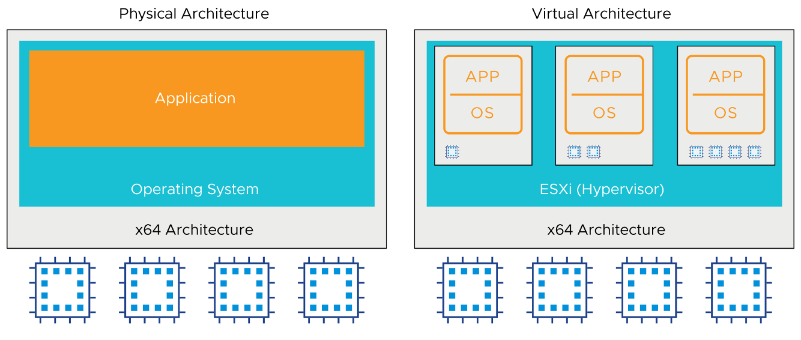

# Module 2-2: vSphere Virtualization of Resources

------

## **가상 머신(Virtual Machine)과 ESXi 호스트 자원 활용**

가상 머신(VM)은 **호스트 기반의 자원을 활용하는 게스트 환경**으로, **지원되는 모든 운영 체제(OS) 및 애플리케이션을 실행할 수 있다**.

**1. 주요 개념**

​	•	**VM(Guest OS)**

​	•	**VM1, VM2, VM3** 각각의 가상 머신은 **독립적인 운영 체제(OS)와 애플리케이션(APP)를 실행**

​	•	동일한 물리적 서버에서 여러 개의 VM이 동시에 동작 가능

​	•	**ESXi 하이퍼바이저(Hypervisor)**

​	•	VMware **ESXi는 가상 머신을 실행하는 하이퍼바이저 역할을 수행**

​	•	VM이 **CPU, 메모리, 디스크, 네트워크 등 하드웨어 리소스를 공유하도록 관리**

​	•	**호스트 자원(CPU, Memory, Disk, Network)**

​	•	**CPU**: VM에 할당된 연산 능력

​	•	**Memory**: 각 VM이 사용하는 RAM

​	•	**Disk**: 가상 머신의 저장 공간

​	•	**Network**: VM이 외부 네트워크와 통신할 수 있도록 연결

**2. 핵심 개념 요약**

✅ **VM은 ESXi 하이퍼바이저를 통해 호스트의 하드웨어 자원을 공유하며 독립적으로 운영됨**

✅ **각 VM은 서로 격리된 상태로 실행되며, 다른 VM의 성능이나 데이터에 영향을 주지 않음**

✅ **VM을 사용하면 하나의 물리 서버에서 여러 운영 체제를 실행하여 자원 활용도를 극대화할 수 있음**

------

## **물리 아키텍처 vs. 가상 아키텍처**

**가상화 기술은 물리적 하드웨어를 소프트웨어적으로 추상화하여 IT 환경을 보다 효율적으로 운영할 수 있도록 지원한다.**

**1. 물리 아키텍처 (Physical Architecture)**

​	•	**단일 운영 체제(OS)가 물리적 하드웨어를 직접 제어**

​	•	OS 위에서 애플리케이션이 실행됨

​	•	모든 하드웨어 리소스(CPU, 메모리, 디스크, 네트워크)를 단일 OS가 독점적으로 사용

​	•	여러 개의 애플리케이션을 실행하면 리소스 충돌 가능

**2. 가상 아키텍처 (Virtual Architecture)**

​	•	**ESXi 하이퍼바이저(Hypervisor)를 사용하여 다수의 가상 머신(VM) 운영 가능**

​	•	각 VM은 독립적인 **운영 체제(OS) 및 애플리케이션**을 실행

​	•	여러 VM이 **CPU, 메모리, 디스크, 네트워크 자원을 공유하면서 효율적으로 사용**

​	•	리소스 할당을 동적으로 조정 가능하며, VM 간 격리 제공

**3. 가상화의 주요 장점**

✅ **하드웨어 활용도 향상**: 하나의 물리 서버에서 여러 VM 실행 가능

✅ **유연성 및 확장성**: 필요에 따라 새로운 VM을 쉽게 추가 가능

✅ **애플리케이션 격리**: VM 간 독립적인 환경 제공으로 충돌 방지

✅ **운영 효율성 증가**: IT 자원 관리 및 유지보수 비용 절감

이 그림은 **물리 환경과 가상화 환경의 차이점을 비교하여 가상화 기술이 IT 인프라에서 어떻게 활용되는지를 설명**한다.

------

## **가상화 환경에서의 리소스 공유 및 관리**

가상화를 사용하면 **하나의 물리적 호스트에서 여러 개의 가상 머신(VM)을 실행할 수 있으며, 각 VM은 물리적 자원을 공유하면서도 독립적으로 운영**된다.

**가상화 환경에서의 리소스 공유 및 관리**

가상화를 사용하면 **하나의 물리적 호스트에서 여러 개의 가상 머신(VM)을 실행할 수 있으며, 각 VM은 물리적 자원을 공유하면서도 독립적으로 운영**된다.

**1. 주요 개념**

**① CPU 및 메모리 공유**

​	•	모든 VM은 **물리적 CPU를 공유**하며, **ESXi 하이퍼바이저가 실행 일정을 조정**

​	•	VM마다 **독립적인 메모리 영역**이 할당됨

​	•	**메모리 오버 커밋(Overcommit Memory)** 가능

​	•	VM의 총 가상 RAM 용량이 **물리적 RAM 용량보다 클 경우에도 실행 가능**

​	•	하이퍼바이저가 메모리 압축, 스왑 등을 사용하여 관리

**② 네트워크 및 디스크 리소스 공유**

​	•	VM은 **물리적 네트워크 카드 및 디스크 컨트롤러를 공유**

​	•	ESXi는 **네트워크 및 디스크 대역폭을 효율적으로 분배**하여 성능을 유지

**③ 운영 체제 및 애플리케이션 실행**

​	•	동일한 물리적 서버에서 **서로 다른 운영 체제(OS) 및 애플리케이션을 실행 가능**

​	•	각 VM은 **격리된 환경에서 동작**하여, 다른 VM의 영향을 받지 않음

**2. ESXi 하이퍼바이저의 역할**

​	•	**VM 일정 관리**: CPU와 메모리 할당을 조정하여 최적의 성능 유지

​	•	**자원 할당 정책**: 기본적으로 동일한 ESXi 호스트에 있는 모든 VM이 **동일한 비율의 리소스 할당**

​	•	**자원 제어 메커니즘**: 필요에 따라 특정 VM에 더 많은 CPU, 메모리, 네트워크 대역폭 할당 가능

**3. 핵심 개념 요약**

✅ **VM은 ESXi 하이퍼바이저를 통해 하나의 물리 서버의 자원을 공유하며 실행됨**

✅ **하이퍼바이저는 CPU, 메모리, 네트워크, 디스크 사용을 효율적으로 관리하여 성능 최적화**

✅ **메모리 오버 커밋을 활용하면 VM의 총 가상 RAM이 물리적 RAM을 초과할 수 있음**

✅ **기본적으로 모든 VM은 동등한 자원을 할당받지만, 필요에 따라 우선순위를 조정할 수 있음**

이 설명은 **가상 머신이 물리적 리소스를 어떻게 공유하고, ESXi 하이퍼바이저가 이를 관리하는지**에 대한 내용을 요약한 것이다.

------

## **CPU 가상화(CPU Virtualization) 개요**

**CPU 가상화는 물리적 CPU를 여러 가상 머신(VM)에서 공유하여 실행하는 기술로, 성능을 최적화하면서도 독립적인 환경을 제공한다.**

**1. 물리 환경(Physical Environment)과 가상 환경(Virtual Environment) 비교**

**① 물리 환경(Physical Architecture)**

​	•	운영 체제(OS)가 **모든 물리적 CPU를 독점적으로 소유**

​	•	애플리케이션은 **단일 OS에서만 실행 가능**

​	•	하나의 물리 서버에서 **다양한 운영 체제를 실행하는 것이 불가능**

**② 가상 환경(Virtual Architecture)**

​	•	**ESXi 하이퍼바이저**를 사용하여 **여러 VM이 하나의 물리 CPU를 공유**

​	•	각 VM은 **독립적인 가상 CPU(vCPU)**를 할당받아 실행

​	•	하이퍼바이저가 **가상 CPU와 물리 CPU 간의 스케줄링을 조정**

​	•	서로 다른 OS를 동시에 실행 가능

**2. CPU 가상화의 주요 특징**

✅ **고성능 유지**: VM은 **실제 CPU에서 직접 실행**되며, 성능 저하 없이 운영 가능

✅ **리소스 효율성 증가**: 여러 VM이 CPU를 공유하므로 **서버 활용률 극대화**

✅ **유연한 운영**: 필요에 따라 **가상 CPU(vCPU) 개수를 동적으로 조정 가능**

✅ **서로 다른 OS 실행 가능**: 동일한 물리 서버에서 **Windows, Linux 등 다양한 OS 동시 운영**

**3. 핵심 개념 요약**

**물리 환경에서는 단일 OS가 모든 CPU를 관리하지만, 가상 환경에서는 하이퍼바이저가 CPU를 가상화하여 여러 VM이 효율적으로 공유**할 수 있도록 한다.

이 그림은 **CPU 가상화가 물리적 자원을 어떻게 분배하고 운영하는지를 시각적으로 나타낸 것**이다.

------

## 물리 환경 vs. 가상화 환경에서의 메모리 사용**

**메모리 가상화는 물리적 메모리를 여러 가상 머신(VM)에서 공유할 수 있도록 관리하는 기술이다.**

**1. 물리 환경(Physical Environment)**

​	•	운영 체제(OS)가 **모든 물리적 메모리(RAM)를 단독으로 소유**

​	•	애플리케이션 실행 시 OS가 메모리 페이지를 직접 할당

​	•	특정 애플리케이션이 과도한 메모리를 사용할 경우 **다른 프로세스의 성능에 영향을 줄 수 있음**

**2. 가상화 환경(Virtualized Environment)**

​	•	**ESXi 하이퍼바이저가 물리적 메모리를 여러 VM에 동적으로 할당**

​	•	각 VM은 **자신만의 독립적인 가상 메모리(vRAM)를 할당받음**

​	•	**메모리 오버 커밋(Overcommitment) 가능**

​	•	할당된 vRAM의 총합이 **물리적 RAM보다 클 수 있음**

​	•	ESXi가 메모리 압축, 공유, 스왑 등의 기술을 사용하여 최적화

**3. 메모리 할당 방식**

✅ **최초 접근 시 할당(First Access Allocation)**

​	•	VM이 메모리를 요청할 때, **실제 물리 메모리에서 페이지가 할당됨**

​	•	필요하지 않은 메모리는 즉시 할당되지 않아 **메모리 낭비를 줄임**

✅ **자원 공유 및 최적화**

​	•	여러 VM이 **중복된 메모리 블록을 공유할 수 있도록 투명 페이지 공유(TPS, Transparent Page Sharing) 기능 활용**

​	•	필요할 경우 **하이퍼바이저가 메모리 압축 및 스왑을 통해 성능 유지**

**4. 핵심 개념 요약**

✅ **물리 환경에서는 운영 체제가 모든 RAM을 독점하지만, 가상 환경에서는 ESXi 하이퍼바이저가 메모리를 효율적으로 배분**

✅ **메모리 오버 커밋을 활용하면, 실제 물리적 RAM보다 더 많은 vRAM을 VM에 할당 가능**

✅ **하이퍼바이저는 필요할 때만 메모리를 할당하며, 투명 페이지 공유(TPS), 압축, 스왑 등의 기술로 최적화**

이 그림은 **물리적 서버와 가상화된 서버에서 메모리가 어떻게 관리되는지를 비교하여 설명하는 것**이다.

------

## **물리적 네트워크 vs. 가상 네트워크 (Physical and Virtual Networking)**

**VMware 가상 네트워킹(Virtual Networking) 개요**

가상 네트워킹을 활용하면 **VM(가상 머신) 간 통신 및 외부 네트워크 연결을 물리적 하드웨어 없이도 구현 가능**하다.

**1. 가상 이더넷 어댑터(Virtual Ethernet Adapter)와 가상 스위치(Virtual Switch)**

​	•	**VM은 하나 이상의 가상 이더넷 어댑터(vNIC)를 가질 수 있음**

​	•	**가상 스위치(Virtual Switch)**는 **물리적 스위치와 유사하게** 프레임을 전송

​	•	ESXi 호스트 내에서 **VM 간 통신을 지원하며, 외부 네트워크 연결도 가능**

​	•	추가적인 물리적 네트워크 장비 없이도 VM 간 연결이 가능

**2. 가상 스위치(Virtual Switch)의 주요 기능**

✅ **VLAN 지원**

​	•	**VLAN 태깅 및 트렁킹 지원**

​	•	물리적 네트워크와 동일한 방식으로 VLAN을 설정 가능

​	•	네트워크 분리 및 보안 강화

✅ **NIC 팀 구성(NIC Teaming)**

​	•	**vmnic(가상 네트워크 인터페이스 카드)**를 여러 개 묶어 네트워크 가용성과 성능 향상

​	•	다중 네트워크 어댑터를 사용하여 **부하 분산 및 장애 복구(Failover) 기능 제공**

✅ **보안 및 격리**

​	•	가상 스위치는 물리적 스위치와 동일하게 **각각의 스위치가 독립된 포워딩 테이블을 가짐**

​	•	**서로 다른 가상 스위치 간 트래픽이 직접 흐를 수 없도록 격리**

​	•	해킹 및 보안 공격 방지를 위한 네트워크 분리 기능

✅ **STP(Spanning Tree Protocol) 불필요**

​	•	**가상 스위치는 계층적(싱글 티어) 네트워크 구조를 따름**

​	•	물리적 네트워크와 달리, **가상 스위치 간 루프가 발생하지 않으므로 STP가 필요 없음**

**3. 핵심 개념 요약**

✅ **VM 간 통신은 가상 스위치를 통해 이루어지며, 물리적 네트워크 없이도 연결 가능**

✅ **VLAN, NIC 팀 구성, 보안 격리 등의 기능을 통해 네트워크 관리 및 성능 최적화 가능**

✅ **물리적 스위치와 유사한 방식으로 동작하지만, STP(Spanning Tree Protocol)는 필요 없음**

이 설명은 **VMware 가상 네트워킹의 주요 개념과 가상 스위치(Virtual Switch)의 기능을 정리한 것**이다.

------

## **물리적 파일 시스템 vs. vSphere 데이터스토어(Datastores)**

**vSphere 데이터스토어는 분산 스토리지 아키텍처를 제공하며, 여러 ESXi 호스트가 동시에 공유 스토리지에 접근 가능하다.**

**파일 시스템 - 데이터를 효율적으로 관리하기 위한 시스템**

**1. 데이터스토어(Datastore) 개념**

​	•	**ESXi는 가상 디스크를 저장하기 위해 데이터스토어를 사용**

​	•	데이터스토어는 **VM의 파일을 저장하는 논리적 컨테이너** 역할 수행

​	•	물리적 스토리지의 복잡성을 숨기고 **일관된 저장소 모델을 제공**

**2. vSphere에서 지원하는 주요 데이터스토어 유형**

✅ **VMFS (VMware Virtual Machine File System)**

​	•	**클러스터 파일 시스템**으로, 가상 머신을 위한 스토리지 가상화 제공

​	•	**여러 ESXi 호스트가 동일한 VMFS 데이터스토어를 동시에 읽고 쓰기 가능**

​	•	VM 스냅샷 및 고급 스토리지 기능 지원

​	•	모든 호스트에서 접근 가능한 스토리지

✅ **NFS (Network File System)**

​	•	**NAS(Network Attached Storage)와 통신하는 파일 공유 프로토콜**

​	•	ESXi 호스트가 **NFS 서버의 공유 폴더를 데이터스토어로 마운트**하여 사용

​	•	VMFS와 달리, **파일 기반 접근 방식 사용**

✅ **vSAN (VMware vSAN)**

​	•	**소프트웨어 정의 스토리지(SDS) 솔루션**

​	•	ESXi 호스트의 **로컬 HDD/SSD를 가상화하여 공유 스토리지로 활용**

​	•	클러스터 내 ESXi 호스트들이 로컬 디스크를 공유하여 **통합 데이터스토어 생성**

✅ **vSphere Virtual Volumes (vVols)**

​	•	**SAN/NAS 디바이스를 논리적 저장소 풀로 추상화**

​	•	개별 VM의 가상 디스크 단위로 **스토리지 정책 기반 관리 제공**

​	•	ESXi 호스트가 직접 스토리지를 관리하지 않고 **스토리지 어레이가 관리**

**3. 핵심 개념 요약**

✅ **데이터스토어는 ESXi의 논리적 저장소이며, 물리적 스토리지를 추상화하여 일관된 스토리지 모델 제공**

✅ **VMFS는 여러 ESXi 호스트가 동시에 읽고 쓸 수 있는 고성능 클러스터 파일 시스템**

✅ **NFS는 NAS 장비와 연결하여 파일 기반 공유 스토리지로 활용**

✅ **vSAN은 로컬 스토리지를 가상화하여 공유 스토리지로 변환하는 소프트웨어 정의 스토리지(SDS)**

✅ **vVols는 개별 VM 디스크 단위로 SAN/NAS 스토리지를 관리하는 고급 솔루션**

이 설명은 **물리적 파일 시스템과 vSphere 데이터스토어의 차이점, 그리고 다양한 데이터스토어 유형을 정리한 것**이다.

------

**GPU 가상화(GPU Virtualization) 개요**

GPU(Graphics Processing Unit)는 **복잡한 그래픽 연산을 최적화하여 CPU 부하를 줄이고 성능을 향상시키는 장치**이다.

**1. GPU 가상화(Virtual GPU) 개념**

​	•	**가상 GPU(vGPU)**를 VM에 추가하여 **고성능 그래픽 및 연산 작업을 수행 가능**

​	•	물리적 GPU를 여러 개의 VM에서 공유하여 **효율적인 GPU 리소스 활용 가능**

​	•	VM에 **최대 4개의 vGPU 장치 추가 가능**

**2. GPU 가상화의 주요 활용 사례**

✅ **고급 2D 및 3D 그래픽**

​	•	CAD, CAM, 그래픽 디자인, 미디어 편집 등의 작업에 활용

✅ **VMware Horizon 가상 데스크톱(Virtual Desktop Infrastructure, VDI)**

​	•	원격 데스크톱 환경에서 **고해상도 그래픽 및 멀티미디어 작업 지원**

✅ **그래픽 집약적 애플리케이션**

​	•	동영상 렌더링, 게임 개발, 3D 모델링 등 **고성능 그래픽 처리 작업**

✅ **과학 연산(Scientific Computation)**

​	•	데이터 분석, 시뮬레이션, 수치 연산 등 **대규모 연산 작업에 GPU 활용**

✅ **AI 및 머신러닝(ML) 워크로드**

​	•	**딥러닝 및 인공지능(AI) 모델 학습 가속화**

​	•	TensorFlow, PyTorch 등 GPU 가속이 필요한 프레임워크에서 활용

**3. GPU 가상화 지원**

​	•	**AMD 및 NVIDIA GPU 지원**

​	•	**물리적 GPU를 여러 개의 VM에서 공유 가능**

​	•	**하드웨어 기반 가상 GPU(vGPU) 기술 지원**

**4. 핵심 개념 요약**

✅ **GPU 가상화를 통해 VM에서도 고성능 그래픽 및 연산 작업 가능**

✅ **AI, 머신러닝, 과학 계산, VDI, 그래픽 작업 등 다양한 분야에서 활용**

✅ **VMware는 AMD 및 NVIDIA GPU를 지원하며, 최대 4개의 vGPU를 VM에 추가 가능**

이 설명은 **GPU 가상화의 개념과 활용 사례, 그리고 VMware 환경에서의 GPU 지원 방식을 요약한 것**이다.

------

### 기타

### overcommitment

**오버 커밋(Overcommitment)**은 **호스트의 실제 물리적 자원(CPU, 메모리 등)보다 더 많은 가상 자원(vCPU, vRAM 등)을 가상 머신(VM)에 할당하는 기술**이다.

✅ **CPU 오버 커밋**:

​	•	물리적 CPU 개수보다 더 많은 **vCPU를 VM에 할당**

​	•	하이퍼바이저가 **CPU 사용 스케줄을 조정**하여 성능을 최적화

✅ **메모리 오버 커밋**:

​	•	물리적 RAM보다 **더 많은 vRAM을 VM에 할당**

​	•	**메모리 압축, 스왑, 공유 기술**을 사용하여 운영

✅ **장점**:

​	•	자원 활용도를 극대화하여 **더 많은 VM 실행 가능**

​	•	비용 절감 및 유연한 리소스 관리 가능

✅ **주의할 점**:

* ''과도한 오버 커밋 시 **성능 저하 및 리소스 부족 가능성**
* 하드웨어의 수를 넘어설 수 없음
* 그래도 모자르면 디스크에서 빌려옴 (SWAP)

**즉, 오버 커밋은 “자원을 초과할당하여 운영하지만, 하이퍼바이저가 최적화하여 관리하는 방식”**이다.

page sharing

vSwitch 0 = SOLDESK

------

## **