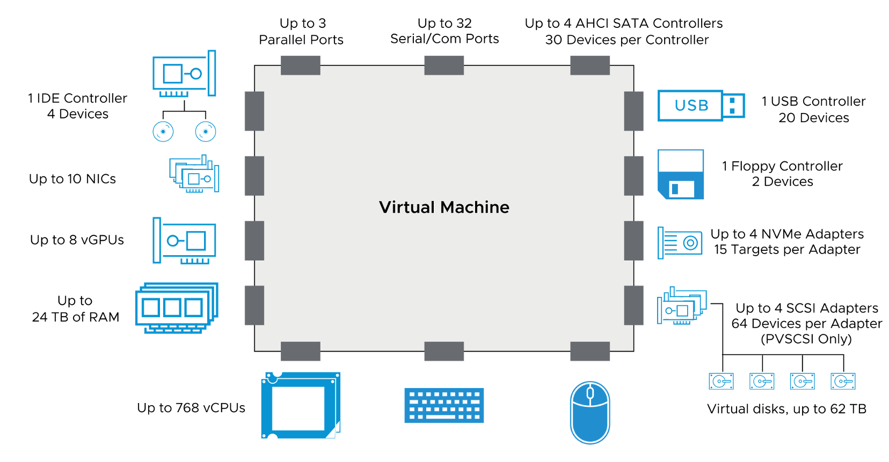

# Module 7: Deploying Virtual Machines

------

## Lesson 1: Creating Virtual Machines


------

## About Provisioning Virtual Machines

VM 프로비저닝 방식은 환경에 따라 최적의 방법이 다를 수 있음. 주요 방법은 다음과 같음.

1. **New Virtual Machine Wizard**
   * 새로운 VM을 생성하는 기본적인 방법.
   * 특정 OS나 하드웨어 설정이 필요한 경우 직접 생성 가능.
   * vSphere Client 및 VMware Host Client에서 지원.

2. **Deploy from Existing Templates or Clones**
   * 기존 템플릿 또는 클론을 사용하여 VM을 배포.
   * 빠르고 일관된 VM 배포 가능.
   * **vSphere Client에서만 지원, VMware Host Client에서는 불가능**.

3. **Deploy from OVF Templates**
   * 사전 구성된 OVF/OVA 형식의 VM을 배포.
   * 운영체제 및 소프트웨어가 미리 설치된 가상 어플라이언스(Virtual Appliance) 사용 가능.
   * vSphere Client 및 VMware Host Client에서 지원되지만, Host Client에서는 일부 기능 제한.

| **프로비저닝 방법**               | **vSphere Client 사용** | **VMware Host Client 사용** |
| --------------------------------- | ----------------------- | --------------------------- |
| 새로운 가상 머신 마법사 사용      | ✅ 지원                  | ✅ 지원                      |
| 기존 템플릿 또는 클론에서 VM 배포 | ✅ 지원                  | ❌ 미지원                    |
| OVF 템플릿에서 VM 배포            | ✅ 지원                  | ✅ 지원                      |

------

------

## **VMware Tools**  

#### **1. VMware Tools란?**  

- 가상 머신(VM)의 게스트 OS 성능을 최적화하는 기능 세트입니다.  
- **주요 목적**: 일반 OS 드라이버를 VMware 가상 하드웨어에 최적화된 드라이버로 대체하여 성능 및 관리 효율성을 향상시킵니다.  

---

#### **2. 주요 기능 및 혜택**  

- **성능 향상**:  
  - **SVGA 디스플레이**: 그래픽 성능 개선.  
  - **VMXNET/VMXNET3**: 고성능 네트워크 드라이버.  
  - **Balloon Driver**: 동적 메모리 관리로 효율적인 리소스 활용.  
  - **Paravirtual SCSI 컨트롤러**: 디스크 I/O 성능 향상.  
  - **Sync Driver**: I/O 작업 일시 중지(Quiescing) 지원.  

- **사용 편의성**:  
  - **호스트-게스트 파일 공유(Shared Folders)**.  
  - **클립보드 통합**: 호스트와 게스트 간 텍스트/파일 복사-붙여넣기.  
  - **자동화 스크립트**: VM 전원 상태 변경 시 작업 자동화.  

- **관리 기능**:  
  - **시간 동기화**: 호스트와 게스트 OS 간 시간 일치.  
  - **원격 종료/재시작**: 툴바에서 직접 제어 가능.  
  - **게스트 OS 하트비트 모니터링**: VM 상태 실시간 감지.  

---

#### **3. 설치 시 포함되는 항목**  

- **VMware Tools 서비스**:  
  - 시간 동기화, 하트비트 서비스 등을 관리합니다.  
- **VMware 전용 디바이스 드라이버**:  
  - Perfmon 모니터링 옵션 포함.  
- **자동화 스크립트**:  
  - VM 전원 조작 시 특정 작업 실행 가능 (예: 시작/종료 시 스크립트 트리거).  

---

#### **4. VMware Tools 미설치 시 제한 사항**  

- **주요 기능 사용 불가**:  
  - 툴바를 통한 종료/재시작 불가 (전원 강제 종료만 가능).  
  - Shared Folders, 클립보드 공유, 성능 최적화 기능 사용 불가.  
- **성능 저하**:  
  - 일반 드라이버 사용으로 그래픽, 네트워크, 디스크 성능이 낮아집니다.  

---

### **5. 결론**  

VMware Tools는 **가상 머신의 필수 구성 요소**로,  

- 성능 최적화,  
- 관리 편의성,  
- 고급 기능 활성화를 위해 반드시 설치해야 합니다.  
- 설치 방법: VM 실행 후 `VM > Install VMware Tools` 메뉴에서 진행.  

>  **참고**: VMware Tools는 **오픈 VM Tools(Open-VM-Tools)**로 대체될 수 있으나, 기능은 동일합니다.

------

------

### **VMware Tools 설치 방법 정리**  

#### **1. 설치 전 확인 사항**  
- **최신 버전 사용**: 게스트 OS에 맞는 **최신 VMware Tools 버전**을 선택해야 합니다.  
- **vSphere 8 호환성**: vSphere 8에 포함된 VMware Tools ISO 이미지 정보는 **vSphere 8 Release Notes**에서 확인할 수 있습니다.  

---

#### **2. 게스트 OS 유형별 설치 방법**  

| **게스트 OS**         | **설치 방법**                                                |
| --------------------- | ------------------------------------------------------------ |
| **Microsoft Windows** | - **Vista 이상** : `windows.iso` 파일을 사용해 설치합니다.   |
| **Linux**             | 다음 방법 중 하나 선택:                                      |
|                       | 1. **`linux.iso`** 파일을 사용해 설치.                       |
|                       | 2. **최신 Linux 배포판** : 패키지 관리자(`yum`, `apt`, `rpm` 등)로 **Open-VM-Tools** 설치. |

---

#### **3. 세부 설명**  
- **Windows 설치**:  
  - VM 실행 후 VMware 환경에서 `windows.iso`를 마운트하여 설치합니다.  
  - 관리자 권한으로 설치 프로그램을 실행합니다.  

- **Linux 설치**:  
  - **전통적 방법**: `linux.iso`를 마운트 후 수동 설치.  
  - **권장 방법 (최신 배포판)**:  
    ```bash  
    # Debian/Ubuntu  
    sudo apt-get install open-vm-tools  
    
    # RHEL/CentOS  
    sudo yum install open-vm-tools  
    ```
  - Open-VM-Tools는 **자동 업데이트 및 간편한 관리**가 가능합니다.  

---

#### **4. 참고 사항**  
- **Open-VM-Tools**:  
  - VMware Tools의 오픈 소스 버전으로, 대부분의 최신 Linux 배포판에서 기본 지원됩니다.  
  - 성능과 기능은 기존 VMware Tools와 동일하며, 패키지 관리자를 통해 업데이트가 용이합니다.  
- **공식 문서**:  
  - 자세한 설치 가이드 및 Open-VM-Tools 활용 방법은 **[VMware Tools Administration](https://docs.vmware.com/en/VMware-Tools/index.html)**에서 확인할 수 있습니다.  

---

### **중요 포인트**  
1. **OS 호환성**: 반드시 게스트 OS 버전에 맞는 VMware Tools를 사용해야 합니다.  
2. **성능 최적화**: VMware Tools 미설치 시 가상 하드웨어 성능이 크게 저하됩니다.  
3. **자동화**: Open-VM-Tools는 Linux 패키지 관리자와 통합되어 설치/업데이트가 간편합니다.  

>  **Tip**: VMware Tools 설치 후 VM을 재시작하여 변경 사항을 적용하세요!

------

------

## Deploying OVF Templates(OVF 템플릿 배포)


**OVF 형식으로 저장된 VM(가상 머신) 또는 가상 어플라이언스를 배포할 수 있습니다.**

**가상 어플라이언스는 미리 구성된 VM으로:**

- **일반적으로 단일 용도로 설계되었습니다.**
- **VMware Marketplace에서도 제공됩니다.**


**가상 어플라이언스는 OVF 템플릿 형식으로 배포됩니다. OVF는 VM을 위한 플랫폼 독립적이고 효율적이며 확장 가능한 개방형 패키징 및 배포 형식입니다. OVF 파일은 압축되어 있어 다운로드 속도가 빠릅니다**


------

------

## Lesson 2: Virtual Machine Hardware Deep Dive

### 학습 목표  

1. **VM을 구성하는 파일 식별**  
   - 가상 머신(VM)을 구성하는 디스크 파일(*.vmdk*), 설정 파일(*.vmx*), 로그 파일(*.log*) 등의 주요 파일을 이해합니다.  

2. **VM 하드웨어 버전 비교**  
   - 다양한 VM 하드웨어 버전(예: vmx-13, vmx-19)의 차이점과 호환성을 분석합니다.  
   - 새 버전의 기능과 업그레이드 시 고려사항을 파악합니다.  

3. **VM의 가상 하드웨어 구성 요소 인식**  
   - 가상 CPU(vCPU), 가상 메모리, 가상 네트워크 어댑터(vNIC), 가상 디스크 등 주요 하드웨어 구성 요소를 확인합니다.  

4. **vSphere Client 탐색 및 VM 설정 검토**  
   - vSphere Client 인터페이스를 활용해 VM의 설정(리소스 할당, 옵션, 게스트 OS 정보 등)을 확인합니다.  

5. **VM 콘솔 접근 방법 이해**  
   - **vSphere Client 내장 콘솔**  
   - **SSH 또는 RDP** (게스트 OS가 지원하는 경우)  
   - **VMware Remote Console (VMRC)** 등의 도구 사용  

> *모든 작업은 vSphere 환경(ESXi/vCenter)에 최적화된 방법으로 진행됩니다.*  

------

## 가상 머신 캡슐화(Virtual Machine Encapsulation)


1. **VM의 저장 방식**
   * VMFS 또는 NFS 데이터스토어에서는 **디렉터리 형태의 파일 집합**으로 저장됨.
   * vSAN 또는 vSphere Virtual Volumes(VVOL) 데이터스토어에서는 **오브젝트(Object) 형태**로 저장됨.

2. **가상 디스크(Virtual Disk) 관리**
   * 각 가상 디스크는 단일 파일 또는 오브젝트로 캡슐화됨.
   * VM의 모든 구성 요소(가상 디스크, VM 설정, 로그 등)는 데이터스토어 내 별도의 폴더에 저장됨.

3. **캡슐화의 장점**
   * **이동성과 관리 용이성**: VM을 구성하는 파일들이 하나의 폴더에 정리되므로 VM을 쉽게 복제하거나 마이그레이션할 수 있음.
   * **데이터 보호**: 스냅샷 기능을 활용해 VM의 특정 상태를 저장하고 복원할 수 있음.
   * **스토리지 효율성**: vSAN 및 VVOL을 사용할 경우, 오브젝트 단위로 스토리지를 관리하여 최적화 가능.


결론적으로, **VM 캡슐화는 가상 머신의 이동성, 관리 편의성, 스토리지 효율성을 극대화하는 핵심적인 개념**이다.

------

------

## About Virtual Machine Files


각 파일의 역할은 다음과 같다.

​	•	**VM_name.vmx**: VM의 설정을 저장하는 구성 파일

​	•	**VM_name.vmtx**: VM을 템플릿으로 변환할 경우 생성되는 구성 파일

​	•	**VM_name.vswp**: VM이 실행될 때 생성되는 스왑 파일 (메모리 부족 시 활용)

​	•	**VM_name.nvram**: VM의 BIOS 또는 EFI 설정을 저장

​	•	**vmware.log**: VM의 이벤트 및 동작을 기록하는 로그 파일

​	•	**VM_name.vmdk**: 가상 디스크의 메타데이터를 저장하는 디스크 설명 파일

​	•	**VM_name-flat.vmdk**: 실제 데이터를 포함하는 디스크 파일

​	•	**VM_name-\*.vmss**: VM이 일시 중지되었을 때 생성되는 suspend 상태 파일


이러한 파일들은 VM이 실행되고 관리될 때 필수적인 역할을 한다.

vmx 확장자 - 가상머신의 구성파일

vmdk - 디스크 파일의 확장자

------

------


------

------

## **VM Virtual Hardware**




VM의 가상 하드웨어는 게스트 OS가 실제 물리적 장치처럼 인식하도록 설계된 가상 장치들로 구성된다. 이를 통해 VM은 다양한 하드웨어 기능을 지원할 수 있으며, 포터블한 환경을 제공한다.

------


**VM 가상 하드웨어 구성 요소**

1. **CPU 및 메모리**
   * vSphere는 최신 가상 CPU(vCPU) 성능 카운터를 지원.
   * VM의 메모리 크기 및 CPU 개수를 설정할 수 있음.

2. **가상 디스크 및 스토리지**
   * 가상 SCSI, SATA 컨트롤러를 통해 디스크, CD/DVD 드라이브, USB 연결 가능.
   * PVSCSI(ParaVirtual SCSI) 드라이버를 사용할 경우, 최대 64개의 가상 SCSI 타겟 지원.
   * 기본 SCSI 컨트롤러 사용 시, 최대 15개의 가상 SCSI 타겟 지원.

3. **네트워크 및 장치 연결**
   * 여러 개의 가상 NIC을 추가하여 네트워크 성능 최적화 가능.
   * USB 장치(보안 동글, 저장 장치 등) 추가 가능하지만, ESXi 호스트에 직접 연결된 경우에만 사용 가능.
   * 한 번에 하나의 VM만 USB 장치를 사용할 수 있으며, 다른 VM과 공유 불가.

4. **가상 머신 커뮤니케이션 인터페이스(VMCI)**
   * VM과 하이퍼바이저 간의 고속 통신을 위한 인프라.
   * 네트워크 계층을 사용하지 않고 직접 통신하여 성능 최적화.
   * 기본적으로 비활성화되어 있음.

------

**VMCI(가상 머신 통신 인터페이스) 지원 방식**

| **통신 유형** | **설명**                       |
| ------------- | ------------------------------ |
| 데이터그램    | UDP 큐와 유사한 연결 없는 통신 |
| 연결 지향     | TCP와 유사한 세션 기반 통신    |

VMCI는 소켓 API를 제공하며, IP 주소 대신 VMCI ID를 사용하여 통신한다.

------

------

## Thick-Provisioned Virtual Disks 


Thick-Provisioned 가상 디스크는 생성 시 설정된 디스크 공간을 즉시 할당하며, 실제 게스트 OS가 사용하는 공간과 관계없이 전체 공간을 예약하는 방식이다.


------


**Thick-Provisioned 디스크 유형**

| **유형**               | **설명**                                                     |
| ---------------------- | ------------------------------------------------------------ |
| **Lazy-Zeroed Thick**  | 생성 시 디스크 공간을 할당하지만, 기존 데이터는 그대로 유지됨. VM에서 처음 데이터를 기록할 때 해당 블록이 0으로 초기화됨. (기본 설정) |
| **Eager-Zeroed Thick** | 생성 시 모든 블록을 0으로 초기화하여 보안 및 성능을 강화함. VM에서 데이터를 기록하기 전에 블록이 미리 0으로 설정됨. |


------


**Thick-Provisioned 방식의 특징**

* 설정된 전체 디스크 공간을 즉시 할당.
* Lazy-Zeroed 방식은 초기화 시간이 짧지만, 첫 번째 쓰기 시 성능 저하 가능.
* Eager-Zeroed 방식은 VM 배포 시간이 길어지지만, 높은 보안성과 성능을 제공.
* 스토리지 공간을 미리 확보하기 때문에 가상 디스크 크기를 동적으로 조정할 수 없음.


이 방식은 데이터 무결성을 유지하고 스토리지 관리 효율성을 높이는 데 사용된다.

------

------

## **Thin-Provisioned Virtual Disks**


Thin-Provisioned 가상 디스크는 가상 머신(VM)이 필요로 하는 만큼의 스토리지를 동적으로 할당하는 방식이다. 초기에는 적은 공간만 사용하며, 필요할 때 자동으로 확장된다.


------

------

## **Thin-Provisioned 디스크 특징**

| **특징**                      | **설명**                                                     |
| ----------------------------- | ------------------------------------------------------------ |
| **동적 공간 할당**            | VM이 필요한 만큼만 스토리지를 사용하며, 최대 할당된 용량까지 확장 가능 |
| **VM에서 전체 용량 인식**     | VM은 전체 할당된 크기를 볼 수 있지만 실제 사용량만큼만 스토리지를 차지 |
| **공간 절약 가능**            | 여러 VM이 스토리지를 효율적으로 공유할 수 있음               |
| **할당 대비 사용량 모니터링** | 할당된 공간과 실제 사용량을 비교하여 경고 및 모니터링 가능   |
| **공간 회수(UNMAP 지원)**     | 사용되지 않는 블록을 회수하여 스토리지 효율성 향상           |


------


**Thin-Provisioning 예제**

​	•	**Provisioned Space (할당된 공간):** 140GB

​	•	**Datastore Capacity (사용 가능한 저장소 용량):** 100GB

​	•	**Used Space (실제 사용된 공간):** 80GB


즉, 140GB를 할당했지만 실제 80GB만 사용 중이므로 스토리지를 효율적으로 사용할 수 있다.


Thin-Provisioning은 스토리지 공간을 절약하고 여러 VM이 스토리지를 공유할 수 있도록 하며, 필요에 따라 크기를 확장할 수 있는 유연성을 제공한다.

------

------

## **Thick-Provisioned vs Thin-Provisioned 디스크 차이점**


VMware에서 가상 디스크를 생성할 때, **Thick-Provisioned**(사전 할당)과 **Thin-Provisioned**(동적 할당) 방식 중 선택할 수 있다. 각 방식은 성능, 공간 활용, 블록 할당 방식에서 차이가 있다.

| **특성**                           | **Thick Provisioned Lazy-Zeroed** | **Thick Provisioned Eager-Zeroed**    | **Thin Provisioned**        |
| ---------------------------------- | --------------------------------- | ------------------------------------- | --------------------------- |
| **생성 시간**                      | 빠름                              | 느림 (디스크 크기에 비례)             | 가장 빠름                   |
| **블록 할당**                      | 전체 공간을 사전 할당             | 전체 공간을 사전 할당                 | 필요한 만큼만 동적 할당     |
| **디스크 레이아웃**                | 연속적인 블록 배치 가능성 높음    | 연속적인 블록 배치 가능성 높음        | 블록이 동적으로 배치됨      |
| **블록의 0으로 채움(Zeroing out)** | 각 블록이 처음 쓰일 때 0으로 채움 | 디스크 생성 시 모든 블록을 0으로 채움 | 블록이 할당될 때 0으로 채움 |


------


**추가 설명**

* **Thick Provisioned Lazy-Zeroed**
  * 디스크가 빠르게 생성되지만, 데이터가 처음 기록될 때 성능 오버헤드 발생 가능.

* **Thick Provisioned Eager-Zeroed**
  * 디스크 생성 시간이 길지만, 모든 블록이 0으로 채워지므로 성능이 가장 안정적.
  * **VMware Fault Tolerance(FT)**와 같은 기능을 지원해야 할 경우 사용됨.

* **Thin Provisioned**
  * 초기에는 적은 공간을 차지하며, 필요할 때 자동으로 확장됨.
  * 스토리지 활용도를 높일 수 있지만, 과할당(Over-provisioning)으로 인해 예상치 못한 공간 부족 현상이 발생할 수 있음.


각 방식은 VM의 성능 요구사항과 스토리지 관리 정책에 따라 선택하면 된다.

------

------

## 가상 네트워크 개요


### 가상 네트워크 개요  

가상 머신(VM)과 물리적 머신은 **가상 네트워크**를 통해 통신합니다.  
VM의 네트워크 설정을 구성할 때 다음 사항을 선택하거나 변경할 수 있습니다:  

1. **네트워크 어댑터 유형**  
   - 예: VMXNET3, E1000E 등 (성능 및 호환성에 따라 선택)  

2. **연결할 포트 그룹**  
   - 표준 가상 스위치 또는 분산 가상 스위치(DVS)의 포트 그룹 지정  

3. **네트워크 연결 상태**  
   - 연결(Connected) / 연결 해제(Disconnected) 상태 제어  

4. **VM 전원 시 네트워크 자동 연결 여부**  
   - `Powered on` 시 자동 연결 옵션 설정  

> - 가상 네트워크 구성은 vSphere 환경(ESXi/vCenter)에서 관리됩니다.  
> - 네트워크 어댑터 유형은 게스트 OS 호환성 및 처리량 요구사항에 따라 선택해야 합니다.  

------

------

'**VMware 가상 네트워크 어댑터 개요**


VMware에서는 가상 머신(VM)에 네트워크 어댑터(NIC)를 추가하고, 특정 유형을 선택할 수 있다. VMXNET3가 가장 권장되는 어댑터 유형이다.


**네트워크 어댑터 유형**


VM에서 사용할 수 있는 네트워크 어댑터 유형은 다음과 같다:

| **어댑터 유형**         | **설명**                                                     | **지원 OS**                          |
| ----------------------- | ------------------------------------------------------------ | ------------------------------------ |
| **E1000E**              | Intel 82574 기가비트 NIC 에뮬레이션                          | Windows 8, Windows Server 2012       |
| **E1000**               | Intel 82545EM 기가비트 NIC 에뮬레이션                        | Windows XP 이후, Linux 2.4.19 이후   |
| **Flexible**            | 초기에는 Vlance로 동작, VMware Tools 설치 시 VMXNET으로 전환 | 대부분의 OS                          |
| **Vlance**              | AMD 79C970 PCnet32 LANCE NIC 에뮬레이션 (10 Mbps)            | 32비트 레거시 OS                     |
| **VMXNET3**             | 고성능 Paravirtualized NIC, 다중 큐 지원, IPv6 오프로드, MSI/MSI-X 지원 | 최신 Linux 및 Windows                |
| **PVRDMA**              | RDMA 지원, OS Bypass, Zero-copy, 저지연 고대역폭             | 특정 RDMA 지원 환경                  |
| **SR-IOV Pass-Through** | 물리 NIC의 가상 기능을 직접 사용하여 네트워크 대기시간 최소화 | RHEL 6+, Windows Server 2008 R2 SP2+ |


------


**추가 설명**

​	•	**VMXNET3**가 가장 권장되며, 성능 향상 기능이 포함됨.

​	•	**PVRDMA**는 RDMA(원격 직접 메모리 액세스) 지원을 통해 고속 네트워크 성능을 제공.

​	•	**SR-IOV Pass-Through**는 가상 스위치를 거치지 않고 물리 NIC를 직접 사용할 수 있어 네트워크 대기시간을 최소화함.


각 네트워크 어댑터는 VM의 하드웨어 버전, 호스트의 최신 호환성 여부, 게스트 운영체제에 따라 선택 가능하다.

------

------

## **VM 콘솔 개요**


1. **웹 콘솔 (Web Console)**  
   - 브라우저의 새 탭에서 VM 콘솔을 표시합니다.  
   - 별도 소프트웨어 설치 없이 즉시 접근 가능합니다.  

2. **원격 콘솔 (VMware Remote Console - VMRC)**  
   - **VMRC 독립형 애플리케이션**을 다운로드하여 별도 창에서 실행합니다.  
   - 원격 호스트의 VM 콘솔에 연결하거나 클라이언트 장치를 제어할 수 있습니다.  

---

### **VM 콘솔의 주요 용도**  
- VM의 **BIOS/UEFI 설정** 접근  
- 게스트 OS **설치 또는 복구**  
- VM **전원 관리** (On/Off/Reset)  
- 가상 하드웨어 **설정 및 문제 해결** (예: 네트워크 장애 시 진단)  

> ⚠️ **일상적인 작업에는 사용되지 않음**  
> - 일반적인 VM 접근에는 **원격 데스크톱(RDP)**, **SSH**, **가상 네트워크 연결** 등을 사용합니다.  
> - 콘솔은 주로 **시스템 부팅, 하드웨어 구성, 긴급 복구** 등에 활용됩니다.  

---

### **사용 시 고려 사항**  
- **VMRC**는 보다 향상된 기능(드래그 앤 드롭 파일 전송, USB 리디렉션 등)을 제공합니다.  
- 방화벽 또는 네트워크 정책에 따라 **원격 콘솔 연결이 제한**될 수 있습니다.  
