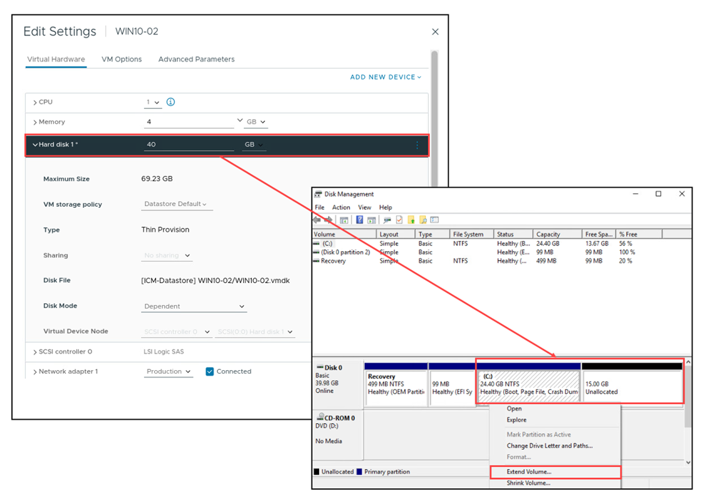

## Lesson 3: Modifying Virtual Machines

------

### Learner Objectives(학습 목표)

- 가상 머신 설정 및 옵션 설명
- 핫 플러그 가능 장치 추가
- 가상 디스크 크기 동적 확장

------

------

## Modifying Virtual Machine Settings(가상 머신 설정 수정)

**가상 머신의 설정을 편집하여 구성을 변경할 수 있습니다:**  

- **가상 하드웨어 추가:  
  전원이 켜진 상태에서도 일부 하드웨어를 추가할 수 있습니다.**  

- **가상 하드웨어 제거:  
  일부 하드웨어는 전원이 꺼진 상태에서만 제거할 수 있습니다.**  

- **가상 머신 옵션 설정**  

- **가상 머신의 CPU 및 메모리 리소스 제어**

  

------

------

## **Hot-Pluggable Devices in VMware**

VMware에서는 **Hot Plug** 기능을 사용하여 가상 머신(VM)에 리소스를 추가할 수 있다. 이를 통해 VM을 종료하지 않고도 특정 하드웨어 리소스를 확장할 수 있다.

------

**Hot-Plug 가능한 장치**

다음과 같은 장치들은 실행 중인 VM에 동적으로 추가할 수 있다:

​	1.	**USB 컨트롤러**

​	2.	**이더넷 어댑터**

​	3.	**하드 디스크**

​	4.	**CPU 및 메모리** (지원되는 운영체제에서만 가능)

------

**CPU Hot Add & Memory Hot Plug**

VM이 실행된 상태에서 **CPU 및 메모리**를 추가할 수 있는 기능이다. 이 기능은 기본적으로 비활성화되어 있으며, 사용하려면 특정 요구 사항을 충족해야 한다.

**요구 사항**

​	1.	**VMware Tools**가 설치되어 있어야 함.

​	2.	**VM 하드웨어 버전 11 이상**을 사용해야 함.

​	3.	**Guest OS가 CPU 및 메모리 핫플러그 기능을 지원**해야 함.

​	4.	**Virtual Hardware 설정에서 Hot-Plug 기능을 활성화**해야 함.

​	5.	**Virtual NUMA(NUMA 노드 분배)와 함께 CPU Hot Add를 설정하면, VM은 UMA(Uniform Memory Access) 모드로 실행됨**.

------

**Hot-Plug의 이점**

​	•	물리적 서버에서는 하드웨어 변경을 위해 데이터 센터에서 직접 조작해야 하지만, VM에서는 **운영 중에도 리소스를 추가 가능**.

​	•	**서비스 중단 없이 자원 확장 가능**, 다만 제거(Remove)는 VM 종료 후 가능.

​	•	**운영 중 동적 리소스 확장**을 통해 서비스 유연성이 향상됨.

이 기능을 활용하면 가상 환경에서 보다 **효율적인 자원 관리**가 가능하다.

------

------

## Dynamically Increasing Virtual Disk Size(가상 디스크 크기 동적 확장)

**전원이 켜진 가상 머신의 가상 디스크 크기를 늘릴 수 있습니다.**  

**필수 조건:**  
- **연결된 스냅샷이 없어야 합니다.**  
- **새로운 공간을 사용하기 위해 시스템 도구가 필요할 수 있습니다.**  

**확장 후 작업: 
가상 디스크 크기를 늘린 후에는 해당 디스크의 파일 시스템 크기도 늘려야 할 수 있습니다.  
게스트 OS 내 적절한 도구를 사용하여 새로 할당된 디스크 공간을 활용하도록 파일 시스템을 구성하십시오.**  

**주의 사항:**  
- **Windows: 디스크 관리 도구에서 파티션 확장**  
- **Linux: `resize2fs` 또는 `xfs_growfs` 명령어 사용**  
- **확장 작업 전 반드시 VM 백업 권장**

------

------

## Inflating Thin-Provisioned Disks

**Thin-Provisioned 디스크를 Thick-Provisioned로 변환 (Inflating)**

VMware에서는 **Thin-Provisioned** 가상 디스크를 **Thick-Provisioned Eager-Zeroed** 형식으로 변환할 수 있다. 이를 **Inflate**라고 한다.

------

**Thin-Provisioned vs. Thick-Provisioned**

​	•	**Thin-Provisioned**: 처음에는 작은 크기로 생성되며, 실제 데이터가 기록될 때마다 크기가 증가함.

​	•	**Thick-Provisioned (Eager-Zeroed)**: 디스크가 생성될 때 모든 공간이 즉시 할당되며, 성능 최적화 및 데이터 복구 방지 효과가 있음.

------

**Thin-Provisioned 디스크를 Thick-Provisioned로 변환하는 방법**

​	1.	**vSphere Datastore 브라우저에서 Inflate 실행**

​	•	.vmdk 파일을 선택한 후 **“INFLATE”** 버튼 클릭.

​	•	해당 가상 디스크가 **Thick-Provisioned Eager-Zeroed** 형식으로 변환됨.

​	2.	**vSphere Storage vMotion을 이용한 변환**

​	•	가상 머신을 다른 데이터스토어로 **Storage vMotion**할 때 **Thick-Provisioned** 옵션을 선택하여 변환.

------

**Inflate 수행 시 고려 사항**

​	•	변환 후 가상 디스크는 **할당된 전체 공간을 차지**하게 됨.

​	•	변환된 디스크는 **이전보다 더 많은 물리적 저장 공간을 필요**로 함.

​	•	일반적으로 **성능 최적화 및 데이터 무결성**을 위해 Thick-Provisioned를 사용하지만, **디스크 공간 활용이 비효율적일 수 있음**.

​	•	**한 번 변환된 Thick-Provisioned 디스크는 다시 Thin-Provisioned로 되돌릴 수 없음**.

이 기능은 저장소 관리와 성능 요구 사항에 따라 적절히 활용하는 것이 중요하다.

thick 방식을 thin 방식으로 변환은 불가능하다.

------

------

## VM Options: General Settings

**VM Options - General Settings**

VMware vSphere에서 **VM Options** 탭을 통해 가상 머신(VM)의 속성을 수정할 수 있다. **General Options**에서는 다음과 같은 항목을 확인 및 수정할 수 있다.

------

**1. VM Name (가상 머신 이름)**

​	•	현재 VM의 **디스플레이 이름**을 표시한다.

​	•	**수정 가능**: 사용자가 원하는 이름으로 변경할 수 있다.

​	•	단, **디스플레이 이름을 변경해도 실제 VM 파일 및 디렉터리 이름은 변경되지 않는다.**

​	•	예를 들어, VM을 생성할 때 지정한 이름이 **Win10-04**라면, 해당 VM의 파일과 폴더 이름도 자동으로 **Win10-04**가 된다.

​	•	하지만 이후에 **VM Name**을 **Win10-Test**로 변경하더라도, 실제 파일 및 폴더명은 여전히 **Win10-04**로 유지된다.

------

**2. VM Config File (.vmx)**

​	•	가상 머신의 **설정 파일(.vmx)**의 위치를 표시한다.

​	•	.vmx 파일은 **가상 머신의 구성 정보**를 저장하는 핵심 파일이며, 이 파일을 이용해 VM을 다시 등록할 수 있다.

​	•	예제:

[ICM-Datastore] Win10-04/Win10-04.vmx

→ **ICM-Datastore**에 있는 **Win10-04** 폴더 내부의 Win10-04.vmx 파일이 해당 VM의 구성 파일임.

------

**3. VM Working Location (가상 머신 디렉터리)**

​	•	해당 VM이 저장된 폴더의 경로를 표시한다.

​	•	예제:

[ICM-Datastore] Win10-04/

→ **ICM-Datastore**의 Win10-04 폴더가 이 VM의 디렉터리.

------

**4. Guest OS Family & Guest OS Version (운영체제 설정)**

​	•	**Guest OS Family**: 운영체제 종류 (Windows, Linux 등)

​	•	**Guest OS Version**: 실제 설치된 운영체제 버전 (예: Microsoft Windows 10 (64-bit))

------

**5. 설정 변경 시 유의사항**

​	•	**VM Name 변경 가능하지만, 실제 파일 및 폴더명은 변경되지 않음.**

​	•	**VM Config File 및 Working Location은 수정할 수 없고, 단순히 확인만 가능.**

​	•	**Guest OS Family 및 Guest OS Version은 변경 가능하지만, 운영체제와 일치해야 함.**

​	•	예를 들어, VM에 **Linux**를 설치했지만 **Guest OS Family**를 **Windows**로 설정하면 일부 기능이 제대로 동작하지 않을 수 있음.

이 설정은 VM을 관리할 때 중요한 정보이므로, VM을 이동하거나 백업할 때 .vmx 파일과 VM 저장 위치를 정확히 확인하는 것이 필요하다.

------

------

## VM Options: VM Boot Settings

**VM Options - VMware Tools 설정**

VMware Tools는 VM의 성능을 향상시키고 관리 기능을 제공하는 필수 도구이다. **VM Options > VMware Tools** 탭에서는 다음과 같은 설정을 조정할 수 있다.

------

**1. Power Operations (전원 관리 설정)**

가상 머신(VM)의 **전원 버튼 동작을 사용자 정의**할 수 있다.

VM이 **종료, 재시작, 또는 일시 중지**될 때 VMware Tools를 통해 다음과 같은 동작을 설정할 수 있다.

* **Shut Down Guest (기본값)**:
  * VM의 운영체제(OS) 종료를 수행한다.

* **Suspend Guest**:
  * VM을 일시 중지한다.

* **Restart Guest (기본값)**:
  * VM을 재부팅한다.

**참고:**

이 설정을 변경하려면 **VM이 꺼져 있어야 한다.**

------

**2. Tools Upgrades (VMware Tools 자동 업그레이드)**

* **Check and upgrade VMware Tools before each power on**:
  * VM을 켤 때마다 **VMware Tools의 최신 버전을 확인하고, 필요 시 자동 업그레이드**를 수행한다.
  * 최신 ISO 이미지가 있을 경우 자동으로 설치됨.
  * **업그레이드 자동화가 필요할 경우 활성화 추천.**

------

**3. Synchronize Time with Host (시간 동기화)**

* **Synchronize at startup and resume (권장됨)**:
  * VM이 시작되거나 다시 실행될 때 **호스트의 시스템 시간과 동기화**한다.

* **Synchronize time periodically**:
  * 일정 주기마다 **호스트의 시간과 동기화**한다.
  * 시간 오차 발생을 줄이는 데 유용함.

------

**4. Run VMware Tools Scripts (자동 실행 스크립트)**

VM의 **상태 변화 시 특정 작업을 자동 실행**할 수 있다.

각 스크립트는 VMware Tools가 설치된 경우에 동작하며, **운영체제의 특정 이벤트에서 자동으로 실행 가능**하다.

* **After powering on**:
  * VM이 부팅된 후 실행.

* **After resuming**:
  * VM이 일시 중지에서 복구된 후 실행.

* **Before suspending**:
  * VM이 일시 중지되기 전에 실행.

* **Before shutting down guest**:
  * VM이 종료되기 전에 실행.

**활용 예시:**

​	•	VM이 부팅되면서 특정 서비스 자동 실행.

​	•	VM이 종료되기 전 로그 파일 저장 및 백업 스크립트 실행.

------

**정리**

| **설정 항목**                    | **설명**                               | **활성화 여부 추천** |
| -------------------------------- | -------------------------------------- | -------------------- |
| **전원 관리 (Power Operations)** | VM 종료/재시작 방식 설정               | 필요 시 변경         |
| **VMware Tools 자동 업그레이드** | VM 실행 시 최신 버전으로 자동 업데이트 | 환경에 따라 결정     |
| **시간 동기화**                  | VM과 호스트 간 시간 동기화             | 활성화 권장          |
| **VMware Tools 스크립트 실행**   | VM 상태 변화 시 자동 스크립트 실행     | 필요 시 활성화       |

이러한 설정을 활용하면 **VM을 보다 효율적으로 관리하고, 자동화된 운영을 수행할 수 있다.**