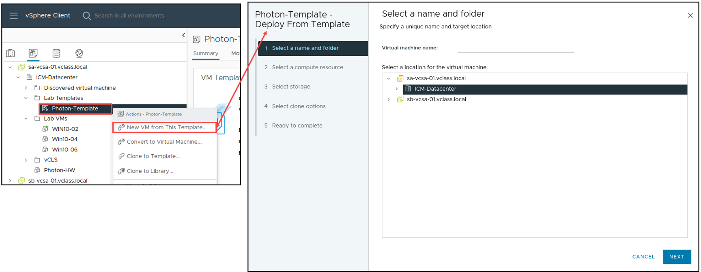
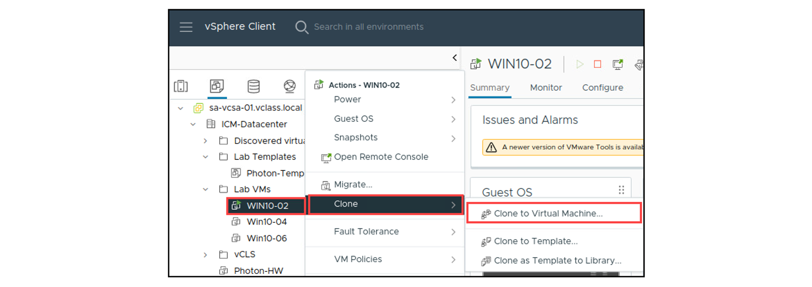
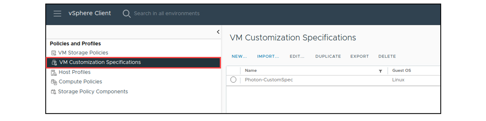
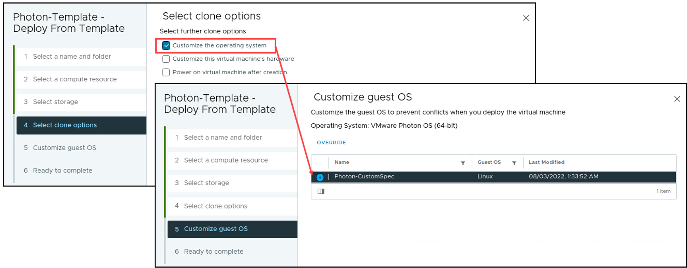

# Lesson 4: Creating Templates and Cloning VMs

------

------

## **VM 템플릿 (Template) 개요**

VM 템플릿은 **가상 머신(VM)의 정적인 이미지**로, 새로운 VM을 빠르고 일관되게 배포하는 데 사용된다.

------

**1. 템플릿의 주요 구성 요소**

VM 템플릿에는 다음과 같은 요소가 포함될 수 있다.

| **구성 요소**        | **설명**                                |
| -------------------- | --------------------------------------- |
| **Guest OS**         | 운영 체제 포함 (예: Windows, Linux)     |
| **애플리케이션**     | 사전 설치된 프로그램 포함 가능          |
| **VM 하드웨어 설정** | CPU, 메모리, 디스크 크기 등 사전 정의됨 |
| **VMware Tools**     | 게스트 OS의 성능 향상을 위해 포함됨     |

------

**2. 템플릿을 사용하는 이유**

​	•	**신속한 VM 배포**: 새로운 가상 머신을 빠르게 생성 가능.

​	•	**일관성 유지**: 동일한 설정을 유지한 VM을 생성하여 환경 표준화.

​	•	**에러 방지**: 수동 설정 과정에서 발생할 수 있는 오류 감소.

------

**3. VM 템플릿과 VM의 차이점**

VM과 템플릿은 vCenter 인벤토리에 함께 존재하며, 다음과 같은 차이점이 있다.

| **항목**           | **VM (가상 머신)** | **템플릿 (Template)**                             |
| ------------------ | ------------------ | ------------------------------------------------- |
| **목적**           | 실행 및 운영       | 배포 및 복제                                      |
| **변경 가능 여부** | 변경 가능          | 직접 변경 불가 (변경하려면 다시 VM으로 변환 필요) |
| **실행 가능 여부** | 실행 가능          | 실행 불가                                         |
| **배포 방식**      | 수동 설정 필요     | 복제하여 빠르게 배포 가능                         |

------

**4. 템플릿 생성 및 활용**

* **vCenter가 필요함**:
  * **VMware Host Client에서는 템플릿을 사용할 수 없음**
  * 템플릿 기능은 **vCenter 환경에서만 지원**됨

* **템플릿에서 VM 생성 가능**:
  * VM 템플릿을 기반으로 새로운 VM을 배포 가능
  * 배포된 VM은 지정된 폴더에 자동으로 추가됨

* **VM을 템플릿으로 변환 가능**:
  * 기존 VM을 템플릿으로 변환하여 여러 VM을 일관되게 배포 가능
  * **풀 카피 없이 변환 가능**, 즉 기존 VM 파일을 복사하지 않아도 템플릿으로 변환할 수 있음

------

**5. 템플릿과 폴더 관리**

​	•	템플릿과 VM은 **같은 인벤토리에서 관리됨**

​	•	여러 개의 VM 및 템플릿을 **폴더 단위로 관리 가능**

​	•	**사용자 권한을 폴더 단위로 적용 가능**, 즉 특정 사용자에게 특정 VM 및 템플릿에 대한 접근 권한 부여 가능

------

**6. 템플릿 사용 시 고려 사항**

| **고려 사항**         | **설명**                                                     |
| --------------------- | ------------------------------------------------------------ |
| **vCenter 연결 필요** | 템플릿 기능을 사용하려면 vCenter에 연결되어 있어야 함        |
| **VMware Tools 관리** | 템플릿 내에서 VMware Tools가 올바르게 설정되어 있어야 함     |
| **템플릿 변경 제한**  | 템플릿 자체는 변경할 수 없으며, 변경하려면 다시 VM으로 변환해야 함 |

------

**결론**

VM 템플릿을 사용하면 **표준화된 환경을 유지하면서 가상 머신을 빠르고 일관되게 배포**할 수 있다.

특히 **대규모 가상 환경을 운영할 경우** 템플릿을 활용하면 **관리 효율성이 증가**하고 **오류를 최소화**할 수 있다.

------

------

## **VM을 템플릿으로 클론 (Clone to Template)**

VM을 템플릿으로 변환하는 방법 중 하나는 **“Clone to Template”** 기능을 이용하는 것이다.

이 방식은 VM이 **켜져 있거나 꺼진 상태**에서도 실행할 수 있다.

------

**1. Clone to Template 과정**

1. **vSphere Client에서 대상 VM을 선택**
   * 예: Win10-04 선택

2. **우클릭 후 “Clone” → “Clone to Template” 선택**

3. **저장할 데이터스토어 및 포맷 지정**

4. **템플릿 생성 완료**

------

**2. VM 클론 시 디스크 포맷 옵션**

클론할 때 **가상 디스크 형식**을 선택할 수 있다.

| **포맷 유형**                      | **설명**                                              |
| ---------------------------------- | ----------------------------------------------------- |
| **Same format as source**          | 원본 VM의 디스크 포맷을 그대로 유지                   |
| **Thin-Provisioned**               | 필요한 용량만 할당하여 스토리지 절약 가능             |
| **Thick-Provisioned Lazy-Zeroed**  | 전체 공간을 미리 할당하되, 데이터는 나중에 0으로 채움 |
| **Thick-Provisioned Eager-Zeroed** | 전체 공간을 미리 할당하고 즉시 0으로 채움 (FT 지원)   |

------

**3. Clone to Template 장점**

✅ **VM 실행 여부와 관계없이 생성 가능**

✅ **원본 VM과 동일한 환경 유지**

✅ **템플릿을 사용해 빠르게 VM 배포 가능**

✅ **가상 디스크 포맷을 선택하여 스토리지 최적화 가능**

------

**4. Clone to Template vs Convert to Template**

| **항목**             | **Clone to Template**     | **Convert to Template**        |
| -------------------- | ------------------------- | ------------------------------ |
| **VM 실행 여부**     | 켜짐 / 꺼짐 가능          | 꺼진 상태에서만 가능           |
| **원본 VM 유지**     | 유지됨 (VM도 그대로 존재) | 템플릿으로 전환됨 (VM 제거됨)  |
| **템플릿 복제 방식** | VM을 복제하여 템플릿 생성 | 기존 VM을 변환하여 템플릿 생성 |
| **디스크 포맷 선택** | 가능                      | 불가능                         |

------

**결론**

**Clone to Template** 기능을 사용하면 **VM을 그대로 유지하면서도 템플릿을 생성**할 수 있다.

이 방식은 **원본 VM을 삭제하지 않고도 동일한 환경의 VM을 여러 개 배포할 때 유용**하다.

------

------

## **템플릿 업데이트 (Updating Templates)**

템플릿을 최신 상태로 유지하려면 **템플릿을 VM으로 변환하여 수정한 후 다시 템플릿으로 변환**하면 된다.

------

**1. 템플릿 업데이트 과정**

1. **템플릿을 VM으로 변환**
   * Convert to Virtual Machine 실행
   * VM으로 변환된 동안에는 해당 템플릿을 사용해 VM을 배포할 수 없음

2. **네트워크 격리 (보안 조치 - 선택사항)**
   * 사용자의 접근을 차단하기 위해 **네트워크 연결 해제** 또는 **격리된 네트워크 사용**

3. **VM 수정 작업**
   * 운영체제(OS) 패치 적용
   * VMware Tools 업데이트
   * VM 하드웨어 버전 업그레이드
   * 애플리케이션 추가/제거

4. **VM을 다시 템플릿으로 변환**
   * Convert to Template 실행
   * 이제 업데이트된 템플릿을 사용해 VM 배포 가능

------

**2. 템플릿 업데이트 방식**

템플릿을 업데이트할 때 **새 템플릿을 만들 필요 없이 기존 템플릿을 수정**하면 된다.

| **방법**                                         | **설명**                                                |
| ------------------------------------------------ | ------------------------------------------------------- |
| **Convert to VM → Modify → Convert to Template** | 기존 템플릿을 그대로 업데이트하는 방법                  |
| **새 템플릿 생성**                               | 기존 템플릿을 유지하면서 새로운 버전을 만들고 싶은 경우 |

------

**3. 템플릿 업데이트 장점**

✅ 기존 템플릿을 유지하면서 **빠르게 업데이트 가능**

✅ 새로운 VM을 생성할 필요 없이 **템플릿 유지보수 가능**

✅ **VM을 네트워크에서 격리하여 보안 유지 가능**

------

**결론**

템플릿을 업데이트하려면 **Convert to Virtual Machine → 수정 → Convert to Template** 과정을 거치면 된다.

이 방식은 **운영체제 업데이트, 소프트웨어 추가/삭제, VM 하드웨어 업그레이드** 등을 반영하는데 효과적이다.

------

------

## Deploying VMs from a Template

------

## **VM 복제 (Cloning Virtual Machines)**

VM을 클론하면 원본 VM과 **완전히 동일한 사본**을 생성할 수 있다.

------

**1. VM 클론과 템플릿의 차이점**

| **방식**              | **설명**                                                     |
| --------------------- | ------------------------------------------------------------ |
| **VM 클론 (Clone)**   | 원본 VM을 그대로 복제하여 동일한 VM을 생성                   |
| **템플릿 (Template)** | 기본 설정을 유지한 상태에서 새로운 VM을 배포할 수 있는 정적인 VM 이미지 |

------

**2. VM 클론의 특징**

✅ **VM이 켜진 상태(운영 중)에서도 클론 가능**

✅ **vCenter에 연결되어 있어야 클론 가능** (VMware Host Client에서는 불가)

✅ **운영 중인 VM을 클론하면 실행 중인 서비스와 프로세스까지 복제됨**

✅ **복제된 VM은 원본과 독립적으로 작동**

------

**3. VM 클론을 고려할 때 중요한 점**

​	•	**운영 중인 VM을 클론할 경우** 실행 중인 프로세스와 서비스도 포함되므로 일관성이 떨어질 수 있음.

​	•	**템플릿에서 배포된 VM은 동일한 기본 이미지로 시작**하지만, 실행 중인 VM을 클론하면 다를 수 있음.

​	•	**템플릿은 저장소 공간을 차지하므로 디스크 공간을 고려해야 함.**

​	•	**템플릿에서 VM을 배포하는 것이 실행 중인 VM을 클론하는 것보다 빠름.**

------

**4. VM 클론 vs. 템플릿 배포 선택 기준**

| **기준**      | **클론 (Clone)**               | **템플릿 (Template)**            |
| ------------- | ------------------------------ | -------------------------------- |
| **VM 상태**   | 켜진 상태에서도 가능           | 꺼진 상태에서만 가능             |
| **복제 속도** | 느림 (실행 중인 프로세스 포함) | 빠름 (기본 이미지에서 생성)      |
| **일관성**    | 다소 낮음 (실행 중 복제)       | 높음 (동일한 베이스)             |
| **저장 공간** | 클론된 VM이 개별적으로 저장됨  | 템플릿을 공유하여 공간 절약 가능 |

------

**결론**

VM을 빠르게 여러 개 배포하려면 **템플릿을 사용하는 것이 더 효율적**이며,

현재 실행 중인 상태를 그대로 유지한 VM이 필요하면 **클론을 생성하는 것이 적합**하다.

------

------

## **VM 맞춤 설정 사양 (Customization Specifications)**

VM 맞춤 설정 사양(Customization Specifications)은 **게스트 운영 체제(Guest OS)를 구성하는 표준화된 방법**을 제공한다.

------

**1. 맞춤 설정 사양(Customization Specifications)의 특징**

✅ **vCenter 데이터베이스에 저장**되어 관리 가능

✅ **Windows 및 Linux 게스트 OS 지원**

✅ **VM 배포 후 초기 설정 자동화 가능**

✅ **호스트 이름, 네트워크 설정, 제품 키 입력 자동화 가능**

------

**2. 맞춤 설정 사양의 주요 기능**

| **기능**                      | **설명**                                             |
| ----------------------------- | ---------------------------------------------------- |
| **컴퓨터 이름 설정**          | VM의 호스트 이름을 지정                              |
| **Windows 제품 키 입력**      | Windows VM 배포 시 자동 입력 가능                    |
| **네트워크 구성**             | IP 주소, 게이트웨이, DNS 등 설정                     |
| **도메인 가입**               | Windows VM을 Active Directory 도메인에 자동으로 가입 |
| **사용자 지정 스크립트 실행** | 초기 설정을 위한 스크립트 실행 가능                  |

------

------

## Customizing the Guest Operating System

