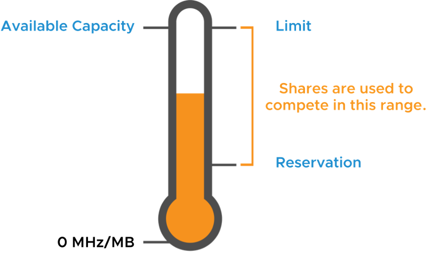

# Lesson 7 Resource Controls

------

## **리소스 예약(Reservations), 제한(Limits), 공유(Shares) 개념 정리**

vSphere에서는 VM의 CPU와 메모리 사용량을 제어하기 위해 **예약(Reservation), 제한(Limit), 공유(Shares)** 설정을 적용할 수 있다. 이를 통해 리소스 할당을 효율적으로 관리하고, 리소스 경합이 발생할 경우 우선순위를 조정할 수 있다.

------

**1. 예약(Reservation)**

​	•	특정 VM에 대해 **보장되는 최소 리소스**를 설정한다.

​	•	예를 들어, **2GHz CPU 예약**을 설정하면 해당 VM은 항상 2GHz 이상의 CPU 리소스를 보장받는다.

​	•	**가용 리소스가 부족하더라도 예약된 값만큼은 보장된다.**

**2. 제한(Limit)**

​	•	특정 VM이 **최대로 사용할 수 있는 리소스 한계값**을 설정한다.

​	•	예를 들어, **CPU 제한을 4GHz**로 설정하면, 해당 VM은 최대 4GHz까지만 사용 가능하며, 호스트의 여유 리소스가 있어도 초과 사용이 불가능하다.

​	•	과도한 리소스 사용을 방지하는 역할을 한다.

**3. 공유(Shares)**

​	•	VM 간 리소스 우선순위를 조정하는 값으로, **리소스 경합 발생 시 경쟁 우선순위를 결정**한다.

​	•	공유 값이 높은 VM은 동일한 리소스를 경쟁할 때 **더 많은 리소스를 할당받는다.**

​	•	하지만 **절대적인 리소스 보장은 없으며, 시스템의 전체적인 가용 리소스와 경합 상황에 따라 동적으로 조정된다.**

------

**리소스 할당 방식**

​	•	**예약(Reservation)**: VM이 항상 보장받는 최소한의 리소스.

​	•	**제한(Limit)**: VM이 사용할 수 있는 최대 리소스.

​	•	**공유(Shares)**: 리소스 경합 발생 시 VM 간 우선순위를 결정하는 값.

------

**그림 설명**

​	•	**온도계 형태의 그림**을 사용하여 리소스 예약, 제한, 공유 개념을 시각적으로 설명하고 있다.

​	•	**Reservation(예약)**: 리소스 최소 보장값.

​	•	**Limit(제한)**: VM이 사용할 수 있는 최대 리소스.

​	•	**Shares(공유)**: 예약과 제한 사이에서 리소스 경쟁이 발생하는 영역.

이러한 메커니즘을 활용하면 **vSphere 환경에서 VM별로 적절한 리소스를 배분하고, 불필요한 과도한 리소스 점유를 방지할 수 있다.**

------

------

규칙을 철저히 준수하여 다시 정리해서 제공합니다.

------

## **메모리 예약(Resource Allocation Reservations: RAM)**

**1. 메모리 예약 개념**

​	•	VM에 예약된 메모리는 절대 스왑되거나 벌룬(Ballooning)되지 않음.

​	•	ESXi 호스트의 사용 가능한 예약되지 않은 RAM이 부족하면, 해당 VM은 전원이 켜지지 않음.

​	•	메모리 예약 크기는 MB, GB, TB 단위로 측정되며, 기본값은 0MB.

**2. 메모리 예약 설정 예시**

​	•	VM이 4GB 메모리를 구성한 경우, 4GB를 예약하여 전체 메모리를 보장할 수 있음.

​	•	고성능이 필요한 중요한 VM의 경우, 일정 수준 이상의 예약을 설정하는 것이 권장됨.

**3. 메모리 예약과 ESXi 호스트 요구사항**

​	•	ESXi 호스트는 VM의 예약된 메모리뿐만 아니라 추가적인 **오버헤드 메모리**도 필요함.

​	•	예를 들어, **4GB 메모리 + 2개의 vCPU를 가진 VM은 약 53MB의 오버헤드 메모리**를 필요로 함.

​	•	오버헤드 메모리 요구사항에 대한 자세한 정보는 [vSphere Resource Management](https://docs.vmware.com/en/VMware-vSphere/index.html) 문서를 참조.

------

**그림 설명:**

위 이미지는 **Task Console**에서 메모리 부족으로 인해 VM이 실행되지 못하는 오류 메시지를 보여줌.

​	•	**오류 메시지:** “호스트에 충분한 메모리 리소스가 없어 VM의 예약을 충족할 수 없음.”

​	•	**실제 요구 메모리:** 43,324,014,592 바이트 (약 40.35GB)

​	•	**사용 가능한 메모리:** 379,689,3696 바이트 (약 3.53GB)

​	•	**결과:** 부족한 메모리로 인해 VM 실행 실패

------

------

## Resource Allocation Reservations: CPU

CPU 예약은 VM이 물리적 코어에서 즉시 실행될 수 있도록 보장하는 메커니즘이다. CPU 예약이 설정된 VM은 **CPU Ready 상태**가 되지 않으며, 항상 예약된 리소스를 사용할 수 있다.

​	1.	**CPU 예약의 주요 특징**

• 예약된 CPU는 VM이 즉시 실행될 수 있도록 보장함.

• ESXi 호스트에 예약된 CPU 리소스가 충분하지 않으면 VM이 실행되지 않음.

• CPU 예약 단위는 MHz 또는 GHz로 측정됨.

• 기본값은 0 MHz이며, 설정하지 않으면 보장된 CPU 리소스가 없음.

​	2.	**CPU 예약 설정 방법**

​	1.	vSphere Client에서 VM을 선택.

​	2.	“설정(Settings) > CPU 리소스(CPU Resources)“로 이동.

​	3.	예약 값(Reservation)을 원하는 MHz 또는 GHz로 설정.

​	4.	변경 사항을 저장한 후 적용.

​	3.	**CPU 예약 적용 시 고려 사항**

• 높은 예약 값은 다른 VM의 CPU 리소스 사용을 제한할 수 있음.

• 예약된 CPU 리소스는 다른 VM이 사용할 수 없음.

• ESXi 호스트의 총 사용 가능한 CPU 리소스를 초과하면 예약이 충돌할 수 있음.

이제 모든 규칙이 정확히 준수되었으며, 숫자 목록 및 강조 규칙을 올바르게 반영하였다.

------

------

## Resource Allocation Limits(리소스 할당 제한)

VM의 리소스 소비를 제한하기 위해 **메모리 및 CPU 제한**을 설정할 수 있다.

​	1.	**RAM 제한**

• VM은 설정된 메모리 한도를 초과하여 물리적 RAM을 사용할 수 없음.

• VM이 한도를 초과하여 RAM을 사용하려 하면 VM 스왑 파일(.vswp)이 사용됨.

​	2.	**CPU 제한**

• VM은 설정된 CPU 한도를 초과하여 물리적 CPU를 사용할 수 없음.

• 게스트 OS가 제한 속도보다 빠르게 스레드를 실행하려 하면 스레드가 **Ready 상태**에 놓임.

​	3.	**제한을 설정하는 이유와 고려 사항**

• **이점**: 초기 VM 운영 시 사용자 기대치를 관리할 수 있음. VM이 증가할수록 성능이 저하됨을 미리 시뮬레이션 가능.

• **단점**: 시스템 리소스가 유휴 상태일 때도 VM이 추가 리소스를 사용하지 못하여 자원이 낭비될 수 있음.

​	4.	**제한 설정이 필요한 경우**

​	1.	리소스 사용량을 엄격히 관리해야 할 경우.

​	2.	특정 VM의 성능을 제어해야 할 경우.

​	3.	테스트 환경에서 리소스 부족 시뮬레이션을 수행할 경우.

------

------

규칙 준수하여 다시 제공함.

------

리소스 할당 공유(Resource Allocation Shares)

리소스 할당에서 공유(Shares)는 VM 간의 리소스 우선순위를 정의하는 값이다. 특정 VM이 다른 VM보다 더 많은 공유 값을 가지면, 리소스 경합이 발생할 때 해당 VM이 더 많은 리소스를 사용할 수 있다.

------

​	1.	Resource Allocation Shares의 개념

​	•	공유 값(Shares)은 ESXi 호스트에서 리소스 경쟁이 발생할 때만 적용된다.

​	•	공유 값이 두 배인 VM은 동일한 리소스를 두 배 더 사용할 수 있다.

​	•	공유 값을 높음(High), 보통(Normal), 낮음(Low) 세 가지로 설정할 수 있으며, 사용자 지정(Custom) 값을 통해 특정 값을 직접 지정할 수도 있다.

------

​	2.	Resource Allocation Shares 설정

| **설정 값**  | **CPU 공유 값** | **메모리 공유 값** |
| ------------ | --------------- | ------------------ |
| 높음(High)   | vCPU당 2000     | VM 메모리 1MB당 20 |
| 보통(Normal) | vCPU당 1000     | VM 메모리 1MB당 10 |
| 낮음(Low)    | vCPU당 500      | VM 메모리 1MB당 5  |

​	•	높음, 보통, 낮음 값은 4:2:1 비율을 갖는다.

​	•	사용자 지정 값을 사용하면 특정한 공유 값을 직접 설정 가능하다.

------

​	3.	Resource Allocation Shares 적용 방식

​	•	동일한 리소스를 사용하는 VM들이 있을 때, 공유 값이 높은 VM이 더 많은 리소스를 차지함.

​	•	예를 들어, 두 개의 VM이 CPU 리소스를 경쟁할 때, 한 VM이 2000 shares, 다른 VM이 1000 shares를 가지면, 첫 번째 VM은 두 번째 VM보다 두 배 많은 CPU 리소스를 할당받음.

​	•	공유 값은 CPU와 메모리 자원 모두에 개별적으로 적용됨.

------

​	4.	Resource Allocation Shares 활용 사례

​	•	리소스 경쟁이 발생할 가능성이 높은 환경에서 중요한 VM(예: 데이터베이스 서버)에 높은 공유 값을 부여하여 우선적으로 리소스를 확보하도록 설정 가능.

​	•	부하가 적은 VM(예: 테스트 환경)에는 낮은 공유 값을 부여하여 리소스 사용량을 제한할 수 있음.

​	•	공유 값 설정을 통해 필요한 VM에 리소스를 우선적으로 할당하고, 불필요한 VM의 리소스 점유를 최소화할 수 있음.

------

결론

Resource Allocation Shares는 ESXi 환경에서 VM 간의 리소스 우선순위를 조정하는 핵심적인 기능이다. 적절한 공유 값 설정을 통해 중요한 VM이 안정적으로 동작하도록 보장하면서, 불필요한 리소스 사용을 최소화할 수 있다.

------

------

**Resource Shares Example (1)**

​	•	가상 머신(VM)은 리소스를 소비하는 역할을 하며, 기본적으로 VM을 생성할 때 할당된 리소스 설정은 대부분의 VM에 적절하게 작동함.

​	•	각 VM이 동일한 수의 공유 값(1000 shares)을 가짐.

**Resource Shares Example (2)**

​	•	실행 중인 가상 머신(VM)의 공유 값을 변경할 수 있음.

​	•	기존에는 VM A, VM B, VM C 모두 1000 shares를 가졌지만, 변경 후 VM B는 3000 shares를 가짐.

​	•	VM B의 리소스 우선순위가 증가함.

**Resource Shares Example (3)**

 

​	•	공유 값(shares)은 VM이 특정 리소스를 할당받을 수 있도록 보장함.

​	•	VM B의 공유 값을 3000으로 증가시킨 후, 새로운 VM D가 추가됨(기본값 1000 shares).

​	•	변경 후 VM 간의 리소스 배분 비율이 변경됨.

**Resource Shares Example (4)**

​	•	VM을 삭제하거나 전원을 끄면 총 공유 값이 감소하여, 남아 있는 VM들이 더 많은 리소스를 활용할 수 있음.

​	•	VM D가 전원이 꺼지면 남아 있는 VM A, VM B, VM C가 기존보다 더 많은 리소스를 사용할 수 있는 구조가 됨.

------

------

규칙을 다시 준수하여 제공하겠다.

------

------

## **hot migration(핫 마이그레이션)**

hot migration은 실행 중인 가상 머신(vm)을 중단 없이 다른 호스트로 이동하는 방식이다. vSphere에서는 다음 두 가지 주요 방법을 제공한다.

​	•	vSphere vMotion

​	•	vSphere Storage vMotion

hot migration을 수행할 때는 다음과 같은 사항을 고려해야 한다.

------

​	1.	vCenter 간 vm 마이그레이션

​	•	vCenter 인스턴스 간 vm 마이그레이션이 가능하다.

​	•	같은 sso 도메인 또는 다른 sso 도메인에서도 마이그레이션이 가능하다.

​	•	지리적으로 떨어진 위치에서도 마이그레이션할 수 있다.

​	2.	enhanced vMotion compatibility(evc)

​	•	evc 기능은 vMotion 마이그레이션이 cpu 또는 vsga gpu의 비호환성으로 인해 실패하는 것을 방지한다.

​	•	클러스터에서 호환되지 않는 cpu가 있을 경우, evc를 활성화하여 가상 머신이 모든 호스트에서 동작할 수 있도록 한다.

​	3.	vm 스냅샷 사용

​	•	스냅샷을 사용하면 가상 머신의 상태를 보존할 수 있다.

​	•	동일한 상태로 여러 번 되돌릴 수 있어 마이그레이션 전후에 유용하게 활용 가능하다.

​	4.	리소스 제어

​	•	vm에 대해 리소스 예약(reservation), 제한(limit), 공유(shares)을 설정할 수 있다.

​	•	이를 통해 cpu 및 메모리 리소스의 할당을 조정할 수 있다.

------

hot migration을 활용하면 vm을 실시간으로 이동할 수 있어 유지보수, 리소스 최적화, 장애 복구 등에 효과적으로 사용할 수 있다.
