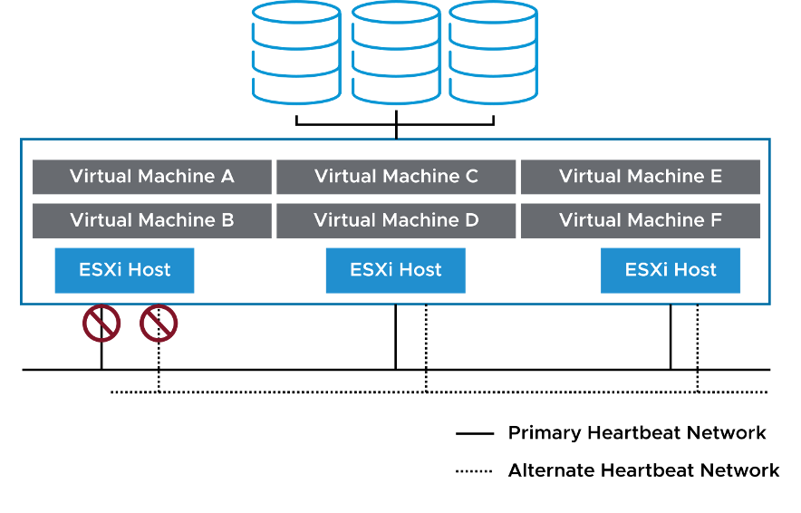

## **vSphere를 활용한 보호 계층별 보안 및 가용성 보장**

------

**1. vSphere를 통한 다운타임 최소화**

​	•	**계획된 다운타임 감소**: 유지보수 및 업그레이드 작업 중에도 VM을 계속 실행할 수 있음

​	•	**예기치 않은 다운타임 방지**: 장애 발생 시 신속한 복구 및 지속적인 VM 보호

​	•	**빠른 복구 기능 제공**: 장애 발생 후 VM 및 서비스의 신속한 복원

------

**2. vSphere를 통한 높은 가용성 보장**

​	•	**하드웨어, 운영체제, 애플리케이션에 독립적인 고가용성 제공**

​	•	**자동 장애 복구 지원**

​	•	**VM의 연속적 가용성 보장**

**① vSphere HA (High Availability)**

​	•	**VM을 자동으로 재시작하여 장애 복구 제공**

​	•	**호스트 장애 발생 시 즉각적인 VM 재배치 및 복구 가능**

**② vSphere Fault Tolerance (FT)**

​	•	**VM을 실시간으로 복제하여 장애 발생 시 데이터 손실 없이 운영 가능**

​	•	**기본 VM과 보조 VM을 완전히 동기화하여 장애 발생 시 즉시 전환 가능**

**③ vSphere vMotion 및 Storage vMotion**

​	•	**계획된 유지보수 중 VM 가용성을 유지**

​	•	**호스트 또는 스토리지 유지보수 시 VM을 다른 리소스로 자동 이동**

------

**3. vSphere Replication 및 백업 솔루션 활용**

​	•	**vSphere Replication**: VM 디스크 파일을 다른 위치로 복제하여 복구 가능

​	•	**VM 캡슐화(Encapsulation) 기능 활용**

​	•	서드파티 백업 솔루션과 연계 가능

​	•	파일 및 이미지 수준 백업 지원

------

**4. Site Recovery Manager (SRM)로 IT 인프라 복구**

​	•	**재해 복구 자동화**: 장애 발생 시 IT 인프라를 빠르게 복원

​	•	**vSphere Replication 또는 스토리지 기반 복제를 통한 데이터 보호**

​	•	**vCenter가 보호 사이트 및 복구 사이트에서 동작해야 함**

------

**5. 결론**

​	•	vSphere를 활용하면 **기본적인 고가용성부터 재해 복구까지 모든 계층에서 보호 기능 제공 가능**

​	•	**운영 유지보수, 장애 대응, 백업, 복구** 등을 신속하고 안전하게 수행 가능

​	•	**vSphere HA, FT, vMotion, Replication, SRM** 등을 조합하여 **최적의 가용성 및 보호 전략 구현 가능**

------

------

## **vSphere HA (High Availability) 개요**

------

**1. vSphere HA란?**

​	•	**VM의 가용성을 보장하는 고가용성(HA) 솔루션**

​	•	**비용 효율적인 방법으로 VM 장애 및 데이터 손실 방지**

​	•	**VM이 실행되는 ESXi 호스트 장애 발생 시 자동으로 복구 수행**

​	•	**기본 인프라를 활용하여 모든 VM을 자동으로 보호**

------

**2. vSphere HA가 제공하는 보호 기능**

| **보호 대상**              | **보호 방법**                                               |
| -------------------------- | ----------------------------------------------------------- |
| **ESXi 호스트 장애**       | 클러스터 내 다른 호스트에서 VM 자동 재시작                  |
| **VM 장애**                | VMware Tools 하트비트가 감지되지 않으면 VM 자동 재시작      |
| **애플리케이션 장애**      | 애플리케이션 하트비트가 감지되지 않으면 VM 자동 재시작      |
| **데이터스토어 접근 장애** | 장애가 발생하지 않은 다른 호스트에서 VM 자동 재시작         |
| **네트워크 격리(분할)**    | 호스트가 격리되면 VM을 자동 재시작하여 지속적인 가용성 유지 |

------

**3. vSphere HA 특징**

​	•	**설정 후 별도의 조치 없이 모든 VM이 자동 보호됨**

​	•	**호스트, VM, 애플리케이션 장애까지 폭넓은 보호 제공**

​	•	**기본 인프라를 활용하여 간단하고 비용 효율적으로 운영 가능**

​	•	**추가적인 클러스터링 솔루션 없이도 HA 기능 제공 가능**

------

**4. 결론**

​	•	vSphere HA는 **모든 워크로드의 지속적인 가용성을 보장**

​	•	**호스트, VM, 애플리케이션 장애를 신속히 복구하여 다운타임 최소화**

​	•	**데이터스토어 장애 및 네트워크 격리 상황에서도 VM을 보호**

​	•	**자동 보호 기능을 통해 운영자의 개입 없이 지속적인 서비스 유지 가능**

------

------

## **vSphere HA: ESXi 호스트 장애 시 동작 방식**

------

**1. 개요**

​	•	vSphere HA는 **클러스터 내 ESXi 호스트 장애 발생 시 자동으로 VM을 복구**

​	•	장애가 발생한 **호스트에서 실행 중이던 VM을 다른 가용한 호스트에서 재시작**

​	•	HA 기능을 통해 **서비스 중단을 최소화**하고 운영 지속성 유지

------

**2. ESXi 호스트 장애 감지 및 대응**

| **장애 유형**                  | **vSphere HA의 대응 방식**                        |
| ------------------------------ | ------------------------------------------------- |
| **ESXi 호스트 장애**           | 클러스터 내 가용한 다른 호스트에서 VM 자동 재시작 |
| **호스트 격리(네트워크 단절)** | 네트워크 격리 감지 후 VM 재배치 또는 재시작       |
| **스토리지 접근 불가**         | VM을 스토리지 접근이 가능한 호스트에서 재시작     |

------

**3. 복구 과정**

1. **ESXi 호스트 장애 감지**
   * vSphere HA는 주기적으로 호스트 상태를 모니터링
   * 네트워크 하트비트를 통해 호스트의 가용성을 판단

2. **장애 발생 시 즉시 복구 절차 시작**
   * 장애가 발생한 호스트에서 실행 중이던 VM을 다른 호스트에서 자동으로 재시작
   * 필요한 경우 vSphere DRS와 연계하여 자원 균형 조정

3. **서비스 복구 시간**
   * 복구 시간은 **VM의 운영체제 및 애플리케이션 부팅 속도에 따라 달라짐**

------

**4. vSphere HA 활용 효과**

​	•	**관리자의 개입 없이 자동으로 VM 복구 진행**

​	•	**ESXi 호스트 장애 발생 시에도 최소한의 다운타임 유지**

​	•	**비즈니스 연속성을 보장하며, 인프라 안정성 향상**

------

**5. 결론**

​	•	vSphere HA는 **ESXi 호스트 장애 시 자동 복구 기능을 제공**

​	•	**네트워크 격리, 스토리지 장애까지 감지하여 VM을 보호**

​	•	**신속한 VM 재시작을 통해 비즈니스 운영에 미치는 영향을 최소화**

------

------

## **vSphere HA: 데이터스토어 접근 불가 시 대응 방식**

------

**1. 개요**

​	•	vSphere HA는 **데이터스토어 접근 불가(스토리지 장애)** 발생 시 **자동 복구** 기능 제공

​	•	장애 유형에 따라 **일시적(APD) 또는 영구적(PDL) 장애로 구분**

​	•	설정된 정책에 따라 **VM을 종료하고 재시작하거나, 이벤트만 기록**

------

**2. 데이터스토어 장애 유형 및 대응 방식**

| **장애 유형**                   | **설명**                                                     | **vSphere HA 대응 옵션**                                     |
| ------------------------------- | ------------------------------------------------------------ | ------------------------------------------------------------ |
| **APD (All Paths Down)**        | - 스토리지 연결이 일시적으로 끊김 - 장애가 일시적이거나 원인을 알 수 없음 | - 이벤트만 기록 - **VM 종료 후 재시작 (보수적 정책)** - **VM 종료 후 재시작 (공격적 정책)** |
| **PDL (Permanent Device Loss)** | - 호스트가 데이터스토어에 대한 **영구적 접근 불가** 상태 - 스토리지 장치가 더 이상 호스트에서 접근 불가능 | - 이벤트만 기록 - **VM 종료 후 재시작**                      |

------

**3. APD(All Paths Down) 대응 방식**

| **정책 유형**     | **대응 방식**                                                |
| ----------------- | ------------------------------------------------------------ |
| **이벤트만 기록** | 장애가 발생한 호스트에서 **VM을 유지**하고, 이벤트만 기록    |
| **보수적 정책**   | vSphere HA는 **다른 호스트에서 VM을 재시작할 수 있는지 확인 후**, 가능할 경우 장애가 발생한 호스트에서 VM을 종료하고 재시작 |
| **공격적 정책**   | vSphere HA는 **클러스터 내 가용 리소스 확인 없이** VM을 종료 후 다른 호스트에서 재시작을 시도 |

------

**4. PDL(Permanent Device Loss) 대응 방식**

​	•	PDL 상태가 감지되면 **스토리지가 더 이상 접근할 수 없는 것으로 간주**

​	•	vSphere HA의 대응 옵션:

​	•	이벤트만 기록

​	•	**VM 종료 후 다른 호스트에서 재시작**

------

**5. 결론**

​	•	**APD는 일시적 장애로 간주하며, 선택한 정책에 따라 VM을 재시작할 수도 있음**

​	•	**PDL은 영구적인 장애로 간주되며, VM을 종료 후 다른 호스트에서 재시작하는 것이 일반적 대응 방식**

​	•	**공격적 정책을 사용할 경우, 충분한 리소스가 없으면 VM이 재시작되지 않을 수도 있음**

​	•	**네트워크 분할(Network Partition) 시 장애 원인 파악이 어렵기 때문에 신중한 정책 설정이 필요**

------

------

## **vSphere HA: Heartbeat 네트워크의 중요성**

------

**1. 개요**

​	•	**Heartbeat 네트워크**는 **VMkernel 포트**를 통해 관리 트래픽 또는 vSAN 트래픽으로 구현됨

​	•	vSphere HA에서 **호스트 장애 감지 및 상태 확인** 역할 수행

매니지먼트 네트워크를 활용함

------

**2. Heartbeat 네트워크의 특징**

| **특징**                    | **설명**                                                     |
| --------------------------- | ------------------------------------------------------------ |
| **호스트 간 상태 확인**     | 기본(primary) 호스트와 보조(secondary) 호스트 간 **주기적인 heartbeat 송신** |
| **장애 감지**               | 기본 호스트가 다운되었는지, 또는 네트워크 단절로 인해 격리되었는지 감지 |
| **Heartbeat 네트워크 사용** | 네트워크를 통해 heartbeat 신호 송신                          |
| **vSAN 활성화 시 변경**     | vSAN과 vSphere HA가 **동시에 활성화된 경우**, 기본 heartbeat 네트워크는 **vSAN 네트워크**로 변경됨 |

------

**3. Heartbeat 네트워크 중복 구성의 필요성**

​	•	**Heartbeat 네트워크를 이중화하면 보다 안정적인 장애 감지 가능**

​	•	**이중화된 네트워크를 통해 단절 방지**

​	•	기본 네트워크 장애 발생 시 **보조 네트워크를 통해 heartbeat 전송 지속 가능**

​	•	단일 heartbeat 네트워크를 사용할 경우, 해당 네트워크 장애 시 **전체 HA 클러스터가 비정상적인 장애 상태로 인식될 위험 존재**

------

**4. 결론**

​	•	**Heartbeat 네트워크는 호스트 장애 감지 및 격리 예방을 위해 필수적**

​	•	**vSAN이 활성화된 경우, vSAN 네트워크가 기본 heartbeat 네트워크 역할 수행**

​	•	**Heartbeat 네트워크를 중복 구성하면 장애 발생 시 네트워크 단절을 방지하고 HA의 신뢰성을 높일 수 있음**

------

------

## **vSphere HA: 네트워크 격리로부터 VM 보호**

------

**1. 개요**

​	•	**vSphere HA는 네트워크 격리(Isolation) 상태가 발생한 경우 VM을 재시작하여 보호함**

​	•	**네트워크 격리란?**

​	•	ESXi 호스트가 실행 중이지만, **Heartbeat 네트워크에서 다른 vSphere HA 에이전트의 트래픽을 감지하지 못하는 상태**

​	•	관리 네트워크 또는 vSAN 네트워크가 단절되었을 가능성이 있음

------

**2. vSphere HA의 동작 방식**

​	•	**호스트가 네트워크 격리에 빠지면, vSphere HA는 이를 감지하여 VM을 재배치 및 재시작**

​	•	**Heartbeat 네트워크를 통해 지속적으로 호스트 상태를 확인**

​	•	**다른 HA 클러스터 호스트에서 격리된 호스트의 VM을 다시 시작함**

------

**3. 네트워크 격리 방지 방법**

​	•	**네트워크 인프라를 이중화하여 최소 하나의 네트워크 경로가 항상 활성화되도록 구성**

​	•	**vSphere HA가 관리 네트워크 또는 vSAN 네트워크를 통해 지속적으로 Heartbeat를 송수신할 수 있도록 설정**

​	•	**vSAN을 사용하는 경우, vSphere HA는 vSAN 네트워크를 기본 Heartbeat 네트워크로 사용**

------

**4. 결론**

​	•	**네트워크 격리는 호스트 장애와 달리, 물리적으로는 운영되지만 네트워크 통신이 불가능한 상태**

​	•	**이중화된 네트워크 구성이 없으면 네트워크 격리로 인해 VM이 가용성을 잃을 수 있음**

​	•	**vSphere HA는 네트워크 격리 발생 시 VM을 정상적인 호스트로 자동 재배치하여 가용성을 유지함**

------

------

## Heartbeat Network Redundancy Using NIC Teaming

하트비트 네트워크는 반드시 이중화하여 사용

------

------

## **Heartbeat Network Redundancy Using Additional VMkernel Ports**

------

**1. 개요**

​	•	**Heartbeat 네트워크의 이중화(Redundancy)를 통해 가용성을 향상시킬 수 있음**

​	•	**추가적인 VMkernel 포트를 생성하여 별도의 가상 스위치(Virtual Switch)에 연결하면 네트워크 단절 시에도 Heartbeat가 유지됨**

------

**2. 구현 방법**

1. **두 번째 VMkernel 포트 생성**
   * 기존의 관리 네트워크(Management Network) 외에 **새로운 VMkernel 포트** 추가
   * 각 VMkernel 포트는 **다른 가상 스위치(Virtual Switch)에 연결**
   * 각 가상 스위치는 **별도의 물리 어댑터(Physical Adapter)를 사용**

2. **NIC Teaming을 통한 이중화**
   * 일반적으로 **NIC Teaming**을 사용하면 충분한 Heartbeat 이중화가 가능함
   * 그러나 **VMkernel 포트를 별도의 가상 스위치와 물리 어댑터에 연결하면 추가적인 보호 기능 제공**
   * 두 개의 VMkernel 포트를 동일한 가상 스위치에 연결할 수도 있음
   * **이 경우, 각 포트 그룹이 다른 물리 어댑터를 사용하도록 구성해야 함**

------

**3. 예제 시나리오**

* **첫 번째 관리 네트워크**

  * *vSwitch0**에서 실행

  * **VMkernel 포트: vmk0 (IP: 172.20.10.51)**

  * **연결된 물리 어댑터: vmnic0**

* **두 번째 관리 네트워크**

  * **vSwitch3**에서 실행

  * **VMkernel 포트: vmk3 (IP: 172.20.11.52)**

  * **연결된 물리 어댑터: vmnic4**

ß

**→ 결과적으로, 하나의 네트워크 경로가 단절되더라도 다른 경로를 통해 Heartbeat를 송수신할 수 있어 고가용성을 보장할 수 있음**

------

**4. 결론**

​	•	**Heartbeat 네트워크의 이중화는 vSphere HA의 핵심적인 보호 메커니즘 중 하나**

​	•	**NIC Teaming을 사용한 기본적인 보호 외에도, 별도의 VMkernel 포트를 추가해 가용성을 극대화할 수 있음**

​	•	**이러한 설정을 통해 네트워크 장애 발생 시에도 지속적으로 vSphere HA의 기능이 유지될 수 있음**