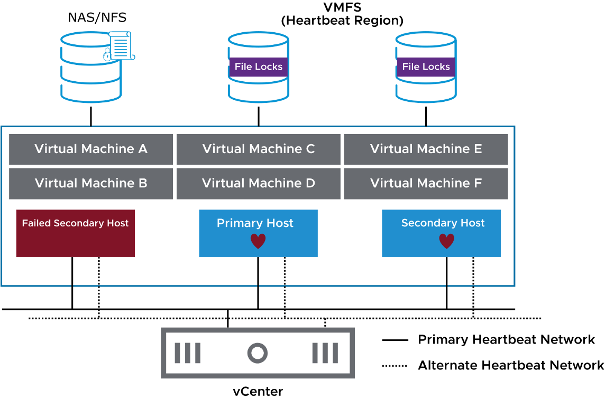

# 

**vSphere HA 아키텍처: 에이전트 통신 개요**

------

**1. 개요**

* vSphere HA(High Availability) **구성 시, 모든 ESXi 호스트에 Fault Domain Manager(FDM) 서비스가 업로드 및 실행됨**
* **FDM 서비스는 vSphere HA 에이전트 역할 수행**
* 클러스터 내 **하나의 호스트가 Primary 호스트, 나머지 호스트는 Secondary 호스트로 설정됨**
* **Primary 호스트와 Secondary 호스트 간 통신을 통해 가상 머신(VM)의 가용성을 유지**

------

2. **Primary 및 Secondary 호스트 관리**
   * vSphere HA **클러스터는 Primary 호스트가 관리하며, Secondary 호스트들은 Primary 호스트와 지속적으로 통신**
   * **Primary 호스트 선출(Election) 과정**
   * **가장 많은 데이터스토어에 접근할 수 있는 호스트가 Primary 호스트로 선정됨**
   * **동일한 개수의 데이터스토어를 볼 수 있는 경우, vCenter에서 할당한 Managed Object ID(MOID)에 따라 결정됨**
   * Primary 호스트 선정 과정은 약 **15초** 정도 소요됨
   * **Primary 호스트는 클러스터의 VM 가용성 및 Fault Domain의 상태를 vCenter에 보고**
   * vCenter는 **Primary 호스트에 클러스터 구성 정보를 전달**하고, Primary 호스트는 이를 Secondary 호스트에 배포

------

3. **Primary 호스트 변경(Election Process) 발생 조건**
   * Primary 호스트가 다음과 같은 이유로 동작하지 않는 경우 새로운 Primary 호스트가 선출됨
     1. **Primary 호스트가 시스템 장애로 인해 중단됨**
     2. **Primary 호스트가 유지보수 모드(Maintenance Mode)로 변경됨**
     3. **Primary 호스트가 대기 모드(Standby Mode)로 전환됨**
     4. **vSphere HA가 재구성됨**
     5. **Secondary 호스트들이 Primary 호스트와의 네트워크 연결을 상실**

------

4. **네트워크 및 통신 방식**
   * vSphere HA 에이전트들은 **UDP 프로토콜을 사용하여 Heartbeat 네트워크를 통해 통신**
   * **Primary 호스트 선출 이후, Primary 호스트와 Secondary 호스트 간 통신은 보안 TCP 프로토콜을 사용**
   * vCenter → Primary 호스트 → Secondary 호스트 순으로 클러스터 구성 정보가 전파됨
   * **각 호스트는 업데이트된 클러스터 구성 정보를 로컬 저장소(Local Storage)에 저장**

------

5. **가상 머신(VM) 보호 및 상태 모니터링**

   * Primary 호스트는 **Secondary 호스트들의 상태를 지속적으로 모니터링**

   * Primary 호스트가 장애 발생 시, Secondary 호스트 중 하나가 새로운 Primary 호스트로 승격됨

     * **Secondary 호스트의 역할**
       * **해당 호스트에서 실행 중인 VM들의 상태를 모니터링**
       * ***Primary 호스트에 VM 상태 변경 정보를 보고**
       * **Primary 호스트가 장애 발생 시 새로운 Primary 호스트 선출 과정에 참여**

     * **VM 보호(Protection) 상태 변경 조건**
       * VM이 **전원이 켜질 때** → **보호(Protected) 상태**로 변경됨
       * VM이 **전원이 꺼질 때** → **비보호(Unprotected) 상태**로 변경됨

     * **스냅샷 복원 시**
       * **메모리 포함된 스냅샷 복원** → VM이 자동으로 켜지면서 보호됨
       * **메모리 없는 스냅샷 복원** → VM이 꺼지면서 비보호 상태로 변경됨

------

6. **결론**
   * **vSphere HA는 Primary 및 Secondary 호스트 간 FDM(Fault Domain Manager) 통신을 기반으로 VM의 고가용성을 보장**
   * **Primary 호스트는 클러스터의 핵심 역할을 수행하며, 장애 발생 시 새로운 Primary 호스트가 선출됨**
   * **UDP 기반의 Heartbeat 통신과 TCP 기반의 클러스터 구성 전파를 통해 안정적인 운영 환경 유지**
   * **VM 보호 상태는 전원 상태 및 스냅샷 복원 여부에 따라 자동으로 변경됨**

------

------

## **vSphere HA 아키텍처: 네트워크 하트비트(Network Heartbeats) 개요**

------

**1. 개요**

​	•	**Primary 호스트는 정기적으로 Secondary 호스트에게 하트비트(Heartbeat) 신호를 전송**

​	•	**Primary 호스트는 Secondary 호스트가 정상적으로 운영 중인지 확인하고, 반대로 Secondary 호스트도 Primary 호스트가 정상 상태인지 확인**

​	•	**모든 구성된 하트비트 네트워크를 통해 Primary 호스트가 Secondary 호스트로 신호를 전송**

​	•	**Secondary 호스트는 기본적으로 하나의 하트비트 네트워크만 사용하여 Primary 호스트와 통신**

​	•	**기본적으로 Primary 호스트와 Secondary 호스트 간의 통신은 하트비트 네트워크를 통해 이루어짐**

------

**2. 하트비트 네트워크 장애 시 처리 방식**

​	•	**Secondary 호스트가 Primary 호스트로부터의 하트비트를 수신하지 못하면 자동으로 다른 하트비트 네트워크로 전환**

​	•	**Primary 호스트가 일정 시간 동안 Secondary 호스트의 응답을 받지 못하면 “에이전트 미응답(Agent Unreachable)” 상태로 판단**

​	•	**Primary 호스트는 Secondary 호스트의 응답 불가 원인을 분석하여 조치를 결정**

------

3. **Primary 호스트의 장애 감지 프로세스**

   * Primary 호스트는 Secondary 호스트가 응답하지 않는 경우, 다음 원인 중 하나인지 확인:

     1. **Secondary 호스트가 충돌(Crash)하여 중단됨**

     2. **네트워크 장애로 인해 Secondary 호스트와의 연결이 끊어짐**

     3. **vSphere HA 에이전트(FDM)가 실행되지 않거나 비정상 상태(Unreachable State)임**

   * Primary 호스트는 위 원인 중 **호스트 장애(Crash)로 판단될 경우, Secondary 호스트에서 실행 중이던 가상 머신(VM)을 다른 정상적인 호스트에서 재시작**

------

4. **결론**

   * vSphere HA의 **네트워크 하트비트는 Primary 및 Secondary 호스트 간의 통신을 유지하는 핵심 요소**

   * **Primary 호스트는 모든 Secondary 호스트에게 하트비트를 전송하여 네트워크 상태를 지속적으로 확인**

   * **하트비트 네트워크 장애 시, Secondary 호스트는 자동으로 다른 네트워크를 사용하여 Primary 호스트와 연결을 유지**

   * **Primary 호스트는 응답이 없는 Secondary 호스트의 상태를 분석하고, 필요할 경우 VM을 다른 호스트에서 자동 복구**

------

------

## **vSphere HA 장애 시나리오(Failure Scenarios)**

------

**1. 개요**

* vSphere HA는 다양한 유형의 장애를 감지하고 대응할 수 있음

  * 주요 장애 유형:

    * **Secondary 호스트 장애**

    * **Primary 호스트 장애**

    * **네트워크 장애(호스트 격리, Host Isolation)**

    * **데이터스토어 접근 불가 장애**

    * **APD(All Paths Down)**

    * **PDL(Permanent Device Loss)**

------

2. **네트워크 장애 (Host Isolation)**

   * **호스트 격리(Isolation)란?**
     * ESXi 호스트가 클러스터 내 다른 호스트의 네트워크 트래픽을 감지할 수 없는 상태
     * 설정된 격리 주소(Isolation Address)로의 핑(Ping) 요청이 실패할 경우 발생

   * **vSphere HA의 대응 방법**

     * **ESXi 호스트 장애(Failure) 감지 시** → 해당 호스트에서 실행 중이던 VM을 클러스터 내 다른 정상적인 호스트에서 자동 재시작

     * **ESXi 호스트가 격리(Isolated) 상태일 경우** → “Host Isolation Response” 정책을 실행하여 VM을 보호

------

3. **데이터스토어 접근 불가 장애 (APD & PDL)**

   * **APD (All Paths Down)**
     * **일시적 또는 알 수 없는 이유로 데이터스토어 연결이 끊어지는 장애**
     * vSphere HA가 복구 가능(Recoverable)한 장애로 판단

   * **PDL (Permanent Device Loss)**
     * **스토리지 장치가 더 이상 접근 불가능한 상태(Unrecoverable Loss)**
     * 스토리지 장치가 물리적으로 제거되거나 호스트가 영구적으로 연결을 잃었을 경우 발생
     * vSphere HA는 VM을 다른 정상적인 호스트에서 재시작하도록 설정 가능

------

**4. Primary & Secondary 호스트 장애 대응**

* **Secondary 호스트 장애**
  * Primary 호스트가 Secondary 호스트의 응답을 받지 못하면 “에이전트 미응답(Agent Unreachable)” 상태로 판단
  * Primary 호스트는 해당 Secondary 호스트에서 실행 중이던 VM을 감지하고 필요 시 다른 정상적인 호스트에서 재시작

* **Primary 호스트 장애**
  * 클러스터 내 모든 Secondary 호스트 간 **Primary 호스트 선출 프로세스(Election Process)** 발생
  * 새로운 Primary 호스트가 지정되면 클러스터 내 상태를 갱신하고 기존 Primary 호스트에서 실행 중이던 VM을 복구

------

**5. 결론**

​	•	vSphere HA는 **호스트 장애, 네트워크 격리, 데이터스토어 장애 등 다양한 장애 시나리오에 대해 자동 복구 기능을 제공**

​	•	**클러스터 내 정상적인 호스트에서 VM을 자동 재시작하여 가용성을 유지**

​	•	**APD 및 PDL 같은 스토리지 장애 상황을 분석하고 적절한 대응 정책을 적용 가능**

​	•	**Primary 호스트 장애 발생 시, Secondary 호스트 중 하나가 자동으로 새로운 Primary 호스트로 선출**

​	•	**vSphere HA는 자동화된 장애 감지 및 복구를 통해 VM의 지속적인 운영을 보장하는 핵심 기능**

------

------

Failed Secondary Hosts

------

------

## Failed Primary Hosts

------

------

## **vSphere HA에서 호스트 격리(Isolated Hosts) 처리 방식**

------

1. **호스트 격리(Isolation)란?**

   * **vSphere HA에서 호스트가 격리 상태로 선언되는 조건**

     1. **네트워크 하트비트(Network Heartbeat) 수신 불가**

     2. **격리 주소(Isolation Address) 핑(Ping) 실패**

   * **격리 주소(Isolation Address)**
     * vSphere HA에서 특정 IP 주소 또는 FQDN을 **격리 감지용 주소로 사용**
     * 기본적으로 **호스트의 기본 게이트웨이**를 격리 주소로 사용
     * 관리자는 추가적인 격리 주소를 수동으로 지정 가능

------

2. **호스트 격리 감지 프로세스**

   1. **네트워크 연결 점검**
      * 해당 호스트가 다른 vSphere HA 호스트로부터 네트워크 하트비트를 수신하는지 확인
      * 하트비트 수신이 중단되면 격리 가능성이 있음

   2. **격리 주소 핑(Ping) 테스트**

      * 호스트가 사전 정의된 격리 주소에 핑을 전송하여 네트워크 연결 상태 확인

      * 핑 테스트가 실패하면 **호스트가 격리된 것으로 판단**

   3. **스토리지 하트비트(Datastore Heartbeat) 검사**

      * 네트워크 문제가 감지되면 **vSphere HA는 데이터스토어 하트비트를 사용하여 추가적인 상태 확인**

      * 호스트가 **스토리지 하트비트를 유지하고 있으면**, 단순 네트워크 격리 상태로 판단

      * 스토리지 하트비트도 중단되면 **호스트가 완전히 장애(Failed) 상태일 가능성**이 높음

------

3. **호스트 격리 발생 시 대응 방식 (Isolation Response)**

| **설정 옵션**                     | **동작 방식**                                                |
| --------------------------------- | ------------------------------------------------------------ |
| **Power off and restart VMs**     | 격리된 호스트에서 실행 중인 VM을 강제 종료 후 다른 정상적인 호스트에서 재시작 |
| **Shutdown and restart VMs**      | VM을 정상 종료 후 다른 호스트에서 재시작 (데이터 손실 최소화 가능) |
| **Leave VMs powered on** (기본값) | 격리된 호스트에서 VM을 계속 실행, 다른 호스트에서 재시작하지 않음 |

​	•	**관리자가 선택한 Isolation Response 옵션에 따라 동작**

​	•	기본값은 “Leave VMs powered on”으로 설정되어 있으며, 네트워크가 복구될 때까지 VM이 계속 실행됨

------

**4. 결론**

​	•	vSphere HA는 **네트워크 하트비트, 격리 주소 핑 테스트, 스토리지 하트비트를 활용하여 호스트 격리를 감지**

​	•	**격리된 호스트에서 실행 중인 VM은 관리자가 설정한 Isolation Response에 따라 조치됨**

​	•	**격리 감지가 정확하게 이루어지도록 적절한 네트워크 및 데이터스토어 하트비트 구성이 필요**

------

------

**VM Storage Failures: 스토리지 장애 및 영향**

------

1. **스토리지 연결 장애(Storage Connectivity Failures)의 원인**

스토리지 연결 문제는 다음과 같은 이유로 발생할 수 있음:

1. **네트워크 또는 스위치 장애**
   * iSCSI, NFS 또는 vSAN 네트워크 연결이 끊어짐
   * 네트워크 스위치 오작동 또는 설정 오류 발생

2. **스토리지 어레이 설정 오류**
   * LUN 또는 데이터스토어 액세스 권한 문제
   * iSCSI, FC(Fibre Channel) 또는 NFS 연결 미설정 또는 잘못된 구성

3. **전원 장애**
   * 스토리지 시스템이 다운되거나 전력 공급 불안정
   * UPS(Uninterruptible Power Supply) 장애로 인한 전원 중단

------

2. **스토리지 장애가 가상 머신(VM)에 미치는 영향**

스토리지 연결이 끊어지면 **VM 가용성(Availability)**에 심각한 영향을 미칠 수 있음:

1. **VM이 정상적으로 관리되지 않음**
   * ESXi 호스트가 VM의 저장소를 읽거나 쓸 수 없기 때문에 관리 콘솔에서 응답 없음 상태가 될 수 있음

2. **애플리케이션 장애**
   * VM에서 실행 중인 애플리케이션이 **스토리지 디스크를 액세스할 수 없으면** 오류 발생
   * 데이터베이스, 파일 서버 및 기타 저장소 의존 서비스가 중단됨

3. **VM 성능 저하 또는 응답 없음**
   * VM의 가상 디스크(VMDK)가 저장된 데이터스토어에 액세스할 수 없으면 **VM이 멈추거나 응답하지 않음**
   * VM의 I/O 요청이 실패하고, OS가 응답 불가능 상태에 빠질 수 있음

4. **데이터 손실 위험**
   * 스토리지 장애가 지속될 경우 **데이터 손실 가능성 증가**
   * 특히, **데이터 복제 또는 백업 시스템이 없으면 장애 발생 시 복구 어려움**

------

3. **해결 방법 및 대응 방안**

   * **스토리지 장애 감지 및 알림 설정**
     * vSphere Alarms를 활용하여 스토리지 연결 문제 감지
     * VMkernel 로그 분석 및 vCenter에서 이벤트 모니터링

   * **스토리지 장애 대비**
     * **Multipathing(다중 경로 설정)**을 사용하여 스토리지 경로 이중화
     * DRS(Distributed Resource Scheduler) 및 HA(High Availability) 활용하여 VM을 자동 재배치
     * vSAN을 구성하여 고가용성(HA) 및 데이터 보호 제공

   * **백업 및 복구 전략**
     * 정기적인 vSphere Replication 또는 스냅샷을 사용하여 백업 유지
     * DR(Disaster Recovery) 솔루션과 vSphere Site Recovery Manager(SRM) 활용

------

**4. 결론**

스토리지 연결 장애는 **VM 가용성에 직접적인 영향을 미치는 중요한 요소**이며, 이러한 장애를 최소화하기 위해 **다중 경로 설정(Multipathing), vSphere HA, DRS 및 백업 전략을 철저히 구성해야 함**.

------

------

## **PDM, PBM, VMCP 개념 정리**

VMware vSphere 환경에서 **PDM(Platform Data Management), PBM(Policy-Based Management), VMCP(VM Component Protection)**은 각각 **데이터 관리, 정책 기반 관리, VM 보호**와 관련된 기능을 수행한다.

------

## **1. PDM (Platform Data Management)**

**PDM이란?**

* **Platform Data Management**의 약자로, vSphere 환경에서 데이터 관리 및 보호를 담당하는 기능이다.
* 주로 **스토리지 시스템과 연동**되어 VM 데이터의 무결성을 유지하고, 백업 및 복구를 효율적으로 수행할 수 있도록 지원한다.

**PDM의 주요 기능**

1. **데이터 무결성 관리**
   * VMFS, vSAN 등의 스토리지 플랫폼에서 데이터의 무결성을 보장하는 기능을 수행한다.
   * 스토리지 장애 발생 시 데이터를 보호하고 복구하는 메커니즘이 포함됨.

2. **스토리지 운영 최적화**
   * 데이터 저장 위치 및 접근 방식 최적화를 통해 성능 향상을 제공한다.
   * vSphere 환경에서 데이터 저장소를 효율적으로 활용할 수 있도록 지원.

3. **데이터 보호 및 복구**
   * VM 스냅샷, 백업 및 복구 정책과 연계하여 데이터를 보호한다.
   * vSphere HA 및 DRS와 연동되어 데이터 유실을 방지함.

------

## **2. PBM (Policy-Based Management)**

**PBM이란?**

​	•	**Policy-Based Management**의 약자로, **VMware vSphere 환경에서 정책 기반의 스토리지 및 리소스 관리**를 수행하는 기능이다.

​	•	주로 **스토리지 프로비저닝 및 성능 요구사항을 자동으로 충족**하는 역할을 한다.

**PBM의 주요 기능**

1. **스토리지 정책 기반 관리**

   * vSAN, vSphere Virtual Volumes(VVols)과 연동하여 **자동화된 스토리지 정책 관리** 수행.

   * 예를 들어, VM을 생성할 때 **성능, 가용성, 장애 허용 범위** 등의 조건을 설정할 수 있음.

2. **자동화된 자원 할당**
   * VM의 성능 및 가용성 요구사항을 바탕으로 적절한 스토리지 리소스를 할당함.
   * 특정 VM이 고성능 SSD 기반 스토리지를 요구하는 경우, PBM을 통해 적절한 데이터스토어를 자동으로 선택 가능.

3. **QoS(서비스 품질) 보장**
   * VM이 운영되는 환경에서 **읽기/쓰기 성능 보장 및 데이터 보호 정책**을 자동으로 적용할 수 있음.
   * 운영 환경 변화에 따라 실시간으로 정책을 업데이트하여 **최적의 성능과 안정성 유지**.

**PBM의 사용 사례**

​	•	vSAN 스토리지 정책을 정의하고, VM을 해당 정책에 맞는 데이터스토어에 자동 배치.

​	•	VVols 환경에서 VM이 요구하는 스토리지 특성을 기반으로 최적의 스토리지 선택.

​	•	VM이 고가용성이 필요한 경우, 복제 또는 백업 정책을 자동 적용.

------

## **3. VMCP (VM Component Protection)**

**VMCP란?**

​	•	**VM Component Protection**의 약자로, **VMware vSphere HA와 연동하여 VM을 보호하는 기능**이다.

​	•	주로 **스토리지 장애(APD, PDL) 발생 시 VM의 가용성을 유지하는 역할**을 한다.

**VMCP의 주요 기능**

1. **스토리지 장애 감지 및 복구**
   * VM이 저장된 데이터스토어가 **일시적으로 다운(APD)** 또는 **영구적으로 손실(PDL)** 되었을 때, 자동으로 감지하여 대응함.

2. **자동 복구 및 마이그레이션**
   * 장애가 발생한 데이터스토어에서 **VM을 자동으로 종료 및 재시작**하여 정상적인 환경으로 이동.
   * vSphere HA와 함께 작동하여 VM의 **자동 재배치** 지원.

3. **스토리지 장애 유형 및 대응 방식**
   * **APD (All Paths Down, 모든 경로 단절)**
   * 일시적인 스토리지 연결 장애.
   * **보수적(Conservative)** 또는 **공격적(Aggressive) 재시작 정책** 설정 가능.
   * **PDL (Permanent Device Loss, 영구적 장치 손실)**
   * 스토리지 어레이에서 데이터스토어를 사용할 수 없다고 보고한 경우.
   * 즉시 **VM 종료 후, 다른 정상적인 데이터스토어에서 재시작**.

------

**PBM의 주요 기능**

1. **스토리지 정책 기반 관리**
   * vSAN, vSphere Virtual Volumes(VVols)과 연동하여 **자동화된 스토리지 정책 관리** 수행.
   * 예를 들어, VM을 생성할 때 **성능, 가용성, 장애 허용 범위** 등의 조건을 설정할 수 있음.

2. **자동화된 자원 할당**
   * VM의 성능 및 가용성 요구사항을 바탕으로 적절한 스토리지 리소스를 할당함.
   * 특정 VM이 고성능 SSD 기반 스토리지를 요구하는 경우, PBM을 통해 적절한 데이터스토어를 자동으로 선택 가능.

3. **QoS(서비스 품질) 보장**

   * VM이 운영되는 환경에서 **읽기/쓰기 성능 보장 및 데이터 보호 정책**을 자동으로 적용할 수 있음.

   * 운영 환경 변화에 따라 실시간으로 정책을 업데이트하여 **최적의 성능과 안정성 유지**.

**PBM의 사용 사례**

​	•	vSAN 스토리지 정책을 정의하고, VM을 해당 정책에 맞는 데이터스토어에 자동 배치.

​	•	VVols 환경에서 VM이 요구하는 스토리지 특성을 기반으로 최적의 스토리지 선택.

​	•	VM이 고가용성이 필요한 경우, 복제 또는 백업 정책을 자동 적용.

------

**3. VMCP (VM Component Protection)**

4. **PDM, PBM, VMCP 비교 정리****

| **기능**  | **PDM (Platform Data Management)**                     | **PBM (Policy-Based Management)**                   | **VMCP (VM Component Protection)**         |
| --------- | ------------------------------------------------------ | --------------------------------------------------- | ------------------------------------------ |
| 역할      | 데이터 무결성 유지 및 관리                             | 정책 기반 스토리지 및 자원 관리                     | VM의 스토리지 장애 감지 및 복구            |
| 주요 기능 | - 스토리지 장애 감지 및 복구- 데이터 보호 및 최적화    | - 스토리지 정책 자동 적용- VM 성능 및 가용성 최적화 | - APD, PDL 장애 감지 및 대응- VM 자동 복구 |
| 연관 기술 | VMFS, vSAN, vSphere HA                                 | vSAN, VVols, QoS                                    | vSphere HA, vMotion                        |
| 사용 사례 | - VM 백업 및 스토리지 관리- 데이터 보호 및 무결성 유지 | - 자동 스토리지 할당- QoS 적용 및 리소스 최적화     | - 스토리지 장애 발생 시 VM 재시작 및 복구  |

