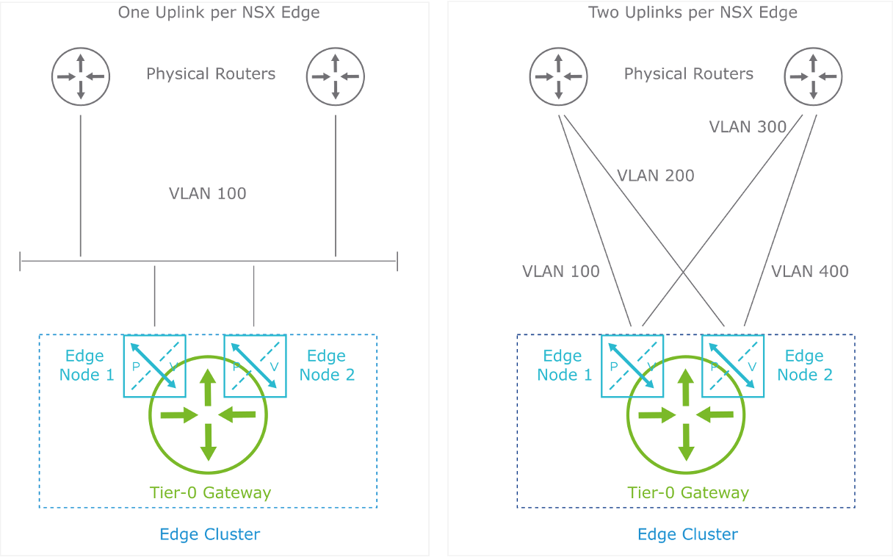

# Lesson2: NSX Edge and Edge Clusters

------

## **학습 목표 (Learner Objectives)**

* **NSX Edge 노드의 주요 기능과 특징 설명**
* **NSX Edge 클러스터의 기능 설명**
* **NSX Edge 노드의 폼 팩터(Form Factors) [VM, BM] 및 크기 옵션(Sizing Options) 식별**
* **NSX Edge 노드의 다양한 배포 방법(Deployment Methods) 설명**

------

------

## **NSX Edge 노드 개요**

​	•	**외부 네트워크와의 연결 제공**

​	•	**Tier-0 및 Tier-1 게이트웨이의 서비스 라우터(Service Router, SR) 구성 요소 호스팅**

​	•	**동적 라우팅 프로세스 및 DHCP, NAT, VPN 등의 네트워크 서비스 실행**

​	•	**오버레이 네트워크를 위한 Geneve 터널 구축**

​	•	**서드파티 벤더와의 서비스 삽입(Service Insertion) 지원**

**NSX Edge 노드의 특징**

​	•	**NSX 전송 영역(Transport Zones)의 일부로 동작**

​	•	**고성능 환경에서 빠른 패킷 포워딩을 위해 DPDK(Data Plane Development Kit) 지원**

​	•	**대부분의 서비스를 컨테이너 기반 아키텍처로 실행**

​	•	**관리 트래픽과 오버레이 트래픽을 위한 별도 라우팅 테이블 사용**

------

------

## **NSX Edge 클러스터의 주요 특성**

1. **추가 리소스를 통한 스케일 아웃**
   * 여러 Edge 노드를 그룹화하여 리소스를 확장함으로써 대규모 환경에서도 안정적인 네트워크 서비스를 제공할 수 있습니다.

2. **고가용성(High Availability) 제공**
   * 클러스터 내에서 여러 Edge 노드가 함께 동작하며, 하나의 노드에 장애가 발생할 경우 다른 노드가 자동으로 서비스 역할을 수행합니다.
   * Tier-1 게이트웨이의 활성(Active) 및 대기(Standby) 인스턴스가 서로 다른 장애 도메인에 배치되어, 예를 들어 랙 장애가 발생해도 서비스 중단 없이 네트워크 서비스가 유지됩니다.

3. **최대 구성 가능 Edge 노드 및 클러스터 수**
   * 한 Edge 클러스터는 최대 10개의 Edge 노드로 구성할 수 있으며, 최대 160개의 클러스터를 구성할 수 있습니다.
   * 이 확장성은 다양한 네트워크 토폴로지와 서비스 요구 사항에 대응할 수 있도록 지원합니다.

4. **장애 도메인(Failure Domain) 구성 가능**
   * NSX API를 통해 장애 도메인을 정의할 수 있습니다.
   * 장애 도메인은 Tier-1 게이트웨이의 활성 및 대기 인스턴스를 자동으로 배치하는 데 사용되어, 특정 영역(예: 랙)에 장애가 발생할 경우에도 서비스 연속성을 보장합니다.

5. **Edge 노드는 Transport Node로 사용**
   * Edge 노드는 Edge 클러스터에 가입되어야만 Transport Node로 사용되며, 이를 통해 Overlay 네트워크 내에서 데이터 트래픽을 처리하는 역할을 합니다.

6. **서로 다른 폼 팩터의 Edge 노드 조합 가능**
   * 한 클러스터 내에 서로 다른 폼 팩터(하드웨어 또는 가상 형태)의 Edge 노드를 포함시킬 수 있어 유연한 환경 구성이 가능합니다.

------

1. **클러스터 구성 (이미지 기반)**
   * **Edge Node 1, Edge Node 2 → Failure Domain 1**
   * **Edge Node 3, Edge Node 4 → Failure Domain 2**
   * **Tier-1 게이트웨이 Active-Standby 인스턴스는 반드시 서로 다른 장애 도메인에 배치**

------

2. **동작 방식**
   * **Tier-0 게이트웨이:** 외부 네트워크와 연결, BGP 사용 가능
   * **Tier-1 게이트웨이:** 내부 NSX-T 세그먼트 간 통신 담당
   * **Active-Standby 구조:** 장애 발생 시 Standby 인스턴스가 자동 활성화됨

------

3. **배포 시 고려 사항**
   * Edge 노드는 반드시 클러스터에 포함되어야 **Transport Node로 사용 가능**
   * **Active-Standby 게이트웨이는 서로 다른 장애 도메인에 배치해야 함**
   * *Tier-0 게이트웨이는 ECMP 사용 가능**, 부하 분산을 위해 여러 Edge 노드에 배포됨**
   * **물리 Edge 노드와 가상 Edge 노드를 혼합 가능**

------

------

## NSX Edge Node Form Factors

**•ESXi host만 지원**

------

------

**NSX Edge VM 크기 옵션(NSX Edge VM Sizing Options)**

NSX Edge 노드는 하이퍼바이저(ESXi)에서 **가상 머신(VM)으로 배포될 수 있으며**, 다양한 배포 크기 옵션이 제공된다.

**1. Edge VM 크기 및 사양**

| **Size**        | **Memory** | **vCPU** | **Disk Space** | **VM 하드웨어 버전**            |
| --------------- | ---------- | -------- | -------------- | ------------------------------- |
| **Small**       | 4 GB       | 2        | 200 GB         | ESXi 6.0 이상 (VM 버전 11 이상) |
| **Medium**      | 8 GB       | 4        | 200 GB         | ESXi 6.0 이상 (VM 버전 11 이상) |
| **Large**       | 32 GB      | 8        | 200 GB         | ESXi 6.0 이상 (VM 버전 11 이상) |
| **Extra Large** | 64 GB      | 16       | 200 GB         | ESXi 6.0 이상 (VM 버전 11 이상) |

------

2. **각 크기의 사용 목적**

   * **Small (소형)**
     * **Proof-of-Concept(POC) 및 테스트 환경**에서 사용됨.
     * **실제 운영 환경에서는 사용하지 않음.**

   * **Medium (중형)**
     * **L2 ~ L4 기능(NAT, 라우팅, L4 방화벽 등)만 필요한 경우** 적합.
     * **처리량이 2 Gbps 미만**일 때 추천됨.

   * **Large (대형)**
     * **L2 ~ L4 기능(NAT, 라우팅, L4 방화벽 등)이 필요하고,**
     * **2 ~ 10 Gbps 처리량이 요구되는 경우** 적합.

   * **Extra Large (초대형)**
     * **VPN, 북-남 트래픽(North-South) 보안 검사(예: 멀웨어 탐지) 등의 고성능 네트워크 서비스**에 적합.
     * **멀티-Gbps 처리량을 필요로 하는 환경에서 사용됨.**

------

**3. 참고 사항**

​	•	Edge VM은 반드시 **ESXi 6.0 이상**에서 실행되어야 하며, **VM 하드웨어 버전 11 이상**이 필요함.

이와 같이 **NSX Edge VM은 다양한 네트워크 요구사항에 맞춰 여러 크기로 배포될 수 있으며, 성능 요구사항에 따라 적절한 크기를 선택하는 것이 중요하다.**

------

------

## **NSX Edge 노드 VM 배포를 위한 사전 요구 사항**

NSX Edge 노드를 **VM 형태**로 배포하려면 다음 요구 사항을 충족해야 합니다:

* **지원되는 배포 미디어**: OVA, OVF, ISO, PXE(Preboot Execution Environment)
* **NSX Edge 노드 VM은 ESXi 하이퍼바이저에서만 배포 가능**
* **PXE 사용 시 root 및 admin 사용자의 비밀번호는 SHA-512로 암호화되어야 함**
* **호스트 이름(Hostname)에 유효하지 않은 문자 포함 금지**
* **NSX Edge 노드 VM에서 VMware Tools를 제거하거나 교체할 수 없음**
* **필수 포트 및 프로토콜이 개방되어 있어야 함**
* **Edge 클러스터 내 모든 Edge 노드는 동일한 NTP(Network Time Protocol) 서비스를 사용해야 함**

DPDK 지원을 위해 기본 플랫폼은 다음 요구 사항을 충족해야 합니다:

​	•	**CPU가 AESNI(AES New Instructions) 기능을 지원해야 함**

​	•	**CPU가 1GB Huge Page를 지원해야 함**

------

------

## Deployment Considerations for NSX Edge Node VM Interfaces(**NSX Edge 노드 VM 인터페이스 배포 고려 사항**)

NSX Edge 노드를 배포할 때는 **관리 인터페이스와 데이터 경로 인터페이스를 적절히 할당해야 한다.**

------

1. **인터페이스 구성 요건**
   * **vSphere 가상 스위치(VSS 또는 VDS)에서 최소 2개 이상의 포트 필요**
   * **첫 번째 인터페이스(eth0)는 관리 인터페이스로 할당해야 함**
   * **나머지 4개의 인터페이스(fp-ethX)는 데이터 경로(Datapath) 인터페이스로 사용**
   * **Overlay 터널링 및 업링크 연결을 처리**

------

**2. NSX Edge VM 인터페이스 할당**

| **인터페이스** | **역할**               | **설명**                                             |
| -------------- | ---------------------- | ---------------------------------------------------- |
| **eth0**       | 관리 인터페이스        | NSX Edge 노드의 관리 액세스 제공 (vNIC0)             |
| **fp-eth0**    | 데이터 경로 인터페이스 | Overlay 터널링 또는 VLAN 기반 N-VDS에 사용됨 (vNIC1) |
| **fp-eth1**    | 데이터 경로 인터페이스 | Overlay 또는 업링크 연결을 위한 인터페이스 (vNIC2)   |
| **fp-eth2**    | 데이터 경로 인터페이스 | 추가적인 Overlay 또는 업링크 트래픽 처리 (vNIC3)     |
| **fp-eth3**    | 데이터 경로 인터페이스 | 최대 4개의 데이터 경로 인터페이스 구성 가능 (vNIC4)  |

------

3. **NSX-T 3.2.1 이상에서의 인터페이스 확장**
   * **NSX-T 3.2.1 이상에서는 최대 4개의 데이터 경로 인터페이스(fp-ethX) 지원**
   * **기존 환경(Brownfield)에서 업그레이드한 경우, Edge 노드를 재배포해야 4개 인터페이스를 사용할 수 있음**

------

**결론**

NSX Edge 노드의 인터페이스 배포 시,

​	1.	**eth0을 반드시 관리 인터페이스로 할당**해야 함.

​	2.	**최대 4개의 데이터 경로 인터페이스(fp-ethX)를 활용**하여 Overlay 터널링 및 업링크 연결 가능.

​	3.	**NSX-T 3.2.1 이상에서는 4개의 fp-ethX 인터페이스 지원**하며, 기존 환경에서는 재배포 필요.

올바른 인터페이스 할당은 **NSX-T 네트워크의 성능과 안정성을 보장하는 중요한 요소이다.**

------

------

## Deploying the NSX Edge Node VM with Multiple N-VDS(**NSX Edge 노드 VM 배포)**

NSX Edge 노드를 **여러 개의 N-VDS(Network Virtual Distributed Switch)** 와 함께 배포할 경우, 다음과 같은 특징이 있다.

------

1. **NSX Edge VM 인터페이스 구성**
   * **총 5개의 vNIC 사용**
   * **첫 번째 인터페이스(eth0)는 관리 네트워크 전용**
   * **나머지 인터페이스(fp-ethX)는 데이터 경로(Datapath) 모듈에 할당**
   * **VSS(VMware Standard Switch) 및 VDS(VMware Distributed Switch)와 연결 가능**

------

2. **N-VDS(Network Virtual Distributed Switch) 역할**
   * **Multiple N-VDS 구성 가능**
   * **Overlay N-VDS:** TEP(Tunnel Endpoint) 인터페이스를 통해 **Overlay 터널링** 트래픽 처리
   * **VLAN uplink N-VDS 1 & 2:** **외부 네트워크(VLAN)와의 연결을 담당**
   * **각 N-VDS는 독립적인 팀 정책(Teaming Policy) 설정 가능**

------

**3. NSX Edge VM의 인터페이스 할당**

| **인터페이스** | **역할**             | **연결 대상**               |
| -------------- | -------------------- | --------------------------- |
| **eth0**       | 관리 네트워크        | vNIC0 (Management Network)  |
| **fp-eth0**    | Overlay 터널링       | vNIC1 (Overlay N-VDS)       |
| **fp-eth1**    | Overlay 터널링 (TEP) | vNIC2 (Overlay N-VDS)       |
| **fp-eth2**    | VLAN Uplink          | vNIC3 (VLAN uplink N-VDS 1) |
| **fp-eth3**    | VLAN Uplink          | vNIC4 (VLAN uplink N-VDS 2) |

------

**4. 고려 사항**

​	•	**NSX Edge 노드에 여러 개의 N-VDS를 구성하면 Overlay 및 VLAN 트래픽을 분리 가능**

​	•	**각 N-VDS는 서로 다른 Teaming Policy를 적용할 수 있어, 트래픽 부하 분산이 가능**

​	•	**VSS 또는 VDS를 통해 하이퍼바이저와의 연결을 지원**

------

**결론**

**NSX Edge 노드 VM을 다중 N-VDS 구성으로 배포하면, Overlay 및 VLAN 트래픽을 분리하여 보다 효율적으로 네트워크를 운영할 수 있다.**

​	•	Overlay 트래픽은 **Overlay N-VDS를 통해 터널링 처리**

​	•	VLAN 트래픽은 **VLAN Uplink N-VDS를 통해 외부 네트워크와 연결**

​	•	**각 N-VDS별로 팀 정책을 달리 설정할 수 있어 네트워크 안정성과 성능을 최적화 가능**

------

------

## **NSX Edge 노드 VM 배포 (단일 N-VDS 구성)**

NSX Edge 노드를 **단일 N-VDS(Single N-VDS) 아키텍처**로 배포할 경우, 다음과 같은 특징이 있다.

------

1. **단일 N-VDS 구성 특징**
   * **하나의 N-VDS가 Overlay 및 VLAN 업링크 트래픽을 모두 처리**
   * **두 개의 TEP(Tunnel Endpoint) 구성**으로 Overlay 트래픽 부하 분산 수행
   * **사전 정의된 Uplink 프로파일(nsx-edge-multiple-vteps-uplink-profile) 사용 가능**
   * **ESXi TEP와 Edge 노드 TEP IP는 동일 서브넷에 속해야 함**

------

**2. NSX Edge VM의 인터페이스 구성**

| **인터페이스**          | **역할**                         | **연결 대상**              |
| ----------------------- | -------------------------------- | -------------------------- |
| **eth0**                | 관리 네트워크                    | vNIC0 (Management Network) |
| **fp(Febic path)-eth0** | VLAN 및 Overlay 트래픽 처리 over | vNIC1 (N-VDS)              |
| **fp-eth1**             | VLAN 및 Overlay 트래픽 처리 over | vNIC2 (N-VDS)              |
| **fp-eth2**             | VLAN 및 Overlay 트래픽 처리 vlan | vNIC3 (N-VDS)              |
| **fp-eth3**             | VLAN 및 Overlay 트래픽 처리 vlan | vNIC4 (N-VDS)              |

------

**3. 단일 N-VDS의 장점 및 고려 사항**

**장점**

* **구성이 단순화되어 관리가 용이함**
* **Overlay 및 VLAN 트래픽을 한 곳에서 처리 가능**
* **두 개의 TEP를 활용한 부하 분산 가능**

**고려 사항**

* **모든 트래픽이 하나의 N-VDS를 통해 전달되므로, 네트워크 설계 시 대역폭 및 성능 최적화 필요**
* **ESXi TEP와 Edge TEP IP는 동일 서브넷에 있어야 함**
* **VLAN 업링크 트래픽의 부하 분산을 위해 개별 팀 정책(Teaming Policy) 사용 가능**

------

**4. 결론**

단일 N-VDS 구성은 **간단한 네트워크 설정을 원하는 경우 적합하며, Overlay 및 VLAN 트래픽을 동일한 N-VDS에서 처리**할 수 있다.

* **TEP 2개를 활용해 Overlay 트래픽 부하 분산 수행**
* **네트워크 단순화를 통해 관리 부담 감소**
* **VLAN 업링크의 부하 분산을 위해 Named Teaming Policy 활용 가능**

이 아키텍처는 **Bare-Metal Edge 노드의 단일 N-VDS 지원 방식과 동일한 구조**를 제공한다.

------

------

## NSX Edge Node VM Network Offloading with SmartNICs(**NSX Edge 노드 VM 네트워크 오프로드 (SmartNIC 활용)**)

NSX Edge 트래픽의 네트워크 성능을 향상시키기 위해 **SmartNIC을 활용한 네트워크 오프로드**가 가능하다.

------

1. **UPT(Uniform Passthrough) 모드 개요**
   * NSX Edge에서 **UPT(Uniform Passthrough) 모드**를 활성화하면 **SmartNIC을 활용한 네트워크 오프로드가 가능**하다.
   * **NSX 4.0.1 Edge는 VMXNET3 UPTv2 vNIC**를 사용하여,
   * **패스스루(Passthrough) 모드**에서 동작하면서도
   * 기존 **에뮬레이션 vNIC 기능(예: vMotion)을 유지**할 수 있다.

------

**2. UPTv2 기반 NSX Edge 오프로드 방식**

| **구성 요소**                   | **역할 및 동작 방식**                                        |
| ------------------------------- | ------------------------------------------------------------ |
| **VMXNET3 UPTv2 vNIC**          | SmartNIC과 직접 통신 가능하며, 패스스루 모드에서도 vMotion 등의 기능 유지 |
| **UPTv2 VF (Passthrough Mode)** | VM 내부에서 직접 SmartNIC으로 패킷을 전달                    |
| **HW Accelerator (Fast Path)**  | SmartNIC 내 하드웨어 가속 엔진을 활용하여 네트워크 트래픽을 빠르게 처리 |
| **Control Plane (Slow Path)**   | HW Table Miss 발생 시, 소프트웨어를 통해 테이블 업데이트 수행 |
| **HW Table Update**             | Fast Path에서 사용될 네트워크 경로를 동적으로 업데이트       |

------

3. **SmartNIC 활용의 이점**

   * **네트워크 트래픽의 하드웨어 오프로드:**
     * CPU 사용량을 줄이고, **SmartNIC의 가속 기능을 통해 패킷 처리 성능 향상**

   * **UPTv2 Passthrough 모드 지원:**
     * VM 내에서 직접 **SmartNIC과 통신 가능**, 네트워크 처리 속도 향상
     * **기존 vSphere 기능과 호환:**
       * **vMotion 등 가상화 기능 유지** 가능

------

4. **결론**

* **SmartNIC을 활용한 UPTv2 기반 네트워크 오프로드는 NSX Edge VM의 성능을 대폭 향상시킴.**
* **CPU 부담을 줄이고, HW Accelerator(Fast Path)를 통해 트래픽을 더 빠르게 처리 가능.**
* **vMotion과 같은 기존 VM 기능을 유지하면서도 고성능 네트워크 처리가 가능.**
* **SmartNIC을 사용하는 환경에서는 NSX Edge에서 UPT 모드를 활성화하는 것이 권장됨.**

------

------

## **NSX Edge 노드의 배포 방법**

**VM 형태(NSX Edge Node VM) 배포 방법**

​	•	**NSX UI 사용**

​	•	**vCenter에서 OVF 템플릿 배포**

​	•	**OVF Tool 명령줄 유틸리티 사용**

​	•	**ISO 파일과 PXE 서버를 이용하여 네트워크 구성을 자동화**

**베어메탈(Bare-Metal) 형태 배포 방법**

​	•	**ISO 파일을 사용하여 설치**

​	•	**PXE 서버를 이용하여 네트워크 구성을 자동화**

------

------

## Deploying NSX Edge Nodes from the NSX UI (1)

------

------

## Deploying NSX Edge Nodes from the NSX UI (2)

------

------

## Deploying NSX Edge Nodes from vCenter

------

------

## Verifying the Edge Transport Node Status 

NSX UI에서 **System > Fabric > Nodes** 를 선택한 후 **Edge Transport Nodes** 탭을 클릭하면, **NSX Manager 또는 관리 플레인(Management Plane)에 등록된 Edge 노드의 상태**를 확인할 수 있습니다.

**Edge Transport Nodes 탭에서 제공하는 정보**

* **구성 상태(Configuration State)**
* **노드 상태(Node Status)**
* **N-VDS**
* **NSX 버전(NSX Version)**

**세부 정보 확인 방법**

* **노드 상태 옆의 정보 아이콘(ℹ️) 클릭** → 상태의 원인에 대한 추가 정보 확인
* **N-VDS 개수 클릭** → 연결된 전송 영역(Transport Zones) 정보 확인
* **데이터 패스 인터페이스 검증** → 해당 Edge Transport Node에서 **Edit(편집)** 클릭

------

------

## Changing the NSX Edge VM Resource Reservations

**NSX Edge VM 리소스 예약 변경 방법**

1. **“Change Edge VM Resource Reservations”** 를 클릭하여 선택한 NSX Edge 노드의 리소스 예약 설정에 접근합니다.

2. 변경할 예약 옵션을 선택합니다:
   * **CPU 예약 우선순위(CPU Reservation Priority)**
   * **메모리 예약 비율(Memory Reservation %)**
   * **CPU 예약 값(CPU Reservation MHz)**

------

------

## Creating an NSX Edge Cluster

**NSX Edge 클러스터를 생성하는 이유**

​	•	**다중 노드 클러스터(Multinode Cluster)를 구성하면 최소한 하나의 NSX Edge 노드가 항상 사용 가능하도록 보장됨**

​	•	**NSX Edge 클러스터는 Tier-0 게이트웨이 업링크 구성 및 NAT, 로드 밸런서와 같은 상태 저장(Stateful) 서비스 활성화에 필요함**

**NSX Edge 클러스터 구성 방법**

	1.	**”+ADD EDGE CLUSTER” 버튼 클릭** → NSX Edge 클러스터 생성 시작
	1.	**사전 정의된 NSX Edge 클러스터 프로파일을 선택** 또는 기본 프로파일 **nsx-default-edge-high-availability-profile** 선택
 	3.	**NSX Edge 노드를 NSX Edge 클러스터에 포함**
     * 하나의 NSX Edge 전송 노드는 **오직 하나의 NSX Edge 클러스터에만 추가 가능**

4. **클러스터 생성 후 필요하면 NSX Edge 노드를 추가로 편집 가능**

------

------

## Tier-0 Gateway Uplink Connections(**Tier-0 게이트웨이 업링크 연결 방식**)

Tier-0 게이트웨이는 **NSX Edge 노드당 하나 이상의 업링크를 물리 네트워크에 연결할 수 있으며**, 다양한 방식으로 배포할 수 있다.

------

**1. Tier-0 게이트웨이 업링크 연결 옵션**

| **구성 방식**                           | **설명**                                                     | **장점**                                   | **단점**                                             |
| --------------------------------------- | ------------------------------------------------------------ | ------------------------------------------ | ---------------------------------------------------- |
| **NSX Edge당 1개 업링크 (왼쪽 그림)**   | - 각 NSX Edge 노드가 단일 업링크(VLAN 100)를 통해 물리 네트워크와 연결됨 | - 단순한 구성- 관리가 용이함               | - 단일 장애 지점(SPOF) 가능성 존재- 부하 분산 불가능 |
| **NSX Edge당 2개 업링크 (오른쪽 그림)** | - 각 NSX Edge 노드가 2개의 업링크(VLAN 100, 200 / VLAN 300, 400) 사용- 두 개의 물리 라우터에 연결 | - 트래픽 부하 분산 가능- 고가용성(HA) 향상 | - 구성이 복잡함- VLAN 추가 관리 필요                 |

------

**2. Tier-0 게이트웨이 배포 방식**

​	•	**Active-Active**

​	•	모든 Edge 노드가 동시에 트래픽을 처리함

​	•	**ECMP(Equal-Cost Multi-Path)** 활성화 가능 → **여러 개의 업링크를 활용한 부하 분산 가능**

​	•	**Active-Standby**

​	•	한 Edge 노드는 **Active(트래픽 처리), 다른 노드는 Standby(대기 상태)**

​	•	장애 발생 시 Standby 노드가 Active로 승격됨

------

**3. 동적 라우팅 및 ECMP 활용**

​	•	**동적 라우팅 프로토콜 사용 가능 (OSPF, BGP)**

​	•	**ECMP 활성화 시 다중 업링크를 통한 부하 분산 가능**

------

**4. 결론**

​	•	**Edge 노드당 하나의 업링크를 사용하는 방식**은 간단하지만 단일 장애 지점(SPOF) 위험이 존재

​	•	**Edge 노드당 두 개의 업링크를 활용하는 방식**은 고가용성과 부하 분산이 가능

​	•	**ECMP를 활용하면 다중 업링크를 통해 네트워크 성능을 최적화할 수 있음**

​	•	**배포 환경에 따라 Active-Active 또는 Active-Standby 방식을 선택해야 함**

------

------

### 기타

**VPN**

1. **confidentiality - 암호화 하는 것/ 기밀성 ex) DES/3DES, AES, RSA**
2. **integrity - 변조를 막는 것 /무결성 ex) sha, md5**
3. **authentication - ex) key, certification**
