## **NSX-T 게이트웨이 구성 (Tier-0 & Tier-1) 설명**

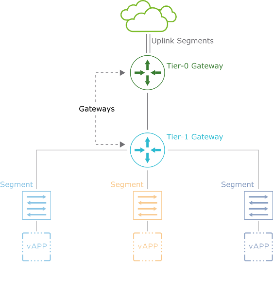

------

**1. NSX-T 게이트웨이 아키텍처 개요**

​	•	**NSX-T에서는 네트워크 트래픽을 계층적으로 관리하기 위해 Tier-0 및 Tier-1 게이트웨이를 사용**

​	•	**Tier-0 Gateway**: 외부 네트워크(클라우드, 물리 네트워크)와 연결

​	•	**Tier-1 Gateway**: 내부 세그먼트(가상 네트워크) 및 가상 애플리케이션(vAPP)과 연결

------

2. **그림의 주요 구성 요소**

   1.  **Tier-0 Gateway (T0)**
      * **외부 네트워크(클라우드)와 연결**
      * **Uplink Segments를 통해 외부와 통신**
      * **Tier-1 Gateway와 연결되어 내부 네트워크에 라우팅 제공**
      * **정적(Static) 또는 동적(Dynamic) 라우팅을 설정하여 물리 네트워크와 통신 가능**
      * BGP(Border Gateway Protocol) 또는 OSPF 같은 프로토콜을 활용 가능

   2. Tier-1 Gateway (T1)
      * **내부 가상 네트워크(Segments)와 연결**
      * 여러 개의 **Segment와 vAPP(Virtual Applications)를 연결하여 트래픽을 관리**
      * 기본적으로 **Tier-0 Gateway를 통해 외부 네트워크와 연결됨**
      * 라우팅 기능을 활성화하면 **Tier-0과 통신하여 외부 네트워크와 경로 설정 가능**

**③ Segments (가상 네트워크)**

​	•	**가상 머신(VM) 및 가상 애플리케이션(vAPP)이 연결되는 논리적 네트워크**

​	•	**각 세그먼트는 서로 다른 VLAN이나 Overlay 네트워크를 구성할 수 있음**

​	•	Tier-1 Gateway를 통해 외부와 통신

------

3. **NSX-T Gateway 설정 절차**

1. **Tier-1 Gateway 생성 및 세그먼트 연결**
   * 내부 네트워크 및 vAPP을 Tier-1 Gateway에 연결

2. **Uplink Segments 생성**
   * Tier-0 Gateway가 물리 네트워크와 연결될 경로 설정

3. **Tier-0 Gateway 생성 및 업링크 연결**
   * 외부 네트워크(클라우드, 물리 라우터)와 연결

4. **Tier-0 & Tier-1 Gateway 연결**
   * 기본적으로 자동 연결되지 않으며, 수동으로 연결 필요

5. **Tier-0에서 정적 또는 동적 라우팅 설정**
   * BGP 또는 OSPF 같은 프로토콜을 사용하여 경로 학습

6. **경로 광고(Route Advertisement) 활성화**
   * Tier-1에서 Tier-0으로 네트워크 정보를 전달하도록 설정

------

**4. 주의사항**

​	•	**NSX 관리 클러스터가 안정적인지 확인 필요**

​	•	**적어도 하나의 NSX Edge 노드가 설치되어 있어야 함**

​	•	**NSX Edge 클러스터가 설정되어 있어야 함**

​	•	**Tier-1과 Tier-0 게이트웨이는 기본적으로 자동 연결되지 않으므로, 수동 연결 필요**

------

**5. 결론**

 **이 구조를 사용하면 내부 가상 네트워크(Segments)에서 외부 네트워크(Cloud, 물리 라우터)까지 연결 가능**

 **NSX-T의 Tier-0 및 Tier-1 게이트웨이를 사용하여 논리적 네트워크를 계층적으로 관리 가능**

 **라우팅 및 세그먼트 연결을 통해 동적인 네트워크 환경 구성 가능**

------

------

## Creating the Tier-1 Gateway

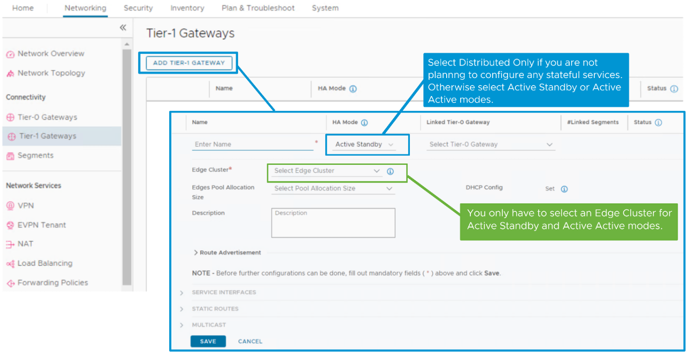

**Tier-1 게이트웨이의 HA(고가용성) 모드 선택**

**1. Distributed Only HA 모드**

​	•	**Tier-1 게이트웨이에서 상태 저장(Stateful) 서비스를 사용하지 않을 경우 선택**

​	•	**Edge 클러스터가 필요하지 않음**

​	•	**서비스 라우터(SR) 없이 분산 라우터(DR)만 생성됨**

​	•	**Edge 노드로의 트래픽 헤어피닝(Hairpinning) 방지 및 리소스 절약 가능**

**2. Active-Standby HA 모드**

​	•	**트래픽을 활성(Active) 멤버가 처리하며, 장애 발생 시 대기(Standby) 멤버가 트래픽을 인계받음**

​	•	**상태 저장 서비스(Stateful Services) 사용 가능**

​	•	**Edge 클러스터가 필요함**

**3. Active-Active HA 모드**

​	•	**Tier-1 게이트웨이가 Tier-0 게이트웨이에 연결되고 상태 저장 서비스가 활성화된 경우 지원**

​	•	**상태 저장 서비스(Stateful Services) 사용 가능**

​	•	**Edge 클러스터가 필요함**

------

------

## Using Network Topology to Validate the Tier-1 Gateway Configuration

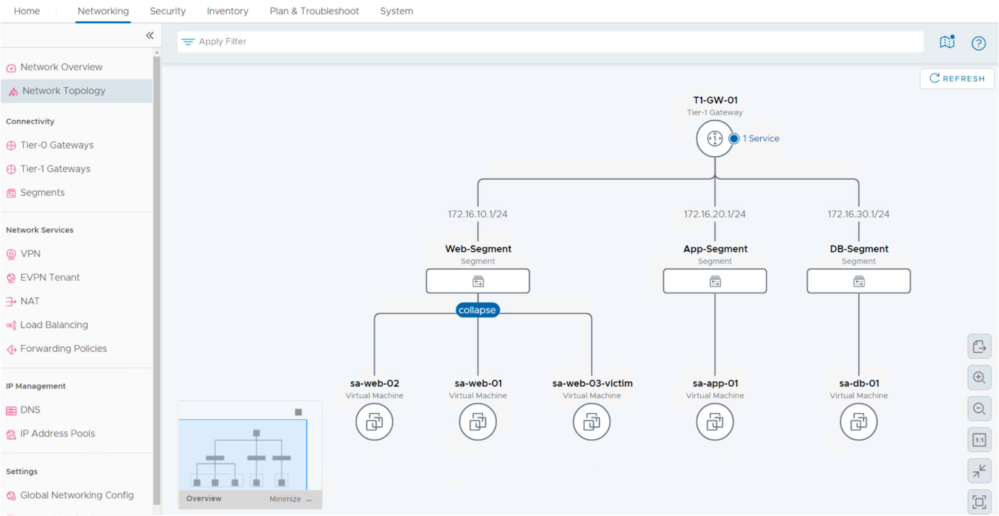

엔티티를 가리키면 **VM, 세그먼트(Segment), Tier-1 게이트웨이** 등의 루트까지의 경로가 강조 표시됩니다.

​	•	**확대 수준이 1보다 작으면** 토폴로지 다이어그램에서 엔티티 이름이 표시되지 않습니다.

​	•	**엔티티를 클릭하면** 해당 엔티티 유형별 세부 정보를 확인할 수 있는 사이드 패널이 열립니다.

​	•	**엔티티 유형**: VM, 세그먼트(Segment), 게이트웨이(Gateway) 등

------

------

## Creating the Uplink Segments

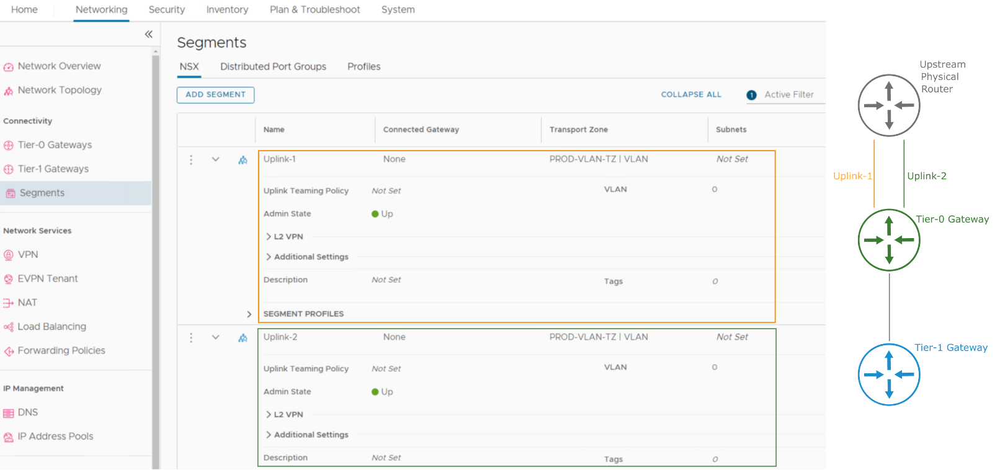

각 **Tier-0 게이트웨이**는 **요구 사항 및 실제 구성에 따라 여러 개의 업링크(Uplink) 연결을 가질 수 있음**.

예제에서는 **두 개의 다른 세그먼트(Segments)** 가 구성되어 **Tier-0 게이트웨이의 업링크 인터페이스에 연결됨**.

------

------

## Creating the Tier-0 Gateway (1)

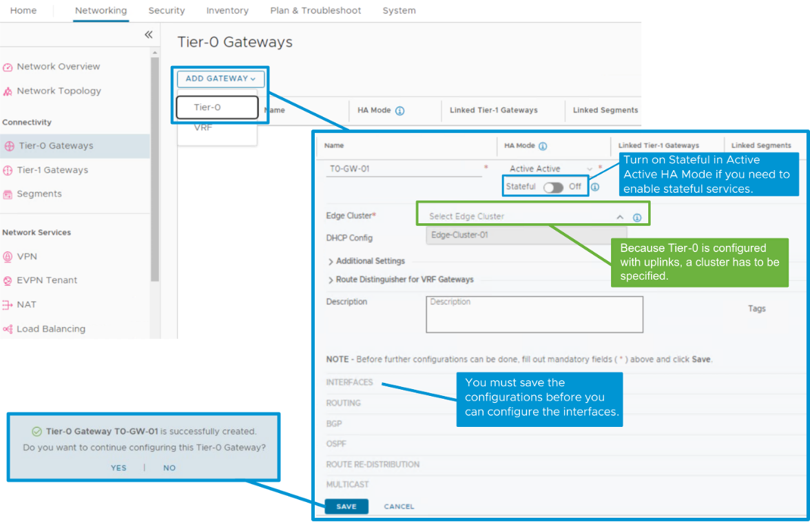

------

------

## Creating the Tier-0 Gateway (2)

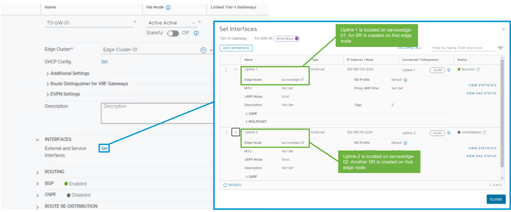

------

------

## Connecting the Tier-1 and Tier-0 Gateways

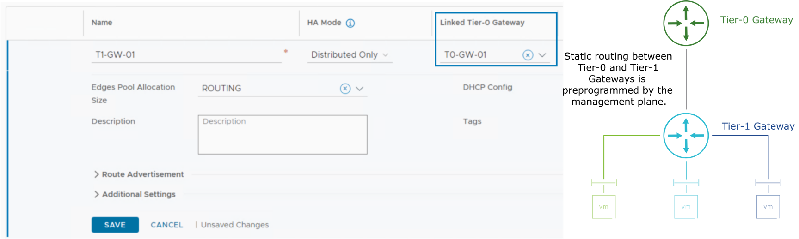

Tier-1 게이트웨이를 편집하여 원하는 Tier-0 게이트웨이에 연결하면 **남북(North-South) 라우팅**을 제공하고 **외부 네트워크에 대한 접근**이 가능해집니다.

------

------

## Enabling Route Advertisement in the Tier-1 Gateway

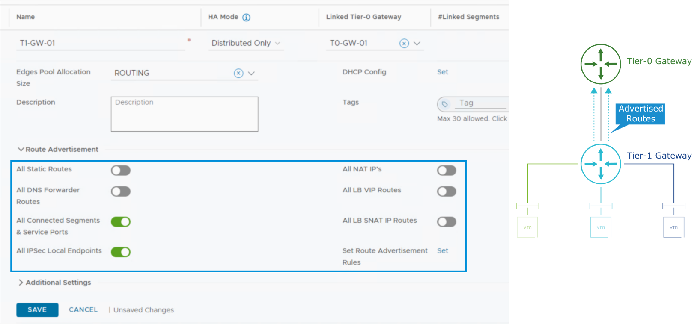

라우트 광고(Route Advertisement)를 사용하면 **테넌트 세그먼트(Tenant Segments)** 에서 정의된 네트워크가 연결된 **Tier-0 게이트웨이에서 인식될 수 있음**.

Tier-0 게이트웨이는 **선호하는 동적 라우팅 프로토콜(Dynamic Routing Protocol)을 통해 해당 네트워크를 외부로 광고**할 수 있음.

------

------

## Configuring Route Redistribution on the Tier-0 Gateway

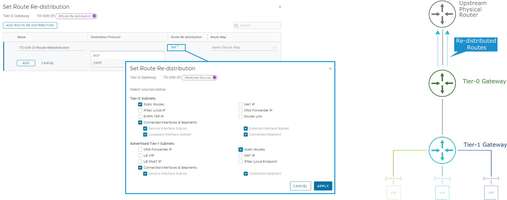

**Tier-0 게이트웨이에서 라우트 재배포(Route Redistribution) 구성 방법**

​	1.	**Networking > Connectivity > Tier-0 Gateway** 로 이동

​	2.	**Tier-0 게이트웨이 편집(Edit)**

​	3.	**라우트 재배포(Route Redistribution) 설정**

**지원되는 동적 라우팅 프로토콜**

​	•	**BGP(Border Gateway Protocol)**

​	•	**OSPF(Open Shortest Path First)**

**정적 라우트만 사용하는 경우**

​	•	**Tier-0 게이트웨이에서 라우트 재배포를 구성할 필요 없음**

**OSPF로의 라우트 재배포 고려 사항**

​	•	**라우트는 OSPF E2 타입(또는 NSSA 영역에서는 N2 타입)으로 재배포됨**

​	•	**OSPF E1 타입(또는 NSSA 영역에서 N1 타입)으로의 재배포는 지원되지 않음**

​	•	**재배포된 OSPF 라우트의 비용(Cost)은 항상 20으로 설정됨**

------

------

## Using Network Topology to Validate the Tier-0 Gateway Configuration

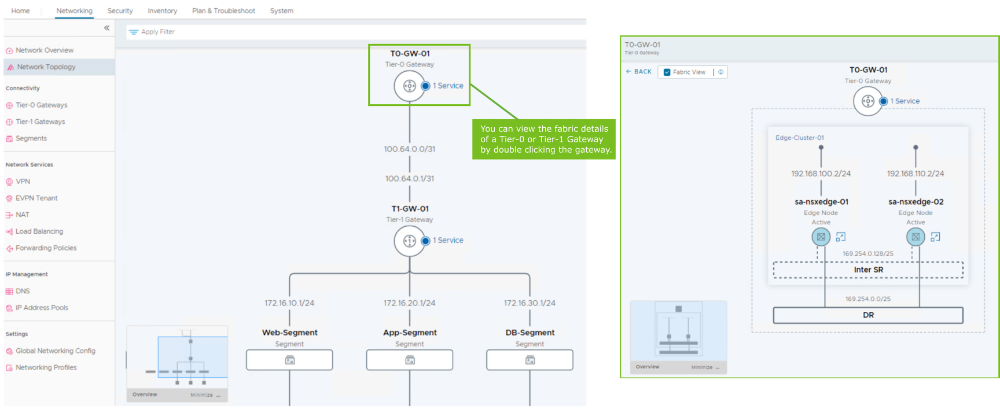

------

------

## Testing North-South Connectivity

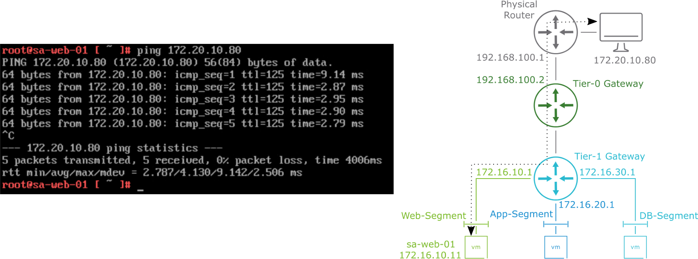

다이어그램 및 명령어 출력에서 **sa-web-01 (172.16.10.11) VM** 은 다음과 같은 핑 테스트가 가능함:

​	•	**Tier-0 게이트웨이(192.168.100.2) 핑 가능**

​	•	**업스트림 물리적 라우터(192.168.100.1) 핑 가능** *(단, 물리적 라우터에서 라우팅이 올바르게 구성된 경우)*

​	•	**원격 VM(172.20.10.80) 핑 가능**

이를 통해 **완전한 남북(North-South) 연결성이 구축됨**.