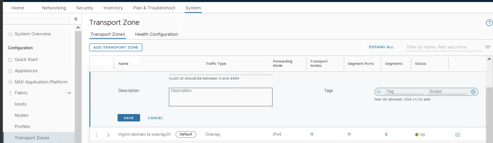

# VMware NSX: Install, Configure, Manage [V4.0]

------

## **Lab 2: 사전 배포된 NSX Manager 인스턴스 구성 검토**

------

### **vCenter 및 ESXi 라이선스 확인**

1. **vSphere Client에서**
   * 왼쪽 메뉴: Administration > Licensing > Licenses
   * **vCenter Server 라이선스 확인 및 등록**
   * Assets 탭 > vCenter Server Systems 탭
   * 필요 시: 라이선스 키 입력 → https://via.vmw.com/nsxicm40_licenses
   * **ESXi 호스트 라이선스 확인 및 등록**
     * Assets 탭 > Hosts 탭
     * 전체 호스트 선택 후 라이선스 등록

------

### **NSX Manager 설정 및 라이선스 확인**

1. **NSX UI > System > Configuration > Appliances**
   * NSX Manager 노드 정보 확인 (IPv4/IPv6, 버전, 클러스터 상태 등)

2. **System > Settings > Licenses**
   * 다음 3가지 라이선스가 활성화되어 있어야 함:
   * NSX Data Center Enterprise Plus
   * NSX Firewall with Advanced Threat Prevention
   * NSX for vShield Endpoint
   * 누락 시 라이선스 키 등록 필요 ([라이선스 링크](https://via.vmw.com/nsxicm40_licenses))

------

### **NSX CLI를 이용한 클러스터 상태 확인**

1. **MTPuTTY 실행 > sa-nsxmgr-01 더블 클릭**
2. **CLI 명령어 실행**

```bash
set cli-timeout 0  
set service http session-timeout 0  
restart service ui-service  
get cluster status  
```

* 결과: Manager 및 Controller 상태가 **STABLE** 이어야 함
* **DEGRADED 상태인 경우**, 몇 분 후 재시도

------

### **vCenter Server를 Compute Manager로 등록**

1. **NSX UI > System > Configuration > Fabric > Compute Managers**
   + ADD COMPUTE MANAGER 클릭

2. **다음 정보 입력**
   * Name: sa-vcsa-01.vclass.local
   * FQDN/IP: 172.20.10.94
   * Username: administrator@vsphere.local
   * Password: VMware1!
   * SHA-256 Thumbprint: 비워둠
   * Create Service Account: Yes
   * Enable Trust: Yes
   * Access Level: 기본값 (Full Access) 유지

3. **ADD 클릭**

4. Thumbprint 경고 시: **ADD 클릭하여 기본 인증서 사용**

5. **하단의 Refresh 클릭 → 상태 확인**
   * Registration Status: **Registered**
   * Connection Status: **Up**
   * vCenter 버전: **7.0.3**

------

------

## LAB 3: NSX Management Cluster 배포 시뮬레이션

https://via.vmw.com/nsxicm40_lab3 

------

------

## **Lab 4: NSX 인프라 준비(Preparing the NSX Infrastructure)**


Transport Zone 구성, IP Pool 생성, ESXi 호스트를 NSX 용도로 준비하여 NSX 가상 네트워킹을 위한 기반 인프라를 완성함.

------

### **Task 2: Transport Zone 생성**

**Overlay 기반 Transport Zone 생성 && VLAN 기반 Transport Zone 생성**




------

### **Task 3: IP Pool 생성**


------

**설치 확인**

​	•	설치가 자동으로 시작되며 약 5분 소요

​	•	설치 완료 후 **호스트 상태가 Up으로 전환**되었는지 확인

​	•	필요 시 **화면 하단의 REFRESH 클릭**

------

------

## **Lab 5: NSX 세그먼트(Segments) 구성**


### **Task 1: 세그먼트 생성 (L2 네트워크 구성)**

​	Networking > Connectivity > Segments > NSX

------

**1. Web-Segment 생성**


------

**2. App-Segment 생성**


------

**3. DB-Segment 생성**


세그먼트 목록에서 상태(Status)가 **Success** 인지 확인

------

------

### **Task 2: VM을 세그먼트에 연결**

vSphere Client UI → Inventory > Hosts and Clusters > Compute-Cluster 확장

**VM 연결 작업 예시 (Web-Segment)**


* sa-web-01 → 우클릭 → Edit Settings
* Network Adapter 1 → Browse → Web-Segment 선택
* Connected 체크박스 확인 → OK 클릭

동일 방식으로 아래와 같이 연결:

* sa-web-02, sa-web-03-victim → Web-Segment
* sa-app-01 → App-Segment
* sa-db-01 → DB-Segment

------

## **Task 3  NSX Topology에서 세그먼트 구성 검증**

​	1.	NSX UI → Networking > Network Topology

​	2.	세그먼트 3개(Web, App, DB) 존재 확인

​	3.	각 세그먼트를 클릭하여 우측 패널에서 VM 연결 상태 확인

​	•	Web-Segment에 sa-web-01, 02, 03-victim

​	•	App-Segment에 sa-app-01

​	•	DB-Segment에 sa-db-01

------

## **Task 4: L2 연결 테스트 및 NSX CLI 검증**

**콘솔 접속: sa-web-01**

사용자: root

비밀번호: VMware1!


------

### **NSX Manager CLI 정보 확인 (MTPuTTY > sa-nsxmgr-01 접속)**

```bash
get segments
```

**예시 출력:**

```bash
VNI     UUID                                    Name
69632   8fd97015-4bdc-47eb-ad98-d67608f82e75    Web-Segment
69633   20d91369-b964-4ff6-a8a9-f8c263dc7213    App-Segment
69634   4fa53e28-3923-4d6f-865c-5736e0e1d02a    DB-Segment
```

------

### **Web-Segment에 대한 상세 정보 확인**

```bash
get segment 8fd97015-4bdc-47eb-ad98-d67608f82e75 vtep
get segment 8fd97015-4bdc-47eb-ad98-d67608f82e75 mac
get segment 8fd97015-4bdc-47eb-ad98-d67608f82e75 arp
get segment 8fd97015-4bdc-47eb-ad98-d67608f82e75 ports
```

- **ping 후 ARP 테이블 확인 가능**
- 각 명령어로 TEP, MAC 주소, ARP 정보, 포트 상태 확인

------

### **ESXi CLI에서 세그먼트 정보 확인**

```bash
nsxcli
get segments
```

출력 예시

```bash
VNI       Logical Switch UUID                          Name
69632     8fd97015-4bdc-47eb-ad98-d67608f82e75          Web-Segment
69633     20d91369-b964-4ff6-a8a9-f8c263dc7213          App-Segment
69634     4fa53e28-3923-4d6f-865c-5736e0e1d02a          DB-Segment
```

------

#### 정리

* **세그먼트 3개(Web, App, DB) 생성 완료**
* **각 세그먼트에 VM 연결 완료**
* **L2 연결(Ping) 테스트 성공**
* **NSX Manager 및 ESXi CLI에서 구성 상태 정상 확인**

**필요 시 get logical-switch 또는 get vif 명령어로 포트 상태도 더 구체적으로 조회 가능함.**

------

------

## **Lab 6: NSX Edge Node 배포 및 구성**

**두 개의 NSX Edge Node를 배포하고 Edge Cluster로 구성하여 Tier-0 게이트웨이용 라우팅 및 L3 서비스를 위한 인프라를 준비함**


------

------

## **Lab 7: Tier-1 Gateway 구성**

**Tier-1 Gateway를 생성하고 Web, App, DB 세그먼트 간의 East-West L3 통신을 구성함.**


------

### **Tier-1 Gateway 생성**

1. **경로:**NSX UI → Networking > Connectivity > Tier-1 Gateways

2. **ADD TIER-1 GATEWAY 클릭 후 설정:**
   * 이름: T1-GW-01
   * HA Mode: Distributed Only
   * Linked Tier-0 Gateway: *비워둠* (아직 Tier-0 게이트웨이 없음)

3. **Route Advertisement 설정 확장:**
   * All Static Routes → **On**
   * All Connected Segments & Service Ports → **On**

4. **SAVE 클릭 후, “계속 편집할 것인가?” 메시지 → NO 선택**

------

### **세그먼트를 Tier-1 Gateway에 연결**

1. **경로:**

**NSX UI → Networking > Connectivity > Segments > NSX**

2. **각 세그먼트 연결 작업:**

**Web-Segment**

* 우측의 점 세 개(︙) 클릭 → Edit
* Connected Gateway: T1-GW-01 선택
* SAVE → CLOSE EDITING

**App-Segment**

•	동일하게 T1-GW-01 연결 후 SAVE

**DB-Segment**

​	•	동일하게 T1-GW-01 연결 후 SAVE

------

### **Tier-1 Gateway 연결 상태 확인**

1. **경로:** NSX UI → Networking > Network Topology

2. **확인 항목:**
   * Web-Segment, App-Segment, DB-Segment가 T1-GW-01에 연결되어 있는지 확인
   * Zoom in 해서 이름이 잘 보이는지 확인
   * T1-GW-01 아이콘 클릭 → 우측 패널에서 설정 정보 확인

------

### **East-West L3 연결 확인 (Ping 테스트)**

1. **vSphere Client UI → sa-web-01 콘솔 열기**
   * 콘솔에서 로그인
   * 사용자: root
   * 비밀번호: VMware1!

2. **Ping 테스트 명령 실행:**

```bash
ping -c 3 172.16.20.11  # sa-app-01
ping -c 3 172.16.30.11  # sa-db-01
```

------


| **구성 요소**      | **상태**          |
| ------------------ | ----------------- |
| Tier-1 Gateway     | 생성 완료         |
| Web/App/DB 연결    | T1-GW-01에 연결됨 |
| Topology 연결 확인 | 정상              |
| Ping 테스트        | 성공              |

