## **학습 목표 (Learner Objectives)**

​	•	**정적 라우팅(Static Routing)** 과 **동적 라우팅(Dynamic Routing)** 의 차이점 구분

​	•	**Tier-0 게이트웨이에 정적 라우트 구성**

​	•	**Tier-0 게이트웨이에 BGP(Border Gateway Protocol) 구성**

​	•	**Tier-0 게이트웨이에 OSPF(Open Shortest Path First) 구성**

------

1. **Static Routing (정적 라우팅)**

​	•	수동으로 관리자가 직접 설정함

​	•	경로 선택을 정밀하게 제어 가능

​	•	네트워크 변화가 생겨도 자동으로 반영되지 않음

​	•	확장성이 떨어짐 (많은 네트워크에서는 비효율적)

​	•	장애 대비 가능하지만,

→ 모든 장애 상황에 대한 경로를 **수동으로 미리 구성**해야 함

------

2. **Dynamic Routing (동적 라우팅)**

​	•	라우터 간에 **자동으로 경로 정보 교환**

​	•	네트워크 변경 발생 시 자동으로 경로 업데이트

​	•	**라우팅 프로토콜 사용**

​	•	라우팅 프로토콜 분류:

​	•	**IGP(Interior Gateway Protocol)**: 하나의 조직 내부 네트워크에서 사용

→ RIP, EIGRP, OSPF, IS-IS

​	•	**EGP(Exterior Gateway Protocol)**: 조직 간 네트워크 연결에 사용

→ BGP (가장 대표적)

**3. NSX에서 지원하는 동적 라우팅 프로토콜**

​	•	**OSPF v2, RIPv2, EIGRP, IS-IS (IGP)**

​	•	**BGP (EGP)**

4. **알고리즘**
   - distance vector(hop count): RIPv2
   - link-state: is-is, ospf
   - advanced distansce vector: eigrp, bgp(path attribute)

즉, NSX는 내부 라우팅에도 OSPF를 사용할 수 있고, 외부 연동(예: 물리 네트워크와 연결) 시 BGP를 활용하여 유연하고 자동화된 라우팅 구성이 가능함.

------

------

## **Tier-0 Gateway Routing Configurations**(Tier-0 Gateway의 라우팅 구성 방식)****

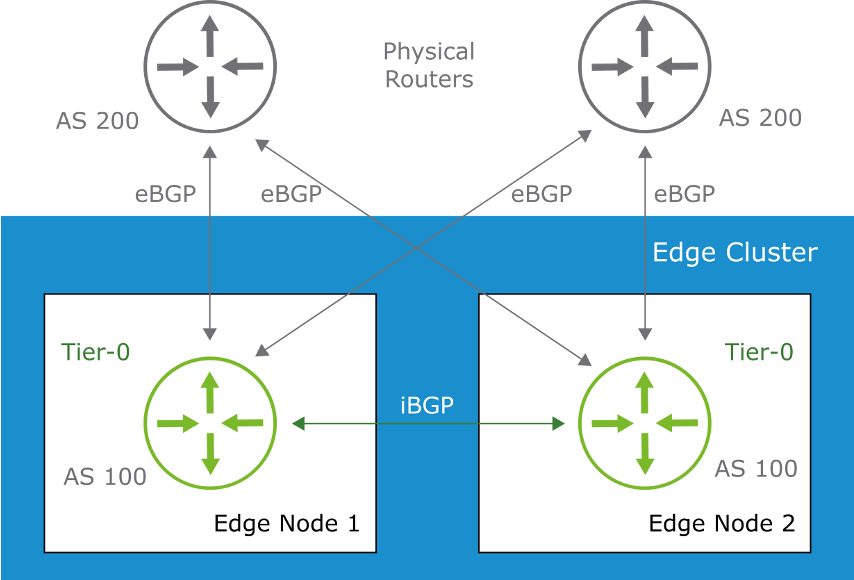

​	**Inter-SR IBGP 자동생성**

1. ------

   **Tier-0 게이트웨이에서 지원하는 라우팅 방식**

   * **Static Routing (정적 라우팅)**
     * 수동으로 설정하는 방식.
     * 관리자에 의해 직접 경로가 구성됨.
     * 경로 변경은 자동으로 반영되지 않음.
     * 세밀한 경로 조정은 가능하나, 관리 오버헤드가 큼.
     * 장애 대비(failover)를 위해 관리자 수동 설계 필요.
     * 경로 중복(redundancy)은 수동으로 구성해야 함.
     * 대규모 네트워크에서는 확장성 떨어짐.

   * **Dynamic Routing (동적 라우팅)**
     * 게이트웨이 간 네트워크 정보 교환이 자동으로 이루어짐.
     * 라우팅 프로토콜을 통해 네트워크 변화 자동 반영.
     * 외부 게이트웨이와의 연동에 유리함.
     * 라우터가 이웃 게이트웨이에 변화 감지 시 정보 전달.
     * NSX에서는 다음과 같은 프로토콜 지원:

* **IGP (Interior Gateway Protocol)**: 단일 조직 내부 라우팅

→ RIP, EIGRP, OSPF, IS-IS 등

* **EGP (Exterior Gateway Protocol)**: 외부 AS 간 라우팅

→ BGP 사용

2. ------

   **BGP 프로토콜 적용 세부 내용**

   * **eBGP (External BGP)**:
     * 서로 다른 AS 간 피어링에 사용됨.
     * 그림에서는 AS 100(Tier-0) ↔ AS 200(물리 라우터) 간 연결.
     * 각 물리 라우터는 서로 다른 Edge Node에 연결되어 redundancy 확보.
     * BGP peer 간에 prefix 교환 수행.

   * **iBGP (Internal BGP)**:
     * 동일한 AS 내의 게이트웨이들 간 피어링에 사용.
     * 예: AS 100의 Edge Node 1과 Edge Node 2 간 iBGP 연결.
     * 내부 경로 정보의 공유에 사용됨.

   * **기타 특징**:
     * BGP는 4-byte ASN (Autonomous System Number) 지원.
     * BGP dynamic neighbor 기능으로 다수의 이웃과 피어링 가능.
     * 토폴로지 구성 시 redundancy 및 symmetry 고려 필요.

------

------

## **Tier-0 OSPF Routing (Tier-0 OSPF 라우팅 구성)[2]**

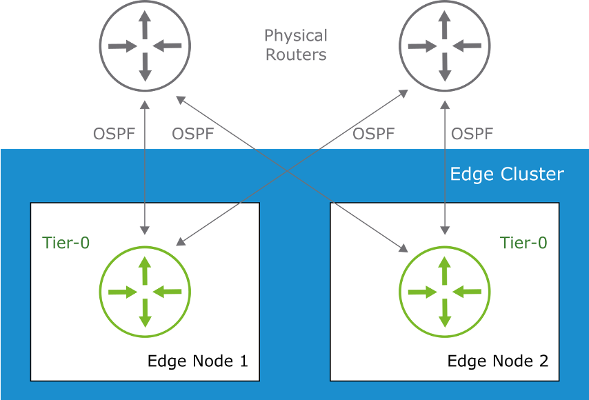

------

1. **OSPF 지원 조건 및 배포 방식**

   * **지원 버전**
     * NSX-T Data Center 3.1.1 이상부터 OSPF 사용 가능

   * **Tier-0 게이트웨이에서 OSPF 사용 가능**
     * OSPF를 통해 업스트림 물리 라우터와 동적 라우팅 구성
     * 그림처럼 Edge Node 1, 2가 각각 물리 라우터와 OSPF 인접관계 형성

   * **OSPF 구성 유형**
     * **Point-to-Point Network**

​			→	두 라우터 간 직접 연결 (예: WAN 링크)

​			→	구성 간단하고 빠른 convergence

​		•	**Broadcast Network**

​			→	하나의 네트워크에 여러 라우터 연결 (예: Ethernet)

​			→	브로드캐스트로 모든 라우터에게 전달 가능

------

2. **OSPF 인접 관계(Adjacency) 형성 조건**

   * OSPF는 링크 상태 라우팅 프로토콜로 인접 라우터 간 라우팅 정보 주기적 교환
   * 인접관계를 형성하려면 다음 조건을 만족해야 함:
     * 같은 서브넷 상에 존재
     * 같은 Area ID 설정
     * 같은 서브넷 마스크
     * Hello Timer / Dead Timer 값 일치
     * 인증 방식 일치 (선택 사항)

   * **인증 방식**
     * MD5 해시 또는 Clear Text 방식 사용 가능
     * 보안 수준에 따라 선택

------

------

## Configuring Static Routes on a Tier-0 Gateway (1)

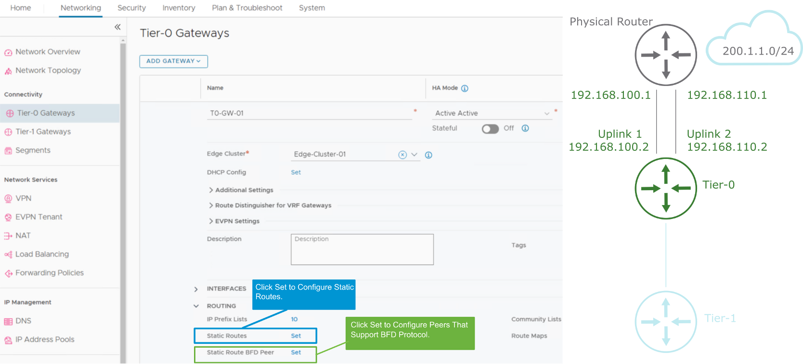

------

------

## Configuring Static Routes on a Tier-0 Gateway (2)

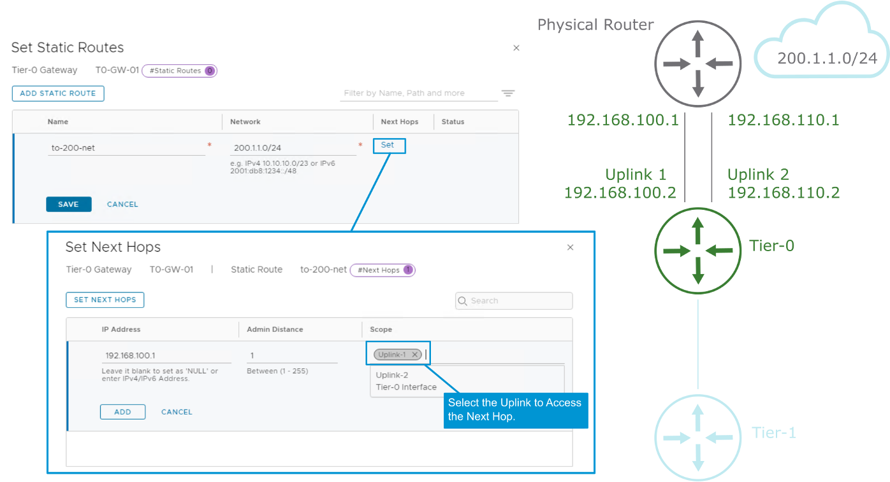

------

------

## Configuring Dynamic Routing with BGP on Tier-0 Gateways (1)

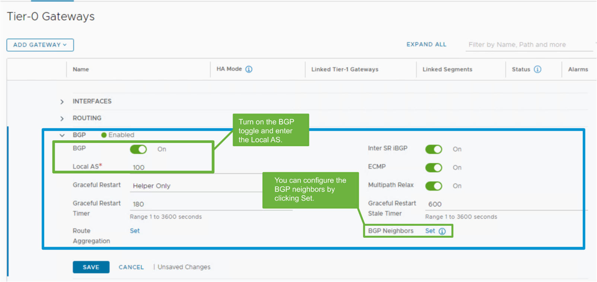

​	•	**BGP는 Tier-0 게이트웨이에서 기본적으로 활성화됨**

​	•	BGP를 사용하기 위해 다음을 반드시 구성해야 함:

​	•	**로컬 AS 번호(Local AS) 설정**

​	•	**BGP 이웃(Neighbor) 구성**

------

 **Inter SR iBGP (Service Router 간 iBGP)**

​	•	**설명**: NSX의 SR(Service Router) 간 내부 BGP(iBGP) 세션을 활성화하는 기능이다.

​	•	**역할**: Tier-0 Gateway가 **Active-Active 구성**일 때, 각각의 SR이 라우팅 정보를 **서로 공유**하기 위해 필요하다.

​	•	**효과**: 동일한 Tier-0 Gateway에 속한 여러 SR 간 라우팅 정보가 전달되어, **경로 최적화 및 트래픽 분산**이 가능해짐.

**ECMP (Equal Cost Multi-Path Routing)**

​	•	**설명**: 목적지까지 비용이 동일한 여러 경로가 존재할 경우, **모든 경로를 동시에 사용**하도록 허용하는 기능이다.

​	•	**역할**: Tier-0 Gateway가 외부 네트워크와 여러 개의 업링크를 통해 연결된 경우, 각 경로로 **트래픽을 로드 밸런싱**함.

​	•	**효과**: 다중 경로 사용을 통해 **대역폭 증가 및 장애 대응성 향상**

 **Multipath Relax**

​	•	**설명**: BGP에서 ECMP 경로로 허용되는 경로를 좀 더 **유연하게 선택**하게 해주는 옵션이다.

​	•	**기본 동작**: BGP는 ECMP를 위해 모든 Path 속성이 일치해야 함 (AS-PATH, MED, ORIGIN 등).

​	•	**이 옵션을 켜면**: 일부 속성이 달라도(예: MED 값) **ECMP로 허용**되도록 완화함.

| **기능 이름**   | **설명**                                             | **효과**                           |
| --------------- | ---------------------------------------------------- | ---------------------------------- |
| Inter SR iBGP   | Tier-0 내부 SR 간 iBGP로 라우팅 정보 공유            | 고가용성, 내부 경로 최적화         |
| ECMP            | Equal-cost 경로를 모두 사용하여 트래픽 분산          | 대역폭 향상, 고가용성              |
| Multipath Relax | ECMP 경로의 일치 조건을 완화하여 더 많은 경로를 허용 | 유연한 경로 선택, 트래픽 분산 향상 |

------

**고급 BGP 설정 항목**

1. **Inter-SR Routing (서비스 라우터 간 라우팅)**

​	•	같은 Tier-0 게이트웨이 내의 **SR 간에 iBGP를 통해 라우팅 정보 교환**

2. **Multipath Relax 설정**

​	•	**이웃 AS 번호가 서로 달라도**, 나머지 BGP 속성이 동일하면 **ECMP(Equal-Cost Multi-Path) 허용**

3. **라우트 광고 필터링(Route Advertisement Filtering)**

​	•	다음 조건에 따라 광고할 라우트를 필터링 가능:

​	•	**IP Prefix List**

→ **서브넷 마스크를 기준으로 허용 또는 거부할 네트워크 정의**

​	•	**Community List**

→ **공통 속성을 가진 경로 집합에 태그를 부여하여 특정 BGP 커뮤니티만 허용**

​	•	**Route Map**

→ **IP Prefix List 또는 Community List의 시퀀스로 구성**

→ 조건이 **일치하면 해당 동작을 수행하고**, **더 이상 나머지 라우트 맵은 평가하지 않음**

이러한 기능들을 통해 **정밀한 라우트 제어 및 정책 기반 라우팅 구성 가능**.

------

------

## Verifying the BGP Configuration of the Tier-0 Gateways

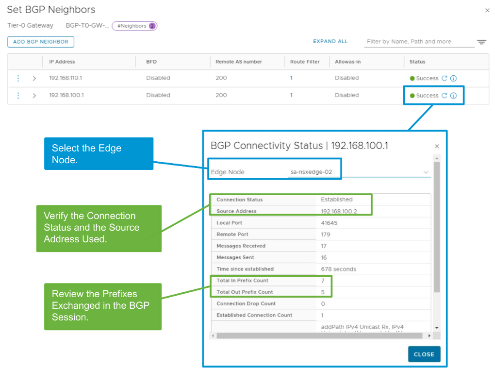

------

------

## **BGP Route Aggregation (BGP 경로 집계)**

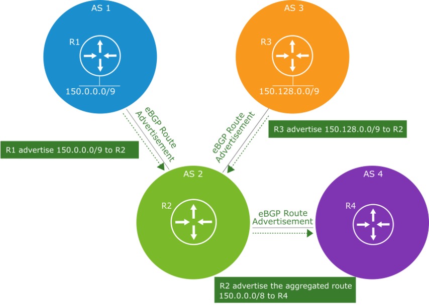

------

1. **BGP Route Aggregation 개요**

• BGP Route Aggregation은 여러 개의 구체적인 경로(prefix)를 하나의 요약된 경로로 집계(aggregate)하는 기능임

→ 예: 150.0.0.0/9 + 150.128.0.0/9 → 150.0.0.0/8 로 요약 가능

• 경로 집계를 통해 다음과 같은 이점 제공

→ 라우팅 테이블 크기 축소

→ 라우터 간 광고되는 경로 수 감소

→ BGP Best Path 계산 속도 향상

------

**2. 그림 설명**

• R1 (AS 1)은 150.0.0.0/9 경로를 R2(AS 2)로 광고

• R3 (AS 3)은 150.128.0.0/9 경로를 R2(AS 2)로 광고

→ 두 경로는 서로 다른 AS에서 수신됨

• R2는 두 경로를 하나로 집계하여 150.0.0.0/8로 요약

→ 요약된 경로를 R4(AS 4)로 eBGP를 통해 광고

------

**3. BGP Route Aggregation 특징 요약**

• 집계는 동일 AS 내 경로뿐 아니라, 서로 다른 AS에서 받은 경로도 가능

• community나 policy를 기반으로 route map을 적용해 세밀하게 제어 가능

• Aggregated Prefix는 개별 prefix 대신 외부로 광고되어 전체 네트워크의 효율성 향상

------

------

## Configuring Route Aggregation with BGP

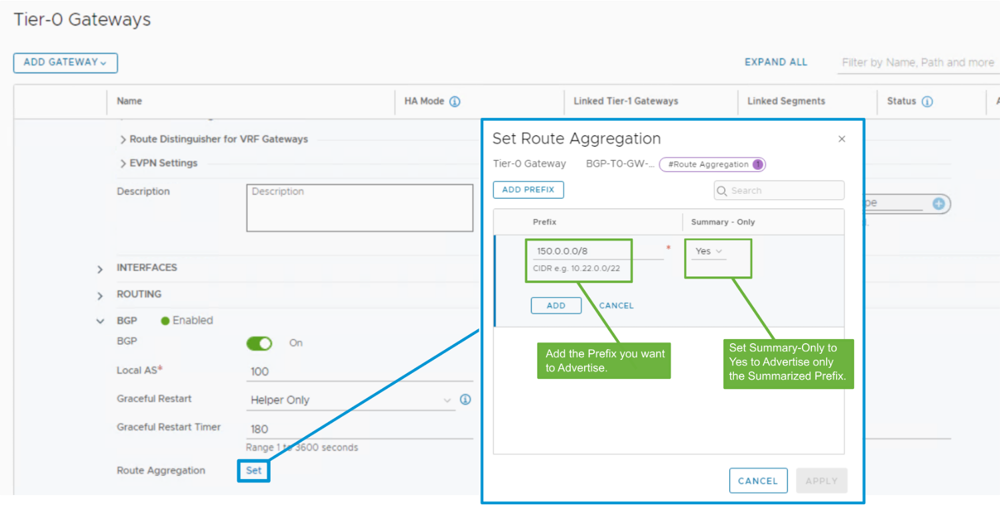

------

------

## Configuring Dynamic Routing with OSPF on Tier-0 Gateways (1)

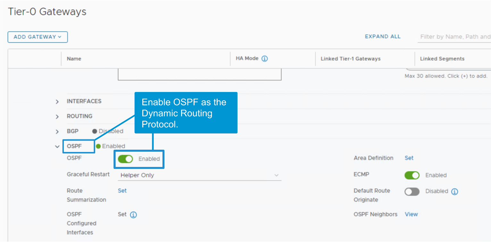

**Tier-0 게이트웨이에서 OSPF 구성 시 유의사항**

​	•	**OSPF는 Tier-0 게이트웨이에서 기본적으로 비활성화되어 있음**

​	•	→ **구성 전에 OSPF 토글을 수동으로 활성화해야 함**

​	•	**OSPF 라우터 ID(Router-ID)**

​	•	사용자 인터페이스(UI)에서는 **수동으로 설정할 수 없음**

​	•	→ NSX가 자동으로 할당함

​	•	**OSPF Graceful Restart 옵션**

​	•	활성화 시, **ToR(Top of Rack) 라우터의 제어 플레인 장애 시에도 트래픽 전송을 계속 유지할 수 있음**

​	•	→ OSPF 상태를 유지하며 서비스 중단 없이 복구 가능

따라서, Tier-0에서 OSPF를 사용하려면 **OSPF 활성화 → 필수 설정 구성 → 고급 옵션 선택** 순서로 진행해야 함.

------

------

Configuring Dynamic Routing with OSPF on Tier-0 Gateways (2)

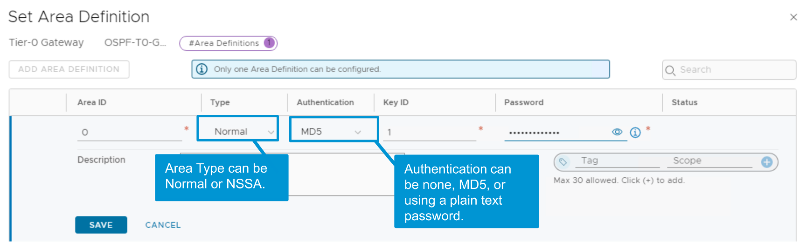

**OSPF 영역의 개념**

​	•	OSPF는 네트워크를 **영역(Area)** 으로 논리적으로 나누어 관리함

​	•	**각 영역의 라우터는 자기 영역의 상세한 토폴로지만 유지**

​	•	**영역 경계 라우터(ABR)** 는 두 영역 간의 경계 역할을 하지만

→ **현재 Tier-0 게이트웨이는 ABR 기능을 지원하지 않음**

------

**NSX에서 지원하는 OSPF 영역 유형**

​	•	**Backbone Area (Area 0)**

​	•	전체 토폴로지에 대한 정보를 가짐

​	•	**모든 인터영역 트래픽은 Backbone을 통해 전달됨**

​	•	분할(PARTITION) 금지, 고가용성 및 이중화 고려 필요

​	•	**Standard Area**

​	•	Backbone과 ABR을 통해 연결되어야 함

​	•	**NSSA (Not-so-Stubby Area)**

​	•	외부 라우트를 차단하지만, 다른 AS에서 온 Type-2 외부 라우트는 수용 가능

​	•	**Stub, Totally Stubby, Virtual Link는 NSX에서 지원하지 않음**

------

**구성 조건 및 제한 사항**

​	•	**Tier-0 게이트웨이당 하나의 OSPF 영역만 구성 가능**

​	•	**Area ID 형식**:

​	•	단일 숫자 (예: 0)

​	•	도트 형식 (예: 0.0.0.0)

​	•	**Area Type**:

​	•	Normal (Standard 또는 Backbone)

​	•	NSSA

​	•	**인증(Authentication)** (선택 사항):

​	•	None, MD5 (해시 기반), Password (평문 텍스트)

------

**예시 (이미지 기준)**

​	•	Area ID: 0

​	•	Type: Normal

​	•	Authentication: MD5

​	•	Key ID 및 Password 설정 가능

------

이 구성을 통해 **Tier-0 게이트웨이는 OSPF 기반 라우팅을 외부 네트워크와 안정적으로 수행**할 수 있으며, **인증과 경로 제어도 강화**할 수 있음.

------

------

## Configuring Dynamic Routing with OSPF on Tier-0 Gateways (3)

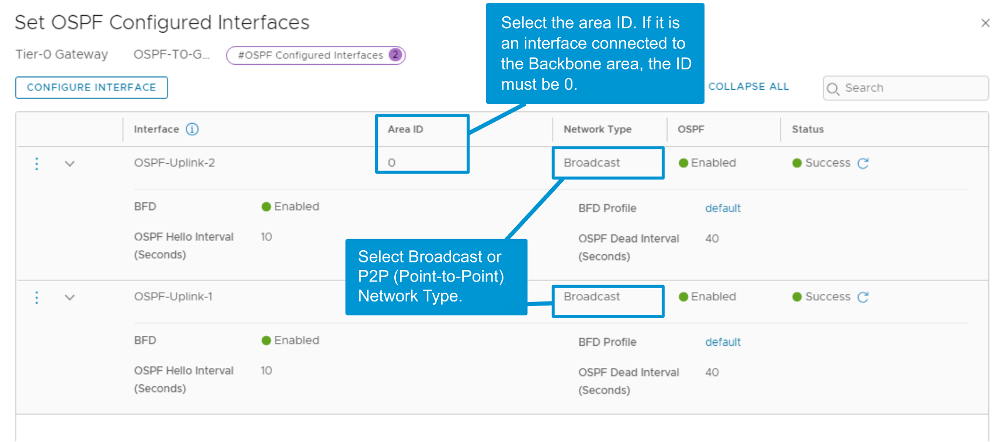

------

------

## Verifying OSPF Configuration of the Tier-0 Gateways

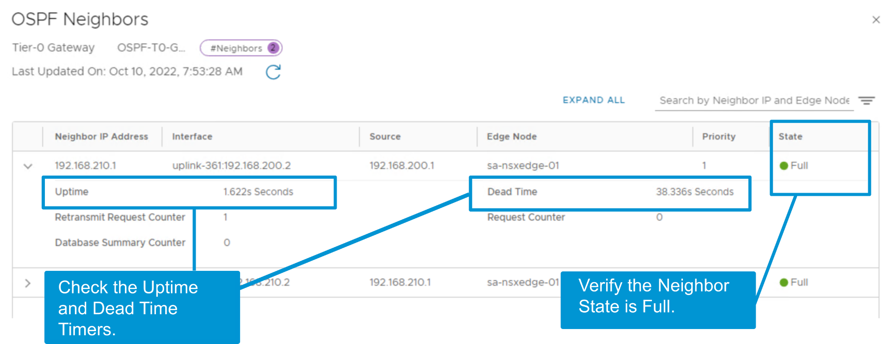

full 상태가 되어야 함

------

------

## **OSPF 경로 요약(Route Summarization) 개요**

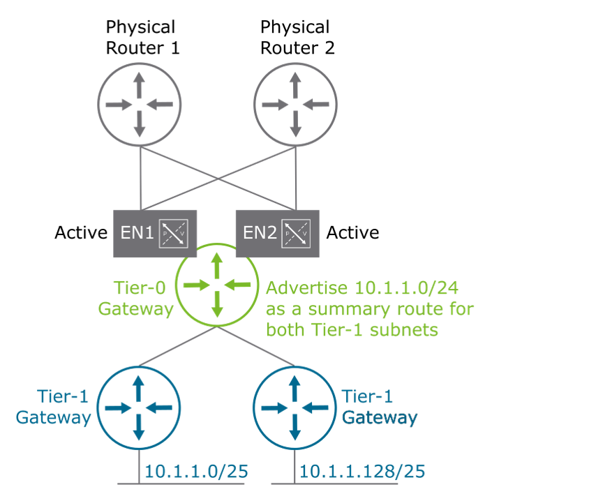

대규모 NSX 환경에서는 **OSPF 경로 요약(Route Summarization)** 을 사용해야 다음과 같은 이점을 얻을 수 있음:

​	•	**LSA(링크 상태 광고) 플러딩 감소**

​	•	**라우터의 CPU 및 메모리 리소스 절약**

​	•	**문제 해결 및 라우팅 관리 단순화**

------

**LSA (Link State Advertisement)란?**

​	•	**OSPF 라우터 간에 교환되는 정보 단위**

​	•	**링크 상태, 라우터 연결, 네트워크 정보 등을 포함**

​	•	**LSA는 각 라우터의 Link State Database(LSDB)에 저장됨**

​	•	**LSA의 유형에 따라 포함하는 정보가 다름 (예: Type 1~5, N1/N2 등)**

------

**그림 설명 요약**

​	•	**두 개의 Tier-1 게이트웨이**가 각각 다음 서브넷을 보유:

​	•	10.1.1.0/25

​	•	10.1.1.128/25

​	•	**Tier-0 게이트웨이**는 이 두 서브넷을 요약하여 **10.1.1.0/24 경로로 광고**

​	•	**요약된 경로는 Type-5 LSA 형식**으로 외부에 광고됨

​	•	이는 **정적 라우트 또는 외부 프로토콜에서 재분배된 경로**에 사용됨

​	•	**NSX 환경에서는 이 요약 경로가 OSPF External Type-2 (N E2)** 로 전달됨

------

**결론**

경로 요약을 통해 **라우팅 테이블의 복잡도를 줄이고, OSPF의 확장성과 안정성을 향상**시킬 수 있음.

특히 다수의 Tier-1 게이트웨이가 존재하는 구조에서는 **Tier-0에서 요약 경로를 외부로 광고하는 것이 필수적**임.

------

------

## Configuring Route Summarization with OSPF

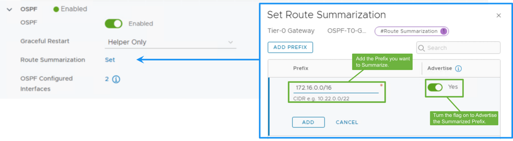

오른쪽 사진 YES 필수
