## **Equal-Cost Multipath Routing (ECMP 라우팅 개요)**

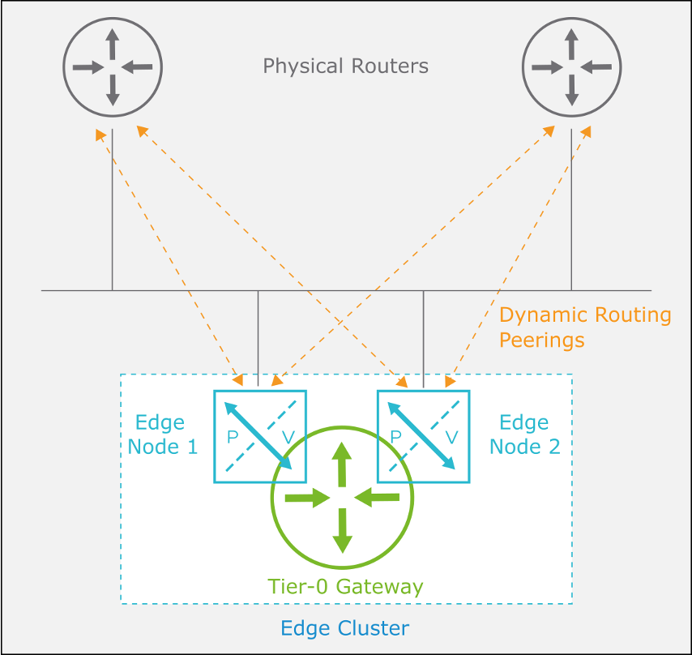

1. **ECMP 라우팅이란?**

• ECMP(Equal-Cost Multipath)는 동일한 비용(cost)을 가지는 다수의 경로를 동시에 사용하는 라우팅 방식

• Tier-0 Gateway에서 동작하며, 물리 라우터와의 **north-south 트래픽** 경로에 적용됨

------

2. **ECMP의 주요 특징**

• **대역폭 증가**

→ 여러 업링크(Uplink)를 병렬로 활용하여 북-남 방향(North-South)의 전체 통신 용량 증가

• **트래픽 부하 분산 (Load Balancing)**

→ 각 경로에 대해 균등하게 트래픽을 분산시켜 효율적 라우팅 제공

• **경로 장애 대비(Fault Tolerance)**

→ 하나의 경로에 장애가 발생해도 나머지 경로로 자동 트래픽 우회 가능

• **최대 8개의 ECMP 경로 지원**

→ NSX에서는 최대 8개의 동일 비용 경로까지 동시 활용 가능

------

3. **ECMP Hashing 방식**

• **5-튜플 기반 해싱 알고리즘** 사용

→ Source IP

→ Destination IP

→ Source Port

→ Destination Port

→ Protocol

• 이 방식은 다양한 흐름(flow)을 다르게 분산시켜, 경로 간 트래픽 충돌 없이 최적 분산을 달성

------

4. **그림 설명**

• Tier-0 Gateway는 Edge Node 1, 2를 통해 물리 라우터와 다중 연결 구성

• 각 Edge Node의 Uplink를 통해 **다수의 Dynamic Routing Peering** 형성

• NSX는 ECMP를 통해 모든 Uplink를 병렬로 사용하여, 트래픽 분산 및 장애 대응 가능

------

------

## Enabling ECMP in BGP

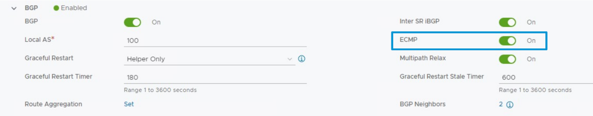

**ECMP 기본 동작 요약**

​	•	**ECMP(동일 비용 다중 경로)**는 **Tier-0 Gateway**에서 **BGP가 활성화되면 자동으로 활성화됨**

​	•	즉, 사용자가 BGP 설정을 켜는 순간 ECMP도 기본적으로 활성 상태가 됨

​	•	NSX는 이를 통해 여러 업링크를 동시에 사용할 수 있도록 설정함

​	•	ECMP는 **BGP 설정 섹션에서 수동으로 비활성화** 가능함

→ NSX UI 경로:

Networking > Tier-0 Gateways > 대상 Gateway 선택 > Edit > BGP 섹션

------

------

## Enabling ECMP in OSPF

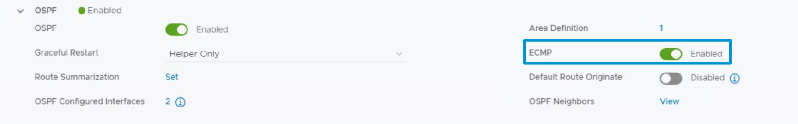

코스트 값이 같아지면 ECMP 활성화

------

------

## **High Availability in NSX Gateways (NSX 게이트웨이 고가용성 구성)**

**1. 고가용성(HA) 개요**

• NSX에서는 **게이트웨이 레벨에서 고가용성(High Availability)** 구성이 가능

• 장애 발생 시 **서비스 연속성**을 유지하기 위한 **이중화 설계** 제공

• 고가용성은 **두 가지 모드** 중 하나로 설정 가능

------

**2. 고가용성 구성 모드**

**① Active-Active 모드**

• 모든 Edge Node가 동시에 활성 상태

• **게이트웨이 서비스가 병렬로 실행**되며, 부하가 전체 노드에 분산됨

• 각 노드는 논리적 라우팅을 독립적으로 수행

→ **특징**

​	• 기본적으로 **Stateless(무상태)** 방식 → 세션 정보가 유지되지 않음

​	• NSX 4.0.1부터는 **Stateful Active-Active 모드**도 지원

​		→ NAT 등 상태 기반 서비스가 필요한 경우 사용 가능

------

**② Active-Standby 모드**

• 하나의 Edge Node만 활성 상태

• 나머지 하나는 **대기 상태(Standby)** 로 유지되며, 장애 발생 시 즉시 전환

• 일반적으로 **상태 기반 서비스(NAT 등)** 에 적합

엑티브 노드가 더이상 사용할 환경이 안되면

→ **특징**

​	• 논리적 라우팅은 오직 하나의 Edge Node에서만 활성화

​	• 장애 발생 시 Standby 노드가 즉시 Active로 전환되어 **서비스 지속성 확보**

​	• Tier-0 및 Tier-1 게이트웨이 모두에서 구성 가능

------

**3. 서비스 라우터와 고가용성**

• **Service Router(SR)** 는 각 Edge Node 상에서 동작

• SR는 고가용성 모드에 따라 다음과 같이 운용됨:

​	• Active-Active 모드 → 여러 Edge Node에서 동시에 SR 동작

​	• Active-Standby 모드 → 하나의 SR만 활성화, 나머지는 대기

------

**4. Edge Node Grouping의 효과**

• Edge Node를 그룹으로 묶어 고가용성을 구성할 경우 다음과 같은 장점 있음:

​	• 장애 복구 능력 향상

​	• 서비스 중단 최소화

​	• 트래픽 처리 분산 (Active-Active 시)

​	• 정책 일관성 유지

------

------

## **Active-Active HA Mode (Active-Active 고가용성 모드)**

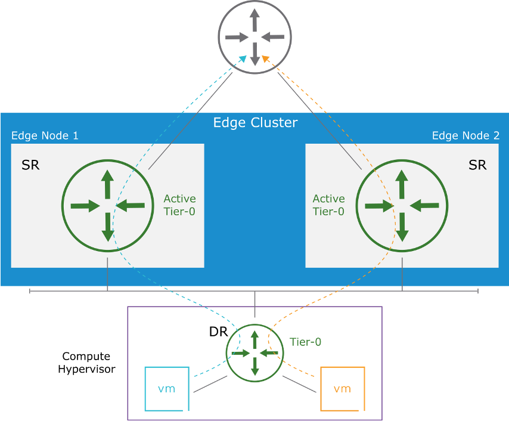

------

**1. Active-Active 개요**

• Active-Active 모드는 **Tier-0 게이트웨이의 기본 고가용성 구성 방식**임

• **여러 Edge Node에 동시에 게이트웨이를 배치하여 부하 분산 및 장애 대비** 가능

• NSX 4.0.1 이상에서는 **상태 기반 서비스(stateful services)** 도 지원 가능

------

**2. 주요 특징**

• **ECMP(Equal-Cost Multi-Path)** 를 통해 다수의 Edge Node 간 **트래픽 로드밸런싱**

• **논리 라우팅(Logical Routing)** 이 **두 개 이상의 Edge Node**에서 동시에 활성

• **최대 8개 Edge Node까지 게이트웨이 확장** 가능

• 기본적으로 **Stateless(무상태)** 모드로 동작

------

**3. 트래픽 흐름 및 장애 대응**

• **North-South 트래픽(Northbound)** 은 DR(분배 라우터)이 **여러 SR(서비스 라우터)** 로 트래픽 전달

• **하나의 Edge Node 장애 시**, **서비스 중단 없이** 나머지 노드에서 처리

→ 단, **사용 가능한 총 대역폭은 감소**

------

**4. Stateless vs. Stateful Active-Active 모드**

**① Stateless (기본값)**

• 상태 기반 서비스(NAT, Stateful Firewall)는 **구성 불가**

• **라우팅 및 무상태 서비스**(예: Reflexive NAT)만 가능

• 세션 정보나 상태 저장 불가 → 부하 분산은 가능하나 세션 유지 불가

------

**② Stateful (NSX 4.0.1 이상)**

• **NAT 등 상태 기반 서비스 구성 가능**

• 특정 세션(Flow)을 **하나의 Edge Node에 고정(Pinning)** 하여 상태 유지

• 로드밸런싱과 세션 일관성을 **동시에 보장**

------

**5. 정리**

| **구분**       | **Stateless**         | **Stateful (NSX 4.0.1+)** |
| -------------- | --------------------- | ------------------------- |
| 세션 상태 유지 | 불가                  | 가능                      |
| NAT 구성       | 불가                  | 가능                      |
| 로드밸런싱     | 가능                  | 가능 (제한적)             |
| 장애 시 전환   | 자동 전환 (세션 단절) | 자동 전환 (세션 유지)     |

------

**→ Active-Active 모드는 확장성과 고가용성을 제공하며, NSX 4.0.1 이상에서는 Stateful 환경에서도 활용 가능함.**

------

------

## **Active-Active Topology with BGP (BGP 기반 Active-Active 토폴로지 구성)**

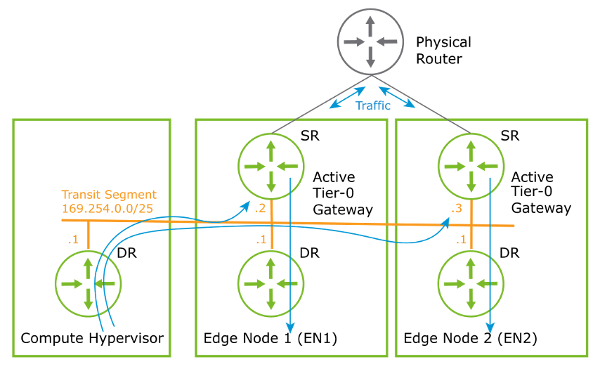

------

**1. 구성 개요**

• 이 토폴로지는 **Tier-0 게이트웨이의 Active-Active 고가용성(HA)** 모드에서 BGP와 함께 사용됨

• 각 **SR(Service Router)** 은 **업스트림 물리 라우터**와 **BGP 피어링(Peering)** 을 형성함

• 모든 SR이 동시에 **북-남(North-South)** 트래픽을 처리함

------

**2. 주요 구성 요소**

• **Transit Segment**

→ 내부 통신을 위한 경유 세그먼트 (예: 169.254.0.0/25 사용)

→ 각 SR에 고유한 IP 할당됨 (예: .2, .3 등)

• **DR(Distributed Router)**

→ 모든 SR로 트래픽을 **로드밸런싱하여 분산** 전달

• **SR(Service Router)**

→ BGP를 통해 외부 물리 라우터와 직접 경로 학습 및 광고 수행

→ Active-Active 구조로 병렬 동작

------

**3. 트래픽 흐름 설명 (예시 기준)**

• DR이 **169.254.0.2**, **169.254.0.3** IP를 가진 **두 SR로 트래픽 분산 전송**

• 각 SR은 **물리 라우터와 직접 BGP Peering 구성**

• 라우팅 결정은 **NSX 내부 DR의 로직**에 의해 수행되며, **BGP 피어링의 상태와 무관**하게 처리됨

→ 즉, DR이 어떤 SR로 보낼지는 BGP 외부 정보에 영향받지 않음

------

**4. 장점 및 특징**

• **ECMP 기반 트래픽 로드밸런싱**

→ DR이 다수의 SR로 분산 전송 → 처리 효율 향상

• **Active-Active로 인한 고가용성**

→ 특정 SR 장애 시, **나머지 SR이 트래픽 처리** → 서비스 중단 없음

• **유연한 확장성**

→ SR 수 증가로 **대역폭 및 처리 성능 증가 가능**

------

**5. 정리**

| **구성 요소**   | **설명**                          |
| --------------- | --------------------------------- |
| DR              | 트래픽을 여러 SR로 분산 처리      |
| SR              | BGP Peering 및 트래픽 전달 수행   |
| Transit Segment | DR ↔ SR 간 내부 경로 구성         |
| BGP             | 외부 물리 라우터와 경로 동적 교환 |
| 로드밸런싱      | DR이 모든 SR에 분산 처리 수행     |

------

**→ Active-Active + BGP 구조는 고가용성과 확장성, 동적 라우팅을 동시에 달성할 수 있는 이상적인 구조임.**

------

------

## **Active-Active Topology with OSPF (OSPF 기반 Active-Active 토폴로지 구성)**

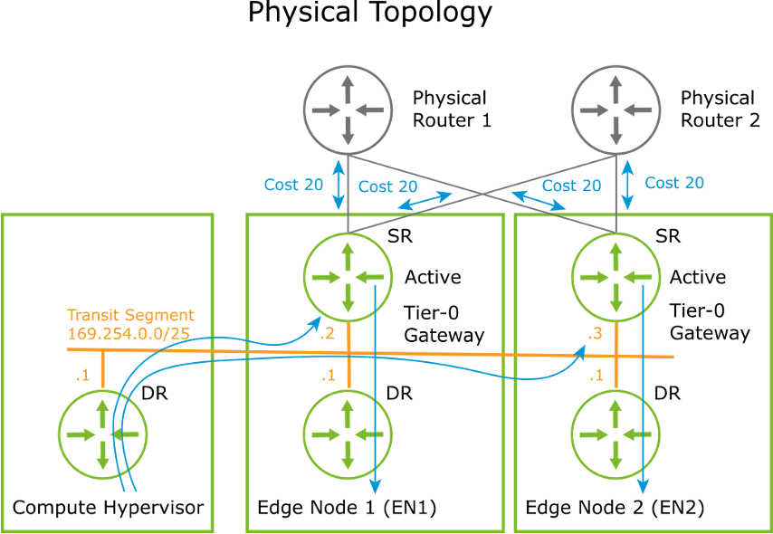

------

**1. 구성 개요**

• **Tier-0 게이트웨이 Active-Active 고가용성(HA)** 모드에서 **OSPF(Open Shortest Path First)** 를 사용하는 구성

• 모든 **SR(Service Router)** 이 동시에 **업스트림 물리 라우터**와 **OSPF 인접관계**를 형성함

• NSX 내부의 **DR(Distributed Router)** 이 트래픽을 모든 SR로 **로드밸런싱**하여 전달

------

**2. 주요 구성 요소**

• **Transit Segment**

→ SR 간 연결을 위한 내부 세그먼트 (예: 169.254.0.0/25)

• **SR(Service Router)**

→ 각각 물리 라우터와 **OSPF 인접관계(Adjacency)** 를 설정

→ 동일한 **OSPF Cost = 20** 을 광고하여 라우팅 경로 선택에 영향

• **DR(Distributed Router)**

→ 수신 트래픽을 모든 SR로 분산 전송

------

**3. 트래픽 흐름 특징**

• **DR은 모든 활성화된 SR로 트래픽을 로드밸런싱**

→ SR .2, .3 등으로 분산 전달됨

• **모든 SR은 물리 라우터와 OSPF 인접관계 형성**

→ 동일한 **Cost 20** 을 설정하여 **Equal-Cost 경로로 간주됨**

• **물리 라우터는 Cost 기준으로 SR 중 하나 선택**

→ 따라서 물리 라우터는 두 경로 중 아무거나 선택 가능 (ECMP)

------

**4. OSPF 구성 제한 사항**

• **Edge Node당 최대 2개의 OSPF 업링크 인터페이스 사용 가능**

→ ECMP를 통해 트래픽 분산 가능하지만, OSPF 인터페이스 수는 제한됨

• **OSPF 인접 관계는 SR 단위로 형성됨**

→ 동일한 Edge Cluster 내 여러 SR이 병렬로 동작 가능

------

**5. 정리**

| **구성 요소**   | **설명**                                                    |
| --------------- | ----------------------------------------------------------- |
| Transit Segment | DR ↔ SR 간 트래픽 경유 경로                                 |
| SR              | OSPF로 외부 물리 라우터와 인접 형성                         |
| DR              | 내부에서 SR로 트래픽 분산                                   |
| OSPF Cost       | 모든 SR에서 동일하게 20으로 설정                            |
| ECMP            | OSPF 기반으로도 트래픽 분산 가능 (단, 인터페이스 제한 있음) |

------

**→ OSPF 기반의 Active-Active 구성은 고가용성뿐 아니라 ECMP 기반의 트래픽 분산까지 가능하게 하며, 물리 라우터의 라우팅 결정에도 영향을 준다.**

------

------

## **Active-Standby HA Mode (Active-Standby 고가용성 모드)**

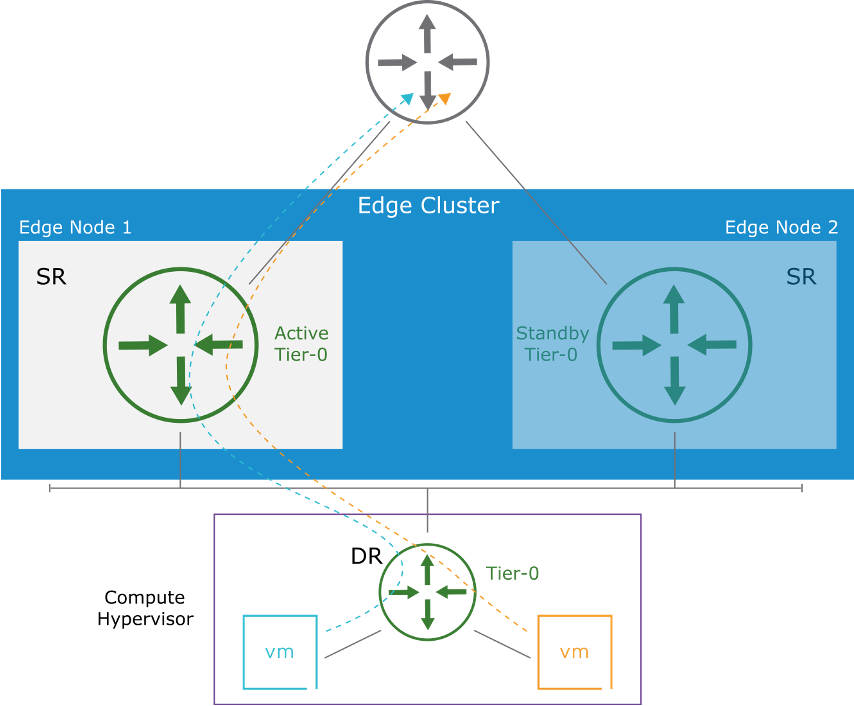

------

**1. 개요**

• Active-Standby 모드는 **단일 Edge Node**에서만 게이트웨이가 활성화되는 고가용성 모드

• **Tier-0 또는 Tier-1 게이트웨이**에서 적용 가능

• 한 노드가 **Active**, 다른 노드는 **Standby** 상태로 대기

------

**2. 주요 특징**

• **단일 Edge Node에서만 게이트웨이 운영**

→ 모든 트래픽은 Active 노드를 통해 처리됨

• **Standby 노드는 상태 동기화만 수행**

→ 트래픽은 처리하지 않고, Active 노드 장애 시 자동 승격

• **중앙 집중형 Stateful 서비스 지원**

→ **게이트웨이 방화벽**, **VPN**, **NAT** 등 Stateful 서비스 사용 가능

------

**3. Tier-0 게이트웨이 구성**

• Active/Standby **SR(Service Router)** 는 **각각 다른 Northbound IP 주소** 사용

• **동적 라우팅(BGP, OSPF)** 세션은 **두 SR 모두 구성**

→ 단, Standby는 트래픽을 전달하지 않음

• **장애 발생 시 새로운 노드가 Active로 전환**

→ 게이트웨이 상태는 동기화되므로 서비스 중단 최소화

------

**4. Tier-1 게이트웨이 구성**

• Active/Standby SR은 **동일한 Northbound IP 주소 사용**

• NSX가 자동으로 흐름을 전환하며 서비스 연속성 보장

------

**5. 트래픽 흐름**

| **구성**   | **설명**                          |
| ---------- | --------------------------------- |
| Active SR  | 트래픽 처리 및 동적 라우팅 유지   |
| Standby SR | 상태 동기화만 수행, 트래픽 미전달 |
| 전환 시점  | 장애 발생 시 Standby가 즉시 승격  |

------

**→ Active-Standby는 Stateful 서비스를 필요로 하는 경우에 적합하며, 장애 대응이 빠르고 안정적인 서비스 전환이 가능하다.**

------

------

## **Active-Standby with BGP (BGP 기반 Active-Standby 구성)**

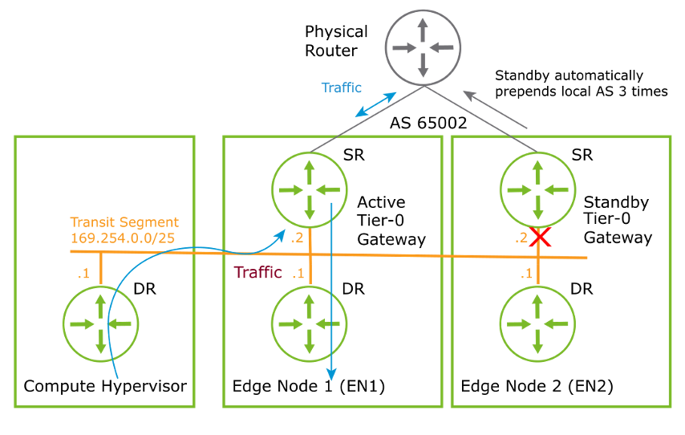

------

**1. 구성 개요**

• BGP를 사용하는 **Active-Standby** 구성에서는 두 SR(Service Router)이 모두 **BGP 피어링**을 맺음

• **Active SR**만 실제 데이터 트래픽을 전달하며, **Standby SR**은 트래픽을 전달하지 않음

------

**2. 구성 요소별 특징**

• **BGP 피어링**

→ Active/Standby SR 모두 물리 라우터와 BGP 피어링 유지

→ 장애 시 빠른 경로 수렴 가능

• **AS Path Prepending**

→ Standby SR은 **AS Path를 인위적으로 늘림**

→ BGP 경로 우선순위를 낮춤 (물리 라우터 입장에서 Standby SR 경로는 비선호)

• **Transit Segment**

→ Active/Standby SR 모두 동일한 **169.254.0.0/25** 대역 사용

→ Standby SR의 인터페이스는 데이터 경로상에서 비활성화됨 (down 상태)

------

**3. 트래픽 흐름**

| **구성**       | **설명**                                    |
| -------------- | ------------------------------------------- |
| DR → Active SR | 모든 트래픽은 DR에서 Active SR로 전달됨     |
| Standby SR     | 트래픽 전달하지 않음, BGP만 유지            |
| 장애 발생 시   | Standby SR이 Active로 승격되고, 경로 수렴됨 |

------

**4. 장점**

• AS Path Prepending을 통해 **물리 라우터 경로 선택 제어**

• Standby SR도 BGP 피어링 유지 → **빠른 장애 복구 가능**

• 서비스 중단 없이 **즉각적인 Active 전환 가능**

------

**→ BGP 기반의 Active-Standby 구성은 안정적인 장애 대응과 빠른 경로 수렴을 제공하며, 고가용성이 필요한 환경에 적합하다.**

------

------

## **Active-Standby with OSPF (OSPF 기반 Active-Standby 구성)**

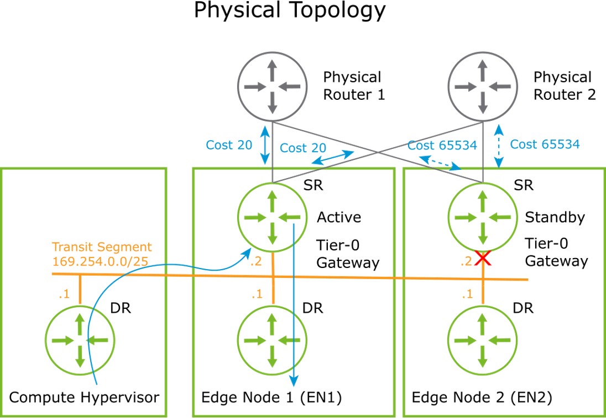

------

**1. 구성 개요**

• **Tier-0 Gateway**가 Active-Standby 모드로 구성됨

• **OSPF 라우팅 프로토콜**을 통해 물리 라우터와 동적으로 연동

• Active/Standby 모두 **OSPF 인접 관계** 형성

------

**2. OSPF 비용(Cost)을 활용한 경로 제어**

• **Active Tier-0 SR**

→ OSPF Cost 20을 사용하여 물리 라우터가 해당 경로를 **선호**

→ 실제 데이터 트래픽은 모두 이 경로를 통해 전달됨

• **Standby Tier-0 SR**

→ **OSPF Cost 65534** 사용 (수정 불가, 하드코딩)

→ 물리 라우터는 이 경로를 **비선호**

→ **트래픽 전달은 하지 않음**, 단지 OSPF 인접 상태 유지

→ **Transit Segment 인터페이스는 down**

------

**3. 트래픽 흐름**

| **구성**       | **설명**                                   |
| -------------- | ------------------------------------------ |
| DR → Active SR | 트래픽은 항상 Active SR로 전송됨           |
| Standby SR     | OSPF 피어링 유지, 트래픽 전달 안함         |
| 장애 시        | Standby가 Active로 전환되며 경로 수렴 발생 |

------

**4. 장점 및 고려사항**

• Standby도 OSPF 유지 → **장애 복구 시 빠른 경로 수렴 가능**

• **Cost 65534**는 강제로 설정되어 있으므로 수동 조정 불가

• Active-Standby 구조로 인해 트래픽이 하나의 노드에 집중됨

------

**→ OSPF 기반 Active-Standby 구성은 안정적인 고가용성을 제공하면서도 트래픽 제어를 OSPF 비용을 통해 정교하게 수행할 수 있다.**

------

------

## **Failover Detection Mechanisms (페일오버 감지 메커니즘)**

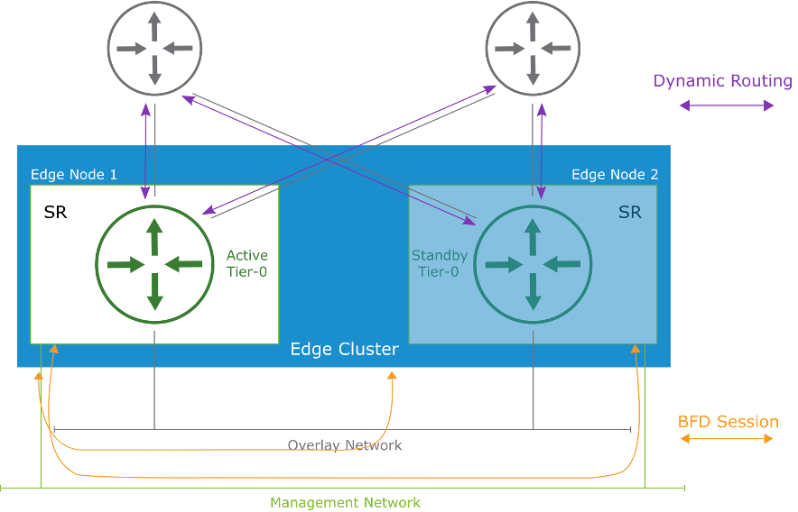

------

**1. 개요**

• Tier-0 게이트웨이의 **Active-Standby 구성**에서 **장애 감지**는 빠른 전환을 위해 다양한 감지 메커니즘 사용

• **Edge Node 간 연결 상태** 및 **업링크 상태**를 모니터링함

------

**2. 감지 메커니즘 구성 요소**

• **BFD (Bidirectional Forwarding Detection)**

→ 관리 네트워크 및 오버레이 네트워크에서 사용됨

→ Active SR ↔ Standby SR 간 빠른 연결 상태 감지

→ layer 1 을 감지하는 시그널링

→ 짧은 시간 간격으로 헬로 패킷 전송 → 장애 즉시 감지 가능

• **Dynamic Routing Protocol (동적 라우팅 프로토콜)**

→ BGP 또는 OSPF를 통해 **업링크 상태**를 확인

→ 물리 라우터와의 인접 관계 상태로 장애 여부 판단

→ 업스트림 경로 장애 시 감지 가능

------

**3. 트래픽 및 세션 흐름**

| **항목**         | **설명**                                                   |
| ---------------- | ---------------------------------------------------------- |
| BFD Session      | Overlay 또는 관리 네트워크에서 동작                        |
| Dynamic Routing  | 업링크 경로 상태를 체크                                    |
| Failover Trigger | BFD 또는 라우팅 피어링 다운 시, Standby → Active 전환 발생 |

------

**4. 구성 이점**

• 빠른 장애 감지 → 서비스 다운타임 최소화

• 중복 구성된 경로를 통해 고가용성 보장

• 동적 라우팅과 BFD 조합으로 **이중 감지 체계** 구성 가능

------

**→ BFD와 동적 라우팅은 Tier-0 게이트웨이의 장애 복구 성능을 극대화하는 핵심 메커니즘이다.**

------

------

##  **BFD in HA Detection (BFD 기반 고가용성 장애 감지)**

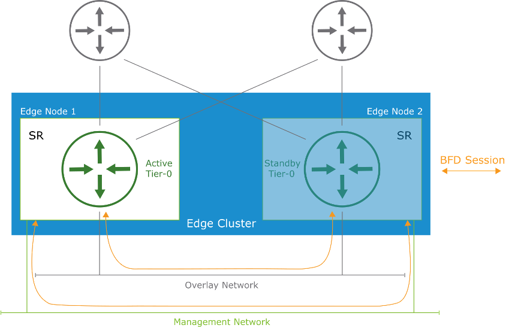

------

**1. BFD의 역할**

• BFD(Bidirectional Forwarding Detection)는 **전달 경로 장애를 빠르게 감지**하기 위한 경량 프로토콜임

• 물리적 장애 감지 기능이 없는 매체(Ethernet 등)에서도 동작 가능

• NSX Edge 노드 간의 **keepalive 메시지(BFD 세션)**를 통해 상태를 주기적으로 확인

------

**2. BFD 세션 구성**

• **인터페이스**

→ Management Network

→ Overlay Network (터널 인터페이스)

• **BFD 세션 형성 대상**

→ Active SR ↔ Standby SR 간 BFD keepalive 주고받음

→ 두 인터페이스(Management + Tunnel) 모두에서 수신 실패 시 장애로 간주

------

**3. 장애 감지 프로세스**

| **항목**            | **설명**                                                     |
| ------------------- | ------------------------------------------------------------ |
| Keepalive 감지 실패 | Standby SR이 두 인터페이스 모두에서 BFD 응답을 못 받으면 장애 발생으로 판단 |
| 역할 전환           | Standby SR이 **자신을 Active로 승격**함                      |
| 라우팅 연속성 유지  | 빠른 전환으로 데이터 플레인 트래픽 손실 최소화               |

------

**4. Active-Active 및 Active-Standby 공통 조건**

• 모든 HA 모드에서 **BFD 기반 감지 조건은 동일함**

• 논리 라우터 단위로 장애를 감지

• 물리적 링크 장애가 아닌 **Edge 노드 상태 기반으로 전환**

------

**→ BFD는 NSX 고가용성 환경에서 실시간 장애 감지를 위한 핵심 기술이며, Active-Standby 전환을 자동으로 처리한다.**

------

------

## **BFD Failover Scenario (BFD 기반 장애 전환 시나리오)**

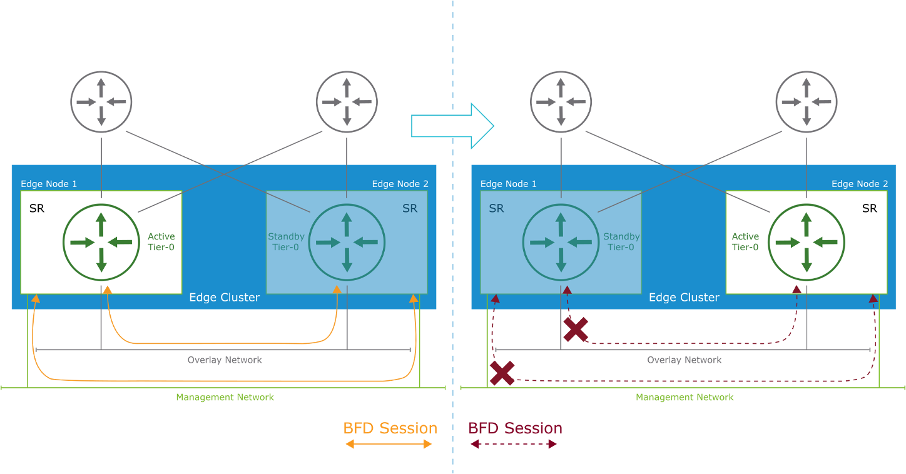

------

**1. 장애 감지 트리거**

• Standby Gateway가 **Management 인터페이스와 Overlay 인터페이스 모두에서 BFD Keepalive 수신 실패** 시

→ 해당 Standby SR은 **Active로 자동 승격**됨

→ 기존 Active SR은 다운 상태로 간주되어 트래픽 전달이 중단됨

------

**2. 감지 속도 (Failure Detection Time)**

| **장비 유형**   | **최소 BFD 타이머** | **재시도 횟수** | **장애 감지 시간** |
| --------------- | ------------------- | --------------- | ------------------ |
| Edge VM 기반    | 500ms               | 3회             | 1.5초              |
| Bare-metal Edge | 50ms                | 3회             | 150ms              |

• **빠른 전환으로 고가용성 보장**

→ 짧은 시간 내 트래픽 복구 가능

------

**3. 시나리오 흐름**

​	1.	정상 상태 (왼쪽 그림)

• Edge Node 1의 SR이 Active, Node 2는 Standby

• BFD Keepalive가 양쪽 인터페이스(Management + Overlay)에서 정상 수신됨

​	2.	장애 발생 (오른쪽 그림)

• Node 1의 SR이 장애로 BFD Keepalive 전송 중단

• Node 2의 Standby SR이 BFD 수신 실패를 감지

• Node 2가 **즉시 Active 역할로 전환**됨

• 트래픽 경로는 Node 2를 통해 복구됨

------

**→ BFD 기반 장애 전환은 NSX 고가용성 환경에서 빠른 복구를 가능하게 하며, 최소한의 트래픽 손실로 안정적인 서비스 지속을 보장한다.**

------

------

## **Failover Scenario with Dynamic Routing (동적 라우팅 기반 장애 전환 시나리오)**

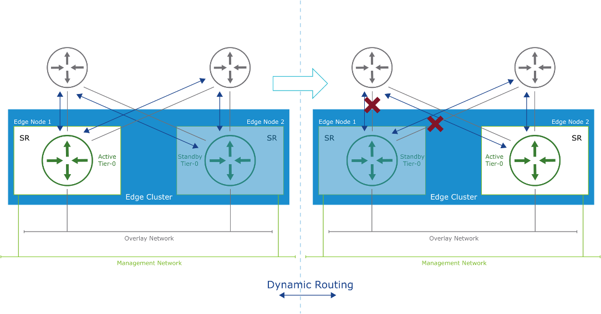

------

**1. 장애 감지 조건**

• Tier-0 Gateway에서 **모든 Dynamic Routing(BGP/OSPF) Peering이 중단될 경우**

→ 해당 Active SR은 **Standby로 전환**됨

→ Standby SR이 **새로운 Active로 승격**

• 적용 대상: **Tier-0 Gateway에만 해당**됨

→ Tier-1에서는 적용되지 않음

------

**2. 동작 흐름**

​	1.	**정상 상태 (왼쪽)**

• Edge Node 1: Active Tier-0

• Edge Node 2: Standby Tier-0

• 모든 물리 라우터와 동적으로 BGP/OSPF Peering 형성 중

​	2.	**장애 발생 (오른쪽)**

• Edge Node 1의 모든 Dynamic Peering 연결 해제됨

• Node 1이 **Active SR 자격 상실 → Standby로 전환**

• Node 2가 **Active SR로 승격**

• 외부 라우터들과 새로운 Dynamic Peering 수립됨

------

**3. 라우팅 프로토콜 상태 확인 기준**

| **프로토콜** | **기본 Hello/Keepalive 타이머** | **Dead/Timeout 타이머** |
| ------------ | ------------------------------- | ----------------------- |
| BGP          | 60초 (Keepalive)                | 180초 (Hold Down)       |
| OSPF         | 10초 (Hello)                    | 40초 (Dead Timer)       |

• Keepalive 메시지 또는 Hello 패킷이 소실되면 연결 종료로 판단

→ Standby SR이 즉시 Active로 전환됨

------

**4. 기타 조건**

• Compute Hypervisor와의 **Overlay Tunnel도 모두 끊긴 경우**,

→ Active SR은 수신 트래픽을 받지 못하므로 Failover가 발생됨

------

**→ 결론:**

동적 라우팅 기반 장애 전환은 **라우팅 세션 감시를 통해 SR 상태를 판단**하며, 장애 발생 시 **즉각적인 Active/Standby 전환**을 수행해 **서비스 연속성 보장**이 가능함.

즉 Active Active 로 빠른 전환이 필요할 수 있음.

------

------

## **Failover Modes in Active-Standby (Active-Standby 구성에서의 장애 복구 모드)**

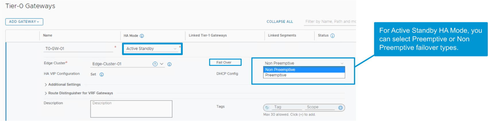

------

**1. Preemptive Mode (선점 모드)**

• 장애로 인해 Standby 노드가 Active로 승격됨

• 이후 원래 Active 노드가 복구되면 → **다시 Active 역할을 선점**

• 복구된 노드는 무조건 다시 Active가 됨

→ **Active 우선순위 보장**

------

**2. Non-Preemptive Mode (비선점 모드)**

• 장애로 인해 Standby 노드가 Active로 승격됨

• 이후 원래 Active 노드가 복구되어도 → **기존 Active 노드 그대로 유지**

• 복구된 노드는 Standby로 남음

→ **서비스 안정성 보장 (불필요한 전환 방지)**

------

**3. 요약 흐름**

| **상황**         | **Preemptive 모드** | **Non-Preemptive 모드** |
| ---------------- | ------------------- | ----------------------- |
| 장애 발생        | Standby → Active    | Standby → Active        |
| 원래 Active 복구 | 다시 Active로 복귀  | 그대로 Standby 유지     |

------

**4. 설정 위치**

• NSX UI에서 Tier-0 Gateway 생성 또는 수정 시

→ **HA Mode가 Active-Standby일 경우**

→ **Failover Type**으로 Preemptive 또는 Non Preemptive 선택 가능

→ 운영 환경 안정성을 원할 경우 Non-Preemptive,

→ 주 노드 복구 우선 보장을 원할 경우 Preemptive 사용

------

**→ 결론:**

Active-Standby 구성에서의 **복구(failback) 전략 선택**을 통해

장애 이후의 네트워크 동작을 **운영 목적에 맞게 최적화**할 수 있음.

------

------

### 기타

ECMP 상황별 대처

| **켜도 되는 상황**                 | **켜면 안 되는 상황**                   |
| ---------------------------------- | --------------------------------------- |
| Tier-0이 Active-Active인 경우      | Tier-0이 Active-Standby인 경우          |
| 다중 업링크 구성                   | 경로 비용이 다르거나 비대칭일 때        |
| 외부 라우터도 ECMP 지원 시         | 외부 라우터가 ECMP를 지원하지 않을 때   |
| 로드 밸런싱이 필요한 대용량 트래픽 | 세션 유지가 중요한 애플리케이션 사용 시 |