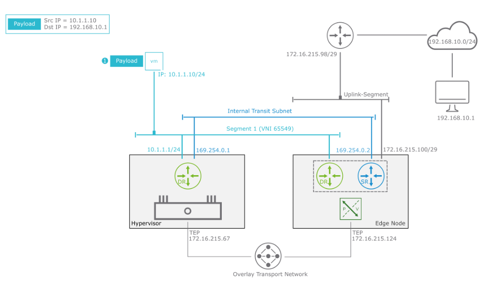
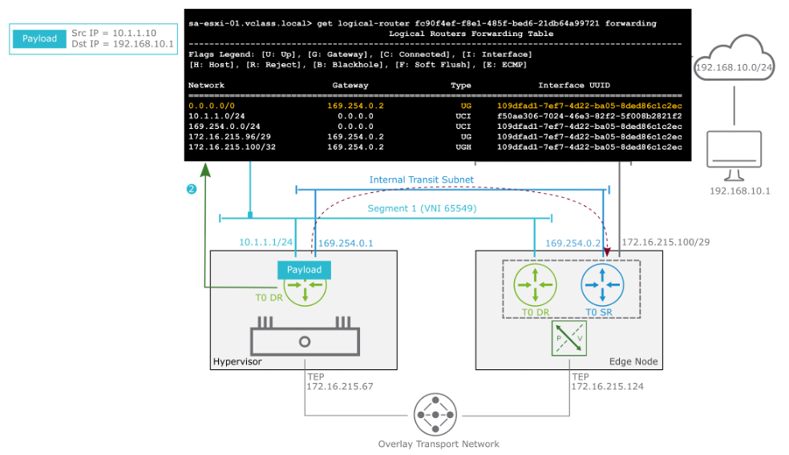
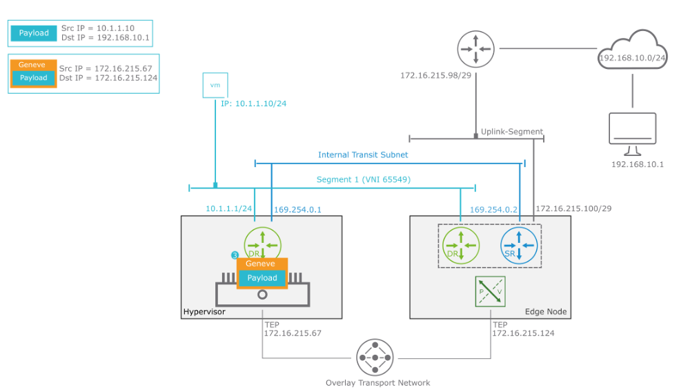
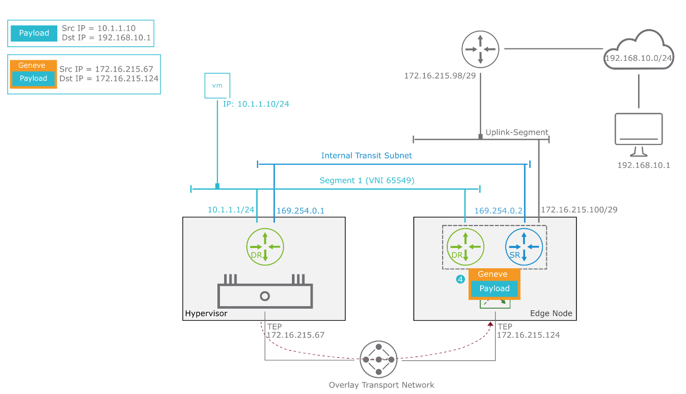
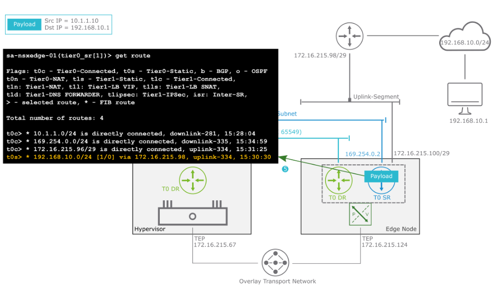
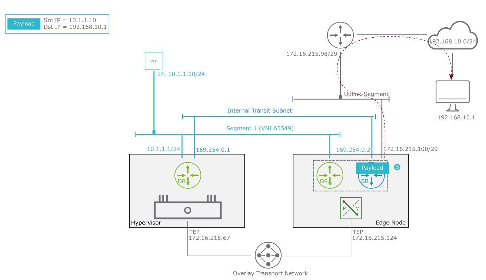
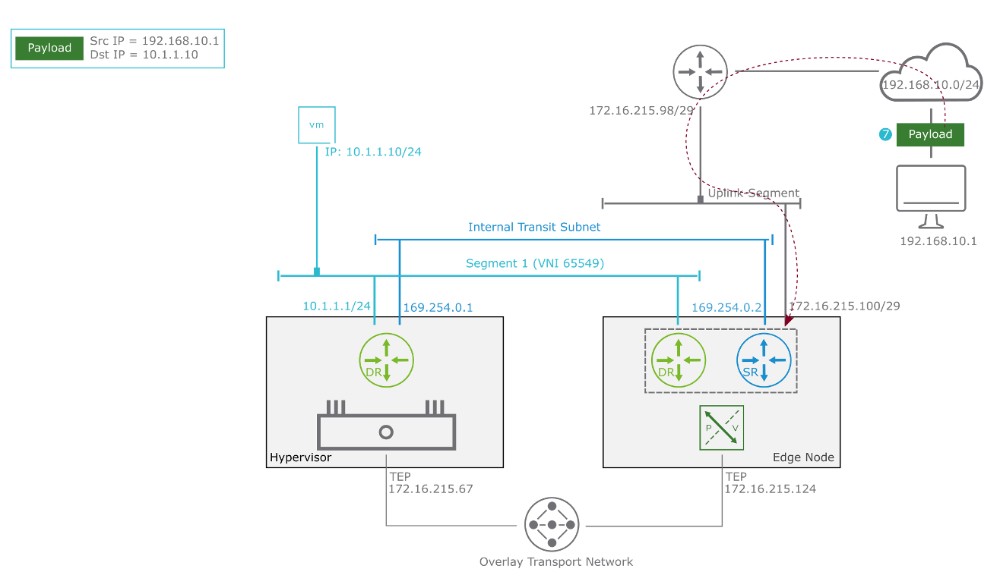

## **학습 목표 (Learner Objectives)**

​	1.	**단일 계층 라우팅(Single-Tier Routing)의 데이터 경로 설명**

​	2.	**다계층 라우팅(Multitier Routing)의 데이터 경로 설명**

------

------

## **Single-Tier Routing: Egress to Physical Network (1단계 – 물리 네트워크로 나가는 단일 계층 라우팅 흐름)**




------


**1. 패킷 전송 시작**

• **출발지 VM IP:** 10.1.1.10

• **목적지 VM IP:** 192.168.10.1 (외부 물리 네트워크에 존재)


------


**2. 첫 번째 홉 – 기본 게이트웨이로 전달**

• 패킷은 VM의 **기본 게이트웨이 10.1.1.1**로 전송됨

• 이 기본 게이트웨이는 **Tier-0 DR(Distributed Router)**

→ **VM이 위치한 하이퍼바이저** 내부에 위치


------


**3. 내부 트랜짓 서브넷(Internal Transit Subnet)**

• **T0 DR과 T0 SR(NSX Edge Node 내부)** 간 연결 역할

• 기본 값: **169.254.0.0/24**

→ 다르게 구성 가능

• 해당 흐름에서는 **169.254.0.1 → 169.254.0.2** 방향으로 전달됨


------


**4. T0 SR로 전송**

• 하이퍼바이저에서 NSX Edge Node 내부의 **T0 SR(Service Router)**로 패킷 전달

• T0 SR이 **북향(외부 물리 라우터)**으로 트래픽 전달을 담당


------


**5. 북향 트래픽 전송 준비**

• Edge Node는 **TEP(Overlay Transport Network)** 통해 하이퍼바이저로부터 패킷 수신

• 이후 Uplink-Segment 통해 **물리 라우터(예: 192.168.10.0/24)**로 트래픽 전달


------


**요약 흐름**

VM (10.1.1.10)

→ T0 DR (10.1.1.1)

→ T0 SR (169.254.0.2)

→ 물리 라우터 (192.168.10.0/24)


→ 외부 목적지 (192.168.10.1)


------

**핵심 포인트**

• DR은 **하이퍼바이저에서 분산 라우팅 수행**

• SR은 **Edge Node에서 서비스 라우팅 수행**

• **169.254.0.0/24**는 DR과 SR 간 기본 트랜짓 네트워크

• 경로 효율성과 성능을 위해 **Overlay TEP** 기반 통신이 병행됨

------

------

## **Single-Tier Routing: Egress to Physical Network (2단계 – 라우팅 테이블 기반 전송)**




------


**1. 출발지 → 기본 게이트웨이 도달 후 라우팅 테이블 확인**

• **VM 10.1.1.10**은 목적지 192.168.10.1로 패킷을 전송

• 패킷은 **T0 DR**(하이퍼바이저 내)로 전달됨

• **T0 DR은 라우팅 테이블 확인**:

```
0.0.0.0/0 → 169.254.0.2 (T0 SR로 기본 경로 설정)
```

→ **192.168.10.0/24**에 대한 **정확한 경로 없음**

→ 따라서 **기본 경로(Default Route)**를 사용


------


**2. 기본 경로로 전송**

• 패킷은 내부 트랜짓 세그먼트(Internal Transit Subnet)를 통해

→ **169.254.0.2 (T0 SR)** 로 전송됨


• **169.254.0.2**는 **Edge Node 내부 T0 SR의 인터페이스**


------


**3. 경로 정보 요약**

| **목적지 네트워크** | **게이트웨이** | **인터페이스 타입** |
| ------------------- | -------------- | ------------------- |
| 0.0.0.0/0           | 169.254.0.2    | UG (기본 경로)      |
| 10.1.1.0/24         | 0.0.0.0        | UCI (로컬)          |
| 172.16.x.x          | 169.254.0.2 등 | UGI (동적 경로)     |


------


**4. 결과**

• T0 DR은 **라우팅 테이블을 기반으로 기본 경로**를 통해

→ **T0 SR로 패킷을 전달**

• 이후 T0 SR은 **물리 라우터로 트래픽 전송 준비**


------


**핵심 정리**

• T0 DR은 하이퍼바이저에 위치하고, DR 간 경로 판단을 수행

• 목적지에 대한 명시적 경로가 없을 경우

→ **Default Gateway (T0 SR)로 트래픽 전송**

• DR → SR 간 전송은 **Internal Transit Subnet (예: 169.254.0.0/24)** 사용

------

------

## Single-Tier Routing: Egress to Physical Network (3)




------

------

## Single-Tier Routing: Egress to Physical Network (4)




------

------

## Single-Tier Routing: Egress to Physical Network (5)



------

------

## Single-Tier Routing: Egress to Physical Network (6)



------

------

## Single-Tier Routing: Ingress from Physical Network (7)



------

------

## Single-Tier Routing: Ingress from Physical Network (8)


------

------

## Single-Tier Routing: Ingress from Physical Network (9)

 Lesson 6 Logical Routing Packet Walk//image-20250325120158538.png)

**엣지 노드에서 하이퍼바이저로 패킷을 전송하기 위해, 패킷은 Geneve 헤더로 캡슐화된다.**

------

------

## Single-Tier Routing: Ingress from Physical Network (10)

 Lesson 6 Logical Routing Packet Walk//image-20250325120249316.png)

**캡슐화된 패킷은 오버레이 터널을 통해 전송된다.**

------

------

## Single-Tier Routing: Ingress from Physical Network (11)

 Lesson 6 Logical Routing Packet Walk//image-20250325120344411.png)

**수신 호스트는 패킷의 캡슐화를 해제하고, 이를 목적지인 VM 10.1.1.10으로 라우팅한다.**


------

------

### 기타

**transport node (esxi host) 라우팅 테이블 보는(확인) 순서**

1. esxi host 로 ssh 접속
2. nsxcli 입력
3. get logical-router 명령어로 라우터 정보 확인 (uuid 확인)
4. get logical-router <uuid> forwarding 


**transport node (edge) 에서 라우팅 테이블 확인 순서**

1. edge node 로 ssh 접속
2. get logical-router
3. vrf x
4. get route -> 라우팅 테이블을 볼 수 있다.

