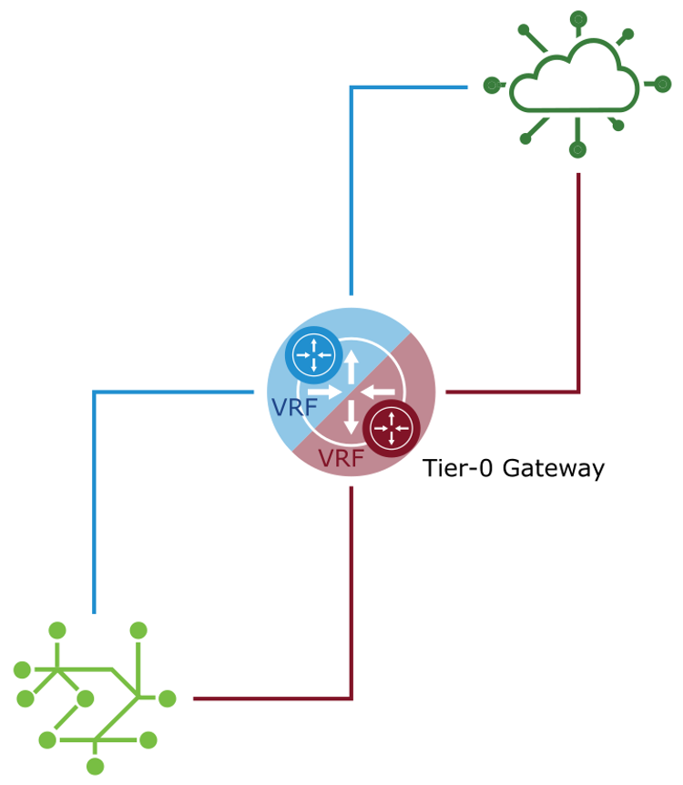
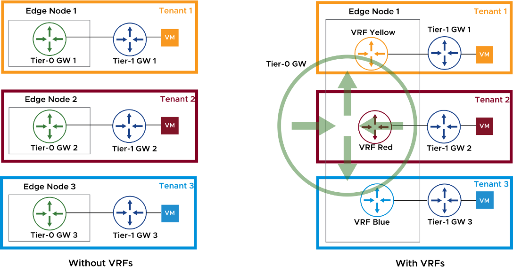
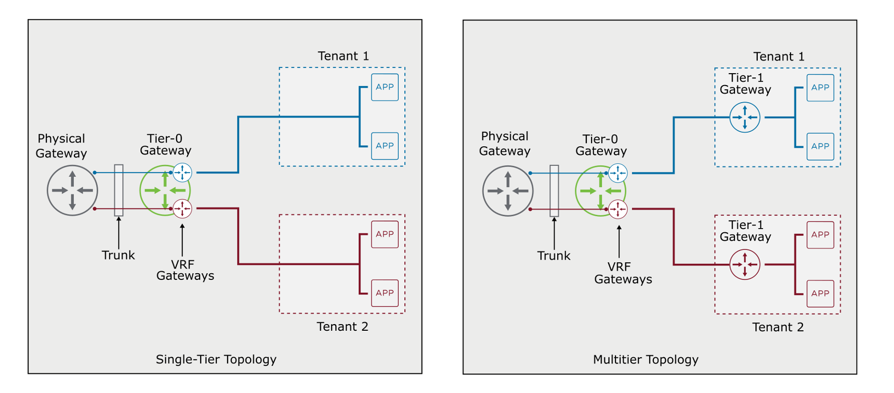
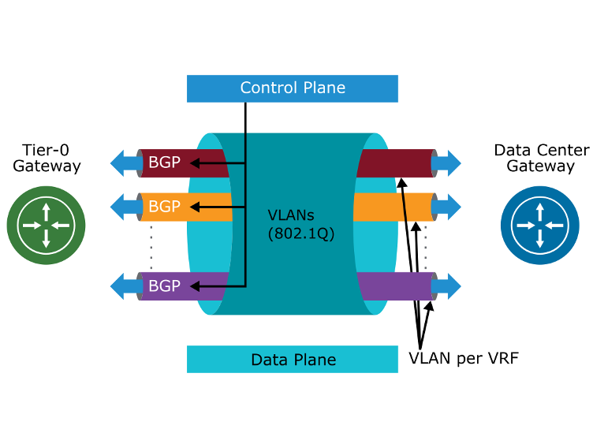

## VRF Lite 구조 설명

**1. 중앙에 있는 Tier-0 Gateway**

​	•	하나의 Tier-0 게이트웨이 내부에 **두 개 이상의 VRF 인스턴스**(여기서는 파란색과 빨간색)가 존재함.

​	•	각 VRF는 **독립적인 라우팅 테이블**을 가지고 있음.

**2. VRF 간 완전한 논리적 분리**

​	•	왼쪽 네트워크(예: Tenant A)와 오른쪽 네트워크(예: Tenant B)는 서로 독립적으로 라우팅됨.

​	•	파란색 선: 하나의 VRF 인스턴스에서 흐르는 트래픽

​	•	빨간색 선: 다른 VRF 인스턴스에서 흐르는 트래픽

**3. 클라우드 또는 외부 네트워크 연결**

​	•	각 VRF는 자체 외부 물리 라우터나 클라우드 환경과 직접 연결될 수 있음.

​	•	이 구조는 각 테넌트/어플리케이션이 **전용 네트워크 경로를 가짐**을 의미함.

------

**VRF Lite 요약 정리**

| **항목**                    | **설명**                                                     |
| --------------------------- | ------------------------------------------------------------ |
| **목적**                    | 하나의 Tier-0 Gateway에서 다중 테넌트 논리 라우팅 분리 제공  |
| **구성 방식**               | 별도의 Tier-0 Gateway 없이, 하나의 게이트웨이 내에 여러 VRF 인스턴스를 설정 |
| **MPLS / MP-BGP 필요 없음** | 전통적인 VRF(MPLS 기반)와 달리 VRF Lite는 이를 사용하지 않음 |
| **장점**                    | Edge Node 추가 없이 테넌트 분리 가능 → 리소스 절약 및 운영 단순화 |
| **지원 대상**               | 외부 물리 장비도 VRF Lite를 지원하면 연결 가능               |

------

------

해당 이미지는 **기존 구조(왼쪽)**와 **VRF Lite 기반 구조(오른쪽)**를 비교하면서 **VRF Lite의 실질적인 사용 사례와 장점**을 보여주는 도식입니다. 아래에 그림 해설과 함께 전체 개념을 요약 정리해 드리겠습니다.

------

## Use Cases for VRF Lite (**도식 설명: 기존 구조 vs VRF Lite 구조**)

**1. 왼쪽: 전통적인 멀티-Tier-0 구조**

​	•	**Tenant 1, 2, 3** 각각을 위해 **별도의 Tier-0 Gateway**와 **Edge Node**가 필요함.

​	•	즉, **테넌트 분리 = Tier-0 게이트웨이 + Edge Node 분리**.

​	•	각 Edge Node에는 하나의 Tier-0만 배치 가능하므로 **확장성에 제약**이 생김.

​	•	**리소스 낭비**: 각 테넌트를 위해 별도의 인프라 리소스가 필요함.

**2. 오른쪽: VRF Lite 기반 구조**

​	•	하나의 Edge Node에 **여러 개의 VRF 인스턴스**(예: Yellow, Red, Blue)를 구성함.

​	•	이들 VRF는 **Tier-0 Gateway 내부에서 논리적으로 완전히 분리됨**.

​	•	각 테넌트는 독립된 VRF 인스턴스를 사용하므로 네트워크 충돌 없음.

​	•	**하나의 Tier-0로 멀티 테넌트 처리 가능 → 리소스 절약 + 확장성 향상**.

------

**VRF Lite 사용 사례 (Use Cases)**

| **사용 사례**          | **설명**                                                     |
| ---------------------- | ------------------------------------------------------------ |
| **중복 주소 허용**     | 서로 다른 테넌트가 **같은 IP 주소 범위**를 사용 가능 (예: 192.168.1.0/24) |
| **멀티 테넌시 제공**   | VRF 인스턴스를 테넌트별로 구성해 **완전한 논리 분리** 제공   |
| **기존 물리망과 호환** | 기존의 **물리적 VRF 구성**과 연동 가능 (예: Cisco VRF와 통합) |
| **확장성 문제 해결**   | Bare-metal 기반의 Tier-0 하나 제한 문제를 회피 가능          |
| **마이그레이션 용이**  | 물리망에서 NSX로 점진적 전환이 용이함                        |

------

**VRF Lite vs 기존 구조 요약**

| **항목**     | **기존 구조 (왼쪽)** | **VRF Lite (오른쪽)**                 |
| ------------ | -------------------- | ------------------------------------- |
| Tier-0 수    | 테넌트당 1개 필요    | 하나의 Tier-0에 VRF로 분리            |
| Edge Node 수 | 테넌트당 1개 필요    | 1개 Edge Node로 멀티 테넌트 처리 가능 |
| 자원 효율    | 낮음                 | 매우 높음                             |
| 중복 IP 허용 | 불가능               | 가능 (VRF 분리로 충돌 없음)           |
| 확장성       | 제한적               | 뛰어남                                |

------

------

## **VRF Lite Topologies(가상 라우팅 라이트 토폴로지)**

**단일 티어 토폴로지 (Single-Tier Topology)**

​	•	VRF는 **Tier-0 게이트웨이에서만 구성 가능**

​	•	각 테넌트는 **Tier-0에 직접 연결**되어 있음

​	•	물리적 게이트웨이와 Tier-0 간의 연결은 **트렁크 링크**를 통해 이루어짐

​	•	트렁크 링크는 **여러 VRF 인스턴스를 태그 기반으로 분리**

​	•	vSphere 분산 포트 그룹 등의 **인프라가 트렁크를 지원해야 함**

​	•	이 구조는 간단하며 **빠른 연결 경로와 낮은 복잡도**가 장점

------

**다중 티어 토폴로지 (Multitier Topology)**

​	•	테넌트는 **Tier-1 게이트웨이를 통해 Tier-0의 VRF에 연결됨**

​	•	이 구조는 **서비스 분리와 보안 정책 적용이 용이함**

​	•	VRF는 여전히 Tier-0에서만 존재하며, Tier-1은 **각 테넌트에 독립적**

​	•	트래픽 흐름: **APP → Tier-1 GW → Tier-0 VRF → Physical GW**

​	•	복잡한 테넌트 환경 또는 보안/서비스 분리를 요구하는 시나리오에 적합

------

**공통 조건**

​	•	**VRF는 Tier-0 Gateway에만 구성 가능하다.**

​	•	**Trunk 인터페이스는 Physical Gateway ↔ Tier-0 VRF 간 통신을 위해 필요하다.**

​	•	**vSphere Distributed Switch 또는 물리 스위치에서 트렁크 구성을 지원해야 한다.**

------

------

**VRF Lite: Control and Data Planes(제어 플레인과 데이터 플레인)**

​	1.	**VLAN 태깅으로 트래픽 격리**

• 업링크 트렁크 세그먼트에서 802.1Q VLAN 태깅 사용

• 각 VRF는 고유 VLAN을 통해 데이터 트래픽을 구분

​	2.	**데이터 플레인 역할**

• VLAN은 데이터 트래픽이 흐르는 경로로 사용됨

• 한 VRF의 VLAN은 다른 VRF와 공유되지 않음

​	3.	**제어 플레인 구성**

• 각 VRF에는 독립적인 BGP 인스턴스가 존재

• MP-BGP 확장 없이도 라우팅 정보 교환 가능

​	4.	**BGP의 기능**

• 제어 플레인의 역할 수행

• 각 VRF에 대해 라우팅 정보를 동적으로 전파하고 업데이트함

------

### 기타

MPLS: multiprotocol label switching

eht | label | ip | L4 | data
