# NSX Distributed Firewall

------

**학습 목표(Learner Objectives)**

* NSX에서 사용되는 방화벽의 유형을 식별한다
*  분산 방화벽(Distributed Firewall)의 기능을 설명한다
* 방화벽 정책(Firewall Policies)을 생성한다
* 방화벽 규칙(Firewall Rules)을 구성한다
* 방화벽 규칙의 속성(그룹, 서비스, 프로필)을 구성한다
* 악성 IP 차단을 위해 분산 방화벽을 구성한다
* 분산 방화벽 구성을 저장, 롤백, 내보내기, 가져오기를 수행한다
* 분산 방화벽 아키텍처를 설명한다

------

**NSX Firewalls(NSX 방화벽 구성)**

![NSX 방화벽 아키텍처 구성도]

**그림 설명:**

이 그림은 NSX 환경에서 방화벽이 적용되는 구조를 나타낸다.

• 상단에는 외부 네트워크와 연결된 **Tier-0 Gateway**가 위치하고 있으며, 여기에는 **Gateway Firewall(게이트웨이 방화벽)**이 적용됨

• 하단에는 여러 개의 VM들이 연결된 **Tier-1 Gateway**가 존재하며, 각각의 VM에는 **Distributed Firewall(분산 방화벽)**이 개별적으로 적용되어 있음

• **Gateway Firewall**은 외부 네트워크(인터넷 포함)와의 **North-South 트래픽** 제어 역할

• **Distributed Firewall**은 동일 네트워크 내 워크로드 간 **East-West 트래픽** 제어 수행

------

1. **Distributed Firewall (분산 방화벽)**

   * **하이퍼바이저 커널에 내장된 상태 기반(stateful) 방화벽**

   * VM의 게스트 OS 외부에 존재

   * VM의 vNIC 입출력 경로(I/O Path)를 제어

   * 동일 네트워크 내에서 VM 간 트래픽(East-West)을 제어함

   * 모든 VM에 자동 적용되며, 확장성과 성능이 뛰어남

------

2. **Gateway Firewall (게이트웨이 방화벽)**
   * NSX 게이트웨이(Tier-0, Tier-1) uplink 및 서비스 인터페이스에 적용
   * **North-South 트래픽**을 제어하는 중앙 집중형 상태 기반 방화벽
   * NSX Edge Node에서 실행됨
   * 보안 경계(Perimeter), 테넌트 간 또는 존 간 방화벽으로 사용 가능

------

3. **핵심 요약**
   * **Distributed Firewall**: 각 VM에 적용, 내부(East-West) 통신 보호
   * **Gateway Firewall**: 게이트웨이에 적용, 외부와의 연결(North-South) 보호
   * 두 방화벽은 서로 보완적으로 동작하며, NSX는 전방위적인 보안 제어를 제공함

------

------

## **NSX Firewalls(NSX 방화벽)**

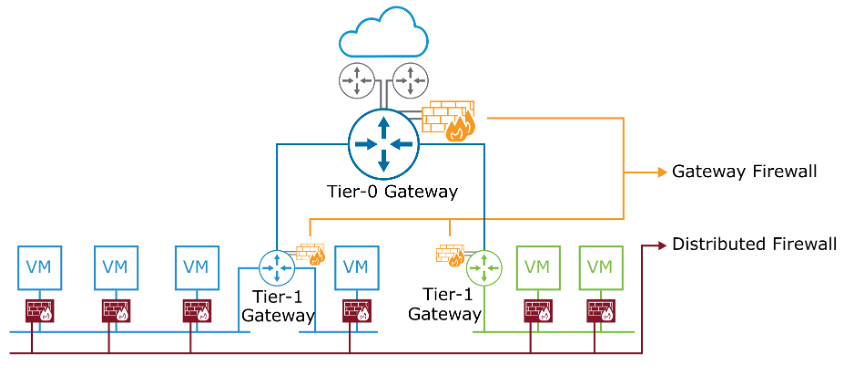

------

**1. 구성 요소 설명**

| **구성 요소**            | **설명**                                                     |
| ------------------------ | ------------------------------------------------------------ |
| **Distributed Firewall** | 하이퍼바이저 커널에 내장된 상태 기반(stateful) 방화벽. VM의 게스트 OS 외부에서 작동하며, vNIC 입출력 경로를 제어함 |
| **Gateway Firewall**     | North-South 트래픽 제어용 방화벽. NSX 게이트웨이와 물리 네트워크 간 통신을 제어하며, Tier-0 및 Tier-1 게이트웨이의 업링크 및 서비스 인터페이스에 적용됨 |
| **NSX Edge Node**        | Gateway Firewall이 작동하는 중앙 집중형 상태 기반 방화벽 서비스 위치 |

------

**2. 그림 설명**

해당 그림은 **NSX에서 제공하는 분산 방화벽(Distributed Firewall)**과 **게이트웨이 방화벽(Gateway Firewall)**의 구성과 트래픽 경로를 시각적으로 표현하고 있음.

• 그림 하단의 VM마다 빨간색 방화벽 아이콘이 연결되어 있으며, 이는 **분산 방화벽**이 각 VM 수준에서 개별적으로 작동함을 나타냄.

• 상단의 Tier-0 Gateway와 외부 네트워크 사이에는 **주황색 방화벽**과 선이 있으며, 이는 **Gateway Firewall**이 **North-South 트래픽을 제어**함을 의미함.

• Gateway Firewall은 **Tier-1 Gateway 상단**에서도 존재하며, 상위 물리 네트워크와의 통신도 제어함.

------

**3. 요약 정리**

• **Distributed Firewall**: VM 단위로 작동하며, **East-West 트래픽 제어**

• **Gateway Firewall**: Tier-0/Tier-1 Gateway 업링크에 적용되어 **North-South 트래픽 제어**

• **Edge Node**에서 게이트웨이 방화벽이 **중앙 집중 방식으로 동작**

• NSX는 두 방화벽을 함께 사용하여 **전체 트래픽 흐름을 세밀하게 제어**함

------

------

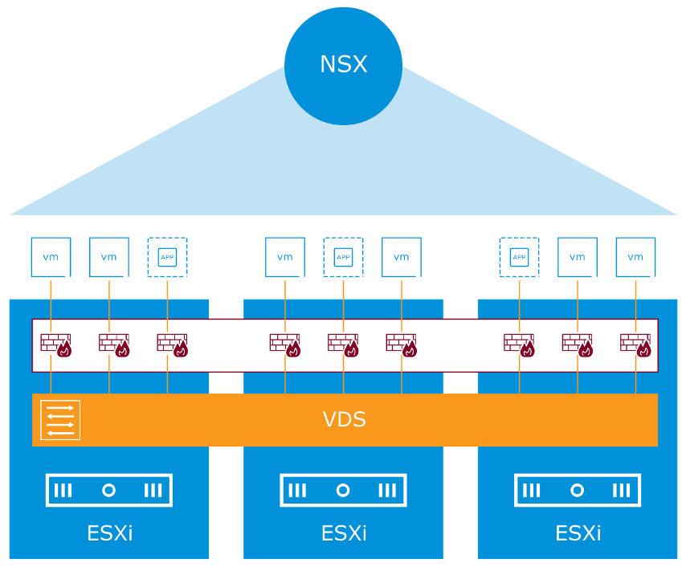

------

------

## **Distributed Firewall: Key Concepts (분산 방화벽 핵심 개념)**

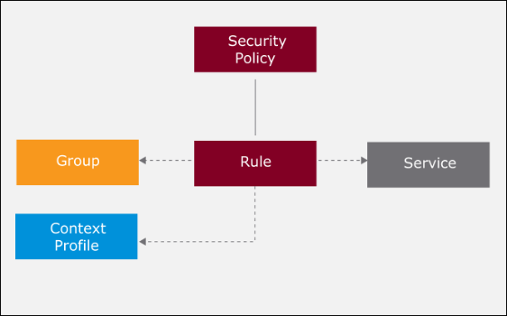

------

**1. Security Policy (보안 정책)**

• 방화벽 규칙과 서비스 설정을 모아놓은 정책 단위

• 하나의 정책 내에 여러 Rule 포함 가능

------

**2. Rule (방화벽 규칙)**

• 패킷을 허용하거나 차단할지 결정하는 기준

• Group, Context Profile, Service와 함께 동작

------

**3. Group (그룹)**

• 객체들을 정적으로 또는 동적으로 묶어 구성

• 방화벽 규칙의 대상(Source/Destination)으로 사용

------

**4. Service (서비스)**

• 포트와 프로토콜의 조합

• 규칙이 어떤 트래픽을 허용 또는 차단할지를 정의

------

**5. Context Profile (컨텍스트 프로파일)**

• 패킷의 L7(Application Layer) 내용을 검사

• 애플리케이션 기반의 허용/차단 정책 구성에 사용

------

**그림 설명**

해당 그림은 NSX 분산 방화벽 정책 구성 요소들의 관계를 보여줌.

Security Policy는 여러 Rule을 포함하고, 각각의 Rule은 Group, Context Profile, Service 구성 요소와 연결되어 있음.

Rule은 어떤 그룹(Group)의 트래픽에 대해 어떤 서비스(Service)를 허용 또는 차단할지를 결정하며, 필요 시 L7 검사(Context Profile)를 추가로 수행함.

------

------

## Overview of a Security Policy

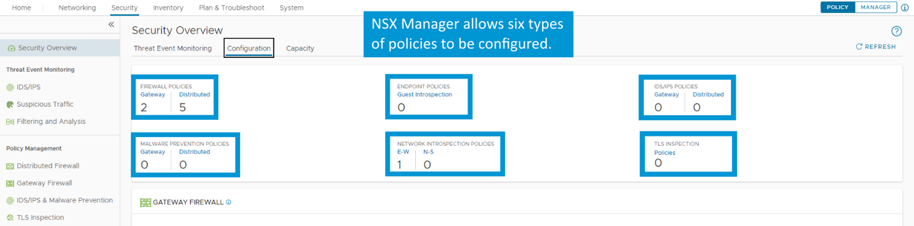

------

------

## **Distributed Firewall Policy Categories(분산 방화벽 정책 카테고리)**

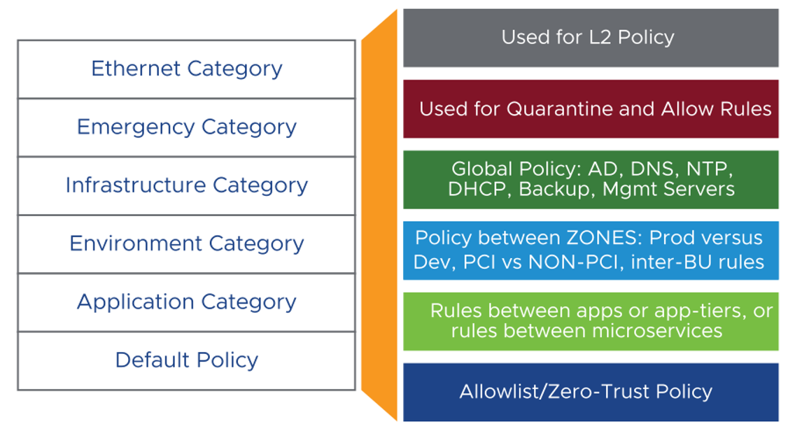

------

**1. 개요**

• 분산 방화벽 정책은 **East-West 트래픽**에 적용되는 방화벽 규칙의 집합이다.

• NSX UI를 통해 여러 **정책 카테고리**로 그룹화하여 관리할 수 있다.

• 방화벽 규칙은 **왼쪽에서 오른쪽, 위에서 아래 순서로** 적용된다.

------

**2. 카테고리별 설명**

| **카테고리**                | **설명**                                                     |
| --------------------------- | ------------------------------------------------------------ |
| **Ethernet Category**       | 레이어 2 정책에 사용됨. 항상 레이어 3 정책보다 먼저 평가됨   |
| **Emergency Category**      | 공격 차단 등 비상 상황에서 임시로 적용되는 격리 및 허용 정책에 사용됨 |
| **Infrastructure Category** | AD, DNS, NTP, DHCP, 백업, 관리 서버 등 인프라 관련 글로벌 정책에 사용됨 |
| **Environment Category**    | 개발/운영/테스트 등 서로 간 통신을 제한하는 영역 간 정책에 사용됨 |
| **Application Category**    | 애플리케이션 간, 애플리케이션 티어 간 또는 마이크로서비스 간의 상세한 정책 적용 |
| **Default Policy**          | Zero Trust 모델의 Allowlist 또는 기본 차단 정책으로 사용됨   |

------

**3. 정책 적용 방식**

• 각 카테고리 내에서는 규칙과 정책의 **재정렬 가능**

• 하지만 서로 **다른 카테고리 간에는 정책 이동 불가**

• **적절한 카테고리에 규칙을 구성**해야 정책 적용 우선순위와 흐름이 명확해짐

------

**4. 그림 설명**

해당 그림은 NSX에서 제공하는 **분산 방화벽 정책 카테고리의 계층 구조**를 보여줌.

• 왼쪽 박스는 정책 분류 기준을 나타내며, 오른쪽 박스는 **각 카테고리의 활용 목적**을 설명하고 있음

• 위에서 아래로 갈수록 일반화된 정책으로 구성되며, 세부 정책은 상위 카테고리에서 우선 적용됨

• 이 구조는 **정책 충돌 방지 및 우선순위 기반 보안 정책 운용**을 가능하게 함

------

**5. 요약 정리**

• NSX 분산 방화벽은 **정책 카테고리를 계층 구조로 구성**하여 우선순위 기반 정책 관리 가능

• 각 카테고리는 **용도에 맞는 트래픽 유형과 환경에 특화된 규칙**을 적용하도록 설계되어 있음

• **정책 정렬 및 구성은 동일 카테고리 내에서만 가능**하며, 잘못된 카테고리 배치는 정책 충돌을 유발할 수 있음

------

**1. 분산 방화벽 개요**

• 분산 방화벽 정책은 **East-West 트래픽**에 적용되는 방화벽 규칙의 집합이다.

• NSX UI를 통해 방화벽 정책을 **여러 개의 범주(Category)**로 그룹화할 수 있다.

• 규칙은 **좌에서 우, 위에서 아래** 순으로 평가된다.

• 각 범주 내에서는 규칙의 순서 변경이 가능하지만, **범주 간 이동은 불가능**하다.

------

**2. 방화벽 정책 범주별 설명**

| **범주(Category)**          | **설명**                                                     |
| --------------------------- | ------------------------------------------------------------ |
| **Ethernet Category**       | L2 정책 적용. 모든 L3 정책보다 먼저 평가됨.                  |
| **Emergency Category**      | 긴급 차단/허용 규칙. 예: 공격자 차단 등 긴급 상황 대응용.    |
| **Infrastructure Category** | AD, DNS, NTP, DHCP 등 인프라 구성요소 보호를 위한 글로벌 정책. |
| **Environment Category**    | 환경 간 정책. 예: Prod ↔ Dev, PCI ↔ Non-PCI, 부서 간 통신 제어. |
| **Application Category**    | 애플리케이션 간 또는 마이크로서비스 간 정책. 앱 계층 간 세부 제어. |
| **Default Policy**          | 기본 허용/차단 정책. Zero Trust 기반 Allowlist 역할 수행.    |

------

**3. 그림 설명**

해당 그림은 **NSX의 분산 방화벽 정책 범주**를 시각적으로 표현하고 있다.

왼쪽에는 정책 범주가 계층적으로 나열되어 있으며, 오른쪽에는 각 범주에 해당하는 적용 용도가 표시되어 있다.

* **Ethernet Category**는 **L2 정책**에 해당하며 가장 우선 순위로 평가된다.
* **Emergency Category**는 **격리나 빠른 차단이 필요한 긴급 규칙**에 사용된다.
* **Infrastructure Category**는 **DNS, AD, DHCP 등 핵심 인프라 서비스 보호**에 사용된다.
* **Environment Category**는 **운영환경 간 통신 제어 정책**을 포함한다.
* **Application Category**는 **앱 또는 마이크로서비스 간 통신 제어**를 위한 세부 정책이다.
* **Default Policy**는 **허용 기반 제로 트러스트 정책**으로 작동한다.

------

**4. 요약 정리**

• 정책은 **범주 내에서만 재정렬 가능**, **범주 간 이동 불가**

• **L2 → 긴급 → 인프라 → 환경 → 애플리케이션 → 기본 정책 순**으로 평가됨

• 각 범주는 **명확한 역할과 적용 범위**를 가진다.

------

------

## About Distributed Firewall Policies

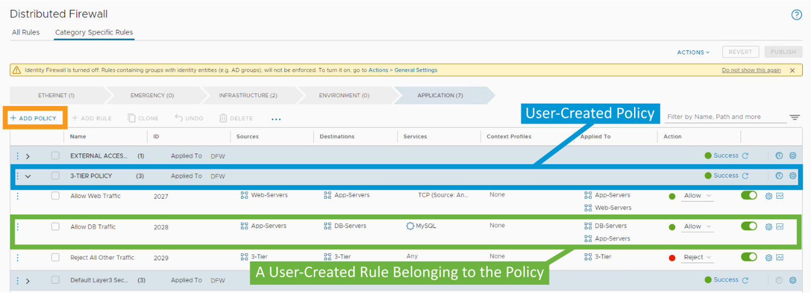

------

------

## **분산 방화벽 규칙 처리 방식 (Distributed Firewall Rule Processing within a Policy)**

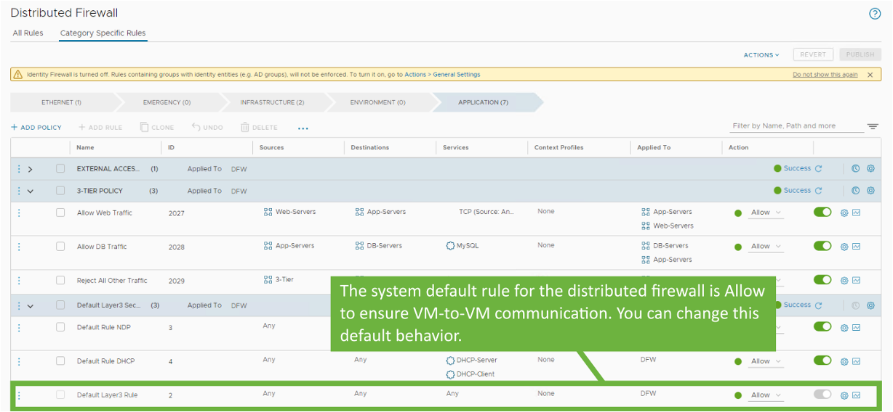

• 방화벽 규칙은 **위에서 아래로(top-to-bottom)** 순서대로 처리된다

• 사용자는 정책 내에서 규칙을 **상하로 이동**시켜 우선순위를 조정할 수 있다

• **처음으로 일치하는 규칙**이 적용되며, 해당 패킷에 대한 처리가 즉시 이루어진다

• 다른 어떤 규칙과도 일치하지 않는 패킷은 **기본 규칙(Default Rule)**에 의해 처리된다

Default Rule - Deny

------

**방화벽 규칙 적용 방식(Firewall Rule Enforcement)**

* 어떤 규칙과도 일치하지 않는 패킷은 **기본 규칙(Default Rule)**에 의해 처리된다
  * 기본 규칙의 초기 설정은 **Allow(허용)**로 설정되어 있음
  * 이는 스테이징 또는 마이그레이션 단계에서 **VM 간 통신이 중단되지 않도록 보장**함

* **제로 트러스트(Zero-Trust) 보안 모델을 구현하려면**,
  * 기본 규칙의 동작을 **Block(차단)**으로 변경하고
  * 허용할 트래픽을 명시적으로 정의하는 **방화벽 정책을 구성**해야 한다

------

------

## **정책의 Applied To 필드(Applied To Field for the Policy)**

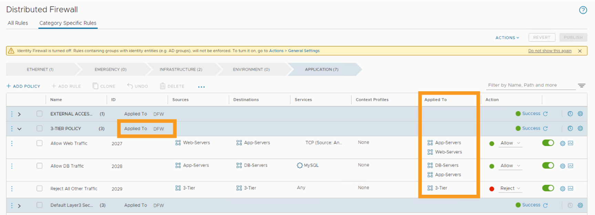

• 분산 방화벽(Distributed Firewall, DFW) 정책을 생성할 때, 해당 정책이 적용될 범위(Scope)를 지정할 수 있다

– 전체 DFW에 적용하거나, 특정 보안 그룹(Security Group)에만 적용할 수 있다

------

• **정책 수준에서 설정한 Applied To 값은, 해당 정책 내 규칙들에 설정된 Applied To 값을 덮어쓴다(override)**

• **Applied To 필드는 정책 수준 또는 규칙 수준 중 하나에만 설정해야 하며, 두 수준 모두에 설정해서는 안 된다**

• 보다 **세밀한 제어를 원할 경우**, **규칙 수준에서 Applied To 필드를 구성**하는 것이 바람직하다

------

------

**Configuring Distributed Firewall Policy Settings(분산 방화벽 정책 설정 구성)**

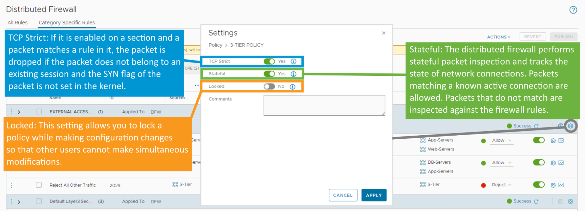

------

**1. 구성 항목 설명**

| **항목**       |                           **설명**                           |
| -------------- | :----------------------------------------------------------: |
| **TCP Strict** | 해당 옵션이 활성화된 정책 섹션에서, 패킷이 정책 규칙에 일치하더라도 기존 세션에 속하지 않거나 SYN 플래그가 설정되지 않은 경우 해당 패킷은 삭제됨. 커널 수준에서 SYN 플래그 유무 확인을 통해 새로운 연결만 허용함 |
| **Stateful**   | 분산 방화벽이 상태 기반 패킷 검사 수행. 활성화된 연결 세션에 일치하는 패킷만 허용하며, 일치하지 않으면 방화벽 규칙에 따라 검사 후 허용 여부 판단 |
| **Locked**     | 설정 중인 정책을 잠그는 기능. 동시 구성 변경 방지를 위해 다른 사용자가 동시에 수정하지 못하도록 제한함 |

------

**2. 그림 설명**

해당 그림은 **NSX 분산 방화벽(Distributed Firewall)의 정책 설정 항목**을 시각적으로 보여주고 있음.

• 우측 설정 창에서 각 항목별 스위치를 통해 **TCP Strict / Stateful / Locked** 항목을 개별적으로 활성화하거나 비활성화할 수 있음.

• TCP Strict는 **비정상 패킷 차단**, Stateful은 **연결 상태 기반 허용/차단**, Locked는 **정책 잠금 기능**을 수행함.

• 하단 정책 리스트에서 정책 별로 Allow/Reject 등의 동작이 구성되어 있고, 우측에서 설정 아이콘을 클릭해 위 설정 항목 조정 가능함.

------

**3. 요약 정리**

• **TCP Strict**: 비정상 신규 연결 차단

• **Stateful**: 활성 연결 상태 기반 패킷 검사

• **Locked**: 설정 동시 수정 방지용 잠금 기능

• 모든 항목은 **정책별로 개별 적용 가능**하며, **방화벽의 세부 동작을 정밀하게 제어**할 수 있음

------

------

**시간 기반 방화벽 정책 구성(Configuring Time-Based Firewall Policies)**

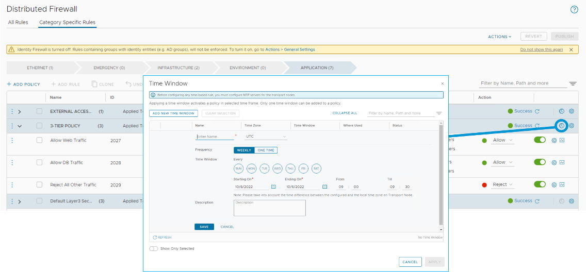

------

• **특정 기간 동안만 유효한 보안 정책**을 구성할 수 있다

• **Time Window**에서 다음과 같은 매개변수를 지정할 수 있다:

​	•	**Name**: 시간 정책의 이름

​	•	**Time zone**: UTC 또는 전송 노드의 로컬 시간대

​	•	**Frequency**: 주간 반복(weekly) 또는 1회성(one time)

​	•	**Recurring days**: 반복할 요일

​	•	**Start and end date**: 시작일과 종료일

​	•	**Start and end time**: 시작 시각과 종료 시각

------

• **From 및 Till 파라미터는 30분 단위로만 설정 가능**

​	•	예: 09:00부터 09:30까지 → 유효

​	•	예: 09:15부터 09:45까지 → **UI에서 구성 오류 발생**

• 시간 기반 규칙을 구성하기 전에, **전송 노드(Transport Nodes)에 대해 NTP 서버가 구성되어 있어야 한다**

------

------

## **분산 방화벽 규칙 생성(Creating Distributed Firewall Rules)**

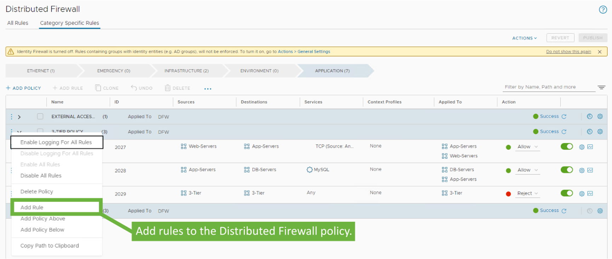

• **규칙(Rules)**은 트래픽 흐름을 평가하기 위한 **일련의 조건(criteria)**으로 구성된다

• 각 규칙은 **패킷을 허용(Allow), 삭제(Drop), 또는 거부(Reject)**할지 결정하는 **명령어 집합**을 포함한다

------

------

## Configuring Distributed Firewall Rule Parameters

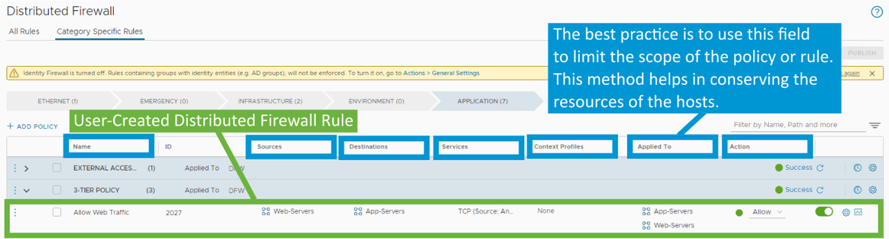

------

------

## Specifying Sources and Destinations for a Rule

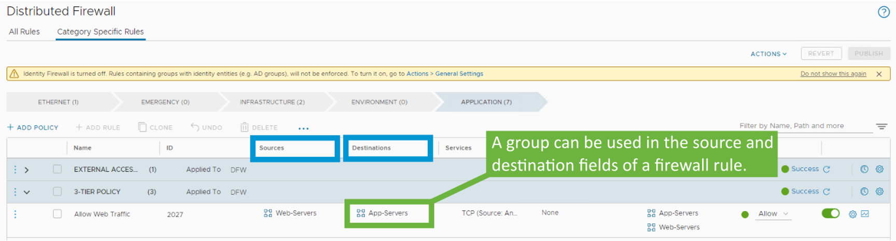

------

------

## Creating Groups

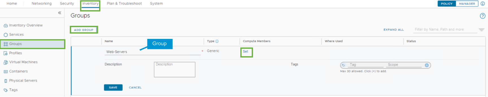

**그룹(Group)의 정의 및 사용(A Group defines a collection of assets…)**

• **그룹(Group)**은 **보안 정책 및 규칙을 적용할 수 있는 자산들의 집합**을 정의한다

------

------

## **그룹의 멤버 및 멤버 조건 추가(Adding Members and Member Criteria for a Group)**

 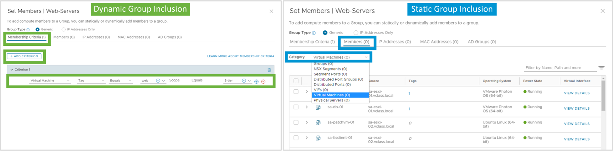

• 그룹은 **정적(Static)** 또는 **동적(Dynamic)** 멤버 기준을 사용하여 정의할 수 있다

------

------

## Creating Groups Based on Tags(태그 기반 그룹 생성)

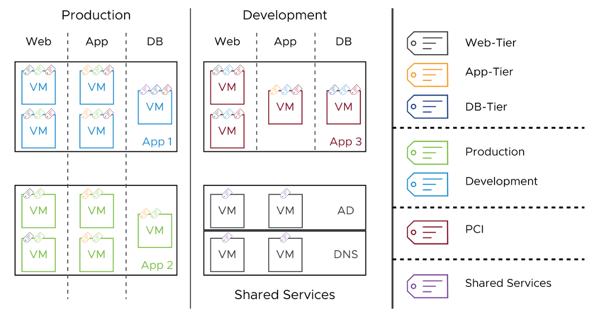

태그는 일반적으로 새로 프로비저닝되는 애플리케이션에 대한 보안 정책 적용을 자동화하기 위해 사용된다.

보안 관리자는 특정 기준에 따라 워크로드에 하나 이상의 태그를 할당할 수 있다.

이러한 태그는 이후 방화벽 규칙에서 사용할 동적 보안 그룹을 생성하는 데 사용될 수 있다.

------

------

## Specifying Services for a Rule(규칙에 서비스 지정하기)

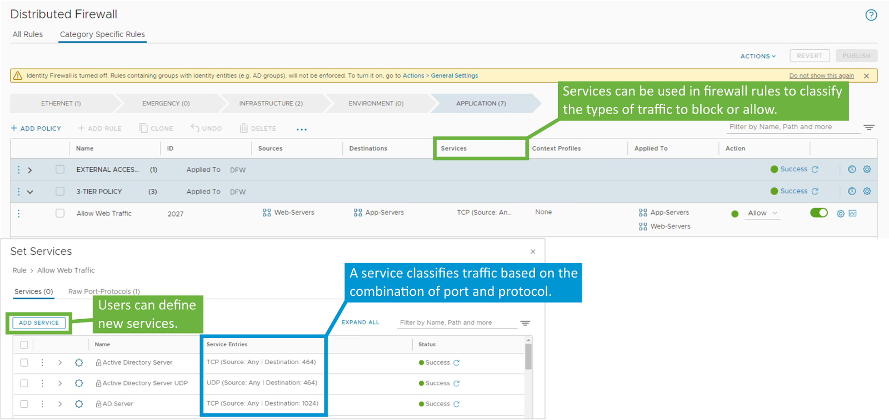

분산 방화벽 규칙을 구성할 때 하나 이상의 서비스를 지정할 수 있다.

서비스는 네트워크 트래픽을 위한 포트 및 프로토콜 정의를 포함한다.

NSX에는 광범위한 사전 정의된 서비스 목록이 포함되어 있으며, 이들 서비스는 수정하거나 삭제할 수 없다. 그러나 통신 요구 사항을 충족하기 위해 추가 서비스를 생성할 수 있다.

서비스는 분산 방화벽 규칙을 구성하는 도중에 생성할 수 있으며, 또는 Inventory > Services > ADD SERVICE 경로를 통해 별도로 생성할 수도 있다.

------

------

## **규칙에 컨텍스트 프로필 추가하기(Adding a Context Profile to a Rule)**

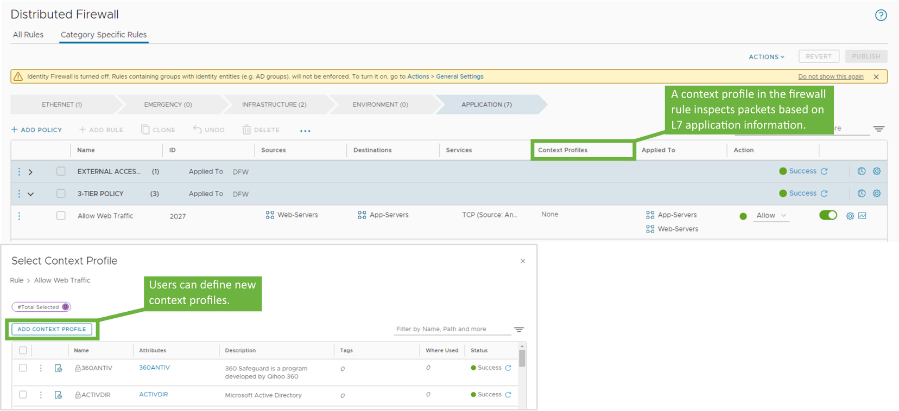

------

• 분산 방화벽 규칙에 **컨텍스트 프로필(Context Profile)**을 적용하여 **L7(애플리케이션 계층) 방화벽**을 활성화할 수 있다

• NSX Manager에는 사전 정의된 컨텍스트 프로필이 포함되어 있으며,

사용자 정의 컨텍스트 프로필을 직접 생성하여 방화벽 규칙에 사용할 수도 있다

• **L7 기반 방화벽 규칙은 상태 저장(Stateful) 방화벽 정책에서만 정의 가능하다**

• 사용자 정의 컨텍스트 프로필을 생성하려면 다음 경로로 이동한다:

**Inventory > Profiles > Profiles > Context Profiles > ADD CONTEXT PROFILE**

------

------

## **규칙 적용 범위 설정(Setting the Scope of Rule Enforcement)**

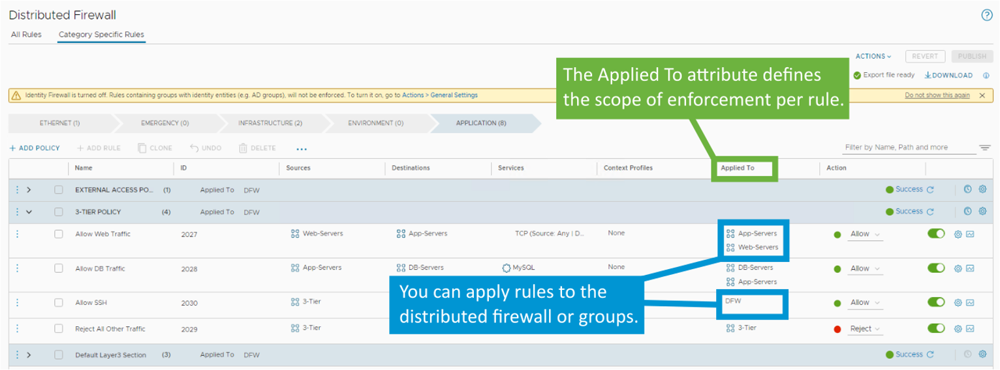

• **Applied To 속성**은 ESXi 호스트에서의 **리소스 사용 최적화**에 기여하며,

특정 영역(zone) 또는 테넌트(tenant)에 **대상 지정된 정책을 정의**할 수 있도록 도와준다.

이는 다른 영역 또는 테넌트에 정의된 정책에 영향을 주지 않는다.

• **Applied To 필드를 적절히 사용하는 것은 전송 노드의 리소스 최적화와 확장성 문제 방지에 매우 중요하다.**

​	•	분산 방화벽 규칙에서 **출발지와 목적지에 사용된 보안 그룹과 일치하도록** Applied To 필드를 구성해야 한다.

• **Zone**은 조직 내 **부서**에 비유할 수 있고,

**Tenant**는 서비스 공급자가 관리하는 **서로 다른 조직**에 비유할 수 있다.

• NSX UI에서는 **Zone 또는 Tenant를 나타내는 그룹**을 생성하여 정책 적용 범위를 관리할 수 있다.

------

------

## **규칙에 대한 동작 지정(Specifying the Action for a Rule)**

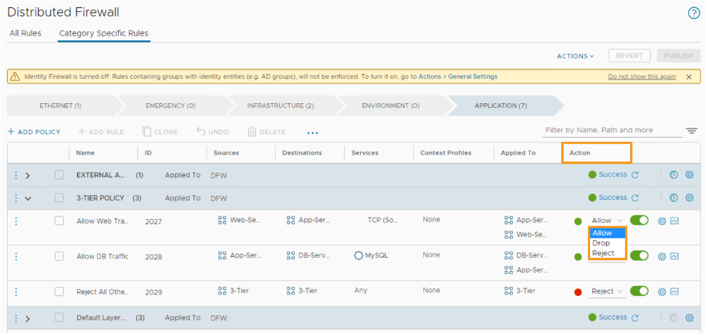

분산 방화벽 규칙에서는 다음과 같은 동작(Action)을 구성할 수 있다:

• **Allow**:

 지정된 출발지, 목적지, 프로토콜을 사용하는 모든 트래픽을 **허용**한다.

• **Drop**:

 지정된 출발지, 목적지, 프로토콜을 사용하는 패킷을 **삭제(Drop)**한다.

 패킷 삭제는 **무응답(Silent)** 처리 방식이며, 송신자나 수신자에게 **알림이 전송되지 않는다**.

• **Reject**:

 지정된 출발지, 목적지, 프로토콜을 사용하는 패킷을 **거부(Reject)**한다.

 Reject는 Drop보다 **우아한(Graceful)** 거부 방식으로,

 송신자에게 **도달 불가 메시지(Destination Unreachable)**를 전송한다.

------

------

## **분산 방화벽 규칙 설정(Distributed Firewall Rule Settings)**

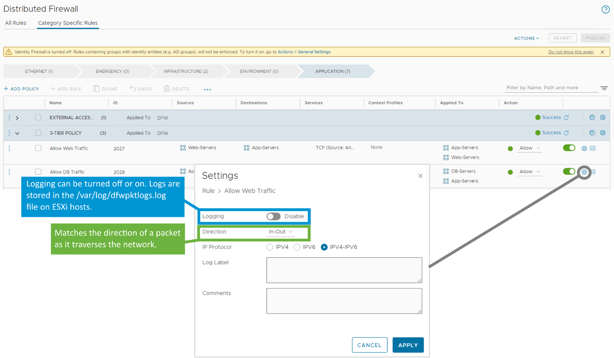

분산 방화벽 규칙에서는 다음과 같은 설정을 구성할 수 있다:

------

• **Logging**:

 로그 기록 기능을 **활성화 또는 비활성화**할 수 있다.

 로그는 **ESXi 호스트의 /var/log/dfwpktlogs.log 파일**에 저장된다.

------

• **Direction (방향)**:

 트래픽의 방향을 **대상 객체의 관점에서** 일치시킨다.

 - **In**: VM으로 **들어오는 트래픽만 검사**

 - **Out**: VM에서 **나가는 트래픽만 검사**

 - **In-Out**: **양방향 트래픽을 모두 검사**

------

• **IP Protocol**:

 다음 세 가지 프로토콜 유형을 지원한다:

 **IPv4**, **IPv6**, **IPv4-IPv6(혼합)**

• **Log Label (로그 라벨)**:

 로그 분석 시 특정 규칙을 **식별하기 위한 태그**로 사용할 수 있다.
