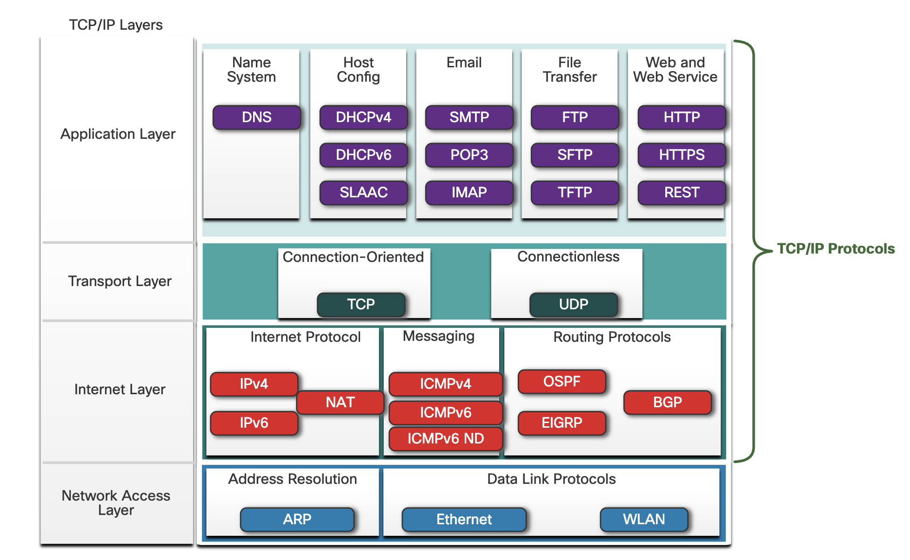
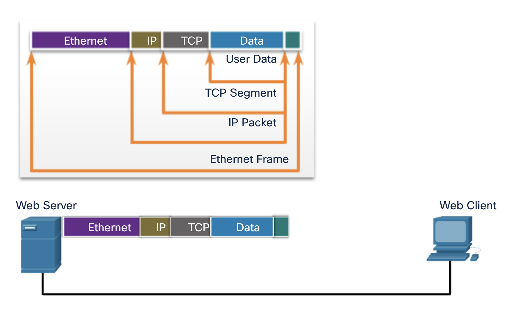

# TCP Protocol

------

## **TCP/IP Protocol Example(TCP/IP 프로토콜 예시)**

------

**1. Application Layer – HTTP (Hypertext Transfer Protocol)**

• 클라이언트(웹 브라우저)와 서버 간 상호작용을 담당함

• 웹 페이지 요청 및 응답의 형식과 내용을 정의함

• 사용자는 HTTP를 통해 웹 서버로 요청을 전송함

------

**2. Transport Layer – TCP (Transmission Control Protocol)**

• HTTP 데이터를 신뢰성 있게 전달하기 위해 사용됨

• 세션 생성, 데이터 세그먼트화, 오류 복구 및 흐름 제어 수행함

• 각 세그먼트는 번호가 지정되고 순서대로 재조립됨

------

**3. Internet Layer – IP (Internet Protocol)**

• 송수신자 간 데이터 패킷 전송 경로를 결정함

• 라우터를 통해 다중 네트워크를 경유하며 최종 목적지로 전달됨

• IP 주소를 기반으로 패킷을 전달함

------

**4. Network Access Layer – Ethernet (또는 WLAN, 셀룰러)**

• IP 패킷을 실제 물리적 네트워크를 통해 전송함

• 이 계층은 TCP/IP 프로토콜 스택에는 속하지 않지만, IP 전달을 위한 물리적 매체를 담당함

• 이더넷 외에도 무선 LAN(WLAN), 셀룰러 네트워크도 사용 가능함

------

**그림 설명**

해당 그림은 **웹 브라우저에서 웹 서버로 HTTP 요청을 전송**하는 예제를 보여주며, **TCP/IP 프로토콜 스택의 네 가지 계층**을 시각적으로 설명함.

• HTTP는 애플리케이션 계층에서 작동하며 사용자 요청을 구성함

• TCP는 신뢰성 있는 전송을 위해 데이터를 세그먼트화함

• IP는 라우팅을 통해 목적지로 전달함

• Ethernet은 실제 네트워크를 통해 데이터를 전달함

이러한 구조는 계층별로 기능이 분리되어 있어 유연한 설계와 구현이 가능함.

------

------

## **TCP/IP Protocol Suite Overview(TCP/IP 프로토콜 모음 개요)**

------

TCP/IP 프로토콜 모음(TCP/IP Protocol Suite)은 오늘날 인터넷과 대부분의 네트워크 환경에서 사용되는 표준 통신 프로토콜 집합이다. 이 프로토콜 스택은 새로운 서비스에 맞춰 지속적으로 확장되고 있으며, 다음 두 가지 중요한 특성을 가진다.

• **오픈 표준(Open Standard)**

누구나 무료로 사용 가능하며, 어떤 벤더든 자신의 하드웨어 또는 소프트웨어에 자유롭게 구현할 수 있다.

• **표준 기반(Standards-Based)**

네트워킹 업계의 승인을 받고 표준화 기관에 의해 공식 승인된 프로토콜이므로, 다양한 제조업체 간의 상호운용성을 보장한다.

------

**TCP/IP 4계층별 주요 프로토콜**

| **Layer**                | **Protocol Categories** | **Example Protocols**     |
| ------------------------ | ----------------------- | ------------------------- |
| **Application Layer**    | Name System             | DNS                       |
|                          | Host Configuration      | DHCPv4, DHCPv6, SLAAC     |
|                          | Email                   | SMTP, POP3, IMAP          |
|                          | File Transfer           | FTP, SFTP, TFTP           |
|                          | Web & Web Services      | HTTP, HTTPS, REST         |
| **Transport Layer**      | Connection-Oriented     | TCP                       |
|                          | Connectionless          | UDP                       |
| **Internet Layer**       | Internet Protocol       | IPv4, IPv6, NAT           |
|                          | Messaging               | ICMPv4, ICMPv6, ICMPv6 ND |
|                          | Routing Protocols       | OSPF, EIGRP, BGP          |
| **Network Access Layer** | Address Resolution      | ARP                       |
|                          | Data Link Protocols     | Ethernet, WLAN            |

------

**그림 설명**

해당 그림은 TCP/IP 4계층 구조에 따라 대표적인 프로토콜들을 분류하여 시각적으로 나타낸 것이다.

• **Application Layer**에는 웹, 이메일, 파일 전송, 이름 해석 등 사용자 인터페이스와 직접 연결되는 다양한 응용 프로토콜들이 위치해 있다.

• **Transport Layer**는 연결 지향 방식(TCP)과 비연결 지향 방식(UDP)을 통해 데이터 전송의 신뢰성 여부를 조절한다.

• **Internet Layer**는 IP 주소 기반 패킷 전달, 라우팅, 메시징 기능을 수행한다.

• **Network Access Layer**는 실제 물리적 전송을 담당하며, ARP 및 Ethernet, WLAN 등이 포함된다.

각 프로토콜은 기능별로 계층에 맞춰 배치되어 있으며, 상호 협력하여 인터넷 통신이 이루어진다.

------

------

## **TCP/IP Communication Process(TCP/IP 통신 과정)**

------

**1. 개요 설명**

해당 그림은 **Web Server**에서 **Web Client**로 데이터를 전송할 때, **TCP/IP 프로토콜 스택의 계층별 캡슐화 과정**과 전송 경로를 시각적으로 표현하고 있다.

데이터가 사용자 애플리케이션에서 생성되어 하위 계층으로 내려가면서 각 계층에서 헤더가 추가되고, 반대쪽에서는 계층을 따라 올라가면서 다시 헤더가 제거되는 **역캡슐화(Decapsulation)** 과정이 수행된다.

------

**2. 계층별 데이터 처리 과정 (캡슐화 순서)**

**• Application Layer**

​	•	**User Data**: 사용자가 생성한 실제 콘텐츠 (예: HTTP 웹 요청 데이터)

​	•	이 데이터는 **전송 계층**으로 전달된다.

------

**• Transport Layer**

​	•	**TCP Segment**: TCP는 사용자 데이터를 **세그먼트(Segment)** 단위로 분할하고, 각 세그먼트에 TCP 헤더를 추가함

​	•	TCP 헤더에는 **포트 번호, 순서 번호, 확인 응답 번호, 플래그, 체크섬** 등이 포함됨

​	•	이 TCP 세그먼트는 IP 계층으로 전달됨

------

**• Internet Layer**

​	•	**IP Packet**: IP 계층은 TCP 세그먼트에 **IP 헤더**를 추가하여 **패킷(Packet)**을 생성함

​	•	IP 헤더에는 **출발지/목적지 IP 주소, TTL(Time To Live), 프로토콜 번호** 등이 포함됨

​	•	이 패킷은 네트워크 계층으로 전달됨

------

**• Network Access Layer**

​	•	**Ethernet Frame**: IP 패킷은 데이터 링크 계층에서 **Ethernet 헤더 및 트레일러**가 추가되어 프레임(Frame)으로 감싸짐

​	•	Ethernet 헤더에는 **출발지/목적지 MAC 주소, EtherType** 등이 포함됨

​	•	최종적으로 프레임은 물리 매체(케이블, 무선 등)를 통해 전송됨

------

**3. 반대편 수신 과정 (역캡슐화)**

Web Client에서는 Ethernet → IP → TCP → Application 순서로 **역캡슐화**가 수행되어 최종적으로 사용자 데이터가 애플리케이션에 도달한다.

------

**4. 헤더 구조 요약 표**

| **계층**          | **데이터 단위** | **헤더 주요 필드 예시**                  |
| ----------------- | --------------- | ---------------------------------------- |
| Application Layer | Data            | (HTTP 등 애플리케이션 데이터 자체)       |
| Transport Layer   | TCP Segment     | Source Port, Destination Port, Seq Num   |
| Internet Layer    | IP Packet       | Source IP, Destination IP, TTL, Protocol |
| Network Layer     | Ethernet Frame  | Source MAC, Destination MAC, EtherType   |

------

**5. 그림 설명 요약**

​	•	상단 확대 그림은 **헤더가 계층별로 어떻게 추가되는지**를 보여줌

​	•	Web Server에서 전송된 프레임이 Web Client까지 도달하여 다시 분해(역캡슐화)되는 과정을 하단에 표현함

​	•	각 단계의 화살표는 **캡슐화와 역캡슐화 경로**를 나타냄

------

**결론 요약**

TCP/IP 통신은 계층별로 **캡슐화(Encapsulation)**와 **역캡슐화(Decapsulation)**를 거쳐 데이터를 정확히 전송하고 수신하는 구조로 이루어지며, **각 계층의 헤더는 데이터 처리의 핵심 역할**을 수행한다.