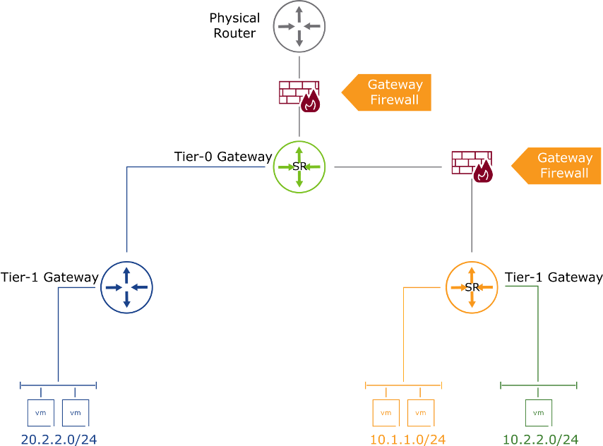
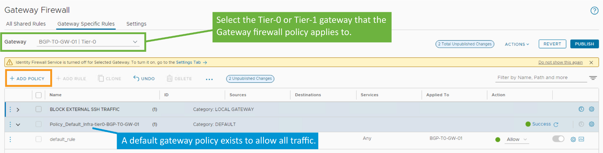
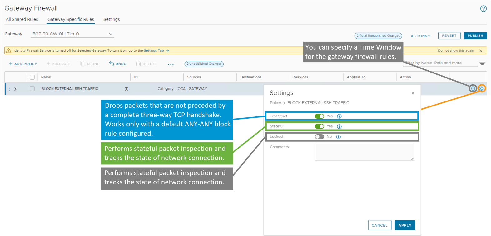
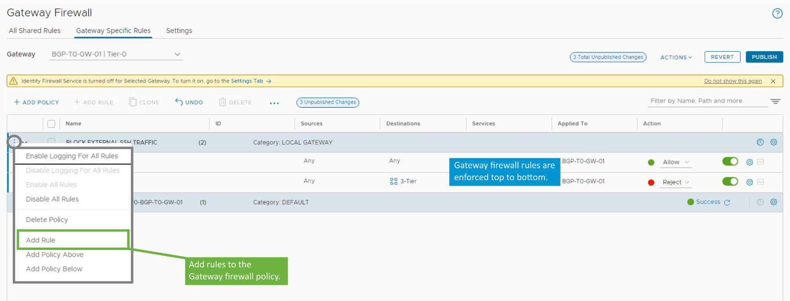
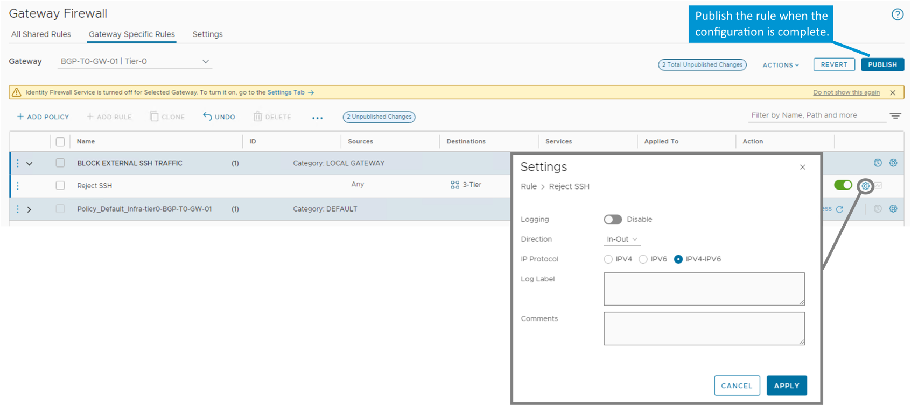
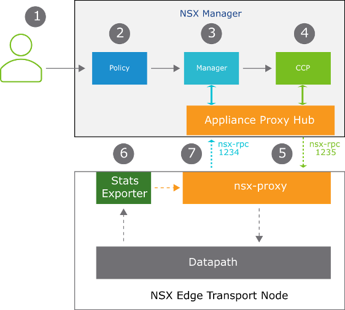
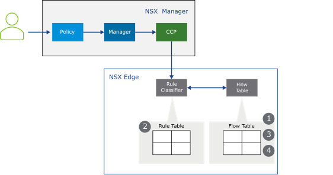

## **About the Gateway Firewall(게이트웨이 방화벽 개요)**

------

**1. 개요**

• NSX 게이트웨이 방화벽은 **North-South 트래픽**을 제어하는 **중앙 집중형 방화벽**이다.

• **분산 방화벽과는 별도로 독립적으로 동작**하며, NSX UI 또는 REST API를 통해 설정할 수 있다.

• **Tier-0 및 Tier-1 게이트웨이의 SR(Service Router) 구성 요소**에 구현되어 동작한다.

------

**2. 주요 특징**

• **상태 기반(stateful) 및 비상태(stateless) 방화벽 규칙**을 모두 지원함

• **게이트웨이의 Northbound 인터페이스(업링크)**에서 트래픽을 검사하고 제어함

• 방화벽 규칙은 **정책 기반 구성**으로, 태그 및 그룹을 활용하여 정책을 정의할 수 있음

• **물리적 경계 방화벽과 병행 사용 가능**, 또는 **논리적 경계 보안 역할**을 수행 가능

------

**3. 구성 조건**

• 게이트웨이 방화벽은 **Tier-0 및 Tier-1 Gateway의 SR(Service Router)**에 구현됨

• SR 구성 요소는 NAT, Gateway Firewall 등의 중앙 집중 서비스 제공

• **NSX Edge Node**에 의해 구동되며, VM 또는 Bare-Metal 형태 모두 지원됨

------

**4. NSX 4.0.1 기능 확장**

• **Tier-0 게이트웨이 방화벽은 상태 기반 필터링(stateful filtering)을 지원**

• 고가용성 모드: **Active-Active**, **Active-Standby** 둘 다 지원됨

------

**5. 활용 사례**

• **PCI 준수 존 구축 시 경계 보안 정책 적용**

• **멀티 테넌트 환경** 또는 **DevOps 기반 격리 환경**에 유용함

• **트래픽이 물리 네트워크로 나가지 않고 NSX 내부에서 격리 처리** 가능

------

**그림 설명**

해당 그림은 게이트웨이 방화벽이 위치한 위치와 트래픽 흐름을 시각적으로 표현한 구조이다.

중앙의 Tier-0 게이트웨이는 상단 물리 라우터와 Tier-1 게이트웨이들 사이를 연결하며, 각 Tier-1 게이트웨이에는 내부 VM들이 연결되어 있다.

**Northbound 트래픽이 통과하는 업링크 지점에 게이트웨이 방화벽이 배치되어 있으며**, 외부 및 상호 테넌트 간 트래픽에 대한 제어를 수행한다.

게이트웨이 방화벽은 **분산 방화벽과는 달리 VM 가까이 존재하지 않고, 네트워크 경계에 존재하는 방화벽임**을 강조하고 있다.

------

------

## Gateway Firewall Policy

• 게이트웨이 방화벽 정책은 **하나 이상의 개별 방화벽 규칙**을 포함하며,

 **북-남(North-South) 트래픽**에 적용된다.

• 게이트웨이 방화벽 정책은 **Tier-0 및 Tier-1 게이트웨이 및 그 인터페이스**에 적용할 수 있다.

------

------

## Configuring Gateway Firewall Policy Settings

------

------

## Configuring Gateway Firewall Rules

정책 내에서 하나 이상의 규칙을 생성하여 트래픽을 **허용(Allow)**, **삭제(Drop)** 또는 **거부(Reject)**할 수 있다.

------

------

## Configuring Gateway Firewall Rules Settings

게이트웨이 방화벽 규칙에서는 **로깅(Logging)**, **방향(Direction)**, **IP 프로토콜(IP Protocol)**을 지정할 수 있다.

방화벽 규칙은 **퍼블리시(Publish)**되어야 적용된다.

• 규칙 로그는 **엣지 노드(Edge Node)**의 **Syslog 파일**에 기록된다.

• CLI에서 로그에 접근하려면 다음 명령어를 사용한다:

 get log-file syslog

------

**방향(Direction)** 설정 옵션:

• **In**: 게이트웨이 인터페이스로 **들어오는 트래픽**만 검사

• **Out**: 게이트웨이 인터페이스에서 **나가는 트래픽**만 검사

• **In-Out**: **양방향 트래픽을 모두 검사**

------

------

## **Gateway Firewall Architecture(게이트웨이 방화벽 아키텍처)**

------

**1. 전체 워크플로 개요**

• 사용자가 **NSX UI 또는 API를 통해 게이트웨이 방화벽 정책을 구성**한다.

• 구성된 정책은 **Policy Role**에서 처리된다.

• 처리된 정책은 **Manager Role**로 전달되며, 유효성 검사 후 **Central Control Plane(CCP)**에 전달된다.

• **CCP는 APH(Appliance Proxy Hub)를 통해 해당 방화벽 구성을 Edge Node로 배포**한다.

• **Edge Node의 nsx-proxy**가 방화벽 구성을 수신하고, **데이터 경로(Datapath)**에 적용한다.

• **Stats Exporter**는 데이터 경로에서 흐름 기록(Flow Record)을 수집하여 **방화벽 규칙 통계를 생성**한다.

• **nsx-proxy는 수집된 통계와 상태 정보를 관리 플레인으로 보고**한다.

------

**2. 주요 구성 요소 설명**

| **구성 요소**                 | **설명**                                                  |
| ----------------------------- | --------------------------------------------------------- |
| **Policy Role**               | 사용자로부터 받은 정책을 처리하는 역할                    |
| **Manager Role**              | 정책의 유효성을 검사하고 CCP로 전달                       |
| **CCP**                       | 방화벽 구성을 APH를 통해 Edge 노드로 배포                 |
| **Appliance Proxy Hub (APH)** | CCP와 nsx-proxy 간 정책 전송 허브 역할                    |
| **nsx-proxy**                 | 구성 수신 후 데이터 경로에 방화벽 적용, 통계 및 상태 보고 |
| **Datapath**                  | 실제 방화벽 규칙이 적용되는 트래픽 처리 경로              |
| **Stats Exporter**            | 흐름 데이터를 수집하여 규칙 통계 생성 및 전달             |

------

**3. 그림 설명**

해당 그림은 NSX Gateway Firewall의 정책 흐름 및 구성 요소 간 상호 작용을 시각적으로 나타낸 아키텍처이다.

• 사용자는 UI 또는 REST API를 통해 정책을 정의한다.

• 정의된 정책은 순차적으로 Policy → Manager → CCP를 거쳐 Appliance Proxy Hub를 통해 Edge 노드로 전달된다.

• nsx-proxy는 CCP로부터 받은 구성을 기반으로 데이터 경로(Datapath)에 방화벽 규칙을 설정한다.

• 트래픽 흐름에 대한 통계는 Stats Exporter가 수집하고, nsx-proxy는 이를 관리 플레인으로 다시 보고한다.

• 구성 요소 간에는 **nsx-rpc 포트 1234, 1235**를 통해 통신이 이루어지며, 전체 구조는 **관리, 배포, 적용, 모니터링의 일련의 흐름**을 완성한다.

------

------

## **Gateway Firewall Rule Processing(게이트웨이 방화벽 규칙 처리)**

------

**1. 처리 절차 개요**

• 사용자는 NSX UI 또는 API를 통해 게이트웨이 방화벽 규칙을 구성한다.

• 구성된 규칙은 NSX Manager의 Policy → Manager → CCP 순으로 전달된다.

• **CCP는 규칙을 NSX Edge의 Rule Classifier에 배포**한다.

• **Rule Classifier는 Rule Table에 규칙을 저장**하고, 트래픽 흐름을 감지하여 처리한다.

• **Stateful 트래픽은 Flow Table에 세션 정보가 기록**되며, 이후 동일한 세션의 패킷은 Flow Table에서 직접 처리된다.

• **Stateless 트래픽은 항상 Rule Table을 기준으로 처리**된다.

------

**2. 주요 구성 요소 설명**

| **구성 요소**       | **설명**                                              |
| ------------------- | ----------------------------------------------------- |
| **Rule Table**      | 구성된 방화벽 규칙을 저장하는 테이블                  |
| **Flow Table**      | 상태 기반(stateful) 트래픽의 세션 정보를 저장         |
| **Rule Classifier** | Rule Table을 참조하여 트래픽을 분류하고 처리하는 모듈 |
| **NSX Edge**        | 방화벽 규칙과 흐름 정보를 실제로 적용하는 데이터 경로 |

------

**3. 동작 방식 요약**

​	1.	패킷 도착 시, **먼저 Flow Table에서 기존 세션 여부를 확인**한다.

​	2.	세션 정보가 없으면, **Rule Classifier의 Rule Table에서 규칙을 조회**한다.

​	3.	트래픽이 **허용되고 stateful일 경우**, **Flow Table에 세션을 기록**한다.

​	4.	이후 동일 세션의 트래픽은 **Flow Table을 통해 직접 처리**된다.

​	5.	Stateless 트래픽은 항상 **Rule Table을 기준으로 처리**된다.

------

**4. 적용 범위**

• Rule Classifier는 다음 기능의 규칙을 포함하여 관리함:

 - Gateway Firewall

 - NAT

 - IPSec

 - Service Insertion

• **게이트웨이당 하나의 Rule Classifier 및 Flow Table 인스턴스가 생성됨**

→ 동일한 NSX Edge 노드에 여러 게이트웨이가 존재하는 경우, 게이트웨이마다 각각의 Rule Classifier와 Flow Table을 가짐.

------

**그림 설명 요약**

해당 그림은 **NSX Edge에서 게이트웨이 방화벽 규칙이 처리되는 흐름**을 나타낸 아키텍처이다.

트래픽은 먼저 Flow Table에서 기존 세션 유무를 검사하고, 세션이 없을 경우 Rule Table에서 규칙을 조회하여 처리된다.

Rule Classifier는 방화벽 외에도 NAT, IPSec 등 다양한 기능의 규칙을 함께 관리하며, 모든 처리는 게이트웨이 단위로 분리되어 수행된다.