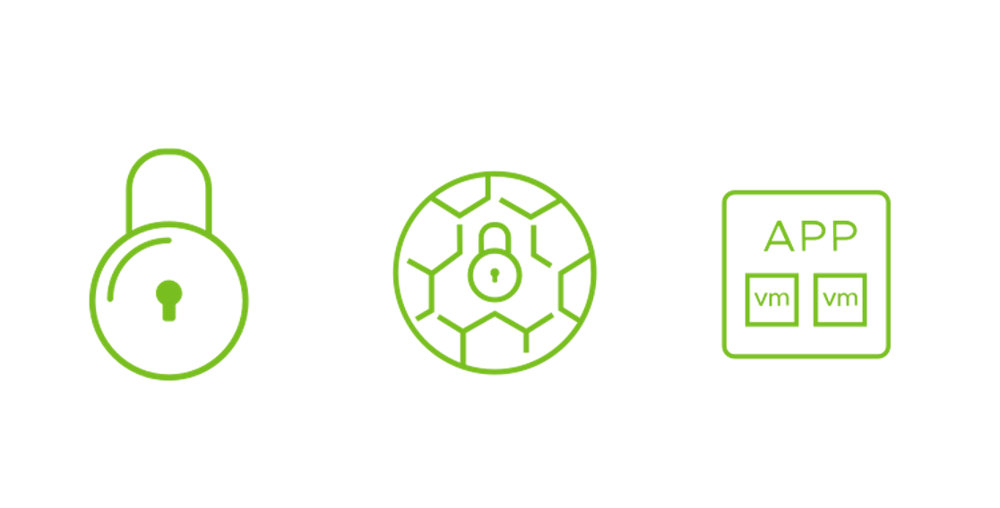
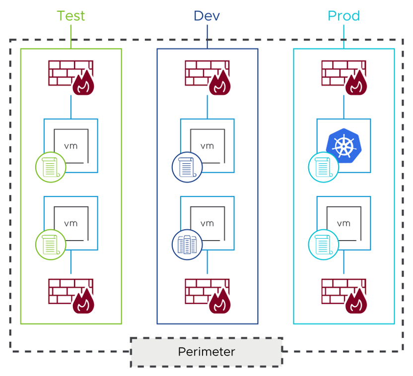

# NSX Firewall

------

### **중요성(Importance)**

NSX는 **East-West 트래픽**과 **North-South 트래픽**을 보호하기 위해 **분산 방화벽(Distributed Firewall)**과 **게이트웨이 방화벽(Gateway Firewall)**을 포함하고 있다.

워크로드를 효과적으로 보호하려면 **NSX 방화벽의 아키텍처와 구성 방식**을 정확히 이해해야 한다.

------

# Lesson 1: NSX Segmentation

------

## **About NSX Segmentation(NSX 세분화 기능 개요)**

------

**1. 세분화(Segmentation)의 정의**

• 데이터센터 인프라를 작은 존(zones)으로 나누는 과정

• 각 존 간의 트래픽 흐름에 대해 정밀한 제어 및 검사 가능

------

**2. NSX 세분화의 구성 요소**

• **분산 내부 방화벽(Distributed Firewall)** 기반의 스케일 아웃 구조

• 자동화된 방식으로 매크로/마이크로 세분화 적용 가능

------

**3. 매크로 세분화(Macro-segmentation)**

• 개발 환경과 운영 환경처럼 **논리적 존 단위**로 격리

• 서로 다른 환경 간의 수평 이동 차단

• **네트워크 세분화(Network Segmentation)**라고도 불림

------

**4. 마이크로 세분화(Micro-segmentation)**

• 개별 **워크로드 또는 애플리케이션 단위**로 보안 정책 적용

• 보안팀이 **정밀한 트래픽 제어** 가능

• 애플리케이션 내의 구성 요소 간 통신까지 격리 가능

------

------

## **Use Cases for NSX Segmentation(NSX 세분화 적용 사례)**

------

**1. Zero Trust 아키텍처 구현**

• NSX 세분화는 **모든 트래픽은 신뢰하지 않는다**는 원칙에 기반한 **제로 트러스트(Zero Trust)** 모델을 구현

• **애플리케이션, 서비스, 워크로드 간 세분화된 정책**을 통해 수평 확산(Lateral Movement)을 차단

• **네트워크 내부의 모든 흐름에 대해 정책 기반 승인**을 요구함으로써 보안 경계 강화

------

**2. 네트워크 세그먼트의 신속한 구축**

• 모든 구성은 **소프트웨어 기반**으로 정의되므로 **가상 보안 존(Virtual Security Zone)**, **파트너 도메인** 등

→ 원하는 구조를 **수 분 내에 배포 및 구성 가능**

• **물리적 네트워크 재설계나 별도 어플라이언스 없이** 세분화 수행 가능

• 보안 요구사항 변화에도 **빠르고 유연하게 대응 가능**

------

**3. 애플리케이션 격리 및 보호**

• **애플리케이션 경계(Application Boundary)**를 NSX Intelligence로 **자동 식별**

• 해당 경계를 기준으로 **세분화 정책 생성 및 적용**

• 중요한 앱과 공유 서비스(예: AD, DNS)는 **타 워크로드와의 직접 통신 제한**을 통해 공격 확산 방지

• 앱이 **이동하거나 구조가 변경되더라도**, 정책이 **자동으로 유지/업데이트됨**

------

**4. 통합 보안 솔루션 기반 운영 효율화**

• NSX를 통해 **세그먼트 생성, 제어, 정책 적용까지 하나의 플랫폼에서 처리**

• 보안팀은 **단일 도구에서 전체 흐름 가시화 및 제어 가능**

• 결과적으로 **운영 비용 절감 + 보안 통제 강화** 동시 달성

------

------

## **NSX Segmentation Benefits(NSX 세그멘테이션의 주요 이점)**

------

**1. 보안 강화 효과**

• 데이터 센터 내부의 **수평 이동(Lateral Movement)** 제한

• 보안 위반 시 **영향 범위를 최소화**함

• 중요한 워크로드 또는 영역에 대한 **격리 구현 용이**

------

**2. 인프라 효율성 증대**

• **기존 물리 네트워크(언더레이 인프라)** 그대로 사용 가능

• 하드웨어 변경 없이 **소프트웨어 정의 방식으로 구성 가능**

------

**3. 비용 절감 효과**

• **자본 비용(CAPEX)** 절감: 네트워크 리디자인 불필요

• **운영 비용(OPEX)** 절감: 정책 자동화 및 중앙 관리로 효율 증가

------

**4. 운영 자동화 및 민첩성 제공**

• **IT 서비스 제공 자동화** 가능 (예: 신규 세그먼트 자동 생성)

• 비즈니스 변화에 맞춰 **유연하고 안전한 확장성 제공**

------

**5. 네트워크 단순화**

• 애플리케이션 흐름을 중심으로 **정책 기반 제어** 가능

• 복잡한 물리적 네트워크 구조 없이 **논리적으로 단순한 트래픽 흐름 설계 가능**

------

**요약 정리**

| **구분**         | **내용**                           |
| ---------------- | ---------------------------------- |
| 보안 측면        | 내부 이동 제한, 영향 최소화        |
| 인프라 활용      | 기존 인프라 활용, 물리 장비 불필요 |
| 비용 절감        | CAPEX/OPEX 절감                    |
| 자동화 및 민첩성 | 서비스 제공 자동화, 변화 대응      |
| 네트워크 단순화  | 정책 중심 설계, 구조 간소화        |

------

**결론**

NSX 세그멘테이션은 기존 인프라를 유지하면서도 보안성과 운영 효율을 극대화하며, 자동화된 서비스 제공과 함께 비즈니스 민첩성을 보장하는 현대적 보안 아키텍처 기반 솔루션입니다.

------

------

## **Step 1: Creating Virtual Security Zones(1단계 – 가상 보안 영역 생성)**

------

1. **목적 및 개요**
   * 데이터 센터 내 트래픽 격리를 위해 **가상 보안 영역(Virtual Security Zones)**을 생성
   * **Macro-Segmentation(매크로 세그멘테이션)** 기반의 보안 영역 분리

------

2. **보안 영역 분리 효과**
   * **서로 다른 환경(예: Test, Dev, Prod) 간 직접 통신 차단**
   * 보안 사고 발생 시 **수평적 이동(Lateral Movement)** 방지
   * 보안 팀은 조직 구조나 업무에 따라 격리할 환경을 결정

→ 예: **부서(HR, 재무)** 또는 **파트너/외부 환경**과 **운영 환경**

------

3. **기존 방식 대비 장점**
   * 기존 **하드웨어 방화벽 기반 구조보다 유연**
   * 보안 존을 손쉽게 확장 가능
   * 업무 변화에 따라 신속한 구조 변경 가능

------

4. **Zero Trust 구조의 출발점**
   * **Zero-Trust 보안 모델**로의 전환을 위한 첫 단계
   * 데이터 센터 내에 **보안 경계(Segmentation Boundary)**를 명확히 설정

------

**5. 핵심 요약**

| **항목**        | **내용**                                |
| --------------- | --------------------------------------- |
| 적용 기술       | Macro-Segmentation                      |
| 구성 요소       | Virtual Zones (Test, Dev, Prod)         |
| 주요 기능       | 보안 영역 격리, 수평 이동 차단          |
| 장점            | 유연한 확장성, 변화 대응력 향상         |
| Zero Trust 연계 | Zero Trust 보안을 위한 초기 단계로 활용 |

**결론 정리**

Macro-Segmentation을 활용한 보안 영역 분리는 가상화 환경에서의 공격 확산을 차단하고, Zero Trust 보안 모델 구축을 위한 핵심 기반을 마련한다.

