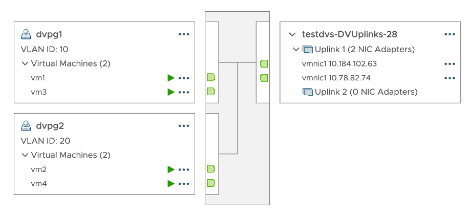
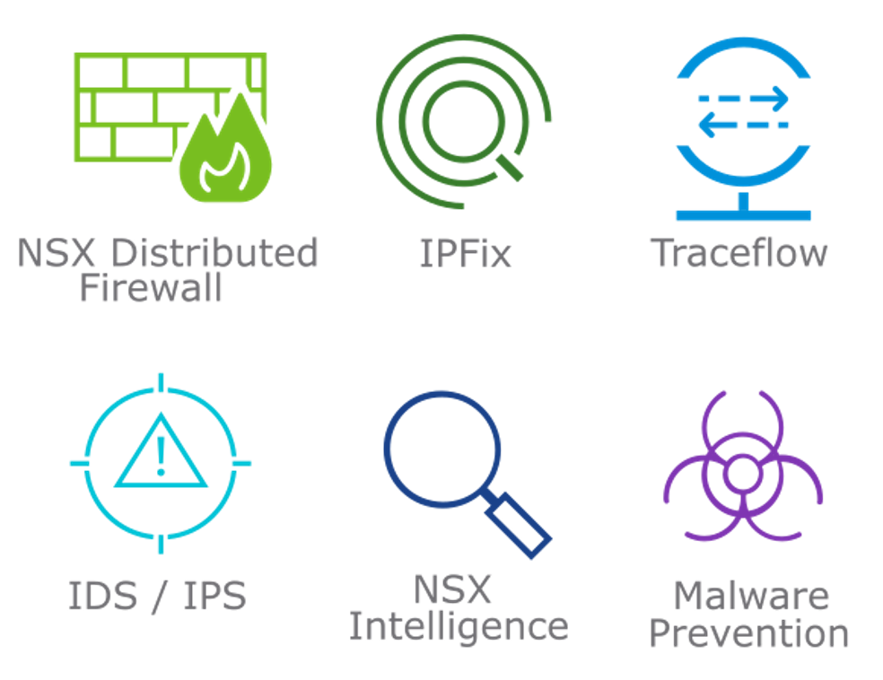
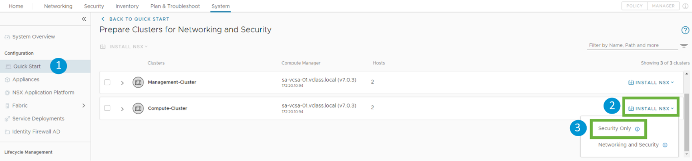
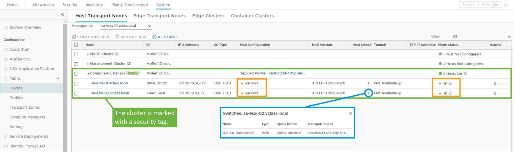
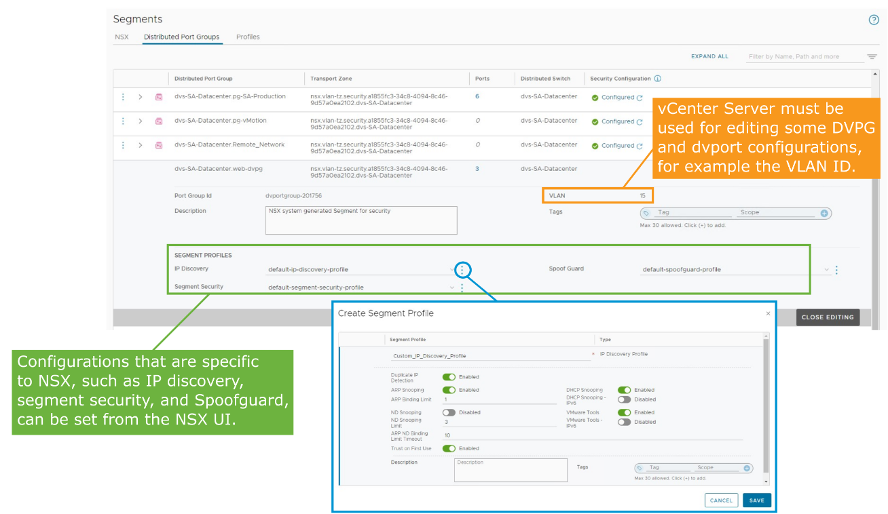

# Use Case for Security in Distributed Firewall on VDS

------

### **학습 목표(Learner Objectives)**

• **VDS(분산 가상 스위치)**에서 분산 방화벽(Distributed Firewall)이 작동하기 위한 **요구 사항을 나열한다**

• **VDS에서 분산 방화벽을 구성한다**

• **VDS에서 분산 방화벽 구성이 올바르게 적용되었는지 검증한다**

------

------

## **Distributed Firewall on VDS(분산 방화벽 – VDS 기반 구성)**

------

**1. 개요**

• 해당 그림은 **vSphere Distributed Switch(VDS)** 기반의 DVPG(VM 포트 그룹)에서 **NSX의 분산 방화벽 기능이 적용되는 구조**를 나타냄

• 기존 vSphere 환경에서 **플랫폼 변경 없이** NSX 보안 기능을 **DVPG에 직접 적용**할 수 있도록 지원함

------

**2. 주요 구성 요소 설명**

| **구성 요소**            | **설명**                                                     |
| ------------------------ | ------------------------------------------------------------ |
| **dvpg1**                | VLAN ID 10에 연결된 DV Port Group. VM1과 VM3이 연결됨        |
| **dvpg2**                | VLAN ID 20에 연결된 DV Port Group. VM2와 VM4가 연결됨        |
| **testdvs-DVUplinks-28** | VDS의 업링크 구성. Uplink 1에 vmnic0, vmnic1이 연결됨. Uplink 2는 비어 있음 |

------

**3. 기능 요약**

① **NSX Security 기능을 기존 DVPG에 직접 적용 가능**

→ NSX Segment로 마이그레이션 필요 없음

② **NSX Manager 또는 vSphere에서 생성한 네트워크 객체 모두에 동일한 정책 적용 가능**

③ **네트워크 관리자의 개입 없이 보안 관리자 단독 배포 가능**

→ 역할 분리 환경에서 효율적인 보안 운영 가능

④ **기존 vSphere 환경 유지하면서 분산 방화벽 및 기타 NSX 보안 기능 사용 가능**

⑤ **vCenter Server 인벤토리 정보 기반으로 NSX 관리 플레인에서 분산 방화벽 구성**

⑥ **vSphere 6.7부터 해당 기능 사용 가능**

------

**4. 그림 설명**

해당 그림은 **vSphere Distributed Switch 상의 DVPG(dvpg1, dvpg2)에 연결된 VM들이** 각각 **서로 다른 VLAN(10, 20)**에 구성되어 있는 상황을 나타냄

• **dvpg1**에는 **VM1, VM3**이 연결되어 있고,

**dvpg2**에는 **VM2, VM4**가 연결되어 있음

• 이들 포트 그룹은 **testdvs-DVUplinks-28** 스위치에 속하며,

Uplink 1은 vmnic0, vmnic1에 매핑되어 있음

• 해당 구조에서도 **NSX 분산 방화벽이 적용되어 보안 정책을 구성**할 수 있음

------

**5. 요약 정리**

• **분산 방화벽 on VDS**는 기존 vSphere 환경에서 **네트워크 변경 없이 보안 기능을 도입** 가능하게 함

• **DVPG 기반 VM도 NSX 보안 정책의 대상**으로 포함 가능

• **NSX Manager와 vCenter의 통합 관리 정보**를 통해 정책이 적용됨

• **마이그레이션 없이 보안 강화가 필요한 경우에 매우 유용한 기능**임

------

------

## Supported Features

------

------

## **Distributed Firewall on VDS Requirements(VDS 기반 분산 방화벽 요구 사항)**

------

**1. NSX 버전 요건**

• NSX **3.2 이상 버전**에서만 지원됨

• **ESXi 호스트는 NSX 준비 상태(Host Preparation)가 아님**

→ NSX 인프라 구성 없이 보안 기능만 적용 가능

------

**2. 호스트 구성 조건**

• **클러스터 내 모든 호스트는 동일한 VDS 구성**을 가져야 함

→ VDS 버전, 업링크 매핑 등 일치해야 구성 가능

• **vCenter Server는 NSX Manager에 Compute Manager로 등록되어야 함**

------

**3. 지원 버전 매트릭스**

| **VDS 버전** | **지원되는 vSphere 버전** |
| ------------ | ------------------------- |
| 6.6.0        | vSphere 6.7 이상          |
| 7.0.0        | vSphere 7.0 Update 1 이상 |
| 7.0.2        | vSphere 7.0 Update 2 이상 |
| 7.0.3        | vSphere 7.0 Update 3 이상 |
| 8.0.0        | vSphere 8.0.0 이상        |

------

**4. 구성 방법 요약**

• 본 기능은 다음 방법으로만 구성 가능함

→ **NSX API**

→ **NSX UI의 Quick Start 설치 마법사**

→ **vCenter NSX 플러그인** 사용

• **VDS는 여러 클러스터에 걸쳐 있을 수 있음**

→ NSX 보안 모드는 일부 클러스터에서만 활성화 가능함

------

**5. 요약 정리**

• NSX 3.2 이상, 비-NSX 준비 호스트 환경에서 사용 가능

• **vSphere 환경을 유지하면서 NSX 보안 기능만 적용**할 수 있는 이상적인 모델

• **보안 기능만 최소 구성으로 도입하려는 기업에 적합**함

• **정책은 NSX Manager 기준으로 적용되지만, 구성은 vCenter와의 연동이 필수적**임

------

------

## Installation Workflow

------

------

## Preparing the Cluster for Security

NSX 보안을 위한 클러스터 준비 방법

• 다음 경로로 이동:

 **System > Configuration > Quick Start > Prepare Clusters for Networking and Security > GET STARTED**

• 보안을 설치할 **클러스터를 선택**

• **INSTALL NSX > Security Only**를 클릭

------

------

## Validating the Security Cluster Preparation from the NSX UI

------

------

## Configuring Segment Profiles

NSX UI에서 다음 항목들을 구성할 수 있다:

• **IP Discovery**

• **Segment Security**

• **Spoofguard**

------

**Attack 			Migration**

**ARP spoofing <-> ARP snooping**

**DHCP spoofing <-> DHCP snooping**

**ND spoofing <-> ND snooping**

**(neighbor discovery)**
