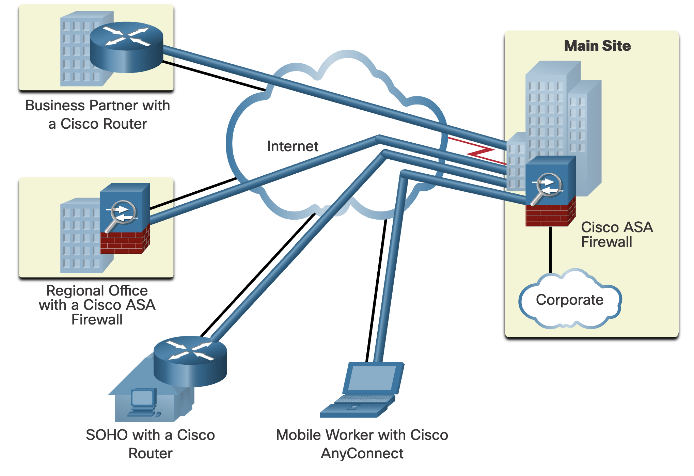
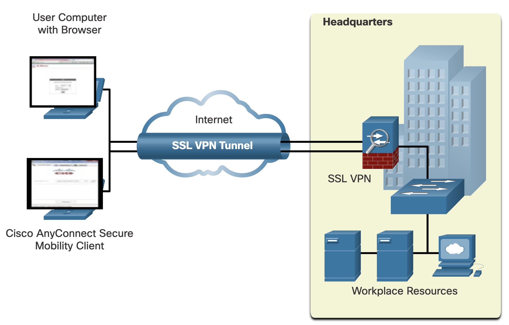
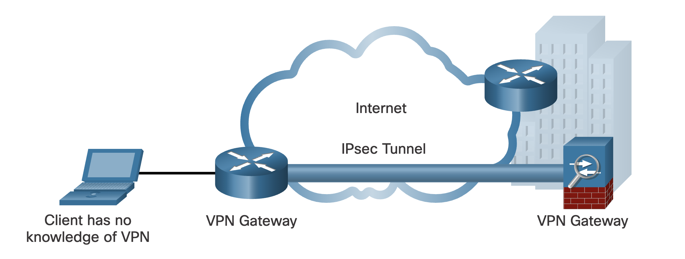
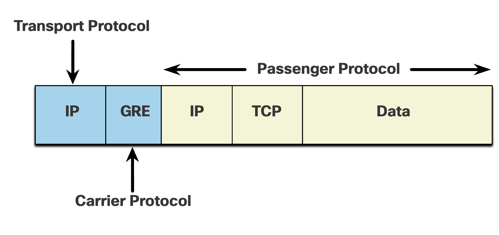
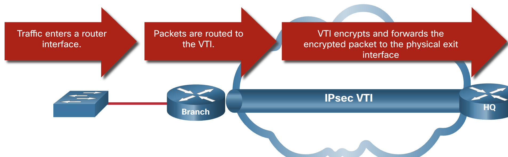
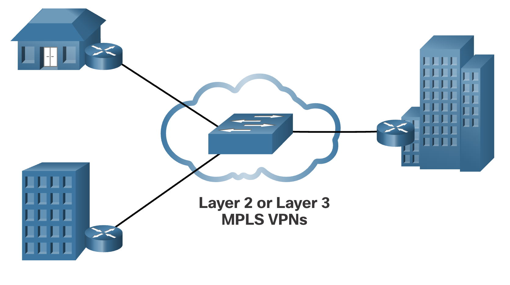

# 

## **Virtual Private Networks(가상 사설망)**

------

​	1.	**기본 개념**

• 가상 사설망(VPN)은 공용 네트워크 상에서 암호화된 터널을 구성하여, 사설 네트워크 간 안전한 통신을 가능하게 해주는 기술이다.

• VPN은 ‘가상’이라는 특성상 실제 공용망을 경유하지만, ‘사설’처럼 보호된 전용 통신처럼 동작한다.

• 모든 데이터는 암호화되어 전송되므로 기밀성을 유지할 수 있다.

------

​	2.	**기능 및 목적**

• 지사, 협력사, 재택근무자 등 원격 사용자들이 본사 네트워크 자원에 안전하게 접근 가능함

• 기업은 중앙 사이트에서 다양한 VPN 연결을 통합 관리함

• 트래픽 보호 외에도 인증, 액세스 제어 기능을 함께 제공함

------

​	3.	**구성 요소 설명**

| **연결 위치**        | **설명**                                                     |
| -------------------- | ------------------------------------------------------------ |
| **Main Site (본사)** | 모든 VPN 트래픽이 집중되는 중앙 거점이며, Cisco ASA Firewall로 보안 통제 수행 |
| **Regional Office**  | Cisco ASA 방화벽을 통해 본사로의 VPN 터널 연결 구성          |
| **Business Partner** | Cisco 라우터를 통해 VPN 터널 구성, 협력사 환경에서도 보안 접속 가능 |
| **SOHO**             | VPN 기능이 내장된 Cisco 라우터를 사용하여 가정/소규모 사무실에서도 본사 연결 가능 |
| **Mobile Worker**    | Cisco AnyConnect를 통한 Client-based VPN 접속을 지원, 재택·외근 환경에 최적화 |

------

​	4.	**VPN의 발전 배경 및 GRE**

• 초기 VPN은 단순한 IP 터널링만 제공했으며, 데이터 암호화나 인증 기능이 없었다.

• GRE(Generic Routing Encapsulation)는 Cisco가 개발한 터널링 프로토콜로, IPv4 또는 IPv6 패킷을 캡슐화하여 IP 터널 내에 전송할 수 있다.

• GRE는 암호화를 포함하지 않지만, 가상 P2P 링크를 만들 수 있는 기본 터널링 기술로 활용됨

------

**그림 설명**

그림은 본사를 중심으로 다양한 형태의 VPN 연결 구성을 보여주고 있다.

• 지사, 협력사, 재택 근무자 등이 공용 인터넷을 통해 본사로 VPN 터널을 구성함

• 모든 트래픽은 Cisco ASA Firewall을 통해 암호화되어 전송되고, 본사 자원(Corporate)에 접근할 수 있다

• SOHO 환경은 소규모 VPN 라우터를 이용하여 접속하며, 모바일 사용자는 AnyConnect를 이용해 직접 VPN을 시작한다

• 각 연결은 안전한 터널 구조로 설계되어 있으며, 본사 중앙에서 관리됨

------

------

## 8.1.4 Enterprise and Service Provider VPNs

* **엔터프라이즈 VPN**:
  * “우리 회사가 스스로 인터넷을 통해 안전한 통로를 만들어서 쓰는 것”

* **서비스 제공자 VPN**:
  * “통신사에 돈 내고 안전한 통로를 대신 만들어달라고 맡기는 것”

------

## **Remote-Access VPN Overview(원격 액세스 VPN 개요)**

------

​	1.	**기본 개념**

• 원격 액세스 VPN은 원격 사용자 또는 모바일 사용자가 기업 네트워크에 암호화된 터널을 통해 안전하게 접속할 수 있도록 해주는 기술이다

• 기업 리소스(이메일, 파일 서버, 애플리케이션 등)에 보안 접속을 제공함

• 사용자 인증을 통해 특정 리소스에 대한 접근만 허용 가능함

• 업체, 외부 계약자 등에게도 제한적 접근 권한을 제공할 수 있음

------

​	2.	**연결 방식 유형**

| **연결 유형**    | **설명**                                                     |
| ---------------- | ------------------------------------------------------------ |
| Clientless VPN   | • 별도 클라이언트 설치 없이 웹 브라우저만으로 접속 가능함• SSL 기반 암호화 사용 (HTTPS, IMAP, POP3 등 보호)• 주로 단순 웹 리소스 접근용으로 사용됨 |
| Client-based VPN | • 전용 클라이언트 소프트웨어(Cisco AnyConnect 등) 설치 필요• 사용자가 직접 VPN 연결을 시작하고 인증 후 접속• IPsec 또는 SSL을 통해 트래픽을 암호화 후 전송 |

1. **클라이언트리스 VPN (Clientless VPN)**

   → **웹 브라우저만 있으면 접속 가능**

   * 별도 프로그램 설치 없이 **웹 브라우저(https:// 주소)**를 통해 접속
   * SSL(HTTPS) 기반으로 이메일, 파일, 웹 앱 등에 접근 가능
   * **간단하지만 기능은 제한적**임

2. **클라이언트 기반 VPN (Client-based VPN)**

→ **전용 프로그램 설치 필요**

* 예: Cisco AnyConnect 같은 **VPN 전용 소프트웨어**를 PC나 노트북에 설치
* 사용자가 앱을 실행해 VPN 연결을 직접 시작
* 연결 시 ID/PW 등으로 **회사 VPN 게이트웨이에 인증**
* 인증되면 **내부 네트워크 자원(파일 서버, ERP, 메일 등)**에 접속 가능
* **IPsec 또는 SSL**을 통해 암호화

------

3. **작동 원리**
   * 원격 사용자가 브라우저 또는 VPN 클라이언트를 통해 VPN 연결을 시작함
   * SSL VPN 장비가 연결을 수신하고 인증 절차 수행
   * 증된 사용자에게 필요한 리소스 접근 권한 부여됨
   * 모든 트래픽은 암호화된 SSL VPN 터널을 통해 본사로 안전하게 전송됨

------

**도표: Remote-Access VPN 비교**

| **항목**      | **Clientless VPN**          | **Client-based VPN**                         |
| ------------- | --------------------------- | -------------------------------------------- |
| 접근 방식     | 브라우저 (HTTPS 기반)       | 전용 클라이언트 앱 사용                      |
| 암호화 방식   | SSL                         | SSL 또는 IPsec                               |
| 설치 여부     | 별도 설치 없음              | 클라이언트 소프트웨어 설치 필요              |
| 사용 편의성   | 쉬움 (단순 웹 접속용)       | 복잡함 (전체 네트워크 리소스 접근에 유리)    |
| 적용 시나리오 | 포털 접속, 제한된 웹 리소스 | 전체 리소스 접속, 원격 업무 환경 구축에 적합 |

------

**그림 설명**

해당 그림은 원격 사용자가 기업 본사에 SSL VPN 터널을 통해 보안 접속하는 흐름을 보여준다.

• 첫 번째 사용자: 브라우저를 통한 Clientless VPN 접속

• 두 번째 사용자: Cisco AnyConnect를 통한 Client-based VPN 접속

• 두 사용자 모두 SSL VPN 게이트웨이를 거쳐 본사의 Workplace Resources에 접근할 수 있다.

모든 통신은 SSL 기반으로 암호화되어 인터넷을 통해 안전하게 전송된다.

------

------

## 8.2.2 **SSL VPNs Overview(SSL VPN 개요)**

------

1. **기본 개념**

• SSL VPN은 실제로는 **TLS(Transport Layer Security)** 프로토콜을 기반으로 작동하며, 이는 SSL의 후속 버전이다

• SSL 또는 TLS를 사용하여 **웹 브라우저 기반의 암호화된 VPN 연결**을 제공함

• 인증은 **공개 키 기반 구조(PKI)** 및 **디지털 인증서**를 통해 이루어짐

• 일반적으로 **특별한 소프트웨어 설치 없이 웹 브라우저만으로 연결 가능**하여 배포가 간편함

• **보안 우선 시 IPsec**, **배포와 접근성 우선 시 SSL** 사용이 적절함

------

​	2.	**IPsec vs SSL 비교표**

| **항목**              | **IPsec**                                                    | **SSL**                                               |
| --------------------- | ------------------------------------------------------------ | ----------------------------------------------------- |
| **지원 애플리케이션** | **광범위함** – 모든 IP 기반 애플리케이션 지원                | **제한적** – 웹 기반 앱 및 파일 공유 중심             |
| **인증 강도**         | **강력함** – 공유 키 또는 디지털 인증서를 활용한 양방향 인증 | **중간 수준** – 일방향 또는 양방향 인증               |
| **암호화 강도**       | **강력함** – 56~256비트 키 길이 사용                         | **중~강력함** – 40~256비트 키 길이 사용               |
| **연결 복잡성**       | **중간** – 클라이언트 VPN 소프트웨어 필요                    | **낮음** – 웹 브라우저만 있으면 연결 가능             |
| **연결 옵션**         | **제한적** – 특정 구성 장비만 접속 가능                      | **광범위함** – 웹 브라우저가 있는 모든 장치 접속 가능 |

------

​	3.	**요약 정리**

• **보안이 중요**하고, **전사적 리소스에 대한 접근이 요구되는 경우** → **IPsec** 적합

• **설치 및 배포가 간단하고**, **웹 애플리케이션 위주의 업무** → **SSL** 적합

• **두 기술은 상호 배타적이지 않으며**, 동시에 병행 구축도 가능함

• 조직의 정책, 사용자 요구, 보안 수준에 따라 선택함

------

**그림 설명**

해당 표는 원격 접속 방식으로서의 IPsec VPN과 SSL VPN을 **5가지 핵심 항목**에 대해 비교한 것이다.

• IPsec은 강력한 인증·암호화 기능을 제공하지만 연결이 복잡함

• SSL은 간편한 연결과 광범위한 접근성을 제공하지만 보안 강도는 상대적으로 낮을 수 있음

------

------

## **Site-to-Site IPsec VPNs Overview(Site-to-Site IPsec VPN 개요)**

------

​	1.	**기본 개념**

• **Site-to-Site VPN**은 서로 다른 지사 네트워크를 인터넷과 같은 **신뢰할 수 없는 공용 네트워크를 통해 안전하게 연결**하기 위한 기술이다

• **엔드 호스트는 암호화 없이 일반 TCP/IP 트래픽**을 전송하고, 중간의 **VPN 게이트웨이(라우터 또는 방화벽)가 암호화 및 복호화를 처리**함

• **VPN Gateway**는 트래픽을 암호화한 후 IPsec 터널을 통해 목적지 VPN 게이트웨이로 전달하며, 도착지에서는 복호화하여 내부 네트워크로 전달함

• 일반적으로 IPsec을 이용해 **양쪽 사이트 사이의 데이터 기밀성과 무결성**을 보호함

------

​	2.	**작동 방식 요약**

​	1.	클라이언트는 VPN 구성에 대해 알 필요 없이 일반 트래픽을 전송함

​	2.	VPN 게이트웨이(라우터 또는 방화벽)는 트래픽을 **암호화 및 캡슐화**하여 인터넷을 통해 전송함

​	3.	반대편 VPN 게이트웨이가 트래픽을 수신하면 **복호화 및 헤더 제거** 수행

​	4.	최종적으로 내부 네트워크의 대상 호스트로 전달됨

------

​	3.	**특징 및 구성 요소**

• **VPN Gateway**: 트래픽 암호화/복호화, 터널 관리 (라우터 또는 Cisco ASA 방화벽)

• **IPsec Tunnel**: 데이터의 보안 전송 경로 (인터넷 위에 암호화된 터널 형성)

• **End Host(클라이언트)**: VPN 처리 과정과 무관하며 일반 트래픽만 송수신

• **인터넷**: 비신뢰 네트워크지만 **IPsec을 통해 보안 터널**을 구축함

------

**그림 설명**

해당 그림은 Site-to-Site VPN을 설명하며 다음 요소를 포함하고 있다:

• **왼쪽 노트북 사용자**는 VPN에 대한 인식 없이 로컬 네트워크를 사용

• **VPN Gateway(라우터)**가 트래픽을 암호화 후 **IPsec 터널을 통해 인터넷으로 전송**

• **오른쪽 VPN Gateway(ASA 방화벽)**는 이를 복호화하고 내부 기업 네트워크로 트래픽을 전달

• 이 구조는 지사 간에 안전하고 지속적인 통신을 가능하게 한다

------

------

**GRE over IPsec Overview(GRE over IPsec 개요)**

1. **기본 개념**

• **GRE(Generic Routing Encapsulation)**는 **보안 기능이 없는 사이트 간 터널링 프로토콜**이다

• **멀티캐스트 및 브로드캐스트 트래픽**을 지원하므로 **라우팅 프로토콜(OSPF 등)**을 터널을 통해 전송 가능함

• **GRE는 암호화를 제공하지 않기 때문에** 보안 VPN으로는 부적절함

• 반면, **IPsec은 강력한 보안을 제공하지만 유니캐스트 트래픽만 전송** 가능함 → **라우팅 프로토콜을 전송할 수 없음**

------

2. **문제 해결 방식: GRE over IPsec**

• **라우팅 프로토콜 트래픽(OSPF 등)**을 먼저 **GRE로 캡슐화(GRE encapsulation)**

• 이후, **GRE 패킷을 다시 IPsec으로 캡슐화하여 전송**

• 이를 통해 **보안 + 멀티캐스트/라우팅 프로토콜**을 동시에 지원하는 터널링 구조 구성 가능

------

3. **캡슐화 구성 요소 정의 (그림 기반)**

• **Passenger Protocol**

  → 원래 전송하려는 데이터 (예: OSPF, IPv4/IPv6 트래픽 등)

• **Carrier Protocol**

  → GRE: Passenger 프로토콜을 캡슐화함

• **Transport Protocol**

  → IPsec: GRE 패킷을 암호화하여 인터넷 상에서 전송함

------

------

## **Dynamic Multipoint VPNs(DMVPN: 동적 다지점 VPN)**

**요약 정리**

DMVPN은 **Hub-and-Spoke 기반으로 동적 터널을 자동 생성**하는 **확장성과 유연성에 뛰어난 VPN 아키텍처**이다. **GRE, NHRP, IPsec의 조합을 통해 전체 트래픽 흐름을 효율화하면서 보안도 동시에 확보**할 수 있다. 중대형 엔터프라이즈 환경에서 지점이 많은 경우 적합하다.

------

------

## **IPsec Virtual Tunnel Interface(IPsec 가상 터널 인터페이스)**

------

1. **기본 개념**

• IPsec VTI(Virtual Tunnel Interface)는 기존 IPsec 설정을 단순화하기 위해 사용하는 가상 인터페이스 기반의 구성 방식이다.

• 일반적인 IPsec에서는 물리적 인터페이스에 IPsec 세션을 정적으로 매핑해야 하지만, VTI는 가상 인터페이스에 설정하여 관리가 간편하다.

• DMVPN과 유사하게 멀티사이트 또는 원격 접속 환경에 유용하게 적용 가능하다.

------

2. **기능 및 특징**

• **IP 유니캐스트와 멀티캐스트** 트래픽 모두 암호화 전송 가능

• **GRE 터널 구성 없이**도 라우팅 프로토콜 사용 가능 (멀티캐스트 지원)

• 허브-스포크(Hub-and-Spoke) 구성이나 사이트 간 구성 모두 지원

• 라우팅 프로토콜을 통한 동적 라우팅 경로 구성 가능

------

​	3.	**동작 과정**

​	4.	**트래픽 유입**

• 지점(Branch) 라우터 인터페이스로 트래픽이 들어옴

​	5.	**VTI 경유**

• 유입된 패킷은 가상 터널 인터페이스(VTI)로 라우팅됨

​	6.	**암호화 및 전송**

• VTI는 해당 패킷을 **암호화한 후**, 물리적 출구 인터페이스를 통해 전송함

• 암호화된 트래픽은 본사(HQ) 라우터로 전송됨

------

**그림 설명**

해당 그림은 Branch(지점) 라우터에서 트래픽이 유입되어 VTI를 경유하여 본사(HQ)로 전달되는 흐름을 보여준다.

• 좌측 트래픽은 라우터 인터페이스로 들어와 VTI를 통해 암호화됨

• 암호화된 패킷은 IPsec 터널을 통해 본사 라우터에 전달됨

• IPsec VTI는 가상 인터페이스이므로 라우팅 프로토콜 통합이 용이하며, 추가적인 GRE 설정 없이도 멀티캐스트를 포함한 다양한 트래픽 처리 가능하다.

------

------

## **DMVPN Architecture (DMVPN 아키텍처)**

**1. 개요**

• **DMVPN (Dynamic Multipoint VPN)**은 다지점 간 VPN 구성을 동적으로 설정할 수 있도록 Cisco에서 개발한 솔루션이다

• GRE, NHRP, IPsec을 기반으로 하며, 복잡한 수작업 설정 없이도 사이트 간 보안 통신이 가능하다

• mGRE(Multipoint GRE) 터널을 통해 하나의 인터페이스로 여러 터널을 지원함

• 새로운 지점이 추가될 때 허브 외 별도 구성 변경 없이 확장 가능하다

------

**2. Hub-to-Spoke 방식 (기본 구성)**

• 중앙 허브 라우터는 모든 Spoke와 고정된 GRE over IPsec 터널을 유지함

• 모든 트래픽은 허브를 경유해 전달되며, 중앙 집중식 제어가 가능하다

**그림 설명**

해당 그림은 허브-스포크(Hub-to-Spoke) 구조에서 각 Spoke 라우터가 Hub와만 터널을 맺는 구조를 보여준다.

• 녹색 선은 IPsec 보안 터널을 의미하며, 각 Spoke는 Hub와만 연결되어 있다

• Spoke 간 직접 연결은 존재하지 않으며, 트래픽은 항상 Hub를 거쳐야 한다

------

**3. Spoke-to-Spoke 동적 터널 (확장 구성)**

• Spoke는 NHRP를 통해 다른 Spoke의 퍼블릭 주소를 확인하고, 직접 보안 터널을 설정할 수 있다

• 이렇게 하면 Hub를 거치지 않고 Spoke 간 트래픽이 직접 흐를 수 있어 지연 시간이 줄어든다

• 기존 Hub-to-Spoke 터널은 유지되며, 필요 시 Spoke-to-Spoke 터널이 동적으로 생성된다

**그림 설명**

해당 그림은 Hub-to-Spoke 터널(녹색 실선)과 동적으로 생성된 Spoke-to-Spoke 터널(주황색 점선)이 공존하는 구조를 나타낸다.

• Spoke A와 Spoke B, Spoke C 간에는 직접적인 터널이 생겨, 트래픽 경로가 최적화된다

• 중앙 Hub는 초기 정보 전달 및 NHRP 등록·질의에 사용되며, 데이터 트래픽 경로에는 관여하지 않는다

------

| **구성 요소** | **설명**                                                  |
| ------------- | --------------------------------------------------------- |
| **Hub**       | 모든 Spoke와 기본 터널 구성, NHRP 서버 역할 수행          |
| **Spoke**     | Hub와 기본 터널 구성, 필요 시 다른 Spoke와 직접 터널 구성 |
| **mGRE**      | 하나의 GRE 인터페이스로 여러 지점과의 터널 지원           |
| **NHRP**      | Spoke의 퍼블릭 주소 등록/질의 수행, Spoke 간 연결 지원    |
| **IPsec**     | GRE 터널 트래픽 암호화하여 보안 제공                      |

------

------

## **Service Provider MPLS VPNs(MPLS 기반 서비스 공급자 VPN)**

------

​	1.	**기본 개념**

• MPLS(Multiprotocol Label Switching)는 서비스 공급자가 사용하는 코어 네트워크 기술로, **레이블(Label)** 기반으로 트래픽을 전달함

• 전통적인 WAN 방식(전용 회선, Frame Relay, ATM 등)과 유사하게 **사용자 간 트래픽은 분리되어 있어 보안성이 높음**

• 고객 간 트래픽이 물리적으로 분리되므로 **추가 암호화 없이도 트래픽 격리 제공 가능**

• VPN 트래픽의 보안 및 경로 관리는 **서비스 공급자가 전담**함

------

​	2.	**MPLS VPN의 두 가지 유형**

| **유형**             | **설명**                                                     |
| -------------------- | ------------------------------------------------------------ |
| **Layer 3 MPLS VPN** | • 서비스 공급자가 고객 라우팅에 참여함• 고객 라우터와 서비스 공급자 라우터 간 라우팅 피어링 형성• 고객의 라우팅 정보가 공급자 네트워크를 통해 다른 지사로 전달됨 |
| **Layer 2 MPLS VPN** | • 공급자는 고객 라우팅에 관여하지 않음• **VPLS(Virtual Private LAN Service)**를 통해 **이더넷 멀티액세스 LAN**을 에뮬레이션• 고객 라우터들은 동일한 2계층 네트워크에 있는 것처럼 동작함 |

------

​	3.	**트래픽 전달 방식**

• MPLS 코어 라우터들은 미리 배포된 레이블 정보를 바탕으로 패킷을 빠르게 전달함

• 고객 트래픽은 공급자 네트워크를 통해 **보안성 있게** 전달됨

• 암호화 없이도 트래픽 분리 가능하지만, **고객이 필요 시 IPsec 등의 추가 보안도 적용 가능함**

------

**그림 설명**

해당 그림은 MPLS 기반의 서비스 공급자 네트워크에서 다양한 고객 지사들이 **Layer 2 또는 Layer 3 방식**의 VPN으로 연결된 모습을 보여준다.

• **좌측 건물들**은 각각 다른 지사 또는 고객을 의미하며, MPLS 코어를 통해 중앙 본사와 연결되어 있다

• **MPLS 백본 장비**는 라벨 스위칭 방식으로 각 사이트 간 트래픽을 빠르게 전달함

• 고객 라우터들은 각각 MPLS 코어에 연결되어 있으며, 서비스 유형에 따라 라우팅 참여 여부가 결정된다

------

------

