# Configuring NAT

------

## NAT Packet Flow Logical Topology

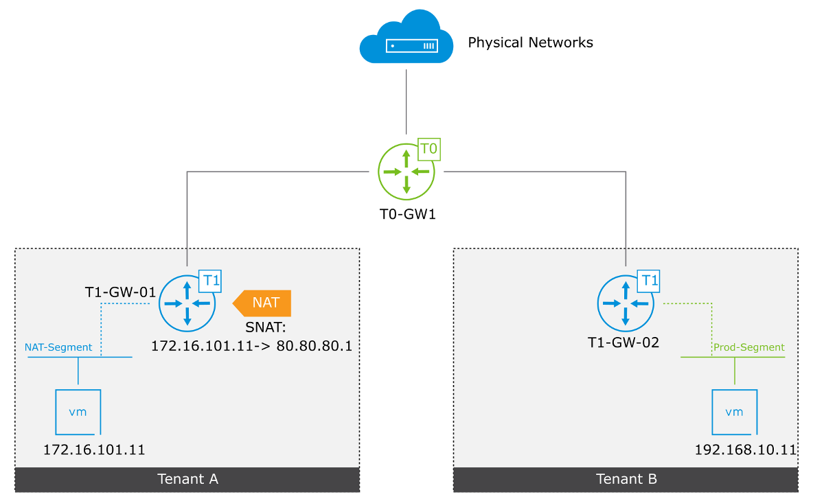

------

------

## NAT Packet Flow (1)

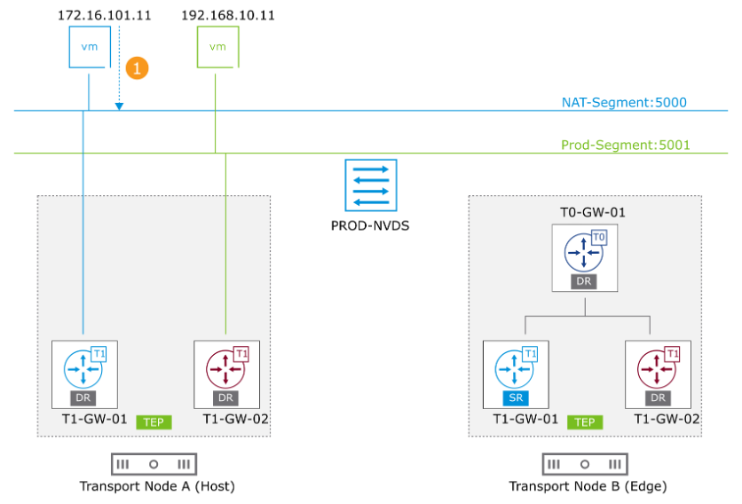

NAT-Segment : 5000에 연결된 VM (172.16.101.11)은 기본 T1-GW-01 게이트웨이로 패킷을 보냅니다.

1. 패킷의 대상은 Prod-Segment : 5001에 연결된 VM (192.168.10.11)입니다.

------

------

## NAT Packet Flow (2)

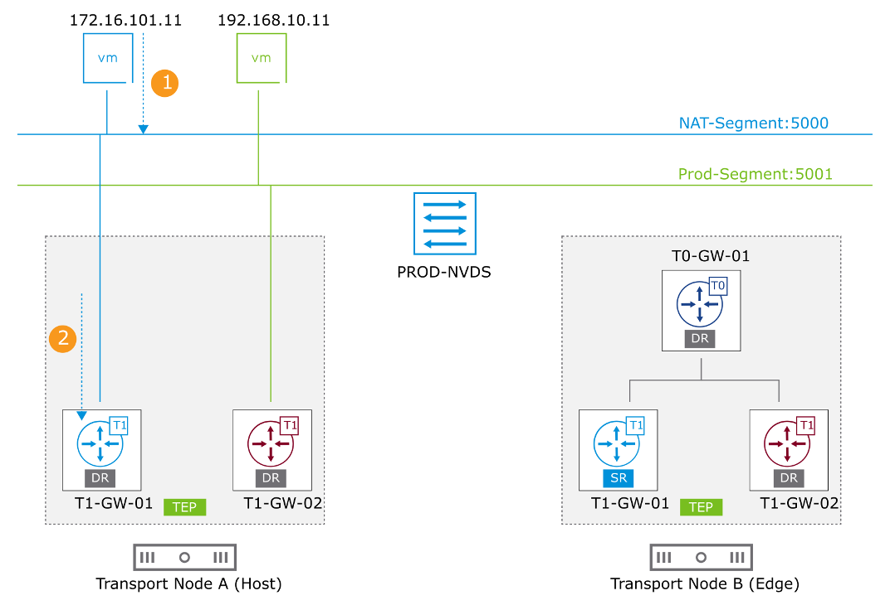

------

------

## NAT Packet Flow (3)

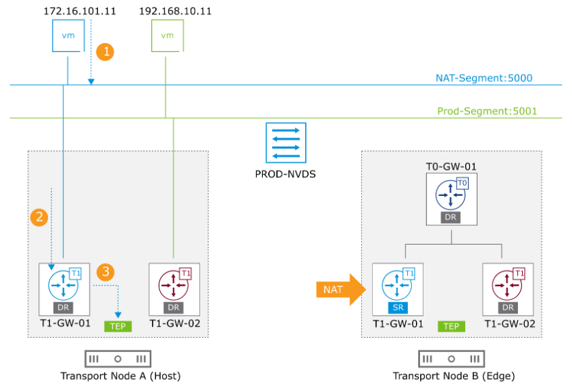

------

------

## NAT Packet Flow (4)

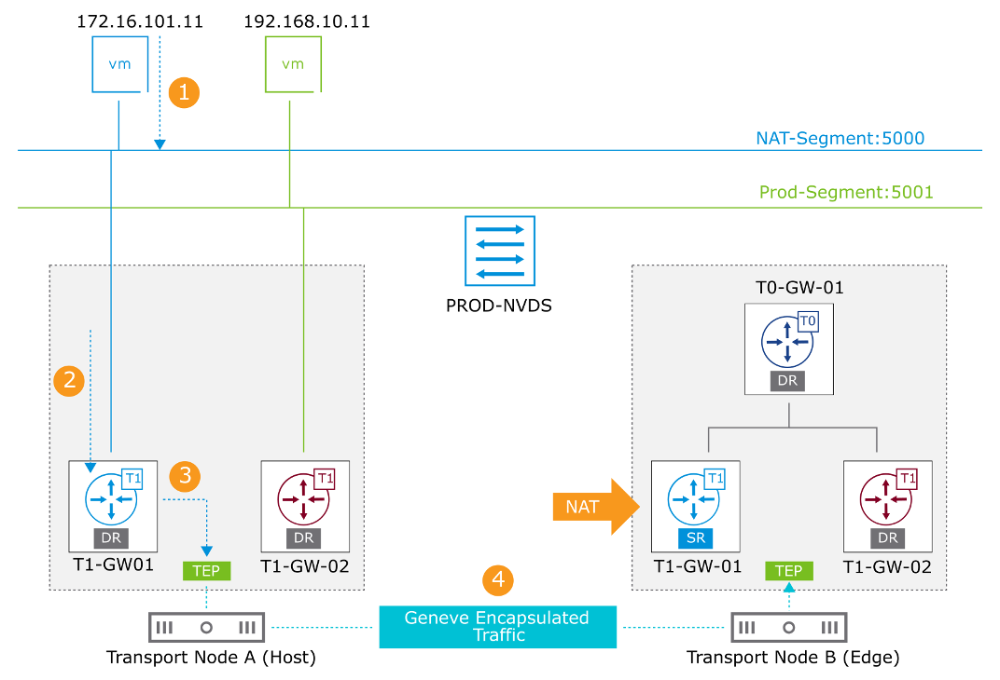

------

------

## NAT Packet Flow (5)

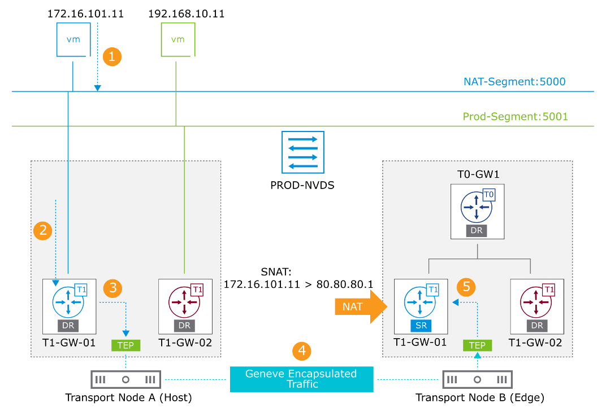

------

------

## NAT Packet Flow (6)

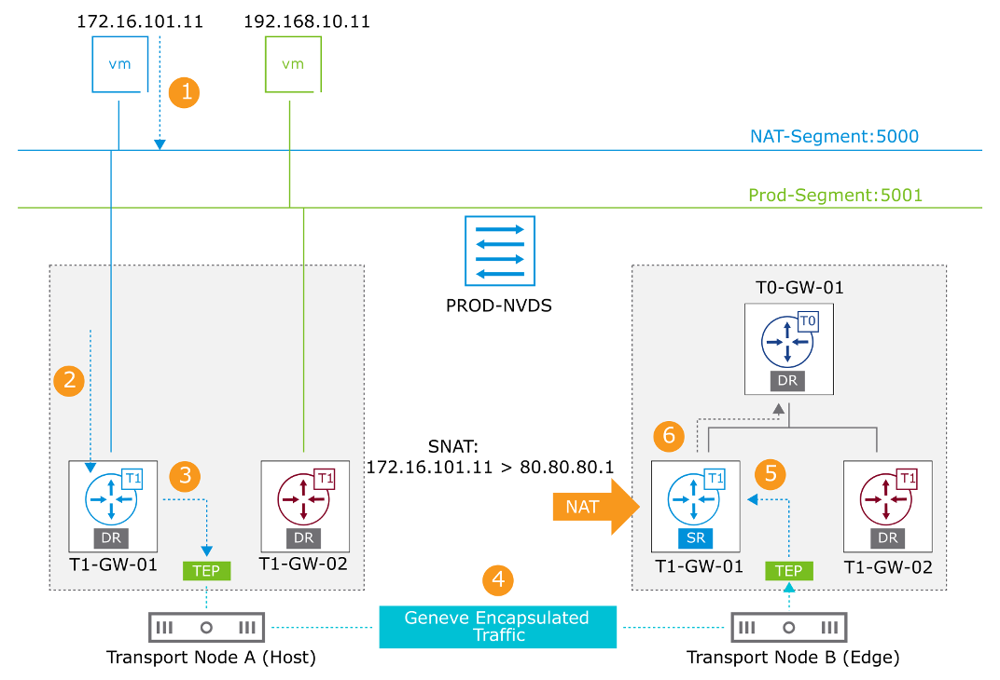

------

------

## NAT Packet Flow (7)

------

------

## NAT Packet Flow (8)

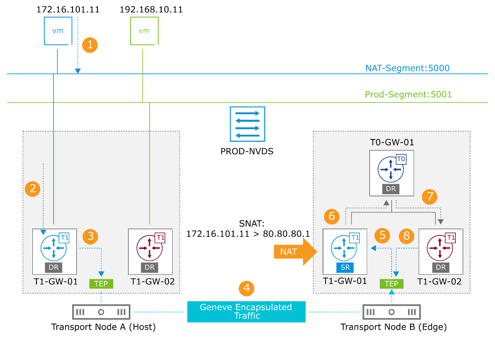

------

------

## NAT Packet Flow (9)

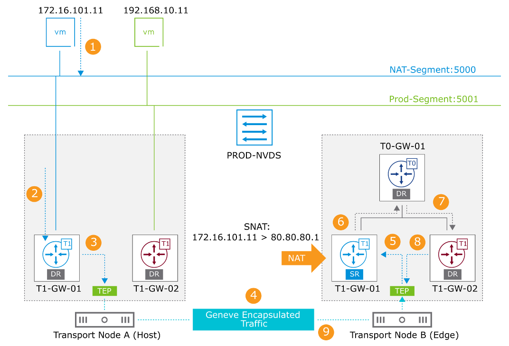

------

------

## NAT Packet Flow (10)

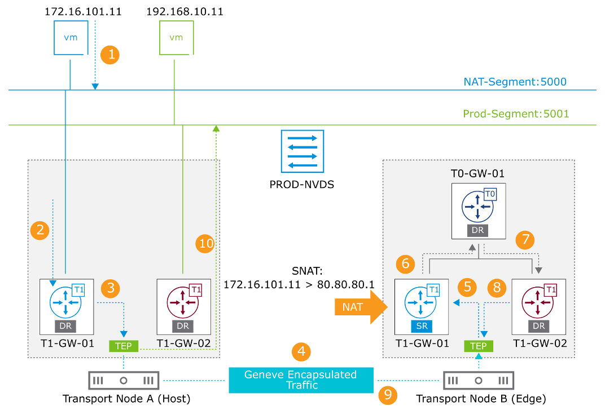 

**destination 세그먼트 Prod-Segment : 5001은 transport node A의 T1-GW-02에 연결됩니다. T1-GW-02의 DR은 라우팅 테이블을 기반으로 패킷을 세그먼트로 라우팅합니다.**

------

------

## NAT Packet Flow (11)

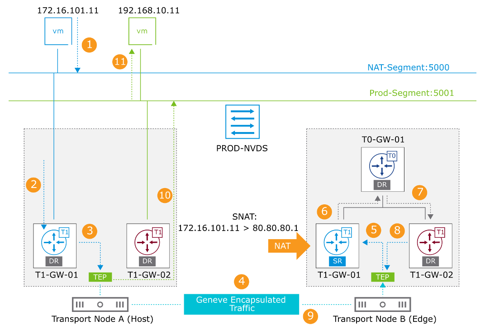

------

------

## **NAT64 Overview(NAT64 개요)**

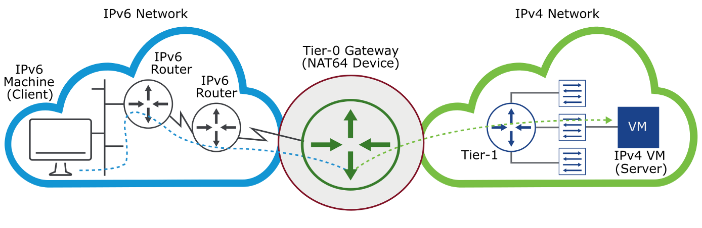

------

1. **기능 설명**

• NAT64는 **IPv6 전용 클라이언트가 IPv4 전용 서버와 통신**할 수 있도록 해주는 변환 메커니즘이다

• IPv6 패킷을 IPv4 패킷으로 변환하고, 응답 시 IPv4 → IPv6 변환을 수행함

• RFC 6146 (Stateful NAT64), RFC 6145 (Stateless Translation) 기반으로 설계됨

------

2. **지원 조건**

• **Tier-0 게이트웨이에서만 지원**

• **Stateful 서비스**이므로 **Active-Standby 모드**로 Tier-0 배포 필요

• IPv6 노드 또는 IPv4 노드에 변경 불필요 (양쪽 모두 투명하게 동작)

------

3. **작동 방식**

• **IPv6 클라이언트가 통신을 시작**해야 함

• Tier-0 게이트웨이는 NAT64 장치 역할 수행

• 클라이언트의 IPv6 요청을 받아 IPv4로 변환하여 Tier-1 → IPv4 서버 전달

• 응답은 반대로 IPv4 → IPv6으로 변환하여 클라이언트에 전달

------

**도표: NAT64 통신 흐름**

| **항목**   | **설명**                                                     |
| ---------- | ------------------------------------------------------------ |
| 클라이언트 | IPv6 전용 장치                                               |
| 서버       | IPv4 전용 VM 또는 시스템                                     |
| 변환 장치  | Tier-0 Gateway (NAT64 기능 포함, Active-Standby 구성 필요)   |
| 통신 흐름  | IPv6 클라이언트 → NAT64 → IPv4 서버 → NAT64 → IPv6 클라이언트 순환 |
| 시작 조건  | IPv6 측에서 세션을 먼저 시작해야 함                          |

------

**그림 설명**

해당 그림은 IPv6 네트워크에 위치한 클라이언트가 NAT64를 통해 IPv4 네트워크에 있는 서버와 통신하는 흐름을 보여주고 있다.

Tier-0 Gateway가 NAT64 기능을 수행하며, 클라이언트와 서버 간 주소 변환을 처리한다.

IPv6 라우터를 통해 NAT64 장치까지 IPv6 경로가 연결되며, 변환된 트래픽은 Tier-1과 IPv4 네트워크를 통해 목적지에 도달한다.

------

------

