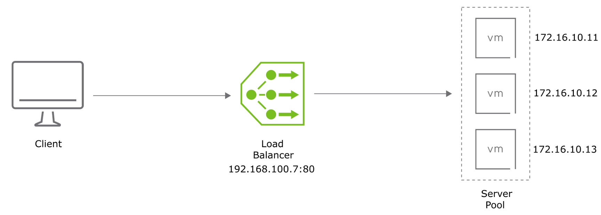
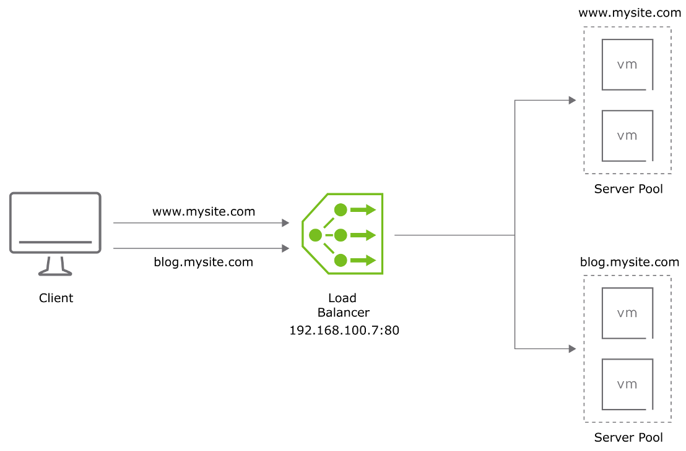
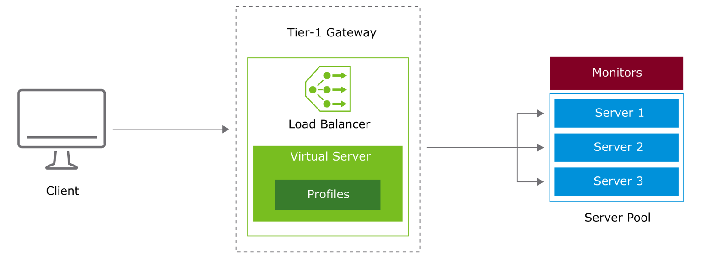
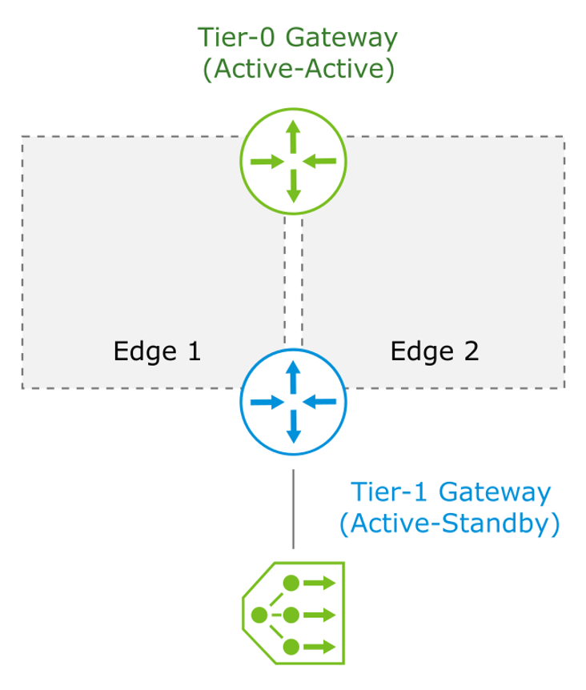
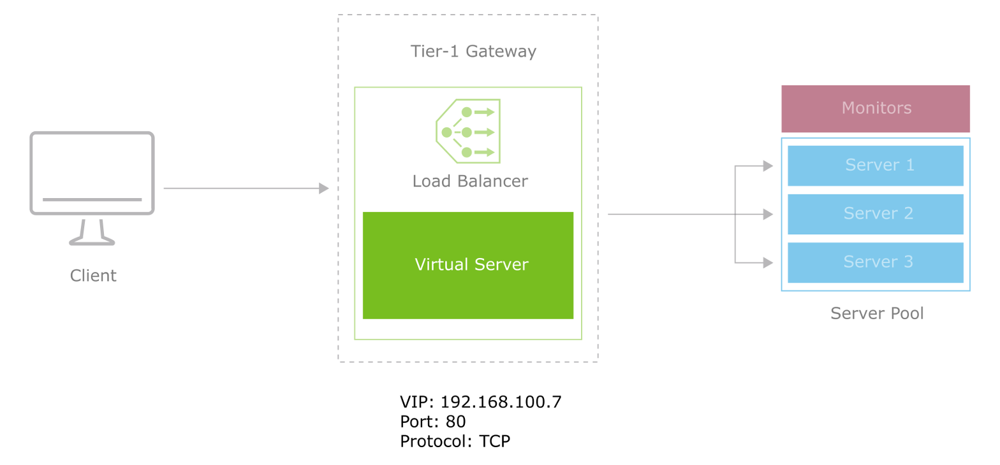
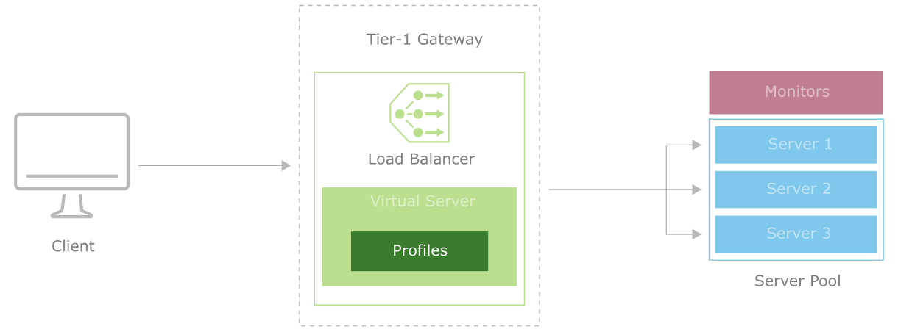
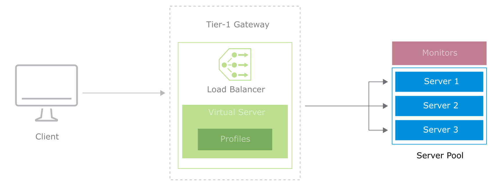
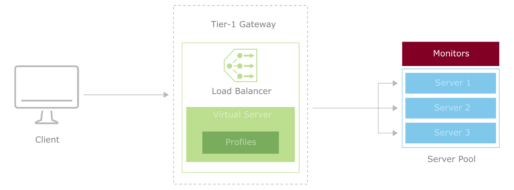
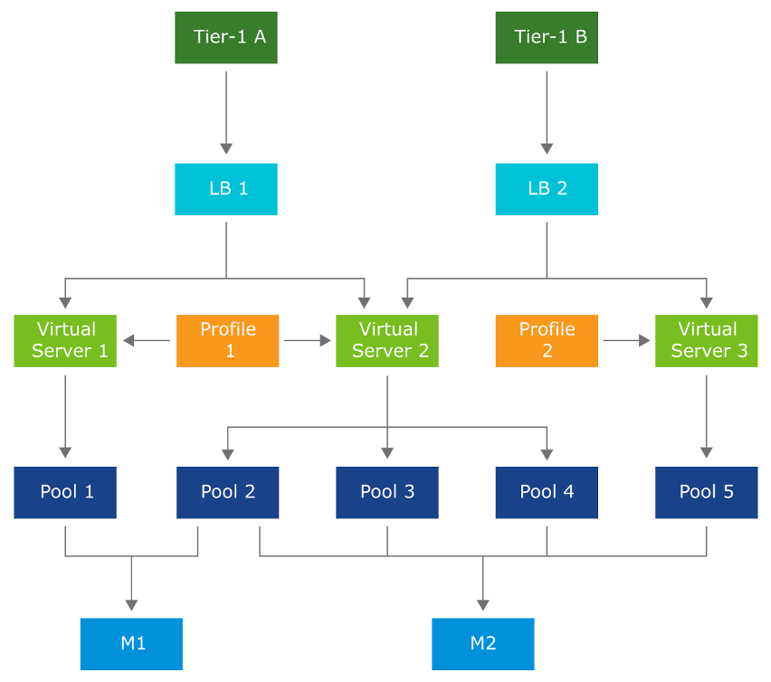

# Lesson 3: Configuring Load Balancing

------

## **로드 밸런싱의 사용 사례(Use Cases for Load Balancing)**

NSX-T Data Center의 로드 밸런서는 **들어오는 서비스 요청을 여러 서버에 분산**시켜

애플리케이션에 대한 **고가용성(High Availability)**을 제공한다.

다음과 같은 경우에 로드 밸런싱을 사용한다:

• **서버 이중화(Server Redundancy)**가 필요하여 **장애 발생을 방지해야 할 때**

• **빠른 응답 시간**을 위해 클라이언트 요청을 **여러 서버에 분산**할 때

• **특정 서버에 부하가 집중되어** 성능 저하가 발생할 때, **부하 분산이 필요한 경우**

------

**Load Balancer (로드 밸런서)**

* 하나의 진입점(단일 IP 또는 도메인)을 통해 요청을 받고
* 내부의 여러 서버(VM)로 **트래픽을 분산 처리**함

**주요 기능**:

• 트래픽 부하 분산

• 서버 장애 시 자동 헬스 체크 및 제외

• 다양한 분산 알고리즘 사용 (Round Robin, Least Connection, Hash 등)

• SSL 종료(Offloading) 기능 포함 가능

------

| **사용 환경**         | **설명**                                     |
| --------------------- | -------------------------------------------- |
| 웹 서비스             | 다수의 웹 서버에 요청 분산                   |
| 애플리케이션 서버     | 중간 계층 부하 분산 및 이중화                |
| NSX-T, F5, HAProxy 등 | 가상 네트워크 또는 물리 인프라에서 사용 가능 |

* ------

  real server = back end server

* vip: real server 를 대표하는 대포 IP

------

------

## 로드 벨런서를 사용하는 이유

| **항목**  | **로드 밸런서 없이**            | **로드 밸런서 사용 시**         |
| --------- | ------------------------------- | ------------------------------- |
| 장애 대응 | VM 하나 죽으면 전체 서비스 중단 | 살아 있는 다른 VM으로 자동 분산 |
| 부하 대응 | 트래픽 증가 시 병목 발생        | 여러 VM에 트래픽 분산           |
| 유지보수  | 서비스 중단 발생 가능           | 무중단 유지보수 가능            |
| 보안      | 클라이언트가 서버 직접 접근     | IP 보호, 보안 구성 유리         |
| 확장성    | 직접 구성 필요                  | 백엔드 추가만으로 확장 가능     |

------

### **결론**

**“반드시 로드 밸런서를 써야 하는가?”**

→ 소규모, 테스트 환경에서는 없어도 운영 가능하지만,

→ **서비스를 안정적으로 운영하려면 필수적**이다.

• 로드 밸런서는 **고가용성, 성능, 확장성, 유지보수, 보안 측면에서 핵심 구성요소**이다.

• 특히 클라우드나 VM 기반 환경에서는 **로드 밸런서 없이 서비스 운영은 사실상 어렵다**고 볼 수 있다.

------

------

##  **Layer 4 Load Balancer (L4 로드 밸런서)**

------

**구성 요소 및 동작 설명**

1. **Client**
   * 외부 사용자가 요청을 보냄
   * 요청 대상은 IP 주소와 포트 번호 (예: 192.168.100.7:80)

------

2. **Load Balancer (L4)**
   * 클라이언트의 요청을 받아서, **서버 풀에 속한 VM 중 하나로 TCP/UDP 연결을 분산**함
   * **동작 기준**: IP 주소, 포트, 프로토콜 수준에서 작동 (세션/애플리케이션 내용을 보지 않음)

------

**특징**:

* **TCP/UDP 지원**
* 빠르고 경량
* 일반적으로 세션 유지 정보는 없음 (stateless)
* Round Robin, Least Connection 같은 **기본 분산 알고리즘** 사용

**예시**:

* 클라이언트가 192.168.100.7:80으로 HTTP 요청 시
* 로드 밸런서는 내부의 172.16.10.11, 12, 13 중 하나로 전달

------

3. **Server Pool**
   * 실제 요청을 처리하는 백엔드 VM 그룹
   * 각각 고유의 내부 IP를 가지며, 로드 밸런서가 트래픽을 전달함

**서버 예시 IP**:

* VM1: 172.16.10.11
* VM2: 172.16.10.12
* VM3: 172.16.10.13

------

**요약: Layer 4 Load Balancing 특징**

| **항목**          | **내용**                                        |
| ----------------- | ----------------------------------------------- |
| 계층              | OSI 4계층 (전송 계층)                           |
| 대상 프로토콜     | TCP, UDP                                        |
| 처리 방식         | 포트와 IP 기준으로 분산                         |
| 속도              | 빠르고 간단함                                   |
| 애플리케이션 인식 | 없음 (HTTP/HTTPS 헤더를 해석하지 않음)          |
| 일반 사용 예      | HTTP, HTTPS, SMTP, DNS 등 고정 포트 기반 트래픽 |

------

**결론**

* L4 로드 밸런서는 **트래픽을 빠르고 간단하게 분산**하기에 적합하며
* 내부 서버 풀에 있는 여러 VM으로 TCP/UDP 기반 요청을 자동으로 분산시켜 **가용성과 성능을 향상**시킨다.

------

------

## **Layer 7 Load Balancing(Layer 7 로드 밸런싱 개요)**

------

1. **기본 개념**
   * Layer 7 로드 밸런서는 **애플리케이션 계층(OSI 7계층)**에서 동작하며, HTTP/HTTPS 요청의 **내용(Content)**에 기반하여 트래픽을 분산시킨다.
   * 일반적인 L4 로드 밸런서와 달리, **요청 URI, 호스트 헤더, 쿠키, 쿼리 문자열** 등을 기반으로 세밀한 트래픽 제어가 가능하다.

------

2. **지원 기능**
   * **HTTP 및 HTTPS 프로토콜 지원**
   * *가상 호스트(Virtual Host)** 이름 기반 라우팅 (예: www.mysite.com, blog.mysite.com)
   * **URL 경로 기반 라우팅** (예: /blog, /images)
   * **사용자 정의 규칙**을 통한 URL 리라이트, 리디렉션, 액세스 제어 등
   * **SSL 종료(Termination)** 기능 지원 가능

------

3. **작동 원리**

| **단계**                                     | **설명**                                                     |
| -------------------------------------------- | ------------------------------------------------------------ |
| ①                                            | 클라이언트가 www.mysite.com 또는 blog.mysite.com에 HTTP/HTTPS 요청을 보냄 |
| ②                                            | 요청은 **공통 IP(예: 192.168.100.7:80)**의 **L7 로드 밸런서**에 도달함 |
| ③                                            | 로드 밸런서는 **도메인 이름(Host 헤더)** 또는 **URL 경로**를 확인함 |
| ④                                            | 분석된 정보에 따라 각각 다른 **서버 풀(Server Pool)**로 요청을 전달함 |
| ⑤                                            | 예:                                                          |
| • www.mysite.com 요청 → www 서버 풀로 전달   |                                                              |
| • blog.mysite.com 요청 → blog 서버 풀로 전달 |                                                              |

------

4. **그림 설명**

* 클라이언트는 동일한 IP(192.168.100.7)로 요청을 전송하지만, 요청 도메인에 따라 서로 다른 백엔드 VM Pool로 트래픽이 전달됨.
*  **www.mysite.com**은 상단 서버 풀로, **blog.mysite.com**은 하단 서버 풀로 라우팅된다.
*  이는 **L7 로드 밸런서가 Host 헤더 기반의 가상 호스팅을 수행**하기 때문이다.

**+) L7은 seen ack seen 을 로드 벨런서와 주고 받으며 3 웨이 핸드셰이크를 수행하여 정보를 전달하게 된다.**

------

5. **요약 정리**
   * Layer 7 로드 밸런싱은 **HTTP/HTTPS 요청의 내용 분석**을 기반으로 동작함
   * 도메인 이름, 경로, 쿼리 등을 활용해 **세밀한 트래픽 분산**이 가능함
   * URL 리디렉션, 리라이트, 필터링 등의 고급 정책 적용 가능
   * 주로 웹 트래픽에 사용되며, 멀티도메인·멀티사이트 환경에 적합함

------

------

## **Load Balancer Architecture(로드 밸런서 아키텍처)**

------

1. **기본 구성 요소**

   * **Tier-1 Gateway (또는 Tier-0 Gateway)**
     * 로드 밸런서는 반드시 **T1 또는 T0 게이트웨이에 연결되어야 함**

   * **Load Balancer**
     * 트래픽 분산 처리를 수행하는 중앙 컴포넌트로, 여러 가상 서버(Virtual Server)와 연결됨

   * **Virtual Server**
     * 클라이언트 요청을 수신하는 논리적 종착지로, IP 주소와 포트를 바탕으로 식별됨

   * **Profiles**
     * 가상 서버 동작 방식을 정의함
       * 예: L7 HTTP 프로파일, TCP 프로파일, SSL 프로파일 등

   * **Server Pool**
     * 실제 요청을 처리하는 백엔드 서버 그룹
     * 서버 풀 내 서버는 로드 밸런서에 의해 요청이 분산됨

   * **Monitors**
     * 서버의 상태를 주기적으로 체크하여 **정상 서버만 트래픽을 수신**하도록 보장함

------

2. **구성 흐름 설명**

| **구성 요소**  | **설명**                                            |
| -------------- | --------------------------------------------------- |
| Client         | 로드 밸런서에 HTTP/HTTPS 요청을 보냄                |
| Virtual Server | 요청을 수신하고, 연결된 Server Pool로 전달          |
| Profiles       | 요청 처리 방식 정의 (예: HTTP, HTTPS, SSL 처리 등)  |
| Server Pool    | 요청을 처리할 실제 서버들로 구성                    |
| Monitors       | 각 서버의 상태를 확인하여 비정상 서버는 자동 제외함 |

------

3. **그림 설명**
   * 클라이언트는 Virtual Server에 요청을 전송함
   * Virtual Server는 Profiles에 정의된 방식으로 요청을 처리하고
   * 연결된 Server Pool에 트래픽을 분산시킴
   * Server Pool에 포함된 Server 1, 2, 3의 상태는 **Monitors**에 의해 관리됨

------

4. **요약 정리**
   * 로드 밸런서는 Tier-1 또는 Tier-0 게이트웨이에 배포됨
   * Virtual Server, Profiles, Server Pool, Monitors는 필수 구성 요소임
   * Monitors는 가용성과 신뢰성을 높이기 위한 핵심 기능임
   * Virtual Server가 중심 역할을 하며 모든 트래픽을 수신하고 분배함

------

------

## **Connecting Load Balancers to Tier-1 Gateways(Tier-1 게이트웨이에 로드 밸런서 연결)**

------

1. **구성 조건**

   * **로드 밸런서는 반드시 Tier-1 게이트웨이에 연결되어야 함**

   * **Tier-1 Gateway는 반드시 Active-Standby 모드로 동작해야 함**
     * 로드 밸런서와 같은 상태 유지가 필요한 서비스(stateful services)는
     * Active-Standby 모드에서만 동작 가능함

   * Tier-1 Gateway는 **상위 Tier-0 Gateway와 연결됨**
     * 이때 Tier-0은 **Active-Active 모드**로 구성하는 것이 일반적임

------

2. **그림 설명**

   * **로드 밸런서는 Tier-1 게이트웨이에 연결되어 있음**
     * 해당 Tier-1 게이트웨이는 **Edge Node 1 또는 Edge Node 2 중 하나**에 활성화됨 (Active-Standby)

   * **Tier-1 게이트웨이는 상위 Tier-0 게이트웨이와 연결되며,** Tier-0은 두 개의 Edge 노드에 걸쳐 Active-Active 모드로 동작함

   * 이 구조는 **상태 정보를 유지하는 로드 밸런서**와 **스케일 아웃 처리 가능한 상위 Tier-0** 간 균형을 맞추기 위한 배치임

------

3. **구조적 요약**

| **구성 요소**  | **설명**                                                 |
| -------------- | -------------------------------------------------------- |
| Tier-1 Gateway | 반드시 Active-Standby로 구성                             |
| Tier-0 Gateway | Active-Active로 구성 가능                                |
| Load Balancer  | Tier-1에 연결되며, 상태 기반 서비스 수행                 |
| Edge Cluster   | 두 개 이상의 Edge 노드로 구성되어 각 게이트웨이를 호스팅 |

------

4. **요약 정리**
   * 로드 밸런서는 반드시 Tier-1에 연결되어야 하며
   * Tier-1은 반드시 Active-Standby 모드여야 함
   * Tier-1은 일반적으로 Active-Active 모드로 동작하는 Tier-0과 연결되어

 북-사우스 트래픽을 처리함

------

------

## **Virtual Servers(가상 서버)**

------

1. **개념 정의**

   * **Virtual Server**는 로드 밸런서가 외부 요청을 수신하는 **서비스 추상화 객체**임
   * 하나의 가상 서버는 다음 세 가지 요소로 구성됨:
     * **VIP (Virtual IP Address)**
     * **Port (포트)**
     * **Protocol (프로토콜)**

   * **외부 클라이언트는 이 조합(VIP, Port, Protocol)을 사용하여 내부 서버에 접근함**

------

2. **그림 설명**

   * 클라이언트는 **VIP 192.168.100.7**, **포트 80**, **TCP 프로토콜**을 사용하여 접속 요청을 보냄

   * 해당 요청은 **Tier-1 Gateway**에 연결된 **로드 밸런서의 가상 서버(Virtual Server)**로 전달됨
   * 로드 밸런서는 설정된 **서버 풀(Server Pool)** 내 서버들 중 하나에 트래픽을 전달함
   * 서버 풀에는 **Server 1, Server 2, Server 3**이 포함되어 있으며, **Monitor**를 통해 서버의 상태를 주기적으로 확인함

------

3. **구조 요약**

| **구성 요소** | **설명**                                        |
| ------------- | ----------------------------------------------- |
| VIP           | 클라이언트가 접근할 가상의 IP 주소              |
| Port          | VIP가 수신하는 포트 번호 (예: 80)               |
| Protocol      | 트래픽 유형 (예: TCP, UDP)                      |
| Server Pool   | 실제 요청이 전달되는 백엔드 서버 그룹           |
| Monitors      | 서버 상태를 주기적으로 확인하여 가용성을 보장함 |

------

​	4.	**요약 정리**

• **가상 서버**는 로드 밸런서 외부 진입 지점 역할을 하며,

 VIP + 포트 + 프로토콜의 조합으로 정의됨

• 로드 밸런서는 클라이언트 요청을 가상 서버를 통해 받아

 설정된 서버 풀에 분산 처리함

• 모니터링 기능으로 서버 장애 시 자동으로 트래픽을 건강한 서버로 우회시킴

------

------

## **Load Balancer Profiles(로드 밸런서 프로파일)**

------

1. **개념 정의**

• **Profiles**는 가상 서버(Virtual Server)의 **트래픽 처리 방식**과 관련된 속성을 정의함

• 각각의 프로파일은 특정 기능에 집중하여 가상 서버 동작을 세밀하게 제어함

------

2. **프로파일 유형**

| **프로파일 유형**       | **설명**                                                     |
| ----------------------- | ------------------------------------------------------------ |
| **Application Profile** | 트래픽을 어떻게 처리할지를 정의함 (예: HTTP, TCP, UDP 등)    |
| **Persistence Profile** | 상태 유지 필요 시, 동일 클라이언트의 요청을 항상 같은 백엔드 서버로 보냄 |
| **SSL Profile**         | 클라이언트/서버 간 SSL 설정을 정의함 (예: 인증서, 암호화 방식 등, L7 전용) |

------

3. **그림 설명**

• 클라이언트 요청이 **Tier-1 Gateway**에 연결된 로드 밸런서로 전달됨

• 로드 밸런서 내 가상 서버는 설정된 **Profiles**를 기반으로 트래픽을 처리함

• Profiles는 서버 풀로 연결되는 흐름에서 **트래픽 처리 방식, 연결 유지 여부, 보안 설정** 등에 영향을 줌

• 서버 풀은 상태 모니터링을 통해 가용성을 유지함

------

4. **요약 정리**

• Profiles는 로드 밸런서의 가상 서버 동작을 구체적으로 설정하는 구성 요소임

• 트래픽 종류, 연결 지속성, SSL 암호화 방식 등을 제어함

• 적절한 프로파일 설정은 안정성과 성능 향상에 기여함

------

------

## **Server Pools(서버 풀)**

------

1. **개념 정의**

• Server Pool은 **특정 서비스를 제공하는 서버 그룹**으로 구성됨

• 로드 밸런서는 클라이언트 요청을 서버 풀에 속한 서버로 분산시킴

------

2. **구성 방식**

| **항목**         | **설명**                                                     |
| ---------------- | ------------------------------------------------------------ |
| **Static Pool**  | 관리자가 수동으로 서버를 지정함                              |
| **Dynamic Pool** | 조건 기반으로 자동으로 서버를 포함함 (예: 태그, 그룹 조건 등) |

------

3. **그림 설명**

• 클라이언트의 요청은 Tier-1 Gateway의 Load Balancer로 전달됨

• Load Balancer는 Virtual Server를 통해 Profiles 설정을 참고하여 트래픽을 처리함

• 최종적으로 요청은 Server Pool 내의 서버 중 하나로 전달됨

• Monitors는 각 서버의 상태를 지속적으로 체크하여 가용성을 보장함

------

4. **요약 정리**

• Server Pool은 동일 서비스를 제공하는 서버의 집합임

• 수동 또는 조건 기반으로 서버 구성 가능

• 서버 상태를 Monitors가 체크하여 **정상 서버로만 트래픽 분산**함

------

------

## **Monitors(모니터)**

------

1. **기능 개요**

• Monitors는 **서버 풀 내 서버의 상태를 점검**하기 위한 메커니즘이다

• 정상 동작 중인 서버만을 대상으로 로드 밸런싱이 수행되도록 보장한다

------

2. **모니터 종류**

| **모니터 유형**     | **설명**                                                     |
| ------------------- | ------------------------------------------------------------ |
| **Active Monitor**  | 백엔드 서버에 직접 테스트 트래픽을 전송하여 가용성 확인      |
| **Passive Monitor** | 실제 클라이언트 요청 중 발생한 실패를 기반으로 서버 상태 판단 |

------

3. **그림 설명**
   * 클라이언트 요청은 Tier-1 Gateway 내의 Load Balancer를 통해 처리됨
   * Load Balancer는 Virtual Server와 Profiles 설정을 바탕으로 요청을 분산함
   * Monitors는 Server Pool의 서버 상태를 실시간 확인함
   * 실패가 반복되는 서버는 “Down” 상태로 표시되어 로드 밸런싱 대상에서 제외됨

------

4. **요약 정리**
   * Monitors는 서버의 상태를 판단하여 안정적인 로드 밸런싱을 보장함
   * Active/Passive 방식으로 동작하며 각각의 방식에 따라 서버를 검사함
   * 문제 발생 시 서버를 자동으로 로드 밸런서 대상에서 제외함

------

------

##  **Relationships Among Load Balancer Components(로드 밸런서 구성 요소 간의 관계)**

------

1. **구성 요소별 관계 설명**

   * **Tier-1 Gateway**:
     * 각 Load Balancer는 하나의 Tier-1 Gateway에만 연결 가능함

   * **Load Balancer (LB)**:
     * 각 LB는 다수의 Virtual Server를 포함할 수 있음

   * **Virtual Server**:
     * 하나 이상의 **Profile**과 연동됨
     * 하나 이상의 **Server Pool**을 참조함

   * **Profile**:
     * 여러 Virtual Server에서 공유 가능함
     * 트래픽 처리 방식, SSL 설정, 지속성(persistence) 등을 정의함

   * **Server Pool**:
     * 다수의 서버로 구성됨
     * **Monitor**를 통해 상태 점검 수행 가능함

   * **Monitor**:
     * Pool에 연결된 서버의 정상 동작 여부를 확인함

------

2. **도표 요약**

| **구성 요소**  | **연결 대상**                | **설명**                    |
| -------------- | ---------------------------- | --------------------------- |
| Tier-1 Gateway | 1개의 Load Balancer          | 단일 연결 허용              |
| Load Balancer  | 여러 Virtual Server          | 다중 서비스 가능            |
| Virtual Server | Profile, Server Pool         | 설정 및 대상 서버 그룹 지정 |
| Profile        | 여러 Virtual Server          | 재사용 가능                 |
| Server Pool    | 여러 Virtual Server, Monitor | 가용성 확보                 |
| Monitor        | Server Pool                  | 헬스 체크 기능 수행         |

------

3. **그림 설명 요약**
   * **Tier-1 A**는 **LB1**을 통해 Virtual Server 1, 2를 호스팅함
   * **Tier-1 B**는 **LB2**를 통해 Virtual Server 3을 호스팅함
   * 각 Virtual Server는 Profile과 연결되며, Pool과도 연동되어 있음
   * Pool은 M1, M2와 같은 Monitor를 통해 상태 점검이 가능함

------

4. **요약 정리**
   * 로드 밸런서 구조는 **Gateway → Load Balancer → Virtual Server → Pool → Monitor** 순으로 구성됨
   * Profile은 트래픽 처리 방식 정의, Monitor는 Pool 서버 상태 확인

• 모든 구성 요소는 상호 참조 및 중복 사용 가능함

------

------

## **Load Balancer Scalability (로드 밸런서 확장성)**

------

**1. 구성 요소별 확장 수치**

| **구성 항목**     | **Small Load Balancer** | **Medium Load Balancer** | **Large Load Balancer** | **Extra Large Load Balancer** |
| ----------------- | ----------------------- | ------------------------ | ----------------------- | ----------------------------- |
| Virtual Server 수 | 20                      | 100                      | 1,000                   | 2,000                         |
| Pool 수           | 60                      | 300                      | 3,000                   | 4,000                         |
| Pool Member 수    | 300                     | 2,000                    | 7,500                   | 10,000                        |

------

**2. 설명**

* **Virtual Server 수**: 각 로드 밸런서 인스턴스가 지원할 수 있는 가상 서버 개수를 의미함

* **Pool 수**: 각 로드 밸런서에서 관리할 수 있는 서버 풀의 총 수를 나타냄

* **Pool Member 수**: 모든 풀에 포함된 서버 멤버의 총 수를 의미함

------

**3. 요약 정리**

• 로드 밸런서 크기에 따라 서비스 처리량과 구성 유연성이 크게 확장됨

• 대규모 서비스에는 Large 또는 Extra Large 타입의 로드 밸런서를 사용하는 것이 적합함

• Pool 및 Member 수 제한에 따라 설계 시 최적 규모 판단이 필요함

------

------

## **Load Balancer Scalability (2) – Edge Node별 지원 현황**

------

**1. Edge Node 유형별 지원 가능한 로드 밸런서 개수**

| **Edge Node 유형**    | **Small Load Balancer** | **Medium Load Balancer** | **Large Load Balancer** | **Extra Large Load Balancer** |
| --------------------- | ----------------------- | ------------------------ | ----------------------- | ----------------------------- |
| Edge VM – Small       | 1                       | Not supported            | Not supported           | Not supported                 |
| Edge VM – Medium      | 10                      | 1                        | Not supported           | Not supported                 |
| Edge VM – Large       | 40                      | 4                        | 1                       | Not supported                 |
| Edge VM – Extra Large | 80                      | 8                        | 2                       | 1                             |
| Bare-Metal Edge Node  | 750                     | 75                       | 18                      | 9                             |

------

**2. 설명**

• **Edge VM Small**

 최소 리소스 사양으로 **Small Load Balancer만 1개** 지원 가능함

• **Edge VM Medium**

 **Small 10개 또는 Medium 1개** 구성 가능, Large 이상은 지원 불가

• **Edge VM Large**

 **Small 40개, Medium 4개, Large 1개**까지 가능, Extra Large는 불가

• **Edge VM Extra Large**

 **Small 80개, Medium 8개, Large 2개, Extra Large 1개**까지 지원됨

• **Bare-Metal Edge Node**

 가장 높은 성능으로 **Small 750개, Medium 75개, Large 18개, Extra Large 9개**까지 지원 가능함

------

**3. 요약 정리**

• VM 기반 Edge는 사양에 따라 로드 밸런서 크기 및 개수 제한이 존재함

• **Extra Large Load Balancer는 VM Extra Large 이상 또는 Bare-Metal에서만** 사용 가능

• **대규모 환경 또는 고성능 필요 시 Bare-Metal Edge Node 사용이 최적**임

------

------

## **Deployment Modes for Load Balancing(로드 밸런서 배포 모드)**

------

1. **Inline Mode (인라인 모드)**
   * 클라이언트와 서버 사이의 트래픽이 모두 로드 밸런서를 통과함
   * Tier-1 Gateway가 북쪽(Northbound)과 남쪽(Southbound) 양방향으로 트래픽을 전송
   * 로드 밸런서가 전체 트래픽 흐름에 **직접 포함**되어 있음
     * **장점:** 정교한 트래픽 제어 가능
     * **단점:** 장애 시 전체 통신에 영향 줄 수 있음

------

2. **One-Arm Mode (원암 모드)**
   * 로드 밸런서가 **트래픽 흐름 외부**에 위치함
   * 클라이언트의 요청만 로드 밸런서를 거치고, 응답은 직접 서버에서 클라이언트로 전달 가능
   * 주로 SNAT을 사용하여 서버 응답 경로를 로드 밸런서로 유지
     * **장점:** 인프라 변경 없이 로드 밸런서 도입 가능
     * **단점:** 양방향 트래픽 처리에는 추가 구성 필요

------

**도표: 배포 모드 비교**

| **항목**       | **Inline Mode**               | **One-Arm Mode**                    |
| -------------- | ----------------------------- | ----------------------------------- |
| 트래픽 경로    | 양방향 트래픽 모두 LB 경유    | 일부 트래픽만 LB 경유               |
| 구성 위치      | 트래픽 경로 상에 위치         | 트래픽 경로 외부에 위치             |
| SNAT 필요 여부 | 일반적으로 필요 없음          | 일반적으로 필요함                   |
| 장애 영향 범위 | 전체 트래픽 영향 받을 수 있음 | 비교적 영향 적음                    |
| 장점           | 고급 트래픽 제어 가능         | 단순하고 기존 환경에 쉽게 적용 가능 |

------

**결론 정리**

• **Inline 모드**는 고급 제어가 필요한 환경에서 적합

• **One-Arm 모드**는 빠르고 유연한 배포가 필요한 경우에 유리함

• 목적에 따라 두 모드를 선택하거나 혼합 구성할 수 있음

------

------

## **L4 vs L7 Load Balancer 상세 비교**

| **구분**             | **L4 Load Balancer**                              | **L7 Load Balancer**                                         |
| -------------------- | ------------------------------------------------- | ------------------------------------------------------------ |
| **작동 계층**        | 전송 계층 (OSI Layer 4)                           | 애플리케이션 계층 (OSI Layer 7)                              |
| **기반 프로토콜**    | TCP, UDP                                          | HTTP, HTTPS, WebSocket 등                                    |
| **트래픽 분산 기준** | IP 주소, 포트 번호                                | URL, 쿠키, 호스트 헤더, HTTP 메서드 등                       |
| **세션 처리**        | 단순한 커넥션 기반 (stateless)                    | 세션 유지, 쿠키 기반 분산 가능                               |
| **성능**             | 빠름, 처리량 높음 (경량)                          | 상대적으로 느림, 처리 복잡                                   |
| **기능**             | • 포트/주소 기반 분산• 단순 라운드로빈, 최소 연결 | • URL 기반 분기• 리버스 프록시 역할• SSL 종료(Offloading)• 콘텐츠 라우팅 |
| **SSL 처리**         | 기본적으로 처리 안 함 (통과만 함)                 | SSL 종료 및 암호 해제 가능                                   |
| **보안 필터링**      | 불가능 (패킷 수준)                                | 가능 (HTTP 헤더, 쿠키 등 분석)                               |
| **적합한 환경**      | 단순 TCP/UDP 서비스 (DNS, SMTP 등)                | 웹 애플리케이션, API Gateway, REST 서비스 등                 |

------

### 예시

**① L4 로드 밸런서 예**

•	클라이언트가 192.168.100.7:80으로 요청 →

TCP 연결 기준으로 172.16.10.11, 12, 13 중 하나에 전달 (내용은 분석하지 않음)

**② L7 로드 밸런서 예**

​	•	클라이언트가 요청한 URL이 /images면 VM1으로, /api면 VM2로 전달

​	•	HTTP 헤더에서 쿠키를 분석해 **세션 유지**

​	•	SSL 연결을 L7에서 종료하고 내부로는 평문 HTTP 전송

------

| **항목**      | **L4 로드 밸런서**  | **L7 로드 밸런서**          |
| ------------- | ------------------- | --------------------------- |
| **기능 중심** | 빠른 커넥션 분산    | 애플리케이션 인식 기반 분산 |
| **속도**      | 빠름                | 상대적으로 느림             |
| **복잡성**    | 단순                | 복잡 (헤더 분석 등 필요)    |
| **적용 대상** | TCP/UDP 기반 서비스 | HTTP/HTTPS 기반 웹 서비스   |

------

