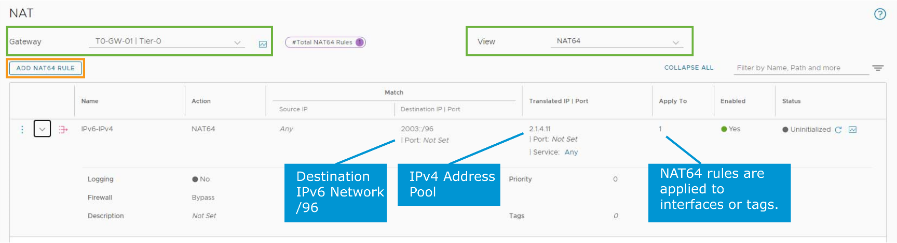

# Lesson 1 Configuring NAT

------

### **모듈 학습 항목(Module Lessons)**

• **NAT 구성(Configuring NAT)**

• **DHCP 및 DNS 서비스 구성(Configuring DHCP and DNS Services)**

• **NSX 고급 로드 밸런서 구성(Configuring NSX Advanced Load Balancer)**

• **IPSec VPN 구성(IPSec VPN)**

• **L2 VPN 구성(L2 VPN)**

------

### **학습 목표(Learner Objectives)**

• **NAT(네트워크 주소 변환)**의 역할을 설명한다

• **출발지 NAT(SNAT)**와 **목적지 NAT(DNAT)**의 차이를 구분한다

• **반사형 NAT(Reflexive NAT)**의 동작 방식을 설명한다

• **상태 저장형 활성-활성 SNAT 및 DNAT(Stateful Active-Active SNAT/DNAT)** 동작 방식을 설명한다

• **NAT64가 IPv6와 IPv4 네트워크 간 통신을 어떻게 지원하는지** 설명한다

------

------

## **NAT Support Overview(NAT 지원 개요)**

------

**1. NAT 개요**

Network Address Translation(NAT)는 하나의 IP 주소 공간을 다른 주소 공간으로 변환하는 기능이다.

NSX에서는 NAT를 **Tier-0 Gateway**와 **Tier-1 Gateway**에서 모두 구성할 수 있으며, **NSX Edge의 고가용성 모드(HA Mode)** 및 **게이트웨이 유형(Gateway Type)**에 따라 지원되는 NAT 종류가 달라진다.

------

**2. NAT 유형별 지원 요약**

| **Supported NAT Rules**            | **Gateway Type**  | **NSX Edge HA Mode**    |
| ---------------------------------- | ----------------- | ----------------------- |
| SNAT / DNAT / NAT64                | Tier-0 and Tier-1 | Active-Standby          |
| Reflexive NAT                      | Tier-0 only       | Stateless Active-Active |
| Stateful Active-Active SNAT / DNAT | Tier-0 and Tier-1 | Stateful Active-Active  |

------

**3. 설명 요약**

• **S(source)NAT / D(Destination)NAT / NAT64**

– 일반적인 NAT 구성

– **Tier-0 / Tier-1**에서 모두 가능

– **Active-Standby** 구성 필요

• **Reflexive NAT**

– 반사형 NAT (출발지 주소 기반으로 동적으로 생성된 대응 규칙)

– **Tier-0 전용**, **Stateless Active-Active** 모드에서만 지원

• **Stateful Active-Active SNAT / DNAT**

– 상태 정보를 유지하는 NAT

– **Tier-0 / Tier-1** 지원

– **Stateful Active-Active** 모드 필요

------

**결론 요약**

NSX에서 NAT 설정 시에는 **게이트웨이 계층**과 **Edge의 HA 모드**를 고려하여 적절한 NAT 유형을 선택해야 하며, **일부 고급 기능(예: Reflexive NAT, Stateful Active-Active)**은 특정 조건에서만 사용 가능하다.

------

------

## **About SNAT(SNAT 개요 및 동작 설명)**

------

1. **SNAT 정의 및 목적**

• **SNAT(Source Network Address Translation)**은 **IP 패킷의 출발지 주소**를 변환하는 NAT 유형이다.

• 일반적으로 **사설 네트워크의 IP 주소를 공인 IP 주소로 변환**하여 외부 인터넷과 통신 가능하게 만든다.

• 필요 시 **출발지 포트(TCP/UDP)**도 함께 변환된다.

------

​	2.	**그림 구성 요소 및 흐름 설명**

| **구성 요소**     | **설명**                                             |
| ----------------- | ---------------------------------------------------- |
| **VM**            | 내부 가상머신, IP 주소는 172.16.101.11               |
| **T1-GW-01**      | SNAT 수행 위치, 패킷 출발지 주소를 80.80.80.1로 변경 |
| **T0-GW-01**      | 외부 네트워크로의 업링크 게이트웨이                  |
| **Translated IP** | 외부에 노출되는 IP 주소 (80.80.80.1)                 |

• VM에서 발생한 트래픽은 T1-GW-01에 도달하며, 이때 SNAT 규칙에 따라 **출발지 IP가 172.16.101.11 → 80.80.80.1로 변경됨**

• 변환된 패킷은 T0-GW-01을 거쳐 외부 네트워크로 전송된다.

------

​	3.	**No SNAT 예외 처리**

• 특정 목적지나 트래픽에 대해 **SNAT 변환을 생략**하려면 **No SNAT 규칙**을 구성할 수 있다.

• 예: 특정 내부 네트워크와의 통신에는 사설 IP를 유지해야 할 경우.

------

**그림 설명**

해당 그림은 내부 VM에서 인터넷으로 나가는 트래픽에 대해 **T1 게이트웨이에서 SNAT 규칙이 적용되어 출발지 IP가 변환되는 과정**을 보여준다.

• VM은 172.16.101.11 주소를 갖고 있음

• 변환된 패킷은 T1의 SR을 거치지 않고 (no snap rule), T1-GW-01은 패킷을 수신 후 출발지 주소를 80.80.80.1로 변경

•  T0-GW-01을 통해 외부 네트워크로 나가게 됨

이 구조는 내부 주소 공간 보호 및 공인 IP의 효율적 사용을 가능하게 한다.

------

------

## **About DNAT(Destination NAT 개요 및 동작 설명)**

------

​	1.	**DNAT 정의 및 목적**

• **DNAT(Destination Network Address Translation)**은 **IP 패킷의 목적지 주소**를 변환하는 NAT 유형이다.

• 일반적으로 **공인 IP로 수신된 외부 요청을 내부 사설 IP로 전달**할 때 사용된다.

• 필요 시 **목적지 포트(TCP/UDP)**도 함께 변환할 수 있다.

내부에서 외부로 통신하는 건 가능하지만, 외부에서 내부로 통신은 불가능한 NAT의 한계를 극복

------

​	2.	**그림 구성 요소 및 흐름 설명**

| **구성 요소**     | **설명**                                        |
| ----------------- | ----------------------------------------------- |
| **Source Client** | 외부에서 접속을 시도하는 클라이언트             |
| **T0-GW-01**      | 업링크 게이트웨이 (Tier-0)                      |
| **T1-GW-01**      | DNAT 수행 위치, 목적지 IP를 내부 IP로 변경      |
| **VM**            | 내부 가상머신, 실제 목적지 주소는 172.16.101.11 |

• Source Client가 80.80.80.1로 요청을 전송함

• T1-GW-01에서 DNAT 규칙에 따라 **목적지 IP가 80.80.80.1 → 172.16.101.11로 변경됨**

• 패킷은 변환된 내부 IP 주소로 전달되어 **VM이 요청을 처리**함

------

​	3.	**No DNAT 예외 처리**

• 특정 트래픽에 대해 DNAT 규칙을 **적용하지 않도록 설정**할 수 있음

• 이를 위해 **No DNAT 규칙**을 구성하여 트래픽을 예외 처리할 수 있음

• 예: 내부 특정 서버에 대해서는 주소 변환 없이 직접 전달

------

**그림 설명**

해당 그림은 외부 Source Client가 공인 IP 주소인 80.80.80.1로 접근할 때,

**T1-GW-01에서 DNAT 규칙이 적용되어 목적지 IP가 내부 사설 IP 172.16.101.11로 변환되는 과정**을 보여준다.

• 클라이언트는 외부 IP 80.80.80.1로 요청 전송

• DNAT 규칙을 통해 T1-GW-01에서 목적지 IP를 내부 VM의 172.16.101.11로 변경

• 내부 VM이 트래픽을 수신하고 응답 처리함

------

**요약**

• **SNAT**은 출발지 IP 변환, **DNAT**은 목적지 IP 변환

• DNAT은 외부 요청을 내부 서버에 전달할 때 핵심적으로 사용됨

• NSX에서는 DNAT 규칙을 통해 **공인 IP → 사설 IP 변환**이 수행되며,

**보안 제어 및 서비스 노출을 세밀하게 설정할 수 있음**

------

------

## **Reflexive NAT(리플렉시브 NAT 개요 및 동작 방식)**

------

​	1.	**Reflexive NAT 정의**

• **Reflexive NAT(Stateless NAT)**는 상태를 추적하지 않는 NAT 방식으로, **Access Control List(ACL)** 기반의 NAT 규칙을 양방향으로 수동 설정해야 한다.

• **Active-Active 구성의 Tier-0 게이트웨이**에서 **비대칭 라우팅(asymmetric path)** 환경을 지원하기 위해 사용된다.

• 일반적인 Stateful NAT은 비대칭 경로에서 연결 상태 추적이 불가능하여 오류를 유발할 수 있으므로, Stateless 방식인 Reflexive NAT이 필요하다.

------

​	2.	**구성 요소 및 흐름 설명**

| **구성 요소**           | **설명**                                       |
| ----------------------- | ---------------------------------------------- |
| **VM (172.16.101.11)**  | 내부 네트워크의 출발지 주소                    |
| **Edge-1 / Edge-2**     | 각각 Tier-0 게이트웨이를 Active 상태로 실행 중 |
| **Physical Router**     | 외부 네트워크(인터넷)로 연결된 라우터          |
| **NAT IP (80.80.80.1)** | 외부에서 접근 가능한 변환된 공인 IP 주소       |

------

​	3.	**트래픽 흐름 및 동작 방식**

​	1.	내부 VM(172.16.101.11)이 외부로 트래픽을 전송

​	2.	이 트래픽은 **Edge-2**를 통해 외부로 나가며, **Reflexive NAT 규칙**에 따라 **IP가 80.80.80.1로 변환됨**

​	3.	외부 클라이언트는 이 **80.80.80.1** 주소로 응답을 보내고

​	4.	이 응답은 **Edge-1**을 통해 들어오더라도, 동일한 Reflexive NAT 규칙에 따라 **172.16.101.11로 변환되어 내부 VM에 전달**됨

​	5.	이는 **비대칭 경로를 지원하는 NAT 처리 방식**이다

------

​	4.	**특징 및 규칙 설정 조건**

• **양방향 ACL이 반드시 정의되어야 하며**, 상태를 추적하지 않기 때문에 응답 트래픽도 별도 규칙 필요

• **IP 주소 범위 설정 가능**: 예를 들어 10개의 IP 주소에 대해 10개의 NAT IP로 매핑 가능

• **정확히 일대일 매핑**: 첫 번째 IP는 첫 번째 NAT IP로, 두 번째는 두 번째로 매핑 (Deterministic Mapping)

• **상태 유지가 불가**하므로, 일반적인 세션 추적이 필요한 환경에서는 부적합

------

**그림 설명**

이 그림은 **Active-Active Tier-0 Gateway** 환경에서 **Reflexive NAT이 비대칭 흐름을 지원하는 방법**을 설명한다.

VM의 트래픽이 Edge-2를 통해 외부로 나가고, 응답은 Edge-1로 들어오지만,

**양쪽 Edge에 동일한 NAT 규칙이 구성되어 있으므로**, NAT 처리가 문제없이 양방향으로 수행된다.

------

**요약 정리**

• Reflexive NAT은 **상태 추적 없는 NAT**로, **비대칭 경로를 지원**

• **Active-Active** 환경에서 반드시 사용해야 하며, **동일한 NAT 규칙을 양방향 Edge에 수동 설정**

• **세션 상태를 유지하지 않음**으로써, 고가용성과 비대칭 트래픽 처리가 가능하다

------

------

**SNAT 및 DNAT 구성(Configuring SNAT and DNAT)**

SNAT 및 DNAT 규칙을 구성할 때 다음 항목에 값을 입력해야 한다:

• **Name**: NAT 규칙의 이름을 입력한다

• **Action**: 조건이 일치할 경우 수행할 동작을 지정한다

• **Source IP**: CIDR 형식의 출발지 IP 주소 또는 범위를 지정한다

  - 입력하지 않으면 로컬 서브넷 외부의 모든 출발지에 적용됨

• **Destination IP**: CIDR 형식의 목적지 IP 주소 또는 범위를 지정한다

• **Destination Port**: 목적지 포트를 지정한다

• **Translated IP**: NAT 적용 결과로 변환될 새 IP 주소

• **Service**: NAT 규칙이 적용될 단일 서비스 항목 선택

• **Applied To**: NAT 규칙이 적용될 대상 객체 선택

  - 대상: 게이트웨이, 인터페이스, 라벨, 서비스 인스턴스 엔드포인트, 가상 엔드포인트 등

• **Enabled**: NAT 규칙을 활성화 또는 비활성화

• **(Optional) Logging**: 분석 및 문제 해결을 위한 로그 기록 여부 지정 (기본값: 비활성화)

• **Priority**: 우선순위를 설정하며, 값이 낮을수록 우선순위가 높음 (기본값: 0)

**방화벽(Firewall) 관련 설정 옵션**:

• **Match External Address**: NAT 규칙의 외부 주소와 방화벽 규칙 일치 여부

• **Match Internal Address**: NAT 규칙의 내부 주소와 방화벽 규칙 일치 여부

• **Bypass**: 방화벽 단계를 건너뛰도록 설정

**(Optional) Tags**: NSX 객체를 그룹화하기 위한 태그 지정 가능

------

**SNAT 사용 사례**:

• 내부 프라이빗 주소를 외부로 나가는 패킷의 퍼블릭 주소로 변환할 때 사용

**DNAT 사용 사례**:

• 외부에서 들어오는 퍼블릭 주소 또는 포트를 내부의 프라이빗 주소 또는 포트로 전달할 때 사용

**SNAT 및 DNAT은 Tier-0 또는 Tier-1 게이트웨이에서 구성함**

------

------

## **Stateful Active-Active Services(Stateful Active-Active 서비스 아키텍처 설명)**

------

1. **Stateful Active-Active 서비스 아키텍처 개요**

• NSX 4.0.1부터 **SNAT/DNAT 같은 상태 기반 서비스(stateful services)**를 **Active-Active 방식**으로 지원함

• **세션 상태 유지**를 위해 **특정 흐름(flow)**은 특정 **Edge 노드에 고정(pinning)**됨

• ECMP(Equal-Cost Multi-Path)를 통한 경로 선택 + 트래픽 전송(punt) 메커니즘으로 **비대칭 경로에서도 상태 일관성을 보장**

------

​	2.	**구성요소 및 흐름 설명**

| **구성 요소**        | **설명**                                                |
| -------------------- | ------------------------------------------------------- |
| VM (172.16.101.11)   | 내부에서 통신을 시작하는 워크로드                       |
| Edge-1~4             | Tier-0 게이트웨이를 구성하는 각 Edge 노드 (Active 상태) |
| ToR-Left / ToR-Right | 외부 네트워크 연결을 위한 Top of Rack 스위치            |
| ECMP                 | 동일 비용 경로 다중화 방식, 해시 기반 트래픽 분산 수행  |
| Transit Segment      | Compute 노드와 Edge 노드를 연결하는 경로                |

------

​	3.	**트래픽 흐름 설명**

**1) Northbound 흐름 (VM → 외부)**

• VM이 외부로 트래픽을 보냄

• Compute 하이퍼바이저에서 **4-way ECMP**를 통해 Edge 노드를 선택함

• **5-tuple 해시 알고리즘** 기반:

 (프로토콜 번호, 출발지 IP, 목적지 IP, 출발지 포트, 목적지 포트)

• 이 예시에서는 **Edge-4가 선택됨** → 해당 세션은 Edge-4에 고정됨

**2) Southbound 흐름 (외부 → VM)**

• ToR 스위치 또한 **4-way ECMP**를 사용하여 Edge 선택

• 이 경우, **ToR-Right**가 **Edge-3을 선택함**

• 그러나 이 트래픽의 세션은 Edge-4에 고정되어 있으므로

 → **Edge-3은 트래픽을 Edge-4로 punt(전달)**하여 **세션 일관성 유지**

------

​	4.	**핵심 메커니즘 요약**

| **항목**                | **설명**                                                     |
| ----------------------- | ------------------------------------------------------------ |
| **세션 기반 Pinning**   | 특정 5-tuple 기반으로 Edge 노드에 세션을 고정함              |
| **ECMP 해시 기준**      | 하이퍼바이저: 5-tuple / ToR: 외부 IP 기반 해시               |
| **Punt 메커니즘**       | 트래픽이 다른 Edge로 도달해도 세션을 고정한 Edge로 전달      |
| **상태 유지(Stateful)** | 트래픽의 방향과 관계없이 **세션을 동일한 Edge 노드에서 처리**함 |
| **서비스 적용 가능 예** | SNAT, DNAT 등 상태 기반 NAT 서비스 포함                      |

------

**그림 설명**

이 그림은 NSX에서 **Stateful Active-Active** 아키텍처를 통해 **세션 일관성**을 어떻게 유지하는지 보여준다.

• **Edge-4가 northbound 트래픽을 처리하도록 선택**된 이후,

• **southbound 트래픽이 Edge-3에 도착해도**, 해당 트래픽은 **Edge-4로 전달되어 처리**된다.

• 이처럼 **상태 기반 NAT도 비대칭 경로에서 안정적으로 동작**할 수 있도록 설계되어 있다.

------

**요약 정리**

• NSX 4.0.1은 Active-Active 구조에서 Stateful 서비스 지원

• ECMP 기반 경로 선택과 Punt 메커니즘으로 세션 일관성 보장

• SNAT/DNAT 등 상태 기반 서비스를 고가용성 환경에서도 운영 가능함

------

------

## **Stateful Active-Active Interface Group(Stateful Active-Active 인터페이스 그룹 설명)**

------

​	1.	**Interface Group 개념**

• **Stateful Active-Active 아키텍처**에서는 **상태 기반 서비스(SNAT, DNAT 등)**를 각 Edge 노드에 분산 처리함

• 이러한 상태 기반 서비스를 위한 **통합 처리 지점**으로 **Interface Group**이 필수 구성 요소로 도입됨

• Interface Group은 **모든 Edge 노드에 하나씩 포함된 uplink 인터페이스들을 묶은 논리적 단위**

------

​	2.	**Interface Group 구성 조건**

| **조건 항목**                           | **설명**                                                     |
| --------------------------------------- | ------------------------------------------------------------ |
| **Edge 노드당 인터페이스 1개씩 포함**   | Edge Cluster 내 모든 노드에서 **각 1개의 uplink 인터페이스**가 필요함 |
| **Edge별 uplink가 2개일 경우**          | **uplink 개수마다 별도의 Interface Group 필요** (예: Edge에 2 uplink → IG 2개) |
| **모든 노드가 동일한 수의 uplink 구성** | 상태 일관성 및 분산 처리를 위해 모든 Edge에 동일 수의 인터페이스가 있어야 함 |

------

​	3.	**그림 설명**

• 그림에서는 **4개의 Edge 노드(Edge-1 ~ Edge-4)**가 있는 **Stateful Active-Active Tier-0 Gateway** 환경을 나타냄

• 각 Edge에는 **하나의 uplink 인터페이스**가 있고, 이 uplink들이 **Interface Group으로 구성됨**

• Interface Group은 **ToR-Left 및 ToR-Right 스위치**를 통해 외부 네트워크와 연결됨

• ECMP(Equal-Cost Multi-Path)를 통해 Compute 하이퍼바이저에서 Edge 노드로 균등한 경로 분산 가능

------

​	4.	**적용 시나리오 예시**

| **구성 요소**         | **기능 또는 역할**                                           |
| --------------------- | ------------------------------------------------------------ |
| Interface Group       | 모든 Edge 노드의 uplink를 묶어 NAT 같은 상태 기반 서비스를 일관되게 처리 |
| Edge-1 ~ Edge-4       | 각 노드가 동시에 활성 상태이며 트래픽을 병렬로 처리 (Active-Active) |
| ECMP 및 외부 토폴로지 | VM → ToR 스위치 → Edge 노드 → 외부 네트워크까지 다중 경로 지원 |

------

**요약 정리**

• **Stateful Active-Active 아키텍처**에서는 **인터페이스 그룹**이 상태 기반 서비스 처리를 위한 필수 구성 요소임

• **모든 Edge 노드는 Interface Group 내에 하나의 uplink 인터페이스를 보유**해야 하며

• Edge에 **uplink가 여러 개일 경우**, uplink마다 **별도의 Interface Group을 구성해야 함**

• ECMP와 함께 사용되면, **고가용성 및 병렬 처리**가 가능한 상태 기반 서비스 인프라를 구축할 수 있음

------

------

## **Stateful Active-Active SNAT(Stateful Active-Active SNAT 동작 방식)**

------

​	1.	**기본 개념 요약**

• **Stateful Active-Active SNAT**은 Active-Standby와 유사한 방식으로 작동하며,

클러스터 내 모든 Edge 노드가 **동일한 SNAT IP(예: 80.80.80.1)**를 공유함

• SNAT 규칙은 **Source IP (예: 172.16.101.11)**를 **공용 IP (80.80.80.1)**로 변환함

• 단, SNAT 세션은 **한 Edge 노드(예: Edge-4)에 고정(pinning)**되어 세션 상태를 유지함

------

​	2.	**SNAT 트래픽 처리 방식**

| **항목**                   | **설명**                                                     |
| -------------------------- | ------------------------------------------------------------ |
| **Source IP**              | 내부 VM: 172.16.101.11                                       |
| **Translated SNAT IP**     | 80.80.80.1 (모든 Edge가 공유)                                |
| **세션 핀 고정 (Pinning)** | 트래픽이 최초 도달한 Edge(예: Edge-4)에 SNAT 세션이 고정되어 이후에도 해당 Edge로 처리됨 |
| **SNAT 룰 작용 위치**      | SNAT 규칙은 Interface Group과 연결된 각 Edge 노드에 적용됨   |

------

​	3.	**ECMP 해시 기반 트래픽 경로 제어**

• **Northbound 트래픽**

– Compute Hypervisor는 **5-tuple 기반 해시(프로토콜, 출/목 IP, 출/목 포트)**로 ECMP 경로를 결정

– 예시에서는 **Edge-4**가 선택되어 SNAT 세션이 해당 노드에 고정됨

• **Southbound 트래픽**

– ToR(ToR-Right)은 **Destination IP 기반의 해시**로 ECMP 경로를 선택

– ECMP 해시값이 고정되므로 대칭 경로(Symmetric Path)가 유지됨

------

​	4.	**그림 설명**

• **VM(172.16.101.11)**에서 외부로 나가는 트래픽은 ECMP 경로를 따라 **Edge-4**로 전달됨

• Edge-4에서 **SNAT 변환(Src: 172.16.101.11 → 80.80.80.1)** 수행

• 변환된 트래픽은 **ToR-Right**를 통해 외부로 전달됨

• 외부 응답 트래픽은 동일 ECMP 해시에 의해 **Edge-4**로 도달하여 세션 상태를 유지함

• **Interface Group**은 모든 Edge uplink를 묶어 트래픽 분산과 상태 기반 처리를 가능하게 함

------

​	5.	**요약 정리**

• **Stateful Active-Active SNAT**은 동일한 SNAT IP를 사용하지만, 각 세션은 **특정 Edge 노드에 고정**됨

• ECMP 해시 기반 경로 제어를 통해 **대칭 트래픽 흐름을 보장**함

• 상태 기반 처리를 위해 **Interface Group** 필수

• NSX 4.0.1부터 지원되는 고가용성, 대칭 경로, 상태 유지 기반 NAT 구성 방식임

------

------

## Stateful Active-Active Configuration

**게이트웨이 상태 전환 제한 사항**

• 해당 기능은 **Stateless 활성-활성(Active-Active)** 게이트웨이 구성을 **상태 저장형(Stateful)**으로 변환하는 것을 **지원하지 않는다**

 → **새 게이트웨이를 배포해야 함**

• 게이트웨이의 **상태 저장형 서비스(Stateful Services)**를 활성화하고 구성을 저장한 후에는

 **해당 게이트웨이의 HA 모드(High Availability Mode)를 수정할 수 없다**

------

------

## Configuring Interface Groups

예제에서 Tier-0 게이트웨이는 **두 개의 업링크 인터페이스**를 가지고 있다.

두 인터페이스 모두를 **인터페이스 그룹(Interface Group)**에 **추가해야 한다**.

------

------

## Configuring Stateful SNAT and DNAT

**상태 저장형 활성-활성(Stateful Active-Active) SNAT 및 DNAT 구성**은

**활성-대기(Active-Standby) SNAT 및 DNAT 구성**과 유사하지만, 다음과 같은 항목에서 차이가 있다:

• **Applied To**:

 이 NAT 규칙이 적용될 **인터페이스 그룹(Interface Group)**을 선택해야 한다

------

------

**NAT64 Communication Process(NAT64 통신 프로세스)**

------

1. **기본 개념**

• **NAT64**는 IPv6 패킷을 IPv4 패킷으로 변환하는 메커니즘임

• IPv6 전용 클라이언트가 IPv4 전용 서버와 통신할 수 있도록 지원함

• NAT64는 **RFC 6146 (IPv6→IPv4 변환)** 및 **RFC 6145 (IPv4→IPv6 변환)** 표준 기반으로 동작함

• IPv6와 IPv4 노드 모두에서 **구성 변경 없이** 작동함

------

​	2.	**NAT64 구성 요소 및 조건**

| **구성 요소**       | **설명**                                                     |
| ------------------- | ------------------------------------------------------------ |
| **Tier-0 Gateway**  | NAT64 변환을 수행하는 장치, 반드시 **Active-Standby** 모드로 구성해야 함 |
| **Tier-1 Gateway**  | Active-Standby Edge 클러스터 필요                            |
| **IPv6 클라이언트** | IPv6 네트워크에 속하며, 통신의 시작점이 됨                   |
| **IPv4 서버**       | IPv4 네트워크에 존재, IPv6 클라이언트와 직접 통신 불가       |

------

​	3.	**통신 절차 요약**

​	1.	**IPv6 클라이언트**가 IPv4 서버와 통신을 시도함

​	2.	패킷은 **IPv6 라우터**를 거쳐 **Tier-0 Gateway (NAT64 장치)**로 도달함

​	3.	Tier-0 Gateway에서 **IPv6 → IPv4** 패킷 변환 수행

​	4.	변환된 패킷은 **Tier-1 Gateway**를 통해 IPv4 네트워크로 전달됨

​	5.	**IPv4 서버(VM)**는 요청에 응답하고 응답 패킷은 다시 NAT64를 통해 IPv6로 변환되어 클라이언트로 전달됨

------

​	4.	**그림 설명**

• 그림에서는 왼쪽의 **IPv6 전용 클라이언트**가 오른쪽의 **IPv4 전용 VM(서버)**와 통신하는 과정을 보여줌

• 중앙의 **Tier-0 Gateway**는 NAT64 장치로서 패킷 변환을 수행함

• NAT64를 통해 변환된 패킷은 **IPv4 네트워크**로 전달되어 최종적으로 서버에 도달함

• 서버는 응답을 보내고, Tier-0에서 다시 IPv6로 변환되어 클라이언트에게 도달함

------

5. **요약 정리**

• **NAT64는 IPv6-only → IPv4-only** 통신을 가능하게 함

• **IPv6 클라이언트에서 트래픽을 먼저 시작**해야 함 (IPv4가 initiate 불가)

• **Active-Standby 모드의 Tier-0 Gateway 필수**

• 양 노드(IPv6/IPv4) 모두에서 **구성 변경 없음**

• IPv6에서 IPv4 네트워크로의 통합을 위한 핵심 기술임

------

------

## Configuring NAT64 Rules

**예제에서 NAT64 규칙은 T0-GW-01에 생성된다.**

NAT64 규칙에는 다음과 같은 매개변수가 구성된다:

• **Name**: NAT64 규칙의 이름을 지정한다

• **Action**: 지원되는 유일한 동작은 **NAT64**이며, IPv6와 IPv4 주소 간 변환을 수행한다

• **(선택 사항) Source**: CIDR 형식의 IPv6 주소 또는 주소 범위를 지정한다

• **Destination**: CIDR 형식의 IPv6 주소 또는 주소 범위를 지정하며, 접두사는 반드시 **/96**이어야 한다

 – 이는 목적지 IPv4 주소가 해당 IPv6 주소의 마지막 4바이트에 포함되기 때문이다

• **Translated**: 변환될 IPv4 주소 또는 주소 풀을 지정한다

 – 이 규칙이 Tier-0 게이트웨이에 구성된 경우, 해당 IPv4 주소는 Tier-1 게이트웨이에서 라우트가 설정되어 있어야 하며

 – 그렇지 않으면 반환 경로를 인식할 수 없다

• **Applied To**: NAT64 규칙은 **업링크 인터페이스 또는 태그**에만 적용할 수 있다

• **Enabled**: NAT64 규칙을 활성화 또는 비활성화할 수 있다

• **(선택 사항) Logging**: 분석 및 문제 해결을 위한 로그 설정 (기본값: 비활성화)

• **Priority**: 규칙의 우선순위를 지정하며, 값이 낮을수록 우선순위가 높다 (기본값: 0)

**방화벽(Firewall) 관련 옵션**:

• **Match External Address**: NAT 규칙의 외부 주소와 방화벽 규칙을 일치시킴

• **Match Internal Address**: NAT 규칙의 내부 주소와 방화벽 규칙을 일치시킴

• **Bypass**: 방화벽 단계를 건너뜀

• **(선택 사항) Tags**: NSX 객체를 그룹화하기 위한 태그를 지정할 수 있음

------

------

### 기타

dns cache

물리 infra

- switch
- router
- security
  - f/w
  - vpn (l2vpn/l3vpn)
  - ips/ids
- slb
  - L4 slb
  - L7 slb
  - caching
- networtk service: nat, dhcp, dns, ntp
- waas: web application acceleration system