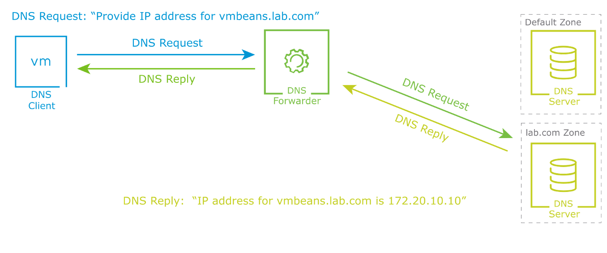

# 

## **DNS Services and Forwarding(DNS 서비스 및 포워딩 개요)**

------

​	1.	**기본 개념**

• **DNS(Domain Name System)**는 도메인 이름을 IP 주소로 변환해 주는 서비스이다.

• 사용자는 도메인 이름(vmbeans.lab.com 등)을 입력하고, DNS는 해당 이름에 대응하는 IP 주소(예: 172.20.10.10)를 반환한다.

------

​	2.	**DNS Zone 및 역할**

• **DNS Zone**은 DNS 네임스페이스의 특정 구간으로, 도메인 이름의 계층적 구조에서 하위 도메인을 관리하는 단위이다.

• 예시: lab.com은 하나의 DNS Zone이고, 이 안에서 vmbeans.lab.com 같은 도메인을 관리함.

------

​	3.	**DNS Forwarder 동작 과정**

| **단계** | **동작 설명**                                                |
| -------- | ------------------------------------------------------------ |
| ①        | VM(DNS Client)이 vmbeans.lab.com에 대한 **DNS 요청(DNS Request)**을 보냄 |
| ②        | DNS 요청은 **DNS Forwarder**로 전달됨                        |
| ③        | Forwarder는 요청 도메인이 속한 Zone(lab.com)을 식별하고, **해당 Zone에 등록된 DNS 서버로 요청 전달** |
| ④        | lab.com DNS 서버가 vmbeans.lab.com에 대한 IP 주소(예: 172.20.10.10)를 응답 |
| ⑤        | DNS Forwarder가 응답을 수신한 뒤, 이를 VM에 **DNS Reply**로 반환함 |

------

​	4.	**그림 설명**

• **좌측**의 VM은 vmbeans.lab.com에 대한 DNS 질의를 전송함

• **중앙**의 DNS Forwarder는 DNS 요청을 받고, 요청된 도메인이 **lab.com Zone**에 속하므로

lab.com DNS 서버로 요청을 포워딩함

• **우측 하단**의 lab.com DNS Server가 응답을 반환하고, 해당 정보(IP 주소: 172.20.10.10)가

DNS Forwarder를 거쳐 최종적으로 VM에게 전달됨

• 이를 통해 VM은 도메인 이름 대신 사용할 수 있는 IP 주소를 획득함

------

​	5.	**요약 정리**

• DNS는 도메인 이름을 IP 주소로 매핑함

• DNS Forwarder는 요청 도메인을 기반으로 **적절한 Zone의 DNS 서버에 요청을 포워딩**함

• DNS Zone은 **도메인별로 요청을 구분하고 처리**할 수 있도록 하는 논리적 단위임

• 이 방식은 **복수의 DNS 서버가 서로 다른 도메인 영역을 관리**할 수 있게 하며,

효율적이고 분산된 DNS 질의 처리를 가능하게 함