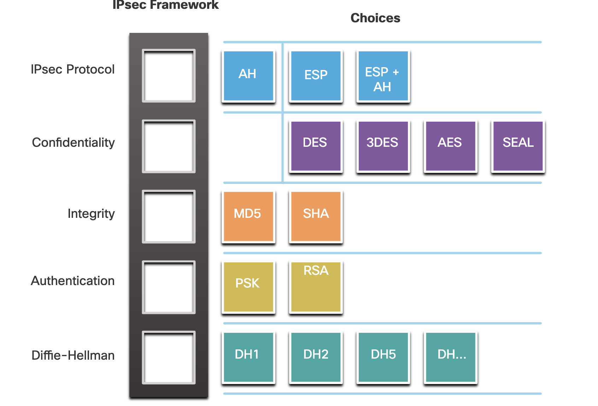
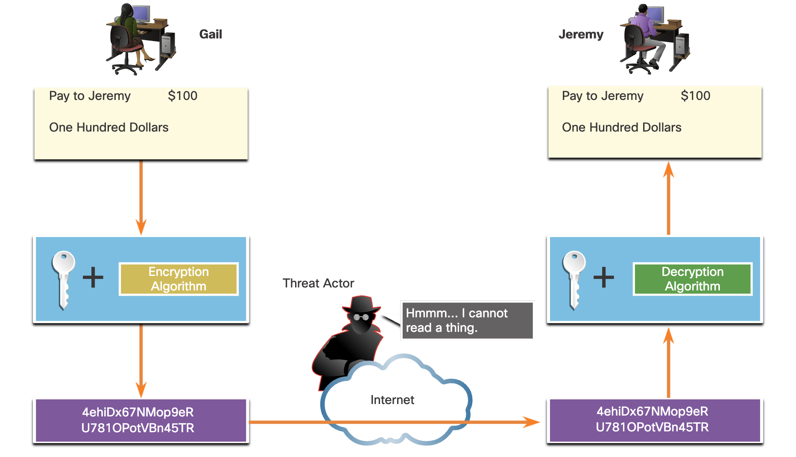

# 

## **IPsec Technologies(IPsec 기술 개요)**

------

**1. 개요**

• IPsec(Internet Protocol Security)은 IETF에서 정의한 VPN 보안 표준으로, RFC 24012412에 명시되어 있다

• IP 패킷의 **보안성**(암호화), **무결성**, **인증성**을 제공하며, **L4L7 계층 트래픽 보호**까지 가능하다

• IPsec은 **유연한 프레임워크 구조**를 가지고 있어, 다양한 보안 기술들을 조합하여 구현할 수 있다

------

**2. 주요 보안 기능**

| **보안 기능**                         | **설명**                                                     |
| ------------------------------------- | ------------------------------------------------------------ |
| **Confidentiality (기밀성)**          | • 암호화 알고리즘을 이용하여 패킷 내용을 암호화함• 공격자가 중간에서 패킷을 가로채더라도 내용을 확인할 수 없음 |
| **Integrity (무결성)**                | • 해싱 알고리즘(HMAC 등)을 사용하여 패킷 변경 여부를 검증함• 전송 중 패킷 변조 시 탐지 가능 |
| **Origin Authentication (출처 인증)** | • 송신자와 수신자의 신원을 검증• IKE(Internet Key Exchange) 프로토콜 사용• PSK(사전 공유 키), 디지털 인증서, RSA 인증 등 다양한 방식 지원 |
| **Diffie-Hellman (DH 키 교환)**       | • DH 알고리즘을 사용하여 안전하게 암호화 키를 교환함• 다양한 DH 그룹(예: Group 1, 2, 14, 19 등) 사용 가능 |

------

**3. IPsec 보안 프레임워크 구조**

• IPsec은 특정 암호화나 인증 방식에 고정되지 않으며, 각각의 보안 기능별로 다양한 알고리즘을 선택해 적용 가능함

• 아래와 같은 구성 요소로 조합되어 하나의 **Security Association(SA)**를 구성함

| **보안 기능 구성 요소** | **예시 알고리즘**            |
| ----------------------- | ---------------------------- |
| 암호화 알고리즘         | AES, 3DES 등                 |
| 해시 알고리즘           | SHA-2, SHA-1, MD5 등         |
| 키 교환 알고리즘        | Diffie-Hellman Group 1~21 등 |
| 인증 방식               | PSK, RSA 인증서, EAP 등      |

→ 이처럼 **슬롯 구조**를 갖춘 IPsec은 **보안 기술 발전에 따라 쉽게 확장 가능**하며, 기존 표준을 변경하지 않고도 새로운 알고리즘 통합이 가능하다

------

**4. 요약 정리**

• IPsec은 데이터 기밀성, 무결성, 인증, 키 교환을 모두 지원하는 강력한 VPN 보안 기술이다

• **IKE** 프로토콜을 통해 키 교환과 인증 과정을 수행하며, **SA(Security Association)**로 구성 요소를 조합함

• 프레임워크 기반 구조이므로 **보안 알고리즘을 자유롭게 선택 및 결합 가능**

• 다양한 환경에 맞춘 유연한 보안 설계가 가능하며, **IP 네트워크 기반 모든 VPN 기술의 핵심 요소**로 사용된다

------

| **IPsec Function**           | **Description (설명)**                                       |
| ---------------------------- | ------------------------------------------------------------ |
| **IPsec Protocol**           | IPsec에서 사용할 수 있는 프로토콜은 **Authentication Header (AH)** 또는 **Encapsulation Security Protocol (ESP)**가 있다. AH는 L3 패킷의 인증을 수행하고, ESP는 L3 패킷을 암호화한다. **ESP+AH 조합은 거의 사용되지 않음** (NAT 장비 통과에 실패할 수 있기 때문). |
| **Confidentiality** (기밀성) | L3 패킷의 기밀성을 보장하기 위해 암호화를 수행함. 사용 가능한 암호화 알고리즘에는 **DES**, **3DES**, **AES**, **SEAL** 등이 있다. 암호화 없는 설정도 가능함. |
| **Integrity** (무결성)       | 수신된 데이터가 전송 중 변경되지 않았는지를 확인함. 무결성 검증을 위해 **MD5**, **SHA**와 같은 해시 알고리즘 사용함. |
| **Authentication** (인증)    | IPsec은 **IKE(Internet Key Exchange)**를 통해 사용자 및 장비 인증 수행. 인증 방식은 **사용자 이름/비밀번호, OTP, 바이오메트릭, PSK, RSA 인증서** 등 다양함. |
| **Diffie-Hellman**           | DH 알고리즘을 사용하여 공유 비밀 키를 안전하게 교환함. 사용 가능한 그룹은 **DH14, 15, 16, 19, 20, 21, 24** 등이 있음. **DH1, 2, 5는 더 이상 권장되지 않음.** |

------

**보충 설명**

• 각 기능은 **SA(Security Association)**라는 단위로 조합되어 사용됨

• SA는 키 교환, 인증 방식, 암호화 알고리즘 등의 정보를 포함

• IPsec은 하나의 프레임워크로서, 다양한 기술 조합을 통해 **다양한 보안 요구 사항을 유연하게 대응**할 수 있음

------

------

## **Confidentiality(기밀성)**

------

• 기밀성(confidentiality)은 데이터를 **암호화(encryption)**하여 제3자가 내용을 이해하지 못하도록 하는 보안 기능이다.

• 암호화 수준은 **암호화 알고리즘의 종류**와 **사용된 키 길이**에 따라 결정된다.

------

**암호화 강도와 키 길이**

| **키 길이** | **해독 예상 시간 (일반적인 공격자 기준)**            |
| ----------- | ---------------------------------------------------- |
| **64-bit**  | 약 **1년** 정도 소요됨 (상대적으로 쉬움)             |
| **128-bit** | 약 **10⁹⁹년** (10 quintillion 년), **사실상 불가능** |

• **키가 짧을수록** 가능한 조합 수가 적어 **브루트 포스(무차별 대입)** 공격에 취약함

• **키가 길수록** 가능한 조합 수가 기하급수적으로 증가하여 **해독이 어려워짐**

------

| **암호화 알고리즘** | **키 길이**           | **특징 및 설명**                                             | **보안 수준**            | **권장 여부**      |
| ------------------- | --------------------- | ------------------------------------------------------------ | ------------------------ | ------------------ |
| **DES**             | 56-bit                | • 가장 초기의 대칭 암호 알고리즘 중 하나• 현재는 **보안 취약** 및 **사용 비권장** | 낮음 (브루트포스에 취약) | **사용 금지**      |
| **3DES**            | 168-bit (56 x 3)      | • DES를 세 번 적용한 방식• DES보다 보안은 강하지만 **계산 성능 저하** 존재 | 중간                     | 부분적 사용 가능   |
| **AES**             | 128, 192, 256-bit     | • 현재 가장 널리 사용되는 알고리즘• **강력한 보안성 + 성능 효율성** 갖춤 | 높음                     | **가장 권장됨**    |
| **SEAL**            | 160-bit (스트림 방식) | • **스트림 암호화**로 실시간 데이터 암호화에 적합• 고속 처리에 적합하고 보안성 우수 | 높음                     | 특정 상황에서 적합 |

------

**결론 정리**

• 기밀성은 **암호화된 데이터를 통해 정보 노출을 방지**하는 핵심 보안 기능이다.

• **IPsec, SSL** 등 다양한 보안 기술이 기밀성을 보장하기 위해 암호화를 사용한다.

• **적절한 알고리즘 선택과 충분한 키 길이 확보**는 안전한 통신을 위한 필수 요소이다.

------

------

## **Integrity Verification in VPNs(무결성 확인)**

**1. 무결성(Integity)의 개념**

• 무결성이란 **전송된 데이터가 수신 시 변경되지 않았음을 보장하는 보안 속성**이다.

• 데이터가 전송 도중 **악의적인 공격자에 의해 변조되거나 위조될 가능성**이 있기 때문에, 이를 방지하기 위한 수단이 필요하다.

------

| **항목**    | **내용**                                                     |
| ----------- | ------------------------------------------------------------ |
| **HMAC**    | • 메시지에 대해 해시 함수를 적용한 후, 키와 결합하여 고유한 해시값 생성• 수신 측에서도 동일한 과정을 통해 생성한 해시값과 비교하여 **데이터 변경 여부 확인** |
| **SHA-1**   | • 과거 널리 사용된 알고리즘이나, **Cisco 기준으로 현재는 Legacy(비권장)** 상태 |
| **SHA-256** | • Cisco 및 업계에서 현재 **권장되는 표준 알고리즘**• 더 긴 해시 값과 더 강력한 충돌 회피 기능 제공 |

------

| **항목**      | **MD5**                                              | **SHA-1 / SHA-256**                                      |
| ------------- | ---------------------------------------------------- | -------------------------------------------------------- |
| **키 길이**   | 128비트 공유 비밀 키                                 | SHA-1: 160비트, SHA-256: 256비트 공유 비밀 키            |
| **출력 길이** | 128비트 해시 값                                      | SHA-1: 160비트 해시, SHA-256: 256비트 해시               |
| **보안성**    | **더 이상 안전하지 않음 (사용 금지 권고)**           | **SHA-1: 더 이상 권장되지 않음**, SHA-256 이상 사용 권장 |
| **적용 방식** | 입력 메시지 + 공유 키 → HMAC-MD5 → 128비트 해시 출력 | 입력 메시지 + 공유 키 → HMAC-SHA → 160/256비트 해시 출력 |

------

------

## **RSA Authentication Process(RSA 인증 절차)**

------

**1. 개요**

• RSA 인증은 공개 키 암호 방식 기반으로, **디지털 서명과 인증서**를 사용하여 피어 간의 **상호 인증**을 수행한다.

• 주로 IPsec VPN에서 사용되며, **서명 기반 인증 방식**으로 사전 공유 키(PSK)보다 **보안성이 우수**하다.

------

**2. 특징 및 장점**

• **PKI 기반 인증**으로, 키 관리 및 신뢰성 측면에서 **PSK 대비 보안 우수**

• 인증서가 있으므로 **확장성과 중앙관리 가능**

• **양방향 인증 필수**, 인증 절차가 다소 복잡하지만 **보안성이 뛰어남**

------

3. 정리

• RSA 인증은 **디지털 서명 + 공개 키 암호화** 방식

• **Hash_L 생성 → 디지털 서명 전송 → 복호화 → 비교 → 인증 완료**

• **서로 동일한 방식으로 양방향 인증 수행**

• 보안성과 확장성 측면에서 **PSK보다 우수함**