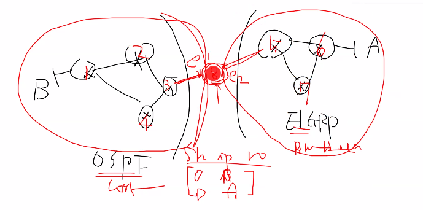
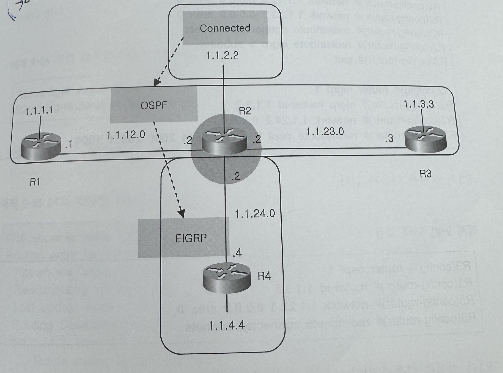

## 재분배 구성 및 분석

소규모 네트워크의 경우 한가지 라우팅 프로토콜만으로 충분하지만, 규모가 커지면 복수개의 라우팅 프로토콜을 사용해야 하는 경우가 많이 생긴다.

**이때 특정 라우팅 프로토콜이 다른 방법으로 알게 된 경로를 자신의 라우팅 프로세스에 포함시키면 해결이 된다.**

**이것을 재분배 라고 한다.**


------

------

## **라우트 재분배 대상 및 방법 상세 설명**  

---

### **1. 재분배 가능한 라우트 소스**  
| 대상          | 설명                                                    |
| ------------- | ------------------------------------------------------- |
| **Connected** | 라우터에 직접 연결된 네트워크 (인터페이스 UP 상태)      |
| **Static**    | 수동으로 구성된 정적 라우트                             |
| **OSPF**      | OSPF 프로토콜을 통해 학습된 라우트                      |
| **EIGRP**     | EIGRP 프로토콜을 통해 학습된 라우트 (동일 AS 번호 필수) |
| **BGP**       | BGP 프로토콜을 통해 학습된 라우트                       |

---

### **2. Static → OSPF 재분배 예시**  
```  
router ospf 1  
 redistribute static metric 30 subnets  // 정적 라우트를 OSPF로 재분배 (Cost=30)  
```
- **메트릭 변환**:  
  - OSPF는 **Cost**를 메트릭으로 사용 → `metric 30`으로 명시적 설정.  
  - 기본 메트릭 미설정 시 **20**으로 적용됨.  
- **서브넷 옵션**:  
  - `subnets`을 생략하면 클래스풀 네트워크만 재분배됨.  

---

### **3. 양방향 재분배 방법 (OSPF ↔ EIGRP)**  

#### **(1) OSPF → EIGRP 재분배**  
```  
router eigrp 10  
 redistribute ospf 1 metric 10000 100 255 1 1500  // OSPF → EIGRP 재분배  
```
- **메트릭 파라미터**:  
  - `bandwidth (10000Kbps)`, `delay (100μs)`, `reliability (255/255)`, `load (1/255)`, `MTU (1500)`.  

#### **(2) EIGRP → OSPF 재분배**  
```  
router ospf 1  
 redistribute eigrp 10 metric 50 subnets  // EIGRP → OSPF 재분배 (Cost=50)  
```

#### **(3) 주의사항**  
- **라우팅 루프 방지**:  
  - **Route Tagging** 또는 **Route-Map**으로 역방향 재분배 차단.  
  ```  
  route-map BLOCK_LOOP deny 10  
   match tag 100  
  route-map BLOCK_LOOP permit 20  
  ```
- **AD(Administrative Distance) 조정**:  
  - 특정 프로토콜의 AD 값을 낮춰 우선순위 강제 지정.  

---

### **4. 재분배된 라우트가 테이블에 보이지 않는 경우**  

#### **(1) 원인 분석**  
- **메트릭 미설정**:  
  - EIGRP 재분배 시 필수 메트릭 파라미터 누락 (예: `redistribute ospf 1`만 입력).  
- **서브넷 옵션 생략**:  
  - OSPF 재분배 시 `subnets` 키워드 미사용 → 클래스풀 네트워크만 전파.  
- **라우트 필터링**:  
  - Distribute-List 또는 Route-Map에서 특정 라우트 차단.  

#### **(2) 수정 예시 (R2 구성)**  
```  
router eigrp 10  
 redistribute ospf 1 metric 10000 100 255 1 1500  // 메트릭 명시적 설정  
 redistribute connected metric 10000 100 255 1 1500  // 연결된 네트워크 재분배  
```

---

### **5. 재분배 필터링 (Prefix-List 활용)**  
```  
ip prefix-list ALLOW_NET seq 5 permit 1.1.4.0/24  // 허용할 네트워크 지정  
!  
route-map FILTER permit 10  
 match ip address prefix-list ALLOW_NET  
!  
router ospf 1  
 redistribute eigrp 10 route-map FILTER  // 필터 적용  
```

---

### **6. 결론**  
1. **재분배 대상**: Connected, Static, OSPF, EIGRP, BGP.  
2. **메트릭 변환 필수**: 각 프로토콜의 메트릭 체계에 맞게 설정.  
3. **양방향 재분배 시**:  
   - 라우팅 루프 방지를 위해 **Route-Map/AD 조정** 필수.  
4. **라우트 누락 시**:  
   - 메트릭, 서브넷 옵션, 필터링 구문 점검.  


------

------

## 재분배 예시 (1)



### 1. R8 구성 분석 (OSPF ↔ EIGRP 양방향 재분배)**  

#### **OSPF 설정**  

```  
router ospf 1  
 redistribute eigrp 10 metric 5  // EIGRP(AS 10) → OSPF 재분배 (메트릭=5 → OSPF Cost=5)  
 redistribute connected          // 연결된 네트워크를 OSPF로 재분배 (기본 메트릭 사용)  
 redistribute static             // 정적 라우트를 OSPF로 재분배 (기본 메트릭 사용)  
!  
interface Ethernet1  
 ip ospf 1 area 0                // E1 인터페이스를 OSPF Area 0에 할당  
```

- **메트릭 변환**:  
  - EIGRP 메트릭 → OSPF **Cost**로 변환 (예: `metric 5` = Cost 5).  
  - 연결/정적 라우트는 OSPF 기본 메트릭(**20**) 적용.  

#### **EIGRP 설정**  

```  
router eigrp 10  
 redistribute ospf 1 100 255 1 20  // OSPF(프로세스 1) → EIGRP 재분배  
                                   // 메트릭: BW=100Kbps, Delay=2550μs, Reliability=1, Load=20, MTU=1500  
 network Ethernet2                 // E2 인터페이스 네트워크를 EIGRP에 직접 광고  
```

- **EIGRP 메트릭 파라미터**:  
  - `100 255 1 20 1500` = Bandwidth(100), Delay(2550μs), Reliability(1/255), Load(20/255), MTU(1500).  

------

재분배를 시킬 수 있는 대상

connected

static

ospf

eigrp

bgp


static (a 정보)를 ospf(b 라우팅 프로토콜)로 재분배

예시) ospf 메트릭 값으로 변경해야함 등등

양방향 재분배 방법 숙지

2번 재분배의 경우 해당 재분배 ip 는 테이블에 안보임

------

## 재분배 예시 (2)



**R2 구성 분석 (재분배 필터링 적용)**  

#### **OSPF → EIGRP 재분배**  

```  
router ospf 1  
 redistribute connected subnet    // 연결된 네트워크를 서브넷 단위로 OSPF에 재분배  
!  
router eigrp 10  
 redistribute ospf 1 100 1000 255 1 1500  // OSPF → EIGRP 재분배 (메트릭 설정)  
 redistribute connected 100 1000 255 1 1500  // 연결된 네트워크를 EIGRP에 재분배  
```

- **EIGRP 메트릭**: BW=100Kbps, Delay=10000μs, Reliability=255/255, Load=1/255, MTU=1500.  
- **서브넷 명시**: `subnet` 옵션으로 클래스리스 네트워크 재분배.  

#### **라우트 필터링 (Prefix-List + Route-Map)**  

```  
router ospf 1  
 redistribute eigrp 1 subnet route-map Filter_EIGRP  // EIGRP → OSPF 재분배 시 필터링 적용  
!  
route-map Filter_EIGRP permit 10  
 match ip address prefix-list Area1Network          // 특정 프리픽스만 허용  
```

- **목적**: 재분배 시 불필요한 라우트 전파 방지 (예: 특정 네트워크만 허용).  

---

### **3. 재분배 핵심 원리**  

#### **(1) 메트릭 변환 규칙**  
| 프로토콜  | 재분배 시 메트릭 처리 방식                   |
| --------- | -------------------------------------------- |
| **OSPF**  | EIGRP/정적/연결 라우트 → **Cost**로 변환     |
| **EIGRP** | OSPF/정적/연결 라우트 → **복합 메트릭** 적용 |

#### **(2) 양방향 재분배 주의사항**  
- **라우팅 루프 방지**:  
  - Route-Tagging, Route-Map, AD 조정 등을 통해 역방향 재분배 차단.  
- **메트릭 일관성**: 각 프로토콜의 메트릭 체계에 맞게 명시적 설정 필요.  

---

### 5. 결론**  
1. **재분배 구성**:  
   - OSPF ↔ EIGRP 양방향 재분배 시 **메트릭 변환**과 **필터링**이 필수적.  
2. **주요 도구**:  
   - Route-Map, Prefix-List로 정확한 라우트 제어.  
3. **디버깅**:  
   - `show ip route`로 라우팅 테이블 확인, `show ip protocols`로 재분배 상태 점검.  

